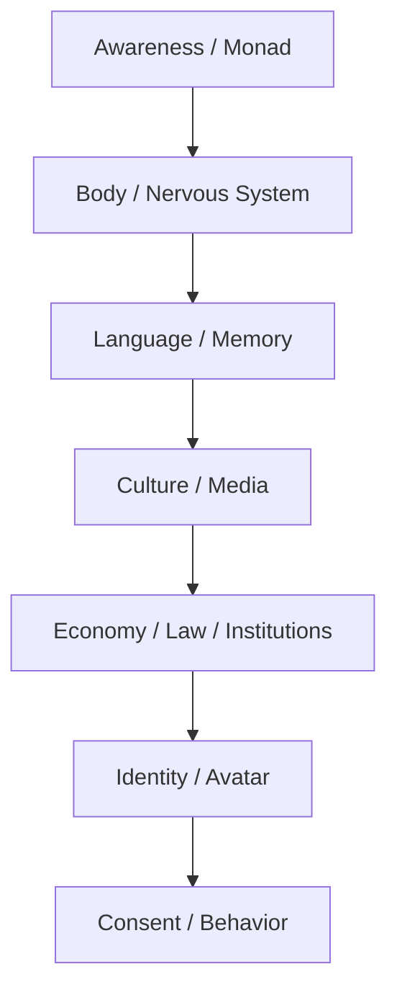

# Cách Đọc Red Pill Wiki

**Red Pill Wiki không phải giáo trình để học thuộc. Nó là bản đồ để đi qua nhiều tầng reality: fact, pattern, symbol, myth, conspiracy, metaphysics và direct knowing. Nếu đọc nó như một hệ niềm tin mới, bạn đã dùng sai. Nếu đọc nó như một bộ câu hỏi để tự nhìn lại thế giới, nó bắt đầu mở khóa.**

*Red Pill Wiki is not a doctrine to memorize. It is a map for moving through layers of reality: fact, pattern, symbol, myth, conspiracy, metaphysics, and direct knowing.*

---

## 1. Đừng Tin. Hãy Thấy.

Câu cốt lõi của vault là:

> Sự thật không cần bạn tin. Nó chỉ cần bạn tìm kiếm.

Tin quá nhanh là cái bẫy đầu tiên. Phủ định quá nhanh là cái bẫy thứ hai.

Một người đọc tốt không hỏi ngay: “Cái này đúng hay sai?”

Họ hỏi:

- Tầng fact ở đây là gì?
- Pattern nào đang lặp lại?
- Symbol này đánh vào tầng tâm lý nào?
- Ai được lợi nếu narrative này được tin?
- Ai được lợi nếu narrative này bị chế giễu?
- Điều gì trong mình phản ứng quá mạnh với chủ đề này?

Red pill không phải là đổi từ niềm tin mainstream sang niềm tin alternative. Red pill là nhìn thấy cơ chế tạo niềm tin.

---

## 2. Bốn Tầng Đọc

Mỗi bài trong vault nên được đọc qua bốn tầng. Đừng trộn chúng lại thành một cục.

| Tầng | Câu hỏi | Ví dụ |
|---|---|---|
| **Fact / Documentable** | Có tài liệu, sự kiện, nguồn, lịch sử nào kiểm được? | IPO, luật, báo cáo, tổ chức, timeline |
| **Pattern / Systems** | Các sự kiện có lặp lại cùng một cấu trúc không? | problem-reaction-solution, divide-and-conquer |
| **Symbol / Myth** | Hình ảnh này lập trình cảm xúc gì? | obelisk, alien, serpent, cube, moon landing |
| **Speculative Synthesis** | Nếu nối các tầng lại, model nào xuất hiện? | Ma Trận, loosh, disclosure ritual, soul trap |

Sai lầm phổ biến là lấy tầng 4 để thay tầng 1, hoặc lấy tầng 1 để phủ định tầng 3.

Một symbol không cần “chứng minh” như một event. Một event không nên bị bóp méo để phục vụ symbol. Mỗi tầng có luật đọc riêng.

Ví dụ với [[Chainlink - Mắt Xích Của Tokenized World]]: fact-level là oracle/RWA/institutional bridge; pattern-level là blockchain nối vào banking rails; symbol-level là chain/link/bank/channel/current; speculative-level mới là giả thuyết Sergey Nazarov/Satoshi. Trộn bốn tầng này lại sẽ thành dogma. Giữ chúng tách ra thì dot trở thành lens đọc hệ thống.

---

## Claim Discipline Cho Crypto / CBDC Dots

Các dot như “Satoshi Nakamoto == Sergey Nazarov”, Chainlink như bridge vào banking system, hay crypto như conditioning layer cho CBDC phải được đọc đúng tầng.

- **Fact**: Bitcoin là public ledger; Chainlink là oracle/interoperability infrastructure; stablecoin và tokenization đang được institutions thử nghiệm.
- **Pattern**: ledger money → programmable contracts → oracle/RWA bridge → digital ID/CBDC là một transition stack hợp logic.
- **Symbol**: chain, link, block, bank, channel, currency/current là word magic đáng đọc.
- **Speculation**: Sergey/Satoshi identity hypothesis là speculative synthesis, không phải fact đã chứng minh.

Ví dụ chuẩn: [[Chainlink - Mắt Xích Của Tokenized World]] không cần khẳng định “Sergey là Satoshi” để chỉ ra rằng Chainlink là mắt xích nối blockchain với tokenized banking.

## 3. Fact Không Đủ. Nhưng Không Có Fact Thì Dễ Bay.

Mainstream thường mắc lỗi: chỉ công nhận fact đã được institution cho phép.

Alternative thường mắc lỗi ngược lại: vì institution từng nói dối, nên mọi thứ chống institution đều có vẻ đúng.

Cả hai đều là bẫy.

[[Khoa Học Xét Lại]] không có nghĩa là phủ định khoa học. Nó nghĩa là phân biệt:

- Science như **method**: quan sát, kiểm chứng, phản biện, lặp lại.
- Science như **institution**: funding, prestige, censorship, career incentive, geopolitics.

Tương tự, conspiracy không có nghĩa là “mọi thứ đều được dàn dựng 100%”. Nó nghĩa là quyền lực thường vận hành qua coordination, incentive, secrecy và narrative management.

---

## 4. Ma Trận Là Interface, Không Chỉ Nhà Tù

Khi đọc [[Ma Trận]], đừng chỉ tưởng tượng một nhóm xấu đang cầm remote điều khiển loài người.

Ma Trận sâu hơn vậy. Nó là interface giữa awareness và world:

Bạn không chỉ bị kiểm soát bởi thông tin sai. Bạn bị kiểm soát bởi cái khung khiến một số câu hỏi không bao giờ xuất hiện trong đầu.

Đó là lý do vault nối nhiều mảng tưởng không liên quan: food, sex, money, education, alien, Hollywood, AI, medicine, spirituality. Chúng là các module khác nhau của cùng một interface.

---

## 5. Symbol Không Phải Trang Trí

Trong vault, symbol được đọc như software của subconscious.

Hollywood, myth, logo, ritual, architecture, tên gọi, ngày tháng, ticker, màu sắc, archetype — tất cả đều có thể hoạt động như interface giữa event và collective psyche.

Điều này không có nghĩa mọi symbol đều là bằng chứng của conspiracy. Nó nghĩa là những người làm power lâu đời hiểu rằng con người không vận hành bằng fact thuần túy. Con người vận hành bằng story, emotion, image, fear, desire và memory.

[[Hollywood - Cây Đũa Phép Của Phù Thủy]] không nói rằng mọi đạo diễn đều biết mình đang làm ritual. Nó nói rằng cinema có khả năng rehearsal cảm xúc tập thể trước khi reality cần public phản ứng theo một cách nào đó.

---

## 6. Đừng Biến Red Pill Thành Tôn Giáo Mới

Một cái bẫy lớn của người tỉnh thức là nghiện cảm giác mình đã tỉnh.

Dấu hiệu red pill bị biến thành ego game:

- Coi người khác là NPC để thấy mình cao hơn.
- Mọi thứ đều quy về một enemy duy nhất.
- Không còn khả năng nói “tôi chưa biết”.
- Thấy pattern ở mọi nơi nhưng không còn phân biệt mạnh/yếu.
- Dùng conspiracy để trốn trách nhiệm đời sống cá nhân.
- Dùng spirituality để bypass trauma, tiền bạc, sức khỏe, quan hệ.

Đây là lý do [[Nghịch Lý Của Hiểu Biết]] nên đọc đầu tiên hoặc cuối cùng. Mọi framework đều là ngón tay chỉ mặt trăng. Kể cả framework của vault này.

---

## 7. Cách Đọc Một Bài Bất Kỳ

Khi mở một bài, hãy thử đọc theo protocol này:

1. **Thesis:** bài đang nói điều gì trong một câu?
2. **Evidence:** phần nào kiểm được bằng nguồn ngoài?
3. **Pattern:** sự kiện này giống pattern nào trong vault?
4. **Symbol:** hình ảnh/archetype nào đang vận hành?
5. **Incentive:** ai được lợi nếu public tin/không tin điều này?
6. **Inner Mirror:** điều này phản chiếu gì trong chính mình?
7. **Action:** biết điều này giúp mình sống tự do, khỏe, tỉnh hơn như nào?

Nếu một bài không giúp bạn sống tỉnh hơn, mà chỉ làm bạn sợ hơn, thì bạn chưa tiêu hóa nó. Bạn mới nuốt raw signal.

---

## 8. Start Here / Reading Paths

Nếu mới vào vault, đừng đọc như đang scroll một feed. Chọn một câu hỏi đang cháy nhất, đi hết một path, rồi quay lại map tổng. Mỗi path dưới đây là một **đường vào**, không phải giáo trình bắt buộc.

*If you are new here, don't read the vault like a feed. Pick the question that burns the most, walk one path, then return to the larger map.*

### 1. Matrix / Perception

**Câu hỏi:** Nếu reality mình đang thấy chỉ là interface, interface đó được dựng bằng gì?

1. [[Ma Trận]] — hệ điều hành của perception, không chỉ “nhà tù bên ngoài”.
2. [[Ma Trận - Giải Phẫu Hoàn Chỉnh]] — anatomy sâu của các lớp kiểm soát và đường thoát.
3. [[Monad]] — điểm Một chưa từng rời Source, bị phủ bởi avatar xã hội.
4. [[Gnosis]] — direct knowing: biết bằng sự nhớ lại, không chỉ bằng thông tin.
5. [[Vô Thức Tập Thể]] — tầng myth/archetype nơi symbol lập trình cảm xúc tập thể.

> Đọc path này chậm. Nếu biến Ma Trận thành một enemy bên ngoài hoàn toàn, bạn đã bỏ sót lớp sâu nhất: phần trong mình đang consent với interface.

### 2. Predictive Programming & Spectacle Ritual

**Câu hỏi:** Media chỉ phản ánh reality, hay nó rehearsal reality trước khi reality được triển khai?

1. [[Predictive Programming - Cấy Tương Lai Vào Tiềm Thức]] — fiction như rehearsal cảm xúc cho tương lai.
2. [[Hollywood - Cây Đũa Phép Của Phù Thủy]] — cinema như ritual engine của collective psyche.
3. [[Karma Disclosure - Truth Hidden In Plain Sight]] — truth-in-plain-sight, consent và revelation method.
4. [[Spectacle Ritual - World Cup, Super Bowl Và Nghi Lễ Đồng Bộ Đại Chúng]] — mass attention synchronization qua thể thao, show, launch và ceremony.
5. [[Brazil 2026 - Khi Bóng Đá Trở Về Với Linh Hồn Tập Thể]] — case lab về World Cup 2026, creator culture và myth của collective field.
6. [[A LIE N - SpaceX IPO Disclosure Day và Nghi Lễ Tên Lửa]] — alien/SpaceX/rocket ritual như case study, đọc theo tầng claim discipline.

> Claim discipline: event kiểm được là một tầng; symbol và ritual reading là tầng khác. Đừng bắt symbol làm việc của document, cũng đừng bắt document giết toàn bộ symbol.

### 3. Money / Control Rails

**Câu hỏi:** Tiền là medium of exchange, hay là permission architecture của time, labor và behavior?

1. [[Điều Mà Trường Học Không Dạy Về Tiền]] — học lại money literacy trước khi nói freedom.
2. [[Tiền Pháp Định]] — fiat như debt-time architecture.
3. [[Bitcoin]] — exit-money thesis, self-custody và censorship resistance.
4. [[Privacy]] — boundary layer của exchange tự do.
5. [[Chainlink - Mắt Xích Của Tokenized World]] — oracle/RWA bridge nối blockchain với banking rails.
6. [[Gen Z và CBDC - Programmable Money Psychology]] — thế hệ cashless-native và programmable money conditioning.
7. [[Báo Cáo 2030]] — policy stack của climate, health, digital ID, money và governance.

> Đọc tiền theo ba tầng: survival trước, sovereignty sau, control architecture cuối. Biết đúng narrative mà chết vì leverage thì vẫn là thua Ma Trận.

### 4. Health Sovereignty

**Câu hỏi:** Cơ thể là máy hỏng cần outsource, hay là terrain sống cần học lại ngôn ngữ?

1. [[MOC - Health Sovereignty]] — map tổng về terrain, metabolism, body sovereignty và claim discipline.
2. [[Y Tế Tự Nhiên]] — lấy lại phần chăm sóc cơ thể đã outsource quá lâu.
3. [[Kính Chiếu Yêu - Nhìn Thấu Tây Y]] — nhìn incentive của hệ thống mà không phủ định cấp cứu hiện đại.
4. [[Thuyết Vi Sinh Nội Sinh]] — terrain lens: mầm bệnh không hành động trong chân không.
5. [[Cơ Chế Tự Bảo Vệ Của Cơ Thể]] — triệu chứng như phản ứng thích nghi, không luôn là “lỗi”.
6. [[Hệ Tiêu Hóa - Bộ Não Thứ Hai]] — gut như nervous/immune/metabolic interface.
7. [[Khoa Học Xét Lại]] — giữ science như method, không để institution độc quyền câu hỏi.

> Medical caution: dùng path này để hỏi tốt hơn, không phải tự chẩn đoán liều cao. Chủ quyền sức khỏe không phải chống bác sĩ; nó là chống learned helplessness trước cơ thể mình.

### 5. Current Events Lab

**Câu hỏi:** Làm sao đọc một sự kiện nóng mà không bị cuốn vào fear, hype, hoặc symbolic overreach?

1. [[Cách Đọc Red Pill Wiki]] — protocol trước khi vào case.
2. [[Karma Disclosure - Truth Hidden In Plain Sight]] — khi quyền lực nói thật dưới dạng fiction/joke/symbol.
3. [[Spectacle Ritual - World Cup, Super Bowl Và Nghi Lễ Đồng Bộ Đại Chúng]] — event lớn như synchronization field.
4. [[Brazil 2026 - Khi Bóng Đá Trở Về Với Linh Hồn Tập Thể]] — đọc sports/culture như myth lab, không như certainty machine.
5. [[A LIE N - SpaceX IPO Disclosure Day và Nghi Lễ Tên Lửa]] — alien/tech/market/ritual stack.
6. [[Chainlink - Mắt Xích Của Tokenized World]] — finance infrastructure như case về tokenized world.
7. [[Báo Cáo 2030]] và [[Elite]] — đặt case vào power-structure map lớn hơn.

> Current event là phòng lab, không phải altar. Quan sát pattern, giữ humility, và luôn hỏi: tầng nào kiểm được, tầng nào là systems reading, tầng nào chỉ là symbol hoặc synthesis?

---

## 9. Synthesis

Red Pill Wiki không bảo bạn tin rằng mọi thứ trong đây đều đúng.

Nó mời bạn luyện một cách nhìn:

- đủ skeptical để không bị mainstream ru ngủ,
- đủ grounded để không bị alternative kéo bay,
- đủ symbolic để đọc myth,
- đủ factual để không bỏ chứng cứ,
- đủ spiritual để nhớ rằng mọi bản đồ đều không phải mặt trăng.

> Mục tiêu không phải biết nhiều conspiracy hơn người khác. Mục tiêu là lấy lại quyền nhìn.
