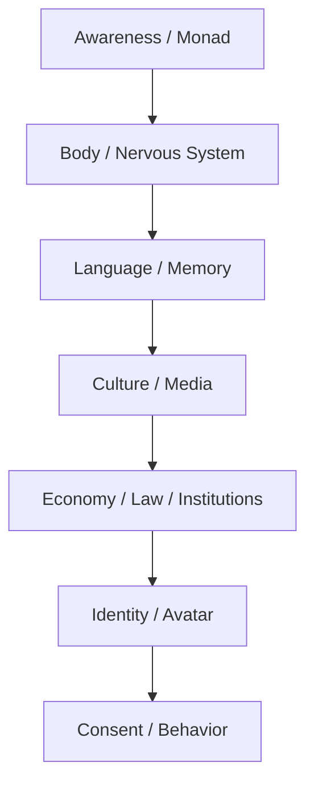

# Cách Đọc Red Pill Wiki

**Red Pill Wiki không phải giáo trình để học thuộc. Nó là bản đồ để đi qua nhiều tầng reality: fact, pattern, symbol, myth, conspiracy, metaphysics và direct knowing. Trước khi tin hoặc phủ định bất kỳ điều gì, hãy nhận biết chính tiến trình thấy đang xảy ra. Nếu đọc vault như một hệ niềm tin mới, bạn đã dùng sai. Nếu đọc nó như một bộ câu hỏi để tự nhìn lại thế giới và chính tâm mình, nó bắt đầu mở khóa.**

*Red Pill Wiki is not a doctrine to memorize. It is a map for moving through layers of reality: fact, pattern, symbol, myth, conspiracy, metaphysics, and direct knowing.*

---

## 0. Trước Khi Tin Hay Phủ Định: Nhận Biết Sự Thấy

Trước khi đi vào bất kỳ rabbit hole nào, hãy dừng lại một nhịp.

Không cần tin ngay.

Không cần phủ định ngay.

Trước hết, nhận biết:

- mình đang thấy điều gì;
- cảm giác gì đang sinh trong thân;
- tâm đang muốn kết luận theo hướng nào;
- mình đang bị hút bởi sợ hãi, phấn khích, giận dữ, hy vọng hay ego “mình biết bí mật”;
- claim này đang làm mình muốn bám vào nó hay đẩy nó đi.

Đây là **kỷ luật nguồn nội tâm**. Source discipline không chỉ là kiểm nguồn bên ngoài. Nó còn là kiểm chính trạng thái tâm đang đọc nguồn đó.

> Không phủ định điều đang thấy. Không vội khẳng định điều đang thấy. Trước hết, nhận biết rằng sự thấy đang xảy ra.

Một bài trong vault có thể mở ra một pattern thật. Nó cũng có thể kích hoạt fear loop, savior complex, rage với hệ thống, hoặc cảm giác hơn người. Nếu không nhận biết tiến trình thấy, người đọc rất dễ đổi từ nhà tù mainstream sang nhà tù alternative.

Đọc đúng không phải là tìm một niềm tin mới để bám. Đọc đúng là quán chiếu:

- phần nào là fact;
- phần nào là pattern;
- phần nào là symbol;
- phần nào là speculative synthesis;
- phần nào là phản ứng của chính mình.

Nếu một idea làm bạn tỉnh hơn, grounded hơn, tự chủ hơn, nó có thể là ngón tay tốt. Nếu nó chỉ làm bạn sợ hơn, kiêu hơn, nghiện doomscroll hơn, nó đang biến thành spell.

Ngón tay chỉ mặt trăng. Ngón tay không phải mặt trăng. Và người chỉ cũng chưa chắc đã thấy trăng trọn vẹn.

---

## 1. Đừng Tin. Hãy Thấy.

Câu cốt lõi của vault là:

> Sự thật không cần bạn tin. Nó chỉ cần bạn tìm kiếm.

Tin quá nhanh là cái bẫy đầu tiên. Phủ định quá nhanh là cái bẫy thứ hai.

Một người đọc tốt không hỏi ngay: “Cái này đúng hay sai?”

Họ hỏi:

- Tầng fact ở đây là gì?
- Pattern nào đang lặp lại?
- Symbol này đánh vào tầng tâm lý nào?
- Ai được lợi nếu narrative này được tin?
- Ai được lợi nếu narrative này bị chế giễu?
- Điều gì trong mình phản ứng quá mạnh với chủ đề này?

Red pill không phải là đổi từ niềm tin mainstream sang niềm tin alternative. Red pill là nhìn thấy cơ chế tạo niềm tin.

Nếu mới vào vault, mở [[Glossary - Từ Điển Red Pill Wiki]] để nắm vocabulary trước, rồi dùng [[Source Discipline - Kỷ Luật Nguồn Và Bằng Chứng]] như firewall khi gặp claim mạnh, nhạy cảm hoặc speculative. Với các sự kiện đang nóng, dùng [[Current Events Lab - Phòng Thí Nghiệm Sự Kiện]] như phòng thí nghiệm public để xem protocol này vận hành trên case cụ thể.

---

## 2. Bốn Tầng Đọc

Mỗi bài trong vault nên được đọc qua bốn tầng. Đừng trộn chúng lại thành một cục. Bản đầy đủ nằm ở [[Source Discipline - Kỷ Luật Nguồn Và Bằng Chứng]].

| Tầng | Câu hỏi | Ví dụ |
|---|---|---|
| **Fact / Documentable** | Có tài liệu, sự kiện, nguồn, lịch sử nào kiểm được? | IPO, luật, báo cáo, tổ chức, timeline |
| **Pattern / Systems** | Các sự kiện có lặp lại cùng một cấu trúc không? | problem-reaction-solution, divide-and-conquer |
| **Symbol / Myth** | Hình ảnh này lập trình cảm xúc gì? | obelisk, alien, serpent, cube, moon landing |
| **Speculative Synthesis** | Nếu nối các tầng lại, model nào xuất hiện? | Ma Trận, loosh, disclosure ritual, soul trap |

Sai lầm phổ biến là lấy tầng 4 để thay tầng 1, hoặc lấy tầng 1 để phủ định tầng 3.

Một symbol không cần “chứng minh” như một event. Một event không nên bị bóp méo để phục vụ symbol. Mỗi tầng có luật đọc riêng.

Ví dụ với [[Chainlink - Mắt Xích Của Tokenized World]]: fact-level là oracle/RWA/institutional bridge; pattern-level là blockchain nối vào banking rails; symbol-level là chain/link/bank/channel/current; speculative-level mới là giả thuyết Sergey Nazarov/Satoshi. Trộn bốn tầng này lại sẽ thành dogma. Giữ chúng tách ra thì dot trở thành lens đọc hệ thống.

---

## Claim Discipline Cho Crypto / CBDC Dots

Các dot như “Satoshi Nakamoto == Sergey Nazarov”, Chainlink như bridge vào banking system, hay crypto như conditioning layer cho CBDC phải được đọc đúng tầng.

- **Fact**: Bitcoin là public ledger; Chainlink là oracle/interoperability infrastructure; stablecoin và tokenization đang được institutions thử nghiệm.
- **Pattern**: ledger money → programmable contracts → oracle/RWA bridge → digital ID/CBDC là một transition stack hợp logic.
- **Symbol**: chain, link, block, bank, channel, currency/current là word magic đáng đọc.
- **Speculation**: Sergey/Satoshi identity hypothesis là speculative synthesis, không phải fact đã chứng minh.

Ví dụ chuẩn: [[Chainlink - Mắt Xích Của Tokenized World]] không cần khẳng định “Sergey là Satoshi” để chỉ ra rằng Chainlink là mắt xích nối blockchain với tokenized banking.

## 3. Fact Không Đủ. Nhưng Không Có Fact Thì Dễ Bay.

Mainstream thường mắc lỗi: chỉ công nhận fact đã được institution cho phép.

Alternative thường mắc lỗi ngược lại: vì institution từng nói dối, nên mọi thứ chống institution đều có vẻ đúng.

Cả hai đều là bẫy.

[[Khoa Học Xét Lại]] không có nghĩa là phủ định khoa học. Nó nghĩa là phân biệt:

- Science như **method**: quan sát, kiểm chứng, phản biện, lặp lại.
- Science như **institution**: funding, prestige, censorship, career incentive, geopolitics.

Tương tự, conspiracy không có nghĩa là “mọi thứ đều được dàn dựng 100%”. Nó nghĩa là quyền lực thường vận hành qua coordination, incentive, secrecy và narrative management.

---

## 4. Ma Trận Là Interface, Không Chỉ Nhà Tù

Khi đọc [[Ma Trận]], đừng chỉ tưởng tượng một nhóm xấu đang cầm remote điều khiển loài người.

Ma Trận sâu hơn vậy. Nó là interface giữa awareness và world:

Bạn không chỉ bị kiểm soát bởi thông tin sai. Bạn bị kiểm soát bởi cái khung khiến một số câu hỏi không bao giờ xuất hiện trong đầu.

Đó là lý do vault nối nhiều mảng tưởng không liên quan: food, sex, money, education, alien, Hollywood, AI, medicine, spirituality. Chúng là các module khác nhau của cùng một interface.

---

## 5. Symbol Không Phải Trang Trí

Trong vault, symbol được đọc như software của subconscious.

Hollywood, myth, logo, ritual, architecture, tên gọi, ngày tháng, ticker, màu sắc, archetype — tất cả đều có thể hoạt động như interface giữa event và collective psyche.

Điều này không có nghĩa mọi symbol đều là bằng chứng của conspiracy. Nó nghĩa là những người làm power lâu đời hiểu rằng con người không vận hành bằng fact thuần túy. Con người vận hành bằng story, emotion, image, fear, desire và memory.

[[Hollywood - Cây Đũa Phép Của Phù Thủy]] không nói rằng mọi đạo diễn đều biết mình đang làm ritual. Nó nói rằng cinema có khả năng rehearsal cảm xúc tập thể trước khi reality cần public phản ứng theo một cách nào đó.

---

## 6. Đừng Biến Red Pill Thành Tôn Giáo Mới

Một cái bẫy lớn của người tỉnh thức là nghiện cảm giác mình đã tỉnh.

Dấu hiệu red pill bị biến thành ego game:

- Coi người khác là NPC để thấy mình cao hơn.
- Mọi thứ đều quy về một enemy duy nhất.
- Không còn khả năng nói “tôi chưa biết”.
- Thấy pattern ở mọi nơi nhưng không còn phân biệt mạnh/yếu.
- Dùng conspiracy để trốn trách nhiệm đời sống cá nhân.
- Dùng spirituality để bypass trauma, tiền bạc, sức khỏe, quan hệ.

Đây là lý do [[Nghịch Lý Của Hiểu Biết]] nên đọc đầu tiên hoặc cuối cùng. Mọi framework đều là ngón tay chỉ mặt trăng. Kể cả framework của vault này.

---

## 7. Cách Đọc Một Bài Bất Kỳ

Khi mở một bài, hãy thử đọc theo protocol này:

1. **Thesis:** bài đang nói điều gì trong một câu?
2. **Evidence:** phần nào kiểm được bằng nguồn ngoài?
3. **Pattern:** sự kiện này giống pattern nào trong vault?
4. **Symbol:** hình ảnh/archetype nào đang vận hành?
5. **Incentive:** ai được lợi nếu public tin/không tin điều này?
6. **Inner Mirror:** điều này phản chiếu gì trong chính mình?
7. **Action:** biết điều này giúp mình sống tự do, khỏe, tỉnh hơn như nào?

Nếu một bài không giúp bạn sống tỉnh hơn, mà chỉ làm bạn sợ hơn, thì bạn chưa tiêu hóa nó. Bạn mới nuốt raw signal.

---

## 8. Start Here / Reading Paths

Reading paths ở đây chỉ là **đường vào nhẹ**. Root `index.md` là cửa chính; các **MOC** vẫn là navigation layer thật. Nếu gặp term lạ, mở [[Glossary - Từ Điển Red Pill Wiki]]. Nếu gặp claim rủi ro cao, đọc [[Source Discipline - Kỷ Luật Nguồn Và Bằng Chứng]] trước.

### 1. Matrix / Perception

Vào bằng [[Ma Trận]], rồi dùng [[MOC - Esoterica & Consciousness]] và [[MOC - Epistemology & Propaganda]] để đi sâu.

Flagship notes: [[Ma Trận - Giải Phẫu Hoàn Chỉnh]], [[Monad]], [[Gnosis]], [[Vô Thức Tập Thể]].

### 2. Predictive Programming & Spectacle Ritual

Vào bằng [[Predictive Programming - Cấy Tương Lai Vào Tiềm Thức]], rồi đi qua [[MOC - Epistemology & Propaganda]] để giữ claim discipline.

Flagship/case notes: [[Hollywood - Cây Đũa Phép Của Phù Thủy]], [[Karma Disclosure - Truth Hidden In Plain Sight]], [[Spectacle Ritual - World Cup, Super Bowl Và Nghi Lễ Đồng Bộ Đại Chúng]], [[Brazil 2026 - Khi Bóng Đá Trở Về Với Linh Hồn Tập Thể]], [[A LIE N - SpaceX IPO Disclosure Day và Nghi Lễ Tên Lửa]].

### 3. Money / Control Rails

Vào bằng [[MOC - Financial Sovereignty]]. Đọc money theo ba tầng: survival, sovereignty, control architecture.

Flagship notes: [[Bitcoin]], [[Privacy]], [[Chainlink - Mắt Xích Của Tokenized World]], [[Gen Z và CBDC - Programmable Money Psychology]], [[Báo Cáo 2030]].

### 4. Health Sovereignty

Vào bằng [[MOC - Health Sovereignty]]. Đọc như map terrain/incentive/body sovereignty, không như toa thuốc cá nhân.

Flagship notes: [[Y Tế Tự Nhiên]], [[Kính Chiếu Yêu - Nhìn Thấu Tây Y]], [[Thuyết Vi Sinh Nội Sinh]], [[Cơ Chế Tự Bảo Vệ Của Cơ Thể]], [[Hệ Tiêu Hóa - Bộ Não Thứ Hai]], [[Khoa Học Xét Lại]].

### 5. Current Events Lab

Vào bằng [[Source Discipline - Kỷ Luật Nguồn Và Bằng Chứng]], rồi dùng [[MOC - Epistemology & Propaganda]], [[MOC - Financial Sovereignty]] hoặc [[MOC - Science Revisionism]] tùy case.

Case notes để luyện đọc bốn tầng: [[Karma Disclosure - Truth Hidden In Plain Sight]], [[Spectacle Ritual - World Cup, Super Bowl Và Nghi Lễ Đồng Bộ Đại Chúng]], [[Brazil 2026 - Khi Bóng Đá Trở Về Với Linh Hồn Tập Thể]], [[A LIE N - SpaceX IPO Disclosure Day và Nghi Lễ Tên Lửa]], [[Chainlink - Mắt Xích Của Tokenized World]], [[Elite]].

> Current event là phòng lab, không phải altar. Quan sát pattern, giữ humility, và luôn hỏi: tầng nào kiểm được, tầng nào là systems reading, tầng nào chỉ là symbol hoặc synthesis?

---

## 9. Synthesis

Red Pill Wiki không bảo bạn tin rằng mọi thứ trong đây đều đúng.

Nó mời bạn luyện một cách nhìn:

- đủ skeptical để không bị mainstream ru ngủ,
- đủ grounded để không bị alternative kéo bay,
- đủ symbolic để đọc myth,
- đủ factual để không bỏ chứng cứ,
- đủ spiritual để nhớ rằng mọi bản đồ đều không phải mặt trăng.

> Mục tiêu không phải biết nhiều conspiracy hơn người khác. Mục tiêu là lấy lại quyền nhìn.
