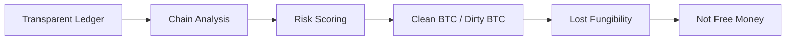

# Bitcoin Sẽ Chết Nếu Không Có Privacy

**Bitcoin có thể sống như store of value mà thiếu privacy một thời gian. Nhưng nếu muốn trở thành tiền tệ tự do thật sự, Bitcoin cần fungibility. Và không có privacy thì không có fungibility. Một đồng tiền bị truy vết, chấm điểm, blacklist và phân loại “sạch/bẩn” cuối cùng sẽ bị kéo ngược về Ma Trận tài chính mà nó sinh ra để thoát khỏi.**

*Bitcoin can survive as a store of value without privacy for a while. But if it wants to become truly free money, it needs fungibility. And without privacy, there is no fungibility. Money that can be traced, scored, blacklisted, and classified as “clean” or “dirty” will eventually be dragged back into the financial Matrix it was born to escape.*

---

## Vault Position / Vị Trí Trong Vault

Bài này nằm trong [[MOC - Financial Sovereignty]], nối [[Bitcoin]], [[Privacy]], [[Tiền Giấy - Tiền Mặt]] và [[Gen Z và CBDC - Programmable Money Psychology]].

Privacy không phải chi tiết kỹ thuật phụ. Nó là điều kiện để tiền còn giữ được chủ quyền.

> No privacy → no fungibility → not free money.

---

## 1. Fungibility Là Gì?

Fungibility nghĩa là mỗi đơn vị tiền có giá trị ngang nhau và hoán đổi được.

Một tờ 500k là một tờ 500k. Bạn không cần tra lịch sử từng người từng cầm nó.

Bitcoin thì khác. Blockchain công khai khiến mỗi UTXO có lịch sử. Nếu lịch sử đó bị chain surveillance companies gắn nhãn “dirty”, thì 1 BTC không còn bằng 1 BTC.

| Money type | Fungibility |
|---|---|
| Cash | mạnh, vì lịch sử khó truy |
| Gold | tương đối mạnh nếu physical |
| Bank money | yếu, permissioned và surveilled |
| Bitcoin on-chain | mạnh về scarcity, yếu về privacy |
| CBDC | anti-privacy by design |

---

## 2. Bitcoin Không Anonymous

Bitcoin là pseudonymous, không phải anonymous.

- Giao dịch on-chain public.
- KYC exchange nối identity với address.
- Chain analysis nối address clusters.
- Merchant/payment metadata leak thêm context.
- Một lần reuse address có thể lộ nhiều thứ.

Lầm tưởng “Bitcoin ẩn danh” là dangerous. Nó khiến người dùng tự do giả trong một ledger công khai vĩnh viễn.

---

## 3. Dirty Bitcoin Problem

Nếu coin từng đi qua hack, darknet, sanctioned address, mixer, hoặc activity bị gắn nhãn, sàn/merchant/custodian có thể từ chối.

Khi đó:

Một hệ thống như vậy dễ bị financial censorship.

---

## 4. War On Cash

Cuộc chiến chống tiền mặt không chỉ vì convenience. Cash là một trong những công cụ privacy cuối cùng của người thường.

Khi cash biến mất, mọi giao dịch đi qua rail có permission:

- bank,
- app,
- exchange,
- payment processor,
- state database,
- tax system,
- AI fraud scoring.

[[Gen Z và CBDC - Programmable Money Psychology]] là cực đối nghịch của financial sovereignty: tiền không chỉ bị theo dõi, mà còn có thể bị lập trình.

Bitcoin muốn chống CBDC thì không thể chỉ có scarcity. Nó cần privacy.

---

## 5. Privacy Không Phải Che Giấu Tội Lỗi

Privacy là quyền có đời sống không bị soi mọi lúc.

Bạn đóng cửa nhà tắm không phải vì phạm tội. Bạn dùng phong bì không phải vì bất chính. Bạn không công khai sao kê ngân hàng không phải vì xấu.

Financial privacy bảo vệ:

- dissidents,
- journalists,
- families,
- businesses,
- donors,
- minorities,
- people under authoritarian regimes,
- người chỉ đơn giản không muốn bị profiling.

> Privacy không phải để trốn khỏi đạo đức. Nó là điều kiện để đạo đức không bị ép bởi surveillance.

---

## 6. Giải Pháp

### On Bitcoin

- address hygiene,
- avoid address reuse,
- coin control,
- Lightning Network,
- CoinJoin/PayJoin,
- self-custody,
- non-KYC acquisition where legal/safe,
- Taproot/script improvements,
- education.

### Outside Bitcoin

- [[Privacy]] as lifestyle,
- cash while still possible,
- Monero/Zcash as privacy experiments,
- local peer networks,
- operational security.

Không có silver bullet. Privacy là practice, không chỉ feature.

---

## 7. Bitcoin Có Thể Thích Nghi Không?

Bitcoin có lợi thế Lindy, liquidity, security, brand và decentralization. Nhưng nó có social conservatism và protocol caution.

Điều này tốt cho monetary base, nhưng có thể chậm với privacy upgrades.

Có hai kịch bản:

1. Bitcoin tích hợp privacy đủ tốt ở layers/tools.
2. Privacy money tồn tại song song và trở thành phần không thể thiếu của financial sovereignty stack.

Câu hỏi không phải BTC hay XMR thắng như fan war. Câu hỏi là: freedom stack cần gì để sống sót?

---

## Synthesis

Bitcoin sinh ra để tách money khỏi central authority. Nhưng nếu mọi coin đều bị surveillance scoring, Bitcoin sẽ bị domesticate: vẫn scarce, nhưng không còn wild.

Scarcity bảo vệ value. Privacy bảo vệ freedom.

> Bitcoin không chết vì thiếu narrative. Nó chết nếu trở thành một ledger trong suốt cho cùng hệ thống mà nó muốn vượt qua.

---

## Related

- [[Bitcoin]]
- [[Privacy]]
- [[Privacy Is The New Wealth]]
- [[Tiền Giấy - Tiền Mặt]]
- [[Gen Z và CBDC - Programmable Money Psychology]]
- [[MOC - Financial Sovereignty]]
