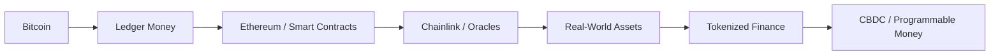
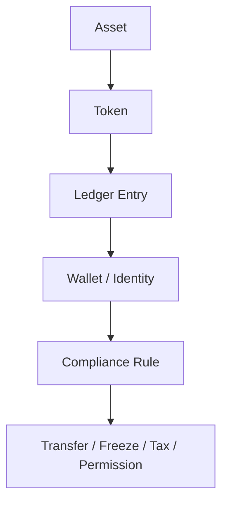

# Chainlink - Mắt Xích Của Tokenized World

**Chainlink không chỉ là một oracle protocol trong crypto. Trong vault, nó là mắt xích biểu tượng và hạ tầng nối blockchain với tài sản thật, dữ liệu thật, ngân hàng, SWIFT, RWA và eventually programmable money. Nếu [[Bitcoin]] làm mass quen với tiền trên ledger, Chainlink làm ledger nói chuyện với hệ thống tài sản toàn cầu.**

*Chainlink is not merely a crypto oracle protocol. In this vault, it is both symbolic and infrastructural: the link that connects blockchains to real-world assets, data, banks, SWIFT, RWAs, and eventually programmable money.*

---

## Vault Position / Vị Trí Trong Vault

Bài này nằm trong [[MOC - Financial Sovereignty]], nhưng nó cũng nối sang [[MOC - Epistemology & Propaganda]] vì ngôn ngữ của crypto tự nó đã là một dạng [[Word Magic - Ngôn Ngữ Của Phù Thủy|word magic]].

Đây là bridge note giữa:

- [[Bitcoin]] — digital scarcity và ledger money.
- [[Bitcoin Sẽ Chết Nếu Không Có Privacy]] — public ledger, traceability và fungibility risk.
- [[Gen Z và CBDC - Programmable Money Psychology]] — programmable money và conditioning.
- [[Tiền Pháp Định]] — fiat, debt và legal money.
- [[Karma Disclosure - Truth Hidden In Plain Sight]] — truth hidden in plain sight qua name, symbol, interface.

Câu hỏi chính không phải “Chainlink tốt hay xấu?”. Câu hỏi là:

> Khi mọi tài sản được nối vào chain, ai giữ quyền đọc, quyền xác minh, quyền đóng/mở dòng chảy?

---

## Evidence Discipline / Cách Đọc Claim

| Tầng | Cách đọc | Ví dụ |
|---|---|---|
| **Fact / documentable** | Chainlink là oracle / data / interoperability infrastructure trong crypto; có liên quan tới use case RWA, institutional settlement, proof-of-reserve, price feeds | oracle, CCIP, price feeds, RWA integrations |
| **Pattern / systems reading** | Blockchain cần oracle để nối thế giới thật; banking cần trusted data layer để tokenized assets hoạt động | tokenization stack, settlement rails, compliance rails |
| **Symbol / word magic** | chain, link, block, bank, channel, currency/current, liquidity/flow | ngôn ngữ tiền tệ như dòng chảy bị kênh hóa |
| **Speculative synthesis** | Sergey Nazarov/Satoshi hypothesis, crypto như rollout layer cho CBDC/tokenized control | đọc như hypothesis, không phải fact đã đóng |

Không nên viết “Sergey Nazarov là Satoshi” như fact. Nhưng có thể đọc hypothesis này như một symbolic/systems clue vì arc Bitcoin → Chainlink quá hoàn chỉnh để bỏ qua.

---

## Publication Pack / Financial Sovereignty

Bài này thuộc **Financial Sovereignty Pack**: đi từ fiat awareness đến self-custody, privacy và rủi ro programmable finance.

Reading path:

1. [[Bitcoin]] — tiền như protocol và exit khỏi fiat dilution.
2. [[Bitcoin Sẽ Chết Nếu Không Có Privacy]] — sovereignty không có privacy là bẫy.
3. [[Privacy]] — quyền riêng tư như hạ tầng tự do.
4. [[Giữ Tiền Quan Trọng Hơn Kiếm Tiền]] — risk survival trước alpha.
5. [[Chainlink - Mắt Xích Của Tokenized World]] — bridge từ crypto sang tokenized real world.

Rule của pack: không biến crypto thành hopium. Sovereignty = custody + privacy + risk discipline.

## 1. Bitcoin Mở Cổng, Chainlink Nối Cổng

Một cách đọc đơn giản:

[[Bitcoin]] dạy mass rằng tiền có thể tồn tại như một entry trên public ledger. Ethereum dạy mass rằng hợp đồng có thể lập trình được. Chainlink dạy blockchain cách đọc dữ liệu bên ngoài: price, proof-of-reserve, event, asset state, settlement condition.

Nếu Bitcoin là “exit khỏi banking system” ở tầng myth, Chainlink là cây cầu để banking system bước vào thế giới onchain ở tầng infrastructure.

> Bitcoin làm con người quen với ledger. Chainlink làm ledger nói chuyện với ngân hàng.

---

## 2. Word Magic: Chain, Link, Block, Bank, Channel

Ngôn ngữ tự khai rất nhiều.

| Từ | Nghĩa thường | Tầng biểu tượng |
|---|---|---|
| **Blockchain** | chuỗi khối | dòng giao dịch bị chia thành blocks và xâu vào chain |
| **Chainlink** | mắt xích của chuỗi | link nối thế giới thật vào chain |
| **Bank** | ngân hàng / bờ sông | bờ điều hướng current/dòng chảy |
| **Channel** | kênh | đường dẫn của flow, payment, communication |
| **Currency** | tiền tệ | current: dòng chảy, điện lưu, liquidity |
| **Liquidity** | thanh khoản | chất lỏng tài chính, dòng chảy có thể đo/điều hướng |

Finance language từ lâu đã là ngôn ngữ của nước: flow, current, liquidity, bank, offshore, channel, float. Crypto không phá ngôn ngữ đó. Nó literalize nó.

Khi currency trở thành current onchain, dòng tiền không còn chỉ “lưu thông”. Nó được ghi, kênh hóa, lập trình, audit, đóng/mở bằng rule.

---

## 3. Luật Biển, Dòng Chảy Và Claim

Trong maritime/admiralty lens, tài sản và tiền không chỉ là vật. Chúng là **claims moving through channels under jurisdiction**.

Ngôn ngữ pháp lý/tài chính đầy dấu nước:

- vessel,
- dock,
- berth,
- bond,
- float,
- draft,
- offshore,
- shipment,
- bill of lading,
- custody,
- liquidity.

Onchain finance làm mô hình này sạch hơn:

Thứ trước đây cần giấy tờ, custodian, clearing house, registry, ngân hàng và tòa án, giờ có thể trở thành programmable claim trên ledger.

Đây là lý do tokenization không chỉ là “hiệu quả hơn”. Nó là một bước chuyển jurisdiction: tài sản thật được translate thành object có thể đọc/điều khiển bởi code.

---

## 4. Oracle Layer Là Gì?

Smart contract tự nó không biết thế giới bên ngoài. Nó cần oracle.

Oracle trả lời các câu như:

- giá BTC/ETH hiện tại là bao nhiêu?
- một treasury có bao nhiêu reserve?
- tài sản ngoài đời đã chuyển trạng thái chưa?
- dữ liệu compliance có pass không?
- sự kiện nào đã xảy ra để kích hoạt settlement?

Không có oracle, blockchain dễ trở thành closed casino. Có oracle, blockchain có thể nối vào insurance, bond, real estate, commodities, equities, banking, derivatives.

Đây là chỗ Chainlink trở thành infrastructure quan trọng: không phải vì token LINK pump hay dump, mà vì nó đại diện cho **data bridge** giữa onchain và offchain.

---

## 5. Tokenized Assets Và Banking Integration

Tokenized world cần nhiều lớp:

1. **Ledger** — nơi ghi ownership.
2. **Identity** — ai được sở hữu/transfer.
3. **Oracle** — dữ liệu thế giới thật.
4. **Compliance** — rule để transfer được phép.
5. **Settlement** — chuyển giao tài sản/tiền.
6. **Custody** — ai giữ asset backing.
7. **Interoperability** — tài sản đi qua chain/rail khác nhau.

Chainlink nằm ở nhiều điểm trong stack này: data, proof, cross-chain messaging, oracle, institutional bridge.

Nếu banking system muốn lên chain, nó không chỉ cần blockchain. Nó cần một lớp đảm bảo rằng code có thể tin dữ liệu ngoài đời. Đó là vai trò oracle.

---

## 6. Transparency Hay Total Visibility?

Crypto bán transparency như virtue:

> Ai cũng thấy ledger, không ai gian lận.

Nhưng cùng transparency đó có thể thành total visibility:

- address clustering,
- KYC exchange mapping,
- chain surveillance,
- clean/dirty coin scoring,
- blacklist/freeze,
- behavioral finance profile,
- automated tax/compliance.

Câu hỏi không phải “minh bạch có tốt không?”. Câu hỏi là:

> Minh bạch cho ai? Người dân nhìn hệ thống, hay hệ thống nhìn người dân?

Đây là lý do [[Bitcoin Sẽ Chết Nếu Không Có Privacy]] là bài sibling của note này. Nếu không có privacy, tokenized world rất dễ biến thành panopticon tài chính.

---

## 7. Sergey Nazarov / Satoshi Hypothesis

Có một giả thuyết fringe cho rằng Sergey Nazarov có thể liên quan tới Satoshi Nakamoto, hoặc ít nhất thuộc cùng một lớp kiến trúc sư early crypto. Đây không phải fact-level claim.

Điểm đáng đọc không phải “prove Sergey = Satoshi”. Điểm đáng đọc là arc:

> Satoshi / Bitcoin → introduce ledger money
> Ethereum → introduce programmable contracts
> Sergey / Chainlink → connect contracts to real-world data/assets
> RWA / CBDC → tokenize and permission the world

Nếu Satoshi là người mở cổng, thì Sergey/Chainlink là người nối cổng đó vào hệ thống tài sản toàn cầu.

Nói mạnh hơn ở tầng symbolic:

> Người giới thiệu exit khỏi banking system cũng có thể là người, hoặc archetype, xây cầu để banking system bước vào blockchain.

Không cần hypothesis này đúng 100% để pattern có giá trị. Names, rails, incentives và adoption path đã rhyme đủ lớn để đưa vào vault.

---

## 8. Crypto Như Conditioning Layer Cho CBDC

[[Gen Z và CBDC - Programmable Money Psychology]] đọc CBDC không chỉ là policy, mà là conditioning.

Crypto đã làm mass quen với:

- wallet,
- address,
- token,
- gas fee,
- onchain reputation,
- digital custody,
- public transaction history,
- smart contract,
- stablecoin,
- tokenized asset.

CBDC không cần xuất hiện như cú sốc. Nó có thể xuất hiện như bản nâng cấp “an toàn, hợp pháp, được bảo chứng” của thứ crypto đã normalize.

> Crypto UX → stablecoin rails → tokenized assets → digital ID → CBDC

Trong stack này, Chainlink/oracle layer là cầu nối làm thế giới thật bước vào ledger.

---

## Synthesis

Chainlink là một dot quan trọng vì nó nối technology, banking, language và myth.

Fact-level: Chainlink là oracle/interoperability infrastructure cho crypto và tokenized assets.

Pattern-level: Chainlink là lớp bridge để blockchain không còn là casino đóng kín mà trở thành settlement fabric cho tài sản thật.

Symbol-level: Chain-link là mắt xích nối mọi thứ vào chain; bank là bờ của current; channel là kênh dẫn dòng.

Speculative-level: Sergey/Satoshi hypothesis là một mythic clue về khả năng crypto không chỉ là rebellion, mà là rollout layer của monetary internet.

> Bitcoin dạy mass tin vào ledger. Chainlink dạy ledger đọc thế giới thật. CBDC chỉ cần bước qua cây cầu đã được xây sẵn.

---

## Related

- [[Bitcoin]]
- [[Bitcoin Sẽ Chết Nếu Không Có Privacy]]
- [[Privacy]]
- [[Tiền Pháp Định]]
- [[Gen Z và CBDC - Programmable Money Psychology]]
- [[Word Magic - Ngôn Ngữ Của Phù Thủy]]
- [[Karma Disclosure - Truth Hidden In Plain Sight]]
- [[MOC - Financial Sovereignty]]
- [[MOC - Epistemology & Propaganda]]
