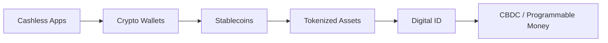
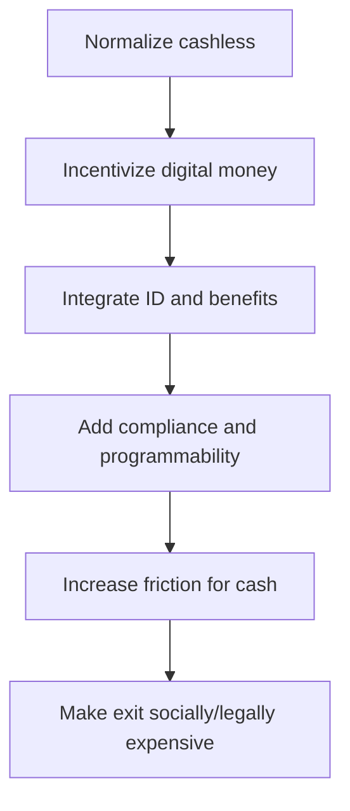

# Gen Z và CBDC - Programmable Money Psychology

**CBDC không chỉ là một upgrade kỹ thuật của tiền tệ. Nó là một bài toán tâm lý học: làm sao để một thế hệ tự nguyện bước từ tiền mặt ẩn danh sang tiền số định danh, lập trình được và giám sát được. Gen Z là thế hệ quan trọng nhất trong quá trình này vì họ không cần bị ép rời khỏi cash; họ gần như chưa từng sống trong một thế giới nơi cash là mặc định.**

*CBDC is not merely a technical upgrade to money. It is a psychology problem: how to move a generation voluntarily from anonymous cash into identity-linked, programmable, surveillable money.*

---

## Vault Position / Vị Trí Trong Vault

Bài này nằm trong [[MOC - Financial Sovereignty]]. Nó nối [[Tiền Giấy - Tiền Mặt]], [[Bitcoin]], [[Privacy]], [[Chainlink - Mắt Xích Của Tokenized World]] và [[Báo Cáo 2030]].

Thesis chính:

> CBDC không thắng bằng cách nói “hãy chấp nhận kiểm soát”. Nó thắng bằng cách khiến kiểm soát mang hình dáng của tiện lợi, an toàn, hiện đại, công bằng và cứu thế giới.

Đọc bài này qua bốn tầng:

| Tầng | Câu hỏi | Ví dụ |
|---|---|---|
| **Fact / documentable** | CBDC là gì? central bank digital money khác cash/bank money ra sao? | central bank liability, digital wallet, pilot programs |
| **Pattern / systems** | Cashless UX, stablecoin, wallet, digital ID đang normalize hành vi gì? | QR pay, Apple Pay, USDT, KYC exchange |
| **Psychological layer** | Gen Z được điều kiện hóa để thấy gì là bình thường? | convenience, subscription, algorithmic fairness |
| **Speculative synthesis** | CBDC + digital ID + programmable rules có thể thành control layer như nào? | expiry, permission, scoring, carbon wallet |

Không cần phóng đại rằng mọi CBDC hôm nay đã có full social credit. Rủi ro thật nằm ở kiến trúc: nếu tiền, ID, compliance và behavioral data được nối vào cùng một rail, khả năng kiểm soát trở thành native feature.

---

## 1. CBDC Là Gì?

**CBDC** = Central Bank Digital Currency, tức tiền kỹ thuật số do ngân hàng trung ương phát hành.

Điểm khác biệt không phải chỉ là “tiền trên app”. Người dùng đã có app ngân hàng, ví điện tử, Apple Pay, MoMo, ZaloPay. Điểm khác là CBDC có thể là **direct hoặc near-direct liability của central bank**, được thiết kế native cho digital settlement, identity, compliance và policy transmission.

| Loại tiền | Issuer | Privacy | Permission risk | Programmability |
|---|---|---|---|---|
| Cash | Nhà nước / central bank | Cao nhất | Thấp khi giao dịch trực tiếp | Gần như không |
| Bank deposit | Ngân hàng thương mại | Thấp-trung bình | Có thể freeze/report | Qua bank/app/rule |
| Stablecoin | Private issuer | Thấp nếu KYC/onchain traced | Có thể freeze ở issuer/chain level | Cao nếu smart contract |
| Bitcoin | Không issuer | Pseudonymous, không anonymous | Thấp ở protocol, cao ở on/off-ramp | Rule cố định, không policy-programmable |
| CBDC | Central bank/state rail | Tùy thiết kế, thường thấp hơn cash | Cao nếu gắn ID/compliance | Có thể rất cao |

Điểm nguy hiểm của CBDC không nằm ở chữ “digital”. Digital chỉ là interface. Điểm nguy hiểm nằm ở khả năng kết hợp:

```text
digital money
+ digital ID
+ programmable rules
+ real-time compliance
+ behavioral data
= permissioned financial operating system
```

---

## 2. Programmable Money Nghĩa Là Gì?

“Programmable” không nhất thiết nghĩa là mọi chính phủ sẽ lập tức dùng hết tính năng xấu. Nó nghĩa là tiền có thể được thiết kế để mang rule ngay trong rail.

Các rule có thể bao gồm:

- tiền hết hạn để kích thích tiêu dùng,
- chỉ dùng được cho ngành/hàng hóa nhất định,
- hạn mức theo khu vực hoặc nhóm người,
- automatic tax/fine/fee,
- freeze hoặc hold giao dịch theo trigger compliance,
- differential interest rate,
- carbon hoặc ESG-linked spending rule,
- geofencing,
- blacklist/whitelist merchant hoặc người dùng.

Với cash, rule phải áp từ bên ngoài và sau giao dịch. Với programmable money, rule có thể áp **trước hoặc trong lúc giao dịch**.

> Cash hỏi: “Bạn có tiền không?”  
> Programmable money hỏi: “Bạn có được phép dùng tiền này, ở đây, lúc này, cho thứ này không?”

Đó là chuyển đổi rất lớn.

---

## 3. Gen Z: Cashless Native

Gen Z không chỉ là digital native. Họ là **cashless native**.

Nhiều người trẻ trải nghiệm tiền lần đầu qua:

- QR code,
- app ngân hàng,
- ví điện tử,
- in-app purchase,
- gaming currency,
- subscription,
- platform credit,
- stablecoin / crypto wallet.

Họ không có ký ức mạnh về cash như một công cụ tự do. Với họ, cash dễ bị frame là:

- chậm,
- bẩn,
- bất tiện,
- khó tracking,
- “của người già”,
- không tối ưu,
- không earn reward.

| Thế hệ | Trải nghiệm tiền đầu tiên | Mental model |
|---|---|---|
| Boomer | Cash | tiền là vật cầm được |
| Gen X | Cash + ATM | tiền là vật + tài khoản |
| Millennial | Card + PayPal + online banking | tiền là account balance |
| Gen Z | QR/app/wallet/token | tiền là access trong interface |

Khi tiền trở thành interface, quyền lực nằm ở người kiểm soát interface.

---

## 4. Convenience Là Gateway Drug

Câu then chốt:

> Convenience is the gateway drug to control.

Không ai rollout CBDC bằng câu: “Hãy vào hệ thống giám sát tài chính.”

Họ sẽ rollout bằng:

- instant settlement,
- no fee,
- cashback,
- chống fraud,
- financial inclusion,
- aid/UBI nhanh hơn,
- tax refund nhanh hơn,
- dễ dùng hơn cash,
- “an toàn hơn crypto”,
- “hiện đại hóa tiền tệ”.

Lúc đầu, control được package như benefit:

```text
tracking → safety
identity → anti-fraud
limits → responsibility
expiry → stimulus
carbon rule → save the planet
freeze → protect users
```

Ngôn ngữ là spell. Nếu đặt tên là “kiểm soát”, người ta phản kháng. Nếu đặt tên là “bảo vệ”, người ta cảm ơn.

---

## 5. Subscription Mindset → Rental Money Mindset

Gen Z đã quen với thế giới không sở hữu:

- Netflix: không sở hữu phim,
- Spotify: không sở hữu nhạc,
- Uber: không sở hữu xe,
- Airbnb: không sở hữu nhà,
- SaaS: không sở hữu phần mềm,
- game skins: sở hữu trong điều khoản platform.

Mental model chuyển từ ownership sang access.

CBDC hoặc platform money có thể đẩy logic này vào tiền:

> Bạn không sở hữu tiền như bearer asset. Bạn có quyền truy cập vào purchasing power, miễn là account/rule/identity còn hợp lệ.

Đây là khác biệt giữa cash và programmable balance.

Cash là bearer instrument: ai cầm thì dùng.

Programmable balance là permission instrument: hệ thống cho phép thì dùng.

---

## 6. Crypto UX Như Training Layer Cho CBDC

Đây là dot quan trọng.

Crypto thường được bán như exit khỏi ngân hàng, nhưng nó cũng làm mass quen với hạ tầng tiền số:

- wallet,
- address,
- seed phrase,
- token balance,
- QR transfer,
- stablecoin,
- gas fee,
- smart contract,
- onchain reputation,
- public transaction history,
- KYC on/off-ramp,
- risk scoring,
- tokenized asset.

[[Bitcoin]] normalizes ledger money. Stablecoin normalizes digital dollar. Ethereum normalizes programmable contracts. [[Chainlink - Mắt Xích Của Tokenized World|Chainlink/oracle layer]] normalizes việc dữ liệu thật, tài sản thật và banking rails bước vào chain.

CBDC không cần xuất hiện như cú sốc. Nó có thể xuất hiện như bản nâng cấp “an toàn, hợp pháp, được bảo chứng” của thứ crypto đã làm người trẻ quen từ trước.



Crypto cho cảm giác thoát khỏi ngân hàng. Nhưng đồng thời nó dạy mass sống trong một thế giới nơi tiền có address, lịch sử, metadata và rule.

---

## 7. Digital ID Là Điểm Khóa

CBDC một mình chưa phải full control. CBDC + digital ID mới là trục nguy hiểm.

Nếu wallet chỉ là ví, rủi ro còn giới hạn. Nếu wallet là identity container, nó có thể nối:

- danh tính pháp lý,
- tài khoản ngân hàng,
- thuế,
- y tế,
- carbon score,
- credit score,
- social graph,
- travel/mobility,
- employment,
- government benefit,
- transaction history.

Khi đó tiền không chỉ là phương tiện trao đổi. Nó thành **permission layer của đời sống**.

```text
Who are you?
→ What are you allowed to buy?
→ Where are you allowed to transact?
→ Which incentives/punishments apply to you?
```

Đây là lý do [[Privacy]] không phải “tội phạm mới cần”. Privacy là khoảng thở giữa con người và hệ thống.

---

## 8. Algorithmic Fairness: Cái Bẫy Tâm Lý

Gen Z lớn lên trong thế giới platform:

- feed được algorithm chọn,
- rating quyết định access,
- moderation quyết định speech,
- credit score quyết định loan,
- platform policy quyết định income.

Họ có thể ghét “hệ thống”, nhưng vẫn quen với việc để system chấm điểm và phân quyền.

CBDC có thể được bán như một hệ thống “công bằng hơn”:

- chống trốn thuế,
- chống rửa tiền,
- chống tài trợ khủng bố,
- chống scam,
- trợ cấp đúng người,
- carbon budget công bằng,
- phúc lợi không bị lạm dụng.

Nhưng algorithmic fairness luôn có câu hỏi bị giấu:

> Ai viết rule? Ai audit rule? Ai được miễn rule? Ai có quyền appeal khi rule sai?

Nếu không trả lời được, “fair system” chỉ là central planning có UI đẹp.

---

## 9. Climate Anxiety → Carbon Wallet Acceptance

Climate narrative là một trong những cửa vào mạnh nhất.

Gen Z được nuôi trong tâm lý:

- hành tinh đang nguy cấp,
- consumption là moral issue,
- carbon footprint là trách nhiệm cá nhân,
- behavior phải được đo để được sửa.

Từ đó carbon-linked money có thể được bán như virtue:

- tracking footprint,
- reward low-carbon behavior,
- surcharge high-carbon behavior,
- quota cho flight/meat/fuel,
- green score cho consumer.

Fact-level: không phải mọi CBDC hiện tại đều có carbon wallet. Pattern-level: nếu tiền, ID và ESG/carbon scoring được nối lại, behavioral control trở nên rất dễ.

Câu hỏi không phải “có nên bảo vệ môi trường không?”. Câu hỏi là:

> Ai được quyền biến đạo đức môi trường thành permission rule trên ví tiền của bạn?

---

## 10. Rollout Playbook

Một rollout mềm thường không bắt đầu bằng ép buộc. Nó bắt đầu bằng convenience và incentive, sau đó mới tăng friction cho alternative.



### Phase 1: Normalization

- Cashless store,
- QR payment,
- app-only discount,
- COVID-era hygiene narrative,
- “cash is inconvenient”.

### Phase 2: Incentivization

- cashback,
- tax benefit,
- faster benefits,
- government aid via wallet,
- youth onboarding campaign.

### Phase 3: Integration

- digital ID,
- welfare,
- tax,
- bank account,
- health/education services,
- travel/mobility credentials.

### Phase 4: Friction

- ATM fees,
- cash withdrawal limits,
- reporting threshold,
- merchant pressure,
- insurance/compliance penalty.

### Phase 5: Permission Economy

- programmable rules,
- risk scoring,
- automated enforcement,
- restricted spending,
- account-level incentives/punishments.

Không phải quốc gia nào cũng đi đủ năm phase. Nhưng đây là pattern cần theo dõi.

---

## 11. CBDC vs Bitcoin: Sự Lựa Chọn Bị Che Mờ

| Khía cạnh | CBDC | Bitcoin |
|---|---|---|
| Issuer | Central bank/state rail | Không có issuer |
| Supply | Policy-driven | 21 triệu BTC |
| Privacy | Tùy thiết kế, thường dễ gắn ID | Pseudonymous, cần privacy practice |
| Control | Native permission/compliance có thể cao | Protocol-resistant, on/off-ramp vulnerable |
| Freeze | Có thể nếu thiết kế cho phép | Không ở base protocol, có ở custodian/exchange |
| Programmability | Policy-programmable | Rule cố định ở base layer |
| User burden | Dễ dùng, ít tự chủ | Self-custody khó, tự chịu trách nhiệm |

Điểm irony:

> Gen Z thích anti-establishment language, nhưng convenience có thể kéo họ vào tiền tệ establishment nhất lịch sử.

Nhưng cũng phải công bằng: Bitcoin không tự động cứu ai. Nếu dùng Bitcoin qua ETF, KYC exchange, custodian và không có privacy, người dùng vẫn có thể bị kéo về surveillance finance.

Xem thêm: [[Bitcoin Sẽ Chết Nếu Không Có Privacy]].

---

## 12. Red Flags Gen Z Thường Không Nhìn Thấy

### “Nó giống Apple Pay thôi mà.”

Không. Apple Pay là interface trên bank/card rails. CBDC có thể là monetary rail mới với policy logic native hơn.

### “Em không có gì phải giấu.”

Privacy không phải che tội. Privacy là quyền không bị biến thành data object 24/7. Hôm nay bạn đúng luật; ngày mai luật, narrative hoặc scoring model có thể đổi.

### “Government sẽ không abuse đâu.”

Không cần giả định ác ý tuyệt đối. Chỉ cần công cụ quá mạnh, incentive chính trị đủ cao, và emergency đủ lớn, abuse sẽ xuất hiện.

### “Optional mà.”

Nhiều hệ thống kiểm soát bắt đầu optional. Sau đó alternative bị làm bất tiện, đắt đỏ, socially suspicious hoặc legally risky.

### “Crypto vẫn là lối thoát.”

Có thể. Nhưng nếu on/off-ramp bị KYC, stablecoin bị freeze, chain bị surveillance, và merchant chỉ nhận compliant wallet, crypto bị biến thành sandbox trong permission economy.

---

## 13. Exit Strategy Không Phải Hoảng Loạn

Financial sovereignty không phải “bán hết, chạy vào rừng”. Nó là giảm dependency.

### Short-term

- giữ một phần cash vật lý,
- không để 100% đời sống phụ thuộc một app/ngân hàng,
- hiểu quyền/rủi ro của ví điện tử,
- lưu record tài chính offline khi cần,
- học basic privacy hygiene.

### Medium-term

- học Bitcoin self-custody,
- hiểu khác biệt giữa custodial và non-custodial,
- tránh reuse address nếu có thể,
- tìm hiểu privacy-preserving tools,
- giữ optionality qua nhiều rail khác nhau.

### Long-term

- xây mạng lưới trao đổi ngoài platform,
- giữ kỹ năng thực và tài sản thực,
- educate người trẻ về cash, privacy, consent,
- không confuse convenience với freedom.

---

## Synthesis

CBDC là một trận chiến về tâm lý trước khi là trận chiến về công nghệ.

Một thế hệ đã quen với app, subscription, algorithmic ranking, QR payment, stablecoin và wallet sẽ ít phản kháng hơn khi tiền tệ định danh xuất hiện. Không phải vì họ ngu. Vì họ được sinh ra sau khi interface đã thay đổi.

Câu hỏi không phải “CBDC có tiện không?”. Chắc chắn nó sẽ tiện.

Câu hỏi là:

> Tiện cho ai?  
> Ai viết rule?  
> Ai có quyền tắt ví?  
> Ai nhìn thấy toàn bộ dòng chảy?  
> Và con người còn giữ được khoảng tối tự do nào giữa mình và hệ thống?

Red pill của CBDC không phải là “tiền số xấu”. Red pill là:

> Khi tiền trở thành software, freedom phụ thuộc vào permission model của software đó.

---

## Related

- [[MOC - Financial Sovereignty]]
- [[Tiền Giấy - Tiền Mặt]]
- [[Tiền Pháp Định]]
- [[Bitcoin]]
- [[Bitcoin Sẽ Chết Nếu Không Có Privacy]]
- [[Privacy]]
- [[Chainlink - Mắt Xích Của Tokenized World]]
- [[Báo Cáo 2030]]
- [[Gen Z - Phân Tích Phản Biện]]
