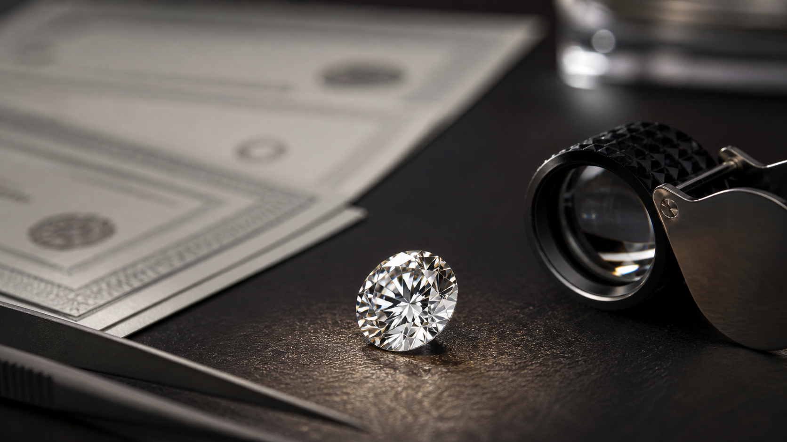

# PNJ Labs, Kim Cương Mẹ Bồng Con Và Niềm Tin Chứng Nhận

**Một viên kim cương không chỉ bán bằng độ trong, giác cắt hay carat. Nó bán bằng giấy kiểm định, nguồn gốc, mã số, thương hiệu và niềm tin rằng viên đá trước mặt đúng là viên đá được mô tả trên giấy. Vụ PNJ Labs làm lộ một tầng rất quan trọng của tài sản xa xỉ: khi lớp chứng nhận bị nghi ngờ, hard asset không còn chỉ là vật chất. Nó trở thành bài test về danh tính, oracle và lòng tin.**

*A diamond is not sold only through clarity, cut, or carat. It is sold through certificate, origin, serial number, brand, and the market's belief that the stone in front of you is the same stone described on paper. The PNJ Labs scandal exposes the soft trust layer inside a supposedly hard asset: when certification is questioned, the asset becomes a test of identity, oracle, and market confidence.*



Bài này không phải lời kết tội PNJ như một công ty. Vụ việc còn thuộc tầng điều tra, báo chí và cơ quan chức năng. Bài này đọc nó như một **case study về lớp chứng nhận**: khi giá trị của một tài sản phụ thuộc vào việc thị trường tin rằng giấy tờ, mã số và người kiểm định còn đáng tin.

Nói thẳng: nếu vàng là “hard asset” vì ai cũng có thể cân đo tương đối nhanh, thì kim cương là hard asset có một linh hồn mềm hơn nhiều. Linh hồn đó nằm trong certificate. Scandal thật sự không chỉ nằm ở vài viên đá. Nó nằm ở câu hỏi: **ai được quyền nói một vật là chính nó?**

---

## Cách Đọc Bài Này / Kỷ Luật Tuyên Bố

| Tầng đọc | Nội dung |
|---|---|
| **Sự kiện / kiểm chứng được** | Báo chí đưa tin cơ quan công an triệt phá đường dây buôn lậu hơn 28.000 viên kim cương; một cá nhân liên quan là Giám đốc PNJ Lab/P-Lab bị khởi tố/tạm giữ để điều tra; PNJ khẳng định vụ việc thuộc trách nhiệm cá nhân liên quan và hoạt động hệ thống/chính sách hiện hành vẫn được triển khai. |
| **Mẫu hình / đọc hệ thống** | Tài sản xa xỉ cần lớp chứng nhận. Khi lớp chứng nhận bị nghi ngờ, tài sản không mất vật chất nhưng mất một phần khả năng được tin, mua lại và định giá. |
| **Biểu tượng / myth** | “Mẹ bồng con” là hình ảnh của việc giấy này bồng viên kia: danh tính giấy tờ che chở cho một vật thể không còn đúng gốc. |
| **Tổng hợp suy đoán** | Vụ này không chỉ là scandal kim cương. Nó là bản nhỏ của một thế giới nơi tài sản ngày càng cần oracle, giấy chứng nhận, proof-of-reserve, mã số, danh tính và niềm tin vào người xác thực. |

Đây không phải lời khuyên đầu tư PNJ, vàng hay kim cương. Đây là bài về **niềm tin chứng nhận**.

---

## Từ Khóa Cần Hiểu

**Certificate / giấy kiểm định** là lớp định danh của viên đá: nó nói viên đá là loại gì, chất lượng ra sao, mã số nào, do ai xác thực. **Oracle** là người/hệ thống đưa dữ liệu ngoài đời vào thị trường: trong crypto là nguồn dữ liệu giá hoặc proof-of-reserve; trong kim cương là phòng lab, chuyên gia kiểm định, mã số và quy trình đối chiếu. **Wrapper** là lớp bọc làm tài sản gốc đi được trong thị trường: giấy, mã, hóa đơn, thương hiệu, chính sách thu đổi.

*Certificate is the identity layer of the stone. Oracle is the trust mechanism that tells the market what the asset is. Wrapper is the layer that lets the asset circulate: paper, serial number, invoice, brand, and buyback policy.*

---

## Fact Layer - Vụ PNJ Labs Đang Nói Gì?

Theo các bài tổng hợp từ CafeF/Vietnam.vn/Zing, cơ quan chức năng đã triệt phá một đường dây buôn lậu kim cương xuyên quốc gia với hơn **28.000 viên kim cương**. Báo chí nêu một cá nhân là Giám đốc Công ty TNHH MTV Giám định PNJ / P-Lab thuộc hệ sinh thái PNJ bị khởi tố/tạm giữ để điều tra liên quan vụ việc.

Các bài báo mô tả cáo buộc cốt lõi: kim cương nhập lậu hoặc sai thông số so với giấy kiểm định GIA bị mua với giá rẻ, sau đó mã GIA cũ trên viên đá bị mài/xóa, rồi được làm mới theo mã số PNJ Lab/P-Lab và cấp giấy kiểm định mới để bán ra.

PNJ/P-Lab, theo báo chí, phản hồi rằng vụ việc thuộc trách nhiệm pháp lý của cá nhân liên quan, công ty phối hợp với cơ quan chức năng, hệ thống vẫn hoạt động, và các chính sách bán hàng, bảo hành, thu đổi, hậu mãi vẫn được triển khai theo hiện hành. PNJ cũng nhấn mạnh kim cương công ty đang kinh doanh đến từ nhập khẩu chính ngạch hoặc mua lại theo chính sách của công ty.

Đặt đúng tầng: đây là **sự kiện đang trong điều tra**, không phải bản án cuối cùng cho toàn bộ hệ thống PNJ. Nhưng nó đủ để mở một câu hỏi rất lớn:

> Nếu giấy kiểm định là lớp định danh của viên kim cương, chuyện gì xảy ra khi lớp định danh đó bị nghi ngờ?

Điểm then chốt: thị trường không cần kết luận rằng “mọi thứ đều giả” mới bị chấn động. Chỉ cần một mắt xích xác thực bị nghi ngờ, người mua đã phải cộng thêm risk premium vào toàn bộ quá trình mua, giữ và bán lại.

---

## “Mẹ Bồng Con” - Khi Giấy Bồng Sai Viên Đá


Trong ngôn ngữ dân gian, “mẹ bồng con” gợi hình ảnh một thứ lớn/bên ngoài che chở, bồng bế, hợp thức hóa thứ nhỏ/bên trong. Đem vào vụ kim cương, có thể đọc nó như một mô hình:

```text
Giấy kiểm định / mã số / thương hiệu
└─ bồng một viên đá
   └─ thị trường tin: viên đá này đúng là thứ giấy mô tả
```

Khi giấy đúng với đá, lớp bồng đó là bảo chứng. Khi giấy không còn đúng với đá, lớp bồng đó thành mặt nạ.

Một viên kim cương không thể tự nói: “tôi là viên này, từ nguồn này, chất lượng này”. Nó cần:

- mã số;
- giấy kiểm định;
- tiêu chuẩn phân loại;
- người kiểm định;
- thương hiệu bán ra;
- cam kết thu đổi;
- niềm tin của người mua sau.

Vì vậy, “mẹ bồng con giả” không chỉ là gian lận giấy. Nó là gian lận **danh tính tài sản**.

Với tài sản tài chính, ta gọi đó là wrapper sai. Với kim cương, đó là certificate sai. Với đời sống, đó là hộ chiếu giả cho một vật thể. Và với thị trường, nó là một câu hỏi lạnh: nếu danh tính có thể được cấp lại, tẩy lại, đóng dấu lại, thì phần nào của giá trị là đá, phần nào là niềm tin vào người đóng dấu?

---

## Kim Cương Không Chỉ Là Carbon - Nó Là Carbon Có Danh Tính

Vàng có thể cân, thử tuổi, đo hàm lượng tương đối nhanh. Kim cương phức tạp hơn vì giá trị không chỉ nằm ở “có phải kim cương không”, mà nằm ở toàn bộ cấu hình:

- carat;
- màu;
- độ sạch;
- giác cắt;
- xử lý hay không;
- tự nhiên hay lab-grown;
- giấy GIA/PNJ Lab/P-Lab hoặc nguồn kiểm định khác;
- có khớp mã số và đặc điểm vật lý không.

Hai viên nhìn giống nhau với mắt thường có thể khác giá rất xa. Vì vậy người mua phổ thông không mua một viên đá trần. Họ mua **một viên đá kèm hệ thống xác thực**.

Đây là lý do scandal lớp giấy tờ nguy hiểm hơn một lỗi bán hàng bình thường. Nó chạm vào tầng nền: thị trường có còn tin rằng viên đá là chính nó không?

> Với kim cương, danh tính là một phần của tài sản.
> Nếu danh tính bị haircut, tài sản cũng bị haircut, kể cả khi vật chất chưa đổi.

---

## Chính Sách Thu Đổi Là Nơi Niềm Tin Gặp Tiền Mặt

Sau vụ việc, báo chí ghi nhận nhiều người quan tâm đến chính sách mua/đổi kim cương của PNJ. Chính sách được tổng hợp cho thấy tỷ lệ mua lại/thu đổi phụ thuộc loại sản phẩm, chất lượng, kích thước, hóa đơn, thời gian giữ và tình trạng viên đá.

Một số nhóm kim cương rời có tỷ lệ mua lại/thu đổi cao, có nhóm phụ thuộc thời gian sở hữu, có nhóm lớn không áp dụng mua lại, trang sức gắn kim cương thường có tỷ lệ thấp hơn, và một số dòng sản phẩm style/trang sức vàng gắn kim cương có tỷ lệ thu đổi thấp hơn nữa.

Điểm cần đọc không phải “tỷ lệ đó công bằng hay không”. Điểm cần đọc là:

> Khi lòng tin bị stress, chính sách thu đổi trở thành bảng giá của niềm tin.

Lúc mua, người ta nhìn vẻ đẹp, thương hiệu, lời tư vấn, cảm xúc, ý nghĩa quà tặng. Lúc bán lại, hệ thống nhìn giấy tờ, điều kiện, loại hàng, kích thước, chất lượng, hóa đơn, thời hạn và khả năng tái bán.

Cảm xúc mua vào là mềm. Bảng mua lại là cứng.

---

## PNJ Là Một Cỗ Máy Niềm Tin, Không Chỉ Là Nhà Bán Lẻ

Theo báo cáo thường niên 2024, PNJ ghi nhận doanh thu thuần **37.823 tỷ đồng**, lợi nhuận sau thuế **2.113 tỷ đồng**, vận hành **429 cửa hàng** tại **58/63 tỉnh thành**, có năng lực sản xuất trên **5 triệu sản phẩm/năm**.

Một hệ thống như vậy không chỉ bán vật chất. Nó vận hành một cỗ máy niềm tin:

- niềm tin vào nguồn gốc;
- niềm tin vào kiểm định;
- niềm tin vào hóa đơn;
- niềm tin vào hậu mãi;
- niềm tin vào khả năng thu đổi;
- niềm tin vào việc nếu có chuyện, hệ thống vẫn đứng đó.

Đây là tài sản vô hình rất lớn. Nó không nằm trong quầy kính, nhưng quyết định vì sao người mua bước vào cửa hàng thay vì mua qua một nguồn rẻ hơn.

Một thương hiệu trang sức lớn không chỉ có inventory vàng/đá. Nó có inventory niềm tin.

Và inventory niềm tin có một điểm rất khác inventory vật chất: nó không giảm đều. Nó có thể tụt theo sự kiện. Một scandal certificate không nhất thiết phá hủy toàn bộ hệ thống, nhưng nó buộc hệ thống phải chứng minh lại điều trước đây được mặc định: quy trình kiểm định, đối chiếu và chịu trách nhiệm có còn đủ mạnh để người mua tiếp tục không tự kiểm chứng từng viên đá hay không.

---

## Từ Kim Cương Sang Vàng - Vì Sao Hard Asset Vẫn Cần Trust Layer

Vụ PNJ Labs bắt đầu từ kim cương, nhưng bài học lan sang mọi tài sản cứng.

Kim cương cần giấy kiểm định. Vàng cần tuổi vàng, thương hiệu, hóa đơn, chênh lệch mua-bán và kênh thanh khoản. Nhà đất cần sổ, quy hoạch, pháp lý, người mua sau. Bitcoin cần private key, node, sàn/custody nếu người dùng không tự giữ. Ngay cả hard asset cũng thường đi kèm một lớp metadata mềm.

Điểm khác nhau là độ dày của lớp metadata:

| Tài sản | Vật chất cứng | Lớp niềm tin mềm |
|---|---|---|
| Vàng miếng/vàng nhẫn | Cao | tuổi vàng, thương hiệu, spread, thị trường mua lại |
| Kim cương | Cao nhưng khó tự định giá | giấy kiểm định, mã số, nguồn gốc, chất lượng, chính sách thu đổi |
| Nhà đất | Cao | sổ, quy hoạch, pháp lý, thanh khoản khu vực |
| Bitcoin tự custody | Phi vật chất nhưng khan hiếm kỹ thuật số | khóa riêng, node, hiểu biết custody, thị trường quy đổi |
| Sản phẩm tài chính bọc tài sản | Phụ thuộc tài sản gốc | báo cáo, audit, proof-of-reserve, bên phát hành, oracle |

Càng xa khả năng tự kiểm chứng của người mua, tài sản càng cần người gác cổng niềm tin.

Vụ kim cương vì vậy không chỉ nói về đá quý. Nó nói về **oracle của tài sản vật lý**.

---

## Nối Với Chainlink, Proof-of-Reserve Và Tài Chính Định Danh

Trong [[Chainlink - Mắt Xích Của Tokenized World]], oracle là lớp đưa dữ liệu ngoài đời vào hệ thống tài chính số. Trong [[BTC Wrapper Crash - Từ Niềm Tin Bitcoin Đến Tài Chính Định Danh]], lớp bọc quanh tài sản gốc có thể tạo khủng hoảng nếu thị trường tin nhầm vào wrapper.

Kim cương cũng có phiên bản analog của cùng vấn đề:

```text
Viên đá thật
→ giấy kiểm định
→ mã số
→ thương hiệu
→ chính sách thu đổi
→ người mua sau tin vào wrapper đó
```

Nếu wrapper đúng, thị trường chạy. Nếu wrapper sai, tài sản gốc vẫn còn đó nhưng giá trị xã hội của nó bị thương.

Đây là lý do thế giới tokenized/RWA luôn nói về proof-of-reserve, audit, oracle, certificate, custody. Nhưng vụ kim cương nhắc một điều lạnh hơn:

> Không có hệ xác thực nào miễn nhiễm với con người đứng trong nó.

Nếu crypto sợ oracle manipulation, kim cương sợ lab/certificate manipulation. Nếu DeFi sợ wrapper không được backing đủ, thị trường đá quý sợ viên đá không còn khớp với giấy. Hai thế giới khác chất liệu, cùng một bài test: **trust layer có bị capture không?**

Nếu người giữ cổng bị mua, sợ, tham, hoặc cấu kết, dữ liệu sạch trên giấy có thể chỉ là lớp son cho một nguồn gốc bẩn.

---

## Cashflow - Khi Lòng Tin Bị Stress, Người Giữ Tài Sản Cần Tiền Mặt

Góc cashflow vẫn quan trọng, nhưng nó không phải điểm bắt đầu. Nó là hậu quả.

Khi có scandal chứng nhận, người mua đặt câu hỏi: viên của tôi có thật đúng không? giấy của tôi có còn được tin không? nếu bán lại, bên mua có nhận không? tỷ lệ bao nhiêu? mất bao lâu? cần điều kiện gì?

Nếu người giữ có cashflow mạnh, họ có thể chờ điều tra, chờ chính sách, chờ thị trường bình tĩnh. Nếu người giữ đang cần tiền, họ phải bước vào cửa thanh khoản ngay lúc lòng tin yếu nhất.

Đó là nơi [[Giữ Tiền Quan Trọng Hơn Kiếm Tiền]] quay lại:

> Giữ tiền là giữ thời gian. Giữ thời gian là giữ quyền chọn. Giữ quyền chọn là giữ tự do.

Một viên kim cương có thể rất quý. Nhưng nếu người giữ cần tiền mặt ngay sau khi niềm tin chứng nhận bị xước, họ không còn bán vẻ đẹp. Họ bán sự cấp bách của mình.

---

## Vàng Cũng Không Thoát Khỏi Bài Test Này

[[Vàng, Golden Age Và Màn Che Của Mặt Trăng]] đọc vàng như vật chất ký ức và điểm neo ngoài fiat/CBDC. Nhưng vàng vẫn có spread, chu kỳ và thanh khoản thực tế.

Một số bài báo về thị trường vàng gần đây mô tả người mua ở vùng giá cao chịu lỗ khi giá đảo chiều, nhất là khi chênh lệch mua-bán rộng. VietnamNet nêu ví dụ nhà đầu tư mua/bán nhiều vòng và lỗ lũy kế khoảng **90,3 triệu đồng** do mua đuổi, bán cắt lỗ, rồi bắt đáy lại. CafeLand mô tả người mua đỉnh đối mặt khoản lỗ lớn khi giá vàng giảm mạnh.

Điểm chung với kim cương không phải chất liệu. Điểm chung là quyền chờ.

- Có cashflow: drawdown là biến động.
- Không có cashflow: drawdown thành thanh lý.
- Có niềm tin và giấy tờ sạch: tài sản dễ đi qua thị trường.
- Niềm tin bị xước: mọi cổng thanh khoản đều hỏi kỹ hơn.

Hard asset chỉ hard khi người giữ không bị ép mềm.

---

## Kết - Tài Sản Cứng, Danh Tính Mềm

Vụ PNJ Labs nhắc một điều khó chịu: tài sản càng đắt, người mua càng tưởng nó cứng; nhưng nhiều khi phần quyết định giá lại nằm ở một lớp rất mềm: giấy, mã, người kiểm định, thương hiệu, chính sách thu đổi và lòng tin.

Kim cương không chỉ là carbon. Vàng không chỉ là Au. Nhà không chỉ là bê tông. Bitcoin không chỉ là ticker. Mọi tài sản đều có một lớp danh tính xã hội giúp thị trường nhận ra nó, tin nó và trả giá cho nó.

Khi lớp danh tính đó bị nghi ngờ, vật chất còn nguyên nhưng niềm tin bị haircut.

> Hard asset không chỉ cần vật chất.  
> Nó cần danh tính đáng tin.  
> Nó cần người giữ có quyền chờ.  
> Và nó cần một thị trường còn tin rằng thứ đang được bán đúng là thứ nó nói nó là.
