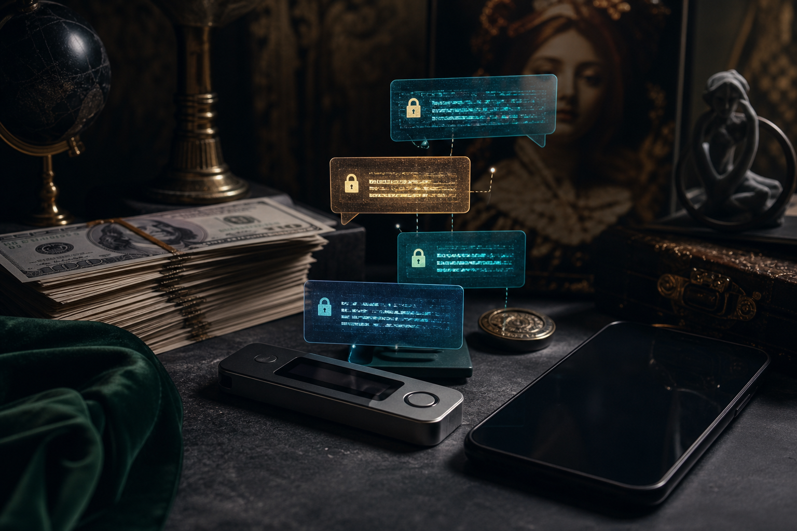

# Privacy (Quyền Riêng Tư)

**Privacy không phải quyền che giấu tội lỗi. Privacy là quyền có một căn phòng bên trong và bên ngoài nơi con người chưa bị đo, chấm điểm, dự đoán, bán lại hoặc trừng phạt. Không có privacy, tự do ngôn luận biến thành self-censorship, tự do tài chính biến thành permission money, và tự do tư tưởng biến thành hành vi được tối ưu bởi người đang quan sát bạn.**

*Privacy is not the right to hide crimes. Privacy is the right to have an inner and outer room where a human is not constantly measured, scored, predicted, sold, or punished. Without privacy, free speech becomes self-censorship, financial freedom becomes permission money, and thought becomes behavior optimized by whoever is watching.*

Câu “nếu không có gì để giấu thì không có gì để sợ” là một trong những câu propaganda nguy hiểm nhất thời đại số. Người nói câu đó thường vẫn khóa cửa nhà, kéo rèm phòng tắm, đặt mật khẩu điện thoại, nói chuyện riêng với người thân và không công khai toàn bộ tài khoản ngân hàng. Vì sâu bên trong, ai cũng biết privacy không phải luxury. Nó là điều kiện để làm người.

---

## Vault Position / Vị Trí Trong Map

Privacy là lớp nền của [[Bitcoin]], [[MOC - Financial Sovereignty|financial sovereignty]] và tự do nhận thức. Không có privacy, Bitcoin dễ thành ledger giám sát. Không có privacy, CBDC dễ thành ví điều kiện. Không có privacy, [[Kiểm Soát Tâm Trí]] không cần roi vọt vì con người tự kiểm duyệt trước khi nói.

Đọc bài này như bản đồ risk, không phải lời khuyên pháp lý hay hướng dẫn né trách nhiệm. Fact là công nghệ và mô hình dữ liệu có thể theo dõi hành vi. Pattern là incentive của nền kinh tế giám sát. Synthesis là privacy như tuyến phòng thủ chống [[Ma Trận]].

Privacy không chống accountability. Nó chống asymmetry: một phía biết tất cả về bạn, còn bạn không biết gì về cách họ dùng dữ liệu đó.

---

## Privacy Là Gì?

Privacy là quyền kiểm soát ngữ cảnh. Không phải mọi thông tin đều cần bí mật tuyệt đối, nhưng người sở hữu đời sống phải có quyền quyết định ai biết gì, trong hoàn cảnh nào, để làm gì và trong bao lâu.

Một câu nói với bạn thân không giống một bài đăng public. Một giao dịch mua thuốc không giống một tín hiệu marketing. Một search query lúc yếu lòng không nên biến thành hồ sơ tâm lý vĩnh viễn. Một ví tiền không nên trở thành camera hành vi. Một ý tưởng chưa hoàn chỉnh cần không gian thô trước khi bị xã hội xét xử.

Privacy là khoảng tối lành mạnh để con người trưởng thành.

Nếu mọi thứ đều bị ghi lại, con người không chỉ mất bí mật. Họ mất khả năng thử sai. Và không có thử sai thì không có tư duy độc lập.

---

## Surveillance Không Chỉ Là Theo Dõi, Nó Là Điều Khiển

Theo dõi là tầng đầu. Dự đoán là tầng hai. Điều khiển là tầng ba.

Nền kinh tế giám sát không chỉ muốn biết bạn đang làm gì. Nó muốn biết bạn sắp làm gì, yếu ở đâu, bị kích hoạt bởi gì, mua khi nào, sợ điều gì, muốn được nhìn nhận ra sao. Dữ liệu càng nhiều, mô hình hành vi càng chính xác. Mô hình càng chính xác, nudging càng hiệu quả.

Bạn chưa cần bị cấm. Chỉ cần bị steer. Feed cho bạn thấy thứ làm bạn giận đúng lúc. App gợi ý thứ làm bạn mua khi đang stress. Payment rails khiến một số hành vi frictionless, một số hành vi đầy ma sát. Search ranking làm một số câu hỏi biến mất khỏi tưởng tượng.

Surveillance là hạ tầng của control mềm.

[[Elite]] không cần kiểm soát từng cá nhân bằng tay nếu hệ thống có thể predict và nudge hành vi ở scale.

---

## Financial Privacy Là Điều Kiện Của Financial Sovereignty

Tiền là diary của đời sống. Bạn tiêu ở đâu, lúc nào, cho ai, bao nhiêu, tần suất ra sao, trong hoàn cảnh nào. Nếu ai đó thấy toàn bộ money trail, họ thấy sức khỏe, mối quan hệ, chính trị, tôn giáo, ham muốn, weakness, routines và network của bạn.

Đó là lý do financial privacy không phải chuyện phụ. Nó là sovereignty layer.

[[Bitcoin]] cho khả năng self-custody, nhưng public ledger khiến privacy không mặc định. [[Bitcoin Sẽ Chết Nếu Không Có Privacy]] nói rõ hơn điểm này: một asset chống kiểm duyệt nhưng bị deanonymize toàn diện sẽ bị kéo về logic giám sát. Người dùng có thể giữ key nhưng mất behavioral privacy.

[[Tiền Giấy - Tiền Mặt|Cash]] vì vậy vẫn quan trọng. Cash không sexy, không yield, không on-chain, nhưng nó có một phẩm chất chính trị: giao dịch nhỏ không cần tạo permanent data trail. Một xã hội không còn cash là xã hội nơi mọi hành vi kinh tế có thể được recorded, scored và permissioned.

---

## CBDC Và Digital ID: Khi Privacy Thành Lỗi Hệ Thống

[[Gen Z và CBDC - Programmable Money Psychology|CBDC]] kết hợp với [[Digital ID Normalization - From Instagram to Government ID|Digital ID]] tạo ra architecture rất khác tiền mặt. Tiền không chỉ chuyển từ A sang B. Tiền có thể mang điều kiện: ai được tiêu, tiêu ở đâu, hết hạn khi nào, category nào bị chặn, hành vi nào bị flagged, social score nào được ưu đãi.

Không cần dystopia ngay ngày đầu. Hệ thống thường đi bằng convenience. Faster payments. Fraud prevention. Financial inclusion. Tax efficiency. Safety. Climate goals. Child protection. Anti-money laundering. Mỗi lý do riêng lẻ có vẻ hợp lý. Nhưng khi ghép lại, chúng tạo một rail nơi privacy bị xem như bug.

Một khi privacy bị định nghĩa là “rủi ro cần loại bỏ”, tự do trở thành tính năng tùy chọn.

---

## Privacy Không Phải Paranoia

Privacy đúng bắt đầu từ threat model. Người bình thường không cần sống như điệp viên. Họ cần hiểu dữ liệu nào nguy hiểm, ai có incentive thu thập, hậu quả nếu bị leak/captured, và effort nào hợp lý.

Không phải ai cũng cần Tor cho mọi thứ. Nhưng ai cũng nên hiểu password manager, 2FA, encrypted messaging, device hygiene, cloud backup risk, KYC footprint, address reuse, public posting, data broker, metadata.

Privacy là hygiene. Giống đánh răng. Không cần biến nó thành religion, nhưng bỏ qua nó thì decay là chuyện thời gian.

Dùng Signal nhưng screenshot mọi thứ gửi lên cloud vẫn hở. Dùng Bitcoin nhưng reuse address và KYC mọi nơi vẫn hở. Dùng VPN nhưng đăng nhập cùng một account trên mọi device vẫn hở. Giữ cash nhưng tự nguyện post location, purchase, relationship và routine lên social vẫn hở.

Tool không thay thế mindset.

---

## Privacy Và Tự Do Tư Tưởng

Tầng sâu nhất của privacy không phải tiền. Là tư tưởng.

Con người cần không gian để nghĩ sai, nghĩ thô, nghĩ nguy hiểm, nghĩ chưa thành hình. Nếu mọi search, draft, message, voice note, location, biểu cảm và reaction đều có thể bị lưu, phân tích và dùng lại, mind bắt đầu tự kiểm duyệt trước khi hình thành câu hỏi.

Đó là loss rất lớn. Một xã hội nơi ai cũng sợ bị hiểu lầm sẽ trở thành xã hội chỉ còn câu an toàn. Mà câu an toàn hiếm khi tìm được truth.

[[Nghịch Lý Của Hiểu Biết]] cần một căn phòng riêng. [[Gnosis]] cần silence. [[Individuation]] cần shadow được nhìn trước khi bị social punishment. Privacy là womb của inner development.

Không có privacy, con người không chỉ mất quyền giấu. Họ mất quyền trở thành.

---

## Thực Hành Privacy

Privacy practice nên đi từ đơn giản tới nâng cao.

Ở tầng cơ bản: dùng password manager, bật 2FA, cập nhật device, tách email quan trọng khỏi email public, giảm app permissions, dùng encrypted messenger cho trao đổi riêng, hạn chế oversharing, tắt location khi không cần, không dùng một password cho mọi thứ.

Ở tầng tài chính: hiểu KYC footprint, không khoe balance, không reuse address bừa bãi, học self-custody, giữ một phần cash hợp lý, không gom mọi hoạt động vào một platform, hiểu rủi ro custodian.

Ở tầng identity: tách persona public và private, không để một account làm chìa khóa cả đời, không biến social media thành nhật ký hành vi toàn diện.

Ở tầng nervous system: đừng để privacy thành fear porn. Mục tiêu không phải sống co rúm. Mục tiêu là giữ đủ không gian để tự do vận hành.

---

## Kết

Privacy là hạ tầng của tự do. Không có nó, freedom chỉ còn là giao diện đẹp trên một hệ thống permissioned. Bạn có thể nói, nhưng tự kiểm duyệt. Bạn có thể tiêu, nhưng bị chấm điểm. Bạn có thể nghĩ, nhưng mọi câu hỏi đều để lại dấu vết. Bạn có thể sở hữu Bitcoin, nhưng wealth graph của bạn bị map.

Privacy không phải chống xã hội. Nó bảo vệ con người khỏi một xã hội nơi mọi thứ bị biến thành dữ liệu để điều khiển.

> Privacy là quyền được có một phần đời sống chưa bị Ma Trận đọc thành metadata.

---

## Publication Pack / Financial Sovereignty

Reading path:

1. [[Bitcoin]] — tiền như protocol và exit khỏi fiat dilution.
2. [[Bitcoin Sẽ Chết Nếu Không Có Privacy]] — sovereignty không có privacy là bẫy.
3. [[Privacy]] — quyền riêng tư như hạ tầng tự do.
4. [[Giữ Tiền Quan Trọng Hơn Kiếm Tiền]] — risk survival trước alpha.
5. [[Chainlink - Mắt Xích Của Tokenized World]] — bridge từ crypto sang tokenized real world.
