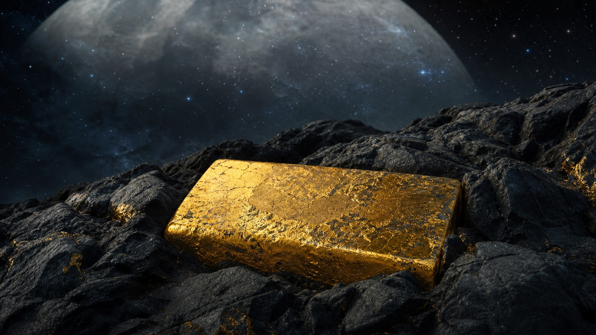
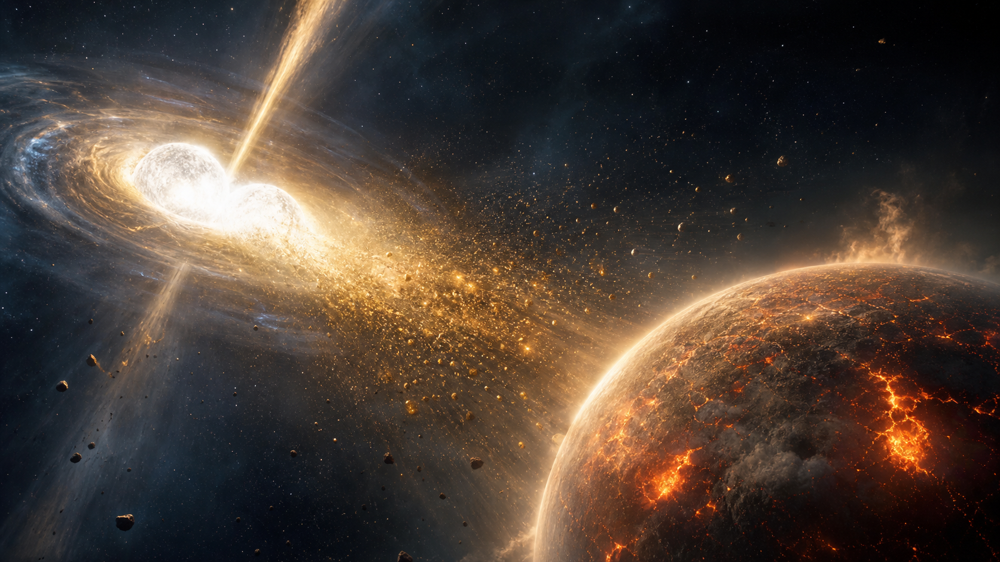
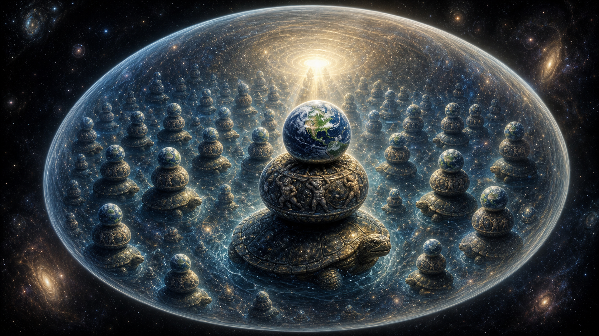
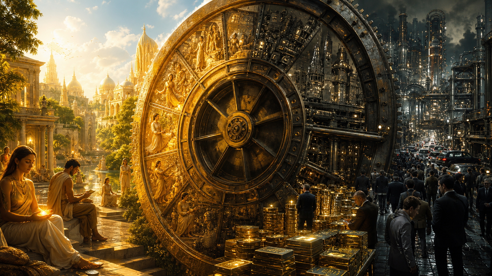
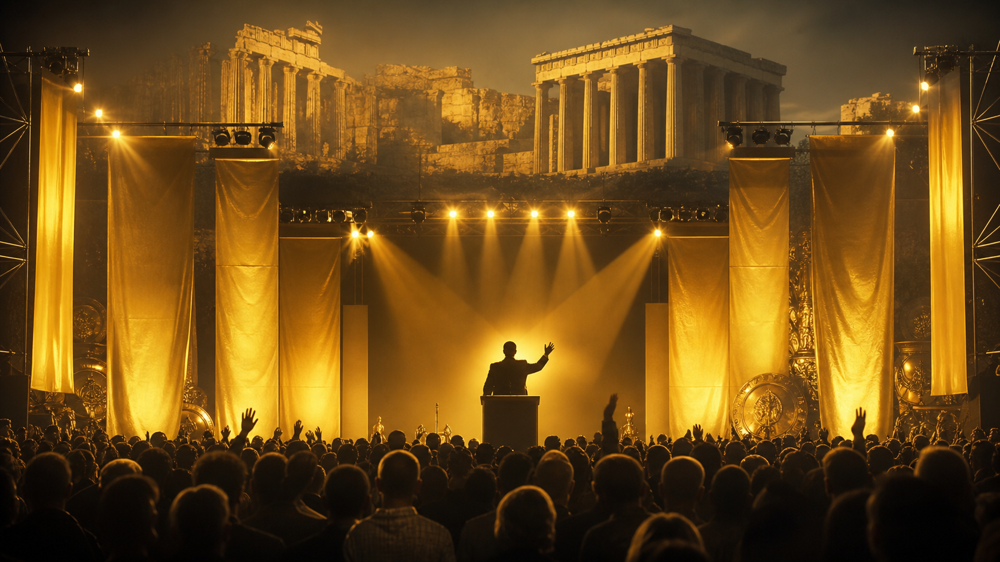

# Vàng, Golden Age Và Màn Che Của Mặt Trăng

**Vàng không chỉ là tài sản. Nó là vật chất của ký ức dài: vật chất vũ trụ nằm trong Trái Đất, biểu tượng của Thời Đại Vàng, và một điểm neo nằm ngoài các hệ tiền do bên phát hành lập trình. Nhưng vàng vẫn đi qua chu kỳ tăng và giảm. Muốn giữ một tài sản ngoài thời gian, đừng mua nó bằng áp lực của thời gian.**



Bài này không phải lời khuyên đầu tư. Nó là một bản đồ nhiều tầng: sự kiện, mô thức, biểu tượng và phần tổng hợp giả thuyết. Nếu trộn các tầng này lại, bài sẽ thành mê tín hoặc ghi chú giao dịch rẻ tiền. Nếu tách đúng, vàng hiện ra như một vật rất lạ: vừa là kim loại, vừa là ký ức, vừa là tiền, vừa là lời nhắc rằng mọi hệ thống phát hành đều muốn thay thế thứ mình không thể in thêm.

---

## 1. Vàng Không Sinh Ra Từ Trái Đất



Bắt đầu từ tầng sự kiện.

Vàng là nguyên tố hóa học **Au**, số nguyên tử 79. Nó nằm trong vỏ Trái Đất, được khai thác từ quặng, dùng trong trang sức, điện tử, dự trữ và các hệ thống tiền tệ cổ điển. Nhưng Trái Đất không "sản xuất" vàng theo nghĩa địa chất bình thường.

Trong khoa học hiện đại, vàng thuộc nhóm nguyên tố nặng được hình thành qua các sự kiện vũ trụ cực đoan: quá trình bắt neutron nhanh trong va chạm sao neutron, một số vụ nổ siêu tân tinh hoặc các sự kiện sụp đổ sao rất mạnh. Những sự kiện đó xảy ra trước khi hệ Mặt Trời hình thành. Vật chất chứa vàng trộn vào đám mây tiền Mặt Trời, rồi một phần được giữ lại trong Trái Đất.

Nói gọn:

> Vàng ở trong Trái Đất, nhưng không bắt đầu từ Trái Đất.

Đây là lý do vàng dễ trở thành biểu tượng. Nó không giống một vật liệu được sinh ra từ đời sống hằng ngày. Nó giống một mảnh ký ức cosmic bị chôn trong đá.

---

## 2. Trứng Vũ Trụ Và Snowman: Trái Đất Gần Lõi Hơn Ta Tưởng



Trong [[Bức Tường Băng]], toàn bộ tạo hóa nằm trong một **Trứng Vũ Trụ**. Nhưng Trứng Vũ Trụ không chỉ chứa một snowman duy nhất. Nó chứa **vô hạn cấu trúc snowman**. Mỗi snowman là một cụm thế giới nhiều tầng.

Trái Đất của chúng ta thuộc về **một** snowman structure cụ thể có ba tầng: **Earth** ở tầng trên cùng, dưới là **Atlas**, rồi **Akupara**. Nói cách khác: Earth không phải toàn bộ Trứng Vũ Trụ; Earth là tầng trên của một cấu trúc ba tầng nằm trong biển cấu trúc vô hạn bên trong Trứng Vũ Trụ.

Đây không phải tầng sự kiện. Đây là khung biểu tượng và giả thuyết.

Nếu đọc mô hình này như biểu tượng, hướng nhìn rất quan trọng: Trái Đất không phải tầng thấp nhất trong snowman của mình. Trái Đất là tầng gần lõi/nguồn hơn so với Atlas và Akupara. Càng gần lõi, vật chất càng có thể được đọc như đậm đặc hơn: không chỉ dày về khối lượng vật lý, mà dày về ký ức, thông tin và áp lực tạo hình.

Trong reading này, vàng không còn là "kim loại quý dưới đất" đơn giản. Nó có thể đọc như **core-proximity metal**: vật chất giữ dấu vết của tầng gần source hơn.

> Trong globe cosmology, vàng là kim loại quý dưới lòng đất. Trong snowman/cosmic egg cosmology, vàng có thể đọc như dấu vết vật chất của tầng gần lõi tạo hóa nhất: ánh sáng bị nén thành kim loại.

Không cần claim cứng model này là fact. Chỉ cần thấy tại sao archetype của vàng lại mạnh: nó là vật chất không mục, khó tạo, khó pha loãng, và luôn bị quyền lực chú ý.

---

## 3. Thời Đại Vàng: Khi Vàng Là Trạng Thái, Không Chỉ Là Hàng Hóa



Trong [[Chu Kỳ Vũ Trụ — Yugas & Kalpas]], Satya Yuga là mùa vàng: dharma vững, consciousness trong, con người gần thần tính hơn. Kali Yuga là mùa sắt: vật chất hóa, đảo ngược giá trị, money thay virtue, noise thay wisdom.

Đây là điểm then chốt:

> Ở Thời Đại Vàng, vàng là phẩm chất của ý thức. Ở Thời Đại Sắt, vàng thành hàng hóa.

Khi con người còn giữ ký ức dài, trật tự không cần quá nhiều luật bên ngoài. Khi ký ức ngắn lại, xã hội cần nhiều sắc lệnh hơn, nhiều chính sách hơn, nhiều bên phát hành hơn, nhiều hệ đo hơn. Cái từng là phẩm chất bên trong phải bị đẩy ra thành vật bên ngoài.

Vàng vì vậy không chỉ lưu value. Nó lưu một nỗi nhớ: ký ức về trạng thái mà con người chưa cần mọi thứ phải được đóng dấu, cấp phép và giám sát.

---

## 4. Màn Che Mặt Trăng: Ký Ức Ngắn Và Ánh Sáng Phản Chiếu


Tầng sự kiện: Mặt Trăng ảnh hưởng thủy triều, ánh sáng đêm, lịch nghi lễ, nhịp sinh học và nhiều tầng văn hóa biểu tượng. Nó là vật thể gần Trái Đất nhất có khả năng định nhịp đời sống tập thể.

Tầng biểu tượng và giả thuyết: nếu Trái Đất là tầng gần lõi/nguồn hơn, Mặt Trăng có thể được đọc như một **lớp phản chiếu, lớp màn che, lớp điều nhịp tần số**. Nó không cần che bằng tường. Nó che bằng nhịp, ánh sáng phản chiếu, chu kỳ, ham muốn, sợ hãi và ký ức ngắn.

Architecture này có thể viết như sau:

```text
Lõi Trứng Vũ Trụ / Nguồn
        ↓
Trái Đất = vật chất đậm đặc + ký ức + vàng + sự sống
        ↓
Màn che Mặt Trăng = nhịp, phản chiếu, phát sóng, lớp lọc gây quên
        ↓
Nhận thức con người = đời ngắn, nhớ ngắn, ý thức chạy theo chu kỳ tin tức
```

Đây là phần tổng hợp giả thuyết, không phải tuyên bố sự kiện. Nhưng nó giải thích vì sao con người có thể đứng trên một tầng đầy ký ức mà vẫn bị huấn luyện để chỉ nhìn 10 năm trước mặt.

Vàng đứng ngược lại với màn che Mặt Trăng theo nghĩa biểu tượng: Mặt Trăng làm mọi thứ chạy theo chu kỳ ngắn; vàng nhắc về thời lượng dài.

---

## 5. Golden Age Bị Chính Trị Hóa



Chính trị hiện đại rất thích bán lại Thời Đại Vàng.

[[MAGA Và Số 42|Make America Great Again]] hoạt động vì nó không định nghĩa chính xác "great" là gì. Nó gọi về một thời vàng son mơ hồ: công việc, biên giới, gia đình, trật tự, nam tính, công nghiệp, chống elite, chống globalism, chống suy đồi. Mỗi người tự lấp ký ức và mất mát của mình vào đó.

Trump dùng rất mạnh restoration myth: gold aesthetics, tower, branding, luxury, crown energy, fallen kingdom cần được phục hồi. Nhưng đây không phải bài pro-Trump hay anti-Trump. Trump chỉ là một case study hiện đại cho cách archetype cổ được chuyển thành campaign interface.

Câu cần giữ:

> Political golden age sells memory. Real gold preserves memory.

Thời Đại Vàng thật không phải một nhiệm kỳ, một thập kỷ GDP, hay một khẩu hiệu. Nó là ký ức về trạng thái ý thức trước khi xã hội cần quá nhiều luật, nợ, nhiễu truyền thông và quyền lực bên ngoài để giữ mình đứng yên.

---

## 6. Fiat, CBDC Và Tiền Không Còn Ký Ức


Trong [[Tiền Pháp Định]], fiat tồn tại nhờ sắc lệnh, nợ, luật công nhận tiền pháp định và hiệu ứng mạng lưới. Nó không cần độ khan hiếm vật lý như vàng. Nó cần bên phát hành, nhu cầu nộp thuế và hệ thống chấp nhận.

Sau 1971, gold window đóng lại. Từ đó money toàn cầu bước sâu hơn vào fiat thuần: flexible hơn, nhưng discipline vật lý yếu hơn. Khi money không còn neo vào scarcity khách quan, quyền phát hành trở thành quyền lực chính trị.

CBDC và tiền lập trình được là bước tiếp theo của cùng logic đó. Khi tiền thành phần mềm, câu hỏi không còn là "tiền có tiện không". Câu hỏi là:

- Ai issue?
- Ai freeze được?
- Ai thấy transaction?
- Ai viết rule?
- Ai cấp quyền giao dịch?
- Ai audit dòng chảy value?

Vàng không trả lời mọi câu hỏi. Nhưng nó đứng ngoài nhiều câu hỏi đó. Nó không có bên phát hành. Không có máy chủ. Không cần cập nhật ứng dụng. Không tự động hết hạn. Không cần tài khoản được cấp quyền để tồn tại.

Đó là lý do các hệ tiền mới có thể ghét vàng: vàng là vật thể ký ức trong một thế giới muốn biến tiền thành đối tượng lập trình được.

---

## 7. Vàng Vẫn Có Chu Kỳ: Accumulate Without Pressure


Đây là đoạn grounding bắt buộc.

Vàng có thể là ký ức vũ trụ, biểu tượng của Thời Đại Vàng và điểm neo ngoài lưới kiểm soát. Nhưng trên thị trường, vàng vẫn là tài sản có chu kỳ:

- có chu kỳ tăng
- có chu kỳ giảm
- có accumulation phase
- có euphoria
- có drawdown dài nhiều năm
- bị ảnh hưởng bởi real yields, dollar liquidity, central bank demand, fear cycle và geopolitics

Một thesis đúng vẫn có thể bị liquidate nếu dùng margin sai thời điểm.

> Tài sản thiêng không cứu được người bị ép bán.

Nguyên tắc đơn giản hơn mọi huyền học:

- no margin
- no forced timeline
- no all-in hero trade
- no money that must be rescued tomorrow
- accumulate wisely
- tôn trọng chu kỳ tăng/giảm

Nếu mua vàng bằng nợ, panic, FOMO hoặc áp lực chứng minh mình đúng, ta biến một tài sản của ký ức dài thành công cụ của anxiety ngắn hạn.

> Vàng thưởng cho sự kiên nhẫn, không thưởng cho áp lực.

---

## Chốt

Vàng là vật chất của ký ức dài, nhưng người cầm vàng vẫn phải sống qua chu kỳ ngắn của thị trường. Muốn giữ một tài sản ngoài thời gian, đừng mua nó bằng áp lực của thời gian.

Ở tầng sự kiện, vàng là nguyên tố có nguồn gốc vũ trụ nằm trong Trái Đất. Ở tầng biểu tượng, vàng là ánh sáng đông đặc, dấu vết của Thời Đại Vàng. Ở tầng quyền lực, vàng là thứ bên phát hành không thể in thêm. Ở tầng thị trường, vàng là tài sản cần kiên nhẫn, không đòn bẩy và không mốc thời gian ép buộc.

Cái mới thường chỉ là giao diện mới của một quyền lực cũ. Fiat, CBDC, tiền lập trình được và các khẩu hiệu phục hưng đều muốn con người sống bằng ký ức ngắn. Vàng không hứa cứu rỗi. Nó chỉ đứng đó như một vật không quên.

---

## Xem Tiếp

- [[Tiền Pháp Định]] — fiat, decree và quyền phát hành thời gian sống
- [[Tiền Giấy - Tiền Mặt]] — tiền mặt như lớp riêng tư vật lý trong kỷ nguyên CBDC
- [[Gen Z và CBDC - Programmable Money Psychology]] — thế hệ không tiền mặt và tiền lập trình được
- [[Bitcoin]] — hàng rào thoát số và tấm gương tối của CBDC
- [[Chu Kỳ Vũ Trụ — Yugas & Kalpas]] — Thời Đại Vàng, Thời Đại Sắt và chu kỳ ý thức
- [[Bức Tường Băng]] — cosmic egg, snowman layers và symbolic containment
- [[Annunaki]] — gold, sky rulers và mythic hypothesis về labor
- [[MAGA Và Số 42]] — huyền thoại phục hưng và Thời Đại Vàng chính trị
