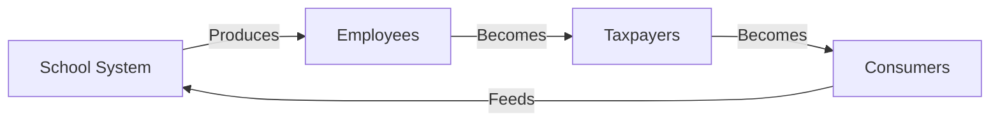
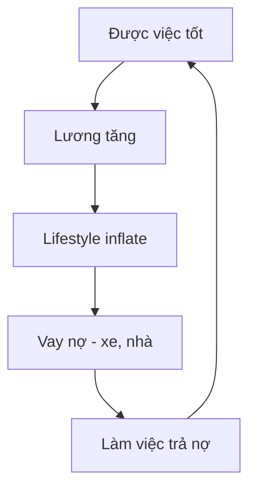
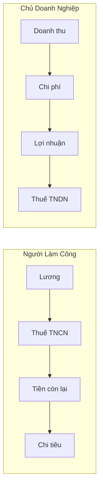
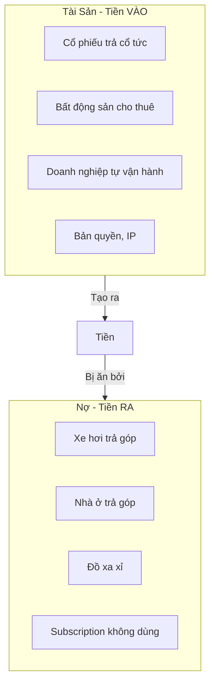
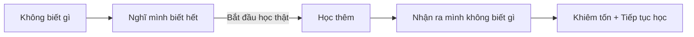

# Điều Mà Trường Học Không Dạy Về Tiền

Trong quá trình tìm hiểu sâu về tài chính, nhiều người mới nhận ra mình "nghèo mạt" — không phải vì thiếu tiền, mà vì **thiếu kiến thức về tiền**.

*While diving deep into finance, many people realize they're "financially illiterate" — not because they lack money, but because they lack knowledge about money.*

> Hệ thống trường học từ tiểu đến đại học **KHÔNG DẠY** gì về làm tiền cả. Dạy xài tiền và vay tiền thì căng.
>
> *The school system from elementary to university teaches NOTHING about making money. But spending and borrowing? They've got that covered.*

---

## Thiết Kế Có Chủ Đích / By Design

Hệ thống giáo dục được thiết kế để tạo ra **nhân viên**, không phải chủ doanh nghiệp.

*The education system is designed to produce **employees**, not business owners.*

| Trường học dạy | Trường học KHÔNG dạy |
|----------------|---------------------|
| Làm bài kiểm tra | Đọc báo cáo tài chính |
| Nghe lời thầy cô | Đàm phán lương |
| Xin việc làm | Tạo việc làm |
| Tiết kiệm tiền | Đầu tư tiền |
| Vay tiền mua nhà/xe | Cash flow vs Income |
| Đóng thuế đầy đủ | Tối ưu thuế hợp pháp |

---

## Vòng Lặp Của "Thành Công" Giả / The Fake Success Loop

Xã hội định nghĩa "thành công":
- Xe đẹp (vay ngân hàng)
- Nhà to (trả góp 20 năm)
- Con học trường xịn (học phí cao)
- Du lịch check-in (thẻ tín dụng)

*Society defines "success" as: nice car (on loan), big house (20-year mortgage), kids in fancy schools, vacation check-ins (on credit).*

**Nhưng tất cả đều là LIABILITIES — những thứ lấy tiền ra khỏi túi bạn.**

*But all of these are LIABILITIES — things that take money OUT of your pocket.*

> "Người giàu không làm việc vì tiền. Họ để tiền làm việc cho họ."
> — Robert Kiyosaki
>
> *"The rich don't work for money. They make money work for them."*

---

## Những Khái Niệm "Kỳ Dị" / "Exotic" Concepts

Những thứ người giàu biết từ nhỏ, nhưng bạn phải tự mò:

*Things the rich learn from childhood, but you have to figure out yourself:*

### 💼 Cấu Trúc Doanh Nghiệp / Business Structures

| Khái niệm | Ý nghĩa | Tại sao quan trọng |
|-----------|---------|-------------------|
| **LLC/Công ty TNHH** | Tách tài sản cá nhân khỏi kinh doanh | Bảo vệ tài sản |
| **Holding Company** | Công ty mẹ sở hữu các công ty con | Tối ưu thuế + bảo vệ |
| **Trust Fund** | Quỹ tín thác giữ tài sản | Chuyển giao thế hệ, tránh thuế thừa kế |
| **Family Office** | Văn phòng quản lý tài sản gia đình | Dành cho ultra-high net worth |
| **Private Equity** | Đầu tư vào công ty chưa niêm yết | Returns cao hơn thị trường |

### 📊 Thuế & Kế Toán / Tax & Accounting

| Khái niệm | Người làm công | Chủ doanh nghiệp |
|-----------|---------------|------------------|
| **Thu nhập** | Lương (đã trừ thuế) | Doanh thu |
| **Chi tiêu** | Tiền sau thuế | Chi phí (trước thuế) |
| **Thuế** | Thuế TNCN cao | Thuế TNDN + tối ưu |
| **Tài sản** | Mua bằng tiền sau thuế | Công ty mua = chi phí |

**Người làm công:** Kiếm → Đóng thuế → Chi tiêu
**Chủ doanh nghiệp:** Kiếm → Chi tiêu → Đóng thuế (trên phần còn lại)

*Employee: Earn → Pay tax → Spend*
*Business owner: Earn → Spend → Pay tax (on what's left)*

### 💰 Dòng Tiền vs Thu Nhập / Cash Flow vs Income

| | Thu nhập (Income) | Dòng tiền (Cash Flow) |
|-|-------------------|----------------------|
| **Định nghĩa** | Tiền bạn kiếm được | Tiền chảy vào/ra mỗi tháng |
| **Ví dụ** | Lương 30 triệu | +30 triệu lương, -15 triệu nợ = +15 triệu |
| **Tài sản** | Tiền một lần | Tạo dòng tiền liên tục |
| **Quan trọng** | Bề ngoài | Thực tế |

**Câu hỏi đúng không phải "Bạn kiếm bao nhiêu?" mà là "Bạn giữ được bao nhiêu?"**

*The right question isn't "How much do you earn?" but "How much do you keep?"*

---

## Tài Sản vs Nợ / Assets vs Liabilities

**Định nghĩa của Robert Kiyosaki:**
- **Tài sản:** Đưa tiền VÀO túi bạn
- **Nợ:** Lấy tiền RA khỏi túi bạn

*Kiyosaki's definitions:*
- *Asset: Puts money IN your pocket*
- *Liability: Takes money OUT of your pocket*

### Xe 300 Triệu — Tài Sản Hay Nợ?

| Chi phí | Số tiền/tháng |
|---------|---------------|
| Trả góp | 8-10 triệu |
| Bảo hiểm | 500K-1 triệu |
| Xăng | 2-3 triệu |
| Bảo dưỡng | 500K |
| Phí đỗ xe | 500K-2 triệu |
| **Tổng** | **12-17 triệu/tháng** |

Xe 300 triệu vay ngân hàng = **LIABILITY** ăn 12-17 triệu/tháng.

*A 300 million VND car on loan = LIABILITY eating 12-17 million/month.*

> Vay tiền làm con xe 300 củ che nắng che mưa đón con hay cho vợ đi chợ thành "sĩ với đời" — mindset này mà học tài chính thì chỉ để tỏ ra mình thượng đẳng thôi.
>
> *Borrowing for a 300M car to "show off" while picking up kids or going to the market — with this mindset, learning finance is just for flexing.*

---

## Tại Sao Không Được Dạy? / Why Isn't This Taught?

Đây không phải ngẫu nhiên. Đây là **thiết kế có chủ đích**.

*This isn't accidental. It's by design.*

### 1. Hệ thống cần nhân viên

Nếu ai cũng biết cách tạo tài sản, ai sẽ làm công?

*If everyone knew how to create assets, who would be employees?*

### 2. Hệ thống cần người tiêu dùng

Nền kinh tế tiêu dùng cần người mua → vay → trả nợ.

*A consumer economy needs people to buy → borrow → pay debt.*

### 3. Hệ thống cần thuế

Người làm công đóng thuế cao nhất, ít cách tối ưu nhất.

*Employees pay the highest taxes with the fewest optimization options.*

### 4. Ngân hàng cần người vay

Lãi suất từ người vay = lợi nhuận ngân hàng.

*Interest from borrowers = bank profits.*

> Xem thêm: [[Khế Ước Bí Mật Rockefeller]] — Blueprint kiểm soát giáo dục và y tế
>
> *See also: [[Khế Ước Bí Mật Rockefeller]] — Blueprint for controlling education and healthcare*

---

## Dunning-Kruger Ngược / Reverse Dunning-Kruger

**Người không biết:** Tự tin, phán xét người khác
**Người đang học:** Nhận ra mình biết ít, khiêm tốn

*The ignorant: Confident, judgmental*
*The learning: Realizes they know little, humble*

> "Hiểu biết của chúng ta cũng từ may mắn một phần mà có. Không chê bai, chỉ dạy được thì chỉ dạy, không thì tùy ý."
>
> *"Our knowledge comes partly from luck. Don't mock others — teach if you can, otherwise let it be."*

---

## Đi Sâu Hơn: Tiền Là Gì? / Going Deeper: What Is Money?

Những cuốn sách mainstream (Rich Dad Poor Dad, Think and Grow Rich...) dạy bạn **chơi game tốt hơn**. Nhưng chúng không hỏi: **Ai tạo ra game? Và game có công bằng không?**

*Mainstream books teach you to play the game better. But they don't ask: Who created the game? And is it fair?*

### Tiền Fiat — Công Cụ Kiểm Soát / Fiat Money as Control

[[Tiền Pháp Định]] (fiat) không được bảo chứng bởi gì cả — chỉ bởi "lòng tin" và súng của chính phủ.

*Fiat money isn't backed by anything — only "trust" and government guns.*

**"Tiết kiệm tiền" trong hệ thống fiat = MẤT TIỀN.**

*"Saving money" in the fiat system = LOSING MONEY.*

- Lạm phát thực tế: 7-15%/năm (không phải 2-3% chính phủ nói)
- Tiền bạn tiết kiệm hôm nay, mất 50% giá trị sau 5-7 năm
- Đây là **thuế ẩn** — đánh cắp mà không cần thông qua quốc hội

*Real inflation: 7-15%/year (not the 2-3% governments claim). Your savings lose 50% value in 5-7 years. This is a hidden tax — theft without congressional approval.*

> Xem: [[Tiền Giấy - Tiền Mặt]] — Lịch sử tiền và cách nó bị weaponize

### Tại Sao Elite Không Giữ Tiền Mặt? / Why Elites Don't Hold Cash

| Người thường | Elite |
|--------------|-------|
| Giữ tiền mặt tiết kiệm | Giữ **tài sản** (BĐS, cổ phần, vàng, BTC) |
| Mất giá trị do lạm phát | Tài sản **tăng giá** theo lạm phát |
| Đóng thuế thu nhập | **Vay** dựa trên tài sản (không đóng thuế) |
| Làm việc → Kiếm tiền | Sở hữu → Tiền tự sinh |

**Chiến thuật "Buy, Borrow, Die":**
1. **Buy:** Mua tài sản tăng giá
2. **Borrow:** Vay tiền dựa trên tài sản (không bán = không thuế)
3. **Die:** Chết → tài sản chuyển cho con với cost basis mới (tránh thuế)

*This is why billionaires pay less tax than their secretaries.*

### Bitcoin — Lối Thoát? / Bitcoin as Exit?

[[Bitcoin]] là tiền **không thể in thêm** — chỉ có 21 triệu BTC, mãi mãi.

*Bitcoin is money that **cannot be printed** — only 21 million BTC, forever.*

| Fiat | Bitcoin |
|------|---------|
| In vô hạn | Cố định 21M |
| Kiểm soát bởi ngân hàng TW | Không ai kiểm soát |
| Lạm phát | Giảm phát (deflationary) |
| Cần permission | Permissionless |
| Có thể bị tịch thu | Tự custody |

> "Fix the money, fix the world."

Xem: [[Bitcoin]] và [[Bitcoin Sẽ Chết Nếu Không Có Privacy]]

---

## Trust Fund, Family Office — Không Chỉ Là "Giàu"

Đây không chỉ là công cụ của người giàu. Đây là cách [[Elite]] **bảo vệ tài sản qua nhiều thế hệ** và tránh thuế hợp pháp.

*These aren't just "rich people tools." They're how the [[Elite]] protect wealth across generations and legally avoid taxes.*

### Tại Sao Gia Đình Thường Mất Tài Sản?

> "Đời 1 tạo ra, đời 2 giữ, đời 3 phá."

Không có cấu trúc → tài sản bị:
- Chia nhỏ qua thừa kế
- Đánh thuế thừa kế (có thể 40-50%)
- Con cháu không biết quản lý

### Cách Elite Giữ Tài Sản

- **Trust:** Tài sản thuộc về trust, không thuộc cá nhân → không bị kiện, không bị chia
- **Family Office:** Quản lý chuyên nghiệp, giáo dục con cháu
- **Holding Company:** Cấu trúc công ty để tối ưu thuế và bảo vệ

> [[Khế Ước Bí Mật Rockefeller]] — Gia tộc này đã giữ tài sản qua 7 đời bằng cách này

---

## Bước Ra Khỏi Ma Trận / Exiting The Matrix

### 💡 Red Pill Mindset

| Blue Pill (Mainstream) | Red Pill |
|------------------------|----------|
| "Tiết kiệm tiền" | "Tiết kiệm **tài sản**" |
| "Đầu tư an toàn" | "An toàn nhất là **hiểu rủi ro**" |
| "Tin vào hệ thống" | "Hệ thống được thiết kế để extract từ bạn" |
| "Làm việc chăm chỉ" | "Làm việc **thông minh** + sở hữu" |
| "Fiat là tiền thật" | "Fiat là nợ, BTC là tiền thật" |
| "Chính phủ bảo vệ bạn" | "Bạn phải tự bảo vệ mình" |

### 🎯 Bước Thực Tế

1. **Hiểu tiền là gì** — Đọc về lịch sử tiền tệ, fiat, gold standard
2. **Giảm phụ thuộc fiat** — Chuyển một phần sang BTC, vàng, tài sản thực
3. **Tự giáo dục** — Hệ thống không dạy, bạn phải tự học
4. **Xây dựng thu nhập không phụ thuộc** — Skill, doanh nghiệp, đầu tư
5. **Tối ưu cấu trúc** — Công ty, trust (khi đủ lớn)
6. **Network** — Học từ người đã làm được, không phải từ sách

### 📚 Đọc Gì?

**Nền tảng:**
- *The Bitcoin Standard* — Saifedean Ammous
- *The Creature from Jekyll Island* — G. Edward Griffin (về Fed)
- *When Money Dies* — Adam Fergusson (hyperinflation Weimar)

**Ma Trận:**
- [[Báo Cáo 2030]] — Agenda của Elite
- [[Khế Ước Bí Mật Rockefeller]] — Blueprint kiểm soát
- [[Elite]] — Ai đang điều hành?

**Chiến thuật:**
- *Tax-Free Wealth* — Tom Wheelwright
- *The Sovereign Individual* — Davidson & Rees-Mogg

---

## Kết Luận / Conclusion

Bạn không "nghèo" vì thiếu tiền. Bạn "nghèo" vì thiếu kiến thức mà hệ thống cố tình không dạy.

*You're not "poor" because you lack money. You're "poor" because you lack knowledge the system intentionally doesn't teach.*

**Tin tốt:** Kiến thức này có sẵn. Bạn chỉ cần tự học.

*Good news: This knowledge is available. You just have to teach yourself.*

**Tin xấu:** Phải tự học. Không ai dọn sẵn cho bạn.

*Bad news: You have to teach yourself. No one will hand it to you.*

> Bước đầu tiên của hiểu biết thật sự là nhận ra mình "không biết gì".
>
> *The first step to real knowledge is realizing you "know nothing."*

---

## Related

### Tài chính / Finance
- [[Bitcoin]] — Escape from fiat system
- [[Tiền Giấy - Tiền Mặt]] — History of money
- [[Tiền Pháp Định]] — Fiat currency

### Ma Trận / Matrix
- [[Ma Trận]] — The control system
- [[Khế Ước Bí Mật Rockefeller]] — Education & healthcare control
- [[Kiểm Soát Tâm Trí]] — Mind control
- [[Báo Cáo 2030]] — The agenda

### Mindset
- [[Tư Duy Lũy Thừa]] — Exponential thinking
- [[Giàu Không Nhờ May Mắn]] — Wealth is a skill
- [[Trí Tuệ]] — Wisdom vs Intelligence
