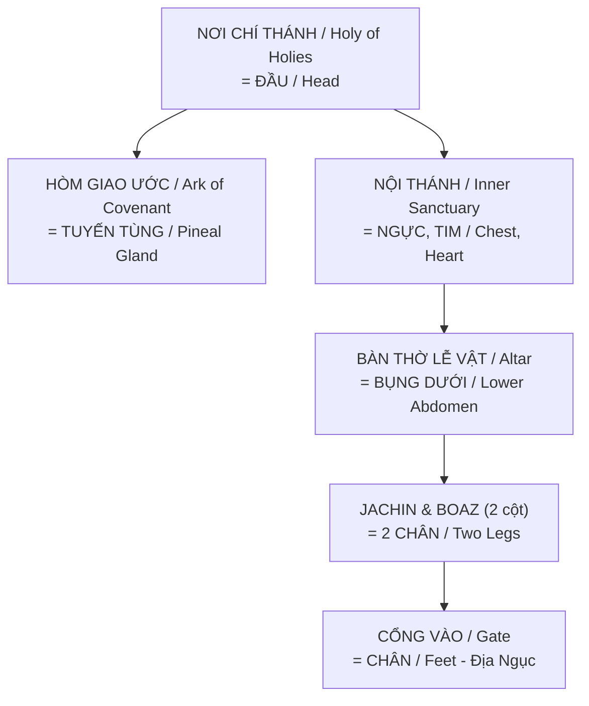

# 33 Tầng Bậc (33rd) - Khám Phá Ngôi Đền Linh Thiêng Trong Tâm Trí

*33 Degrees - Exploring the Sacred Temple Within the Mind*

Tác phẩm **"33rd"** của tác giả Luce Wayne là một cuộc hành trình vĩ đại kết hợp giữa tôn giáo cổ xưa, biểu tượng học, khoa học, và triết học để giải mã bí mật lớn nhất của vũ trụ: *Thượng đế đã giấu sự thật cốt lõi ngay bên trong tâm trí của con người.*

*The work "33rd" by author Luce Wayne is a grand journey combining ancient religion, symbolism, science, and philosophy to decode the greatest secret of the universe: God hid the core truth right within the human mind.*

---

## 1. Bí Mật Của Vũ Trụ: "Ngôi Đền Không Do Bàn Tay Con Người Tạo Ra"

*The Universe's Secret: "The Temple Not Made by Human Hands"*

Câu chuyện ngụ ngôn mở đầu sách kể rằng Thượng Đế không giấu bí mật ở Mặt Trăng hay dưới đáy biển sâu, mà Ngài giấu nó ở một nơi mà chỉ những người xứng đáng mới có thể tìm thấy: **Sâu trong tâm trí con người.**

*The opening parable tells that God didn't hide the secret on the Moon or at the bottom of the sea, but in a place only the worthy can find: **Deep within the human mind.***

- Cơ thể con người chính là cỗ máy sinh học hoàn hảo, là "Ngôi đền linh thiêng" duy nhất mà Thượng Đế ngự trị, chứ không phải các công trình kiến trúc đồ sộ bên ngoài.
  *The human body is the perfect biological machine, the only "sacred temple" where God resides — not in grand external architecture.*

- **Understanding (Hiểu biết):** Để thực sự thấu hiểu thế giới và bản thân, con người phải "đứng bên dưới" (Under-stand) cấu trúc của chính tâm trí mình.
  *To truly understand the world and oneself, one must "stand under" the structure of their own mind.*

---

## 2. Khám Phá Chấn Động Tại Nag Hammadi

*The Shocking Discovery at Nag Hammadi*

Vào tháng 12 năm 1945, một nông dân Ai Cập tên Mohammed Ali Samman vô tình đào được chiếc lọ gốm chứa 13 tập sách cổ đóng bìa da tại Nag Hammadi.

*In December 1945, an Egyptian farmer named Mohammed Ali Samman accidentally dug up a clay jar containing 13 leather-bound ancient codices at Nag Hammadi.*

- **Phúc Âm Ngộ Đạo (Gnostic Gospels):** Đây là những văn bản bằng tiếng Coptic có niên đại 100-200 năm SCN, chứa đựng những "lời bí mật mà Đức Giê-su hằng sống đã nói".
  *These are Coptic texts dated 100-200 CE, containing "the secret words that the living Jesus spoke."*

- Các văn bản này đã bị Giáo hội Công giáo La Mã loại bỏ và coi là "dị giáo" suốt 2000 năm.
  *These texts were rejected by the Roman Catholic Church and labeled "heresy" for 2000 years.*

- **Tin Mừng Thánh Thomas (Gospel of Thomas):** Trích dẫn nổi bật nhất cho thấy sức mạnh của Ngộ Đạo: *"Vương quốc của Chúa Cha ở trong chính các người và nó ở bên ngoài các người. Khi ngươi biết chính mình (Know yourself), thì ngươi sẽ được biết đến..."*
  *The most striking quote showing Gnosis's power: "The Kingdom of the Father is within you and outside of you. When you know yourself, then you will be known..."*

---

## 3. Kiến Thức "Gnosis" (Ngộ Đạo) Và Sự Thức Tỉnh

*Gnosis (Direct Knowledge) and Awakening*

Gnosis trong tiếng Hy Lạp không phải là kiến thức duy lý (như toán học, vật lý) mà là kiến thức tâm linh, kinh nghiệm thấu hiểu sâu sắc bản chất thần thánh của chính mình.

*Gnosis in Greek isn't rational knowledge (like math or physics), but spiritual knowledge — a profound experiential understanding of one's divine nature.*

- **Hành trình tìm kiếm:** Khi một người tìm kiếm sự thật, ban đầu họ sẽ gặp rắc rối và mâu thuẫn dữ dội với thế giới quan cũ (gia đình, xã hội, nền giáo dục nhồi sọ). Sau đó, họ sẽ kinh ngạc, choáng ngợp và cuối cùng là vươn lên trị vì vương quốc tâm trí của mình.
  *The seeker's journey: Initially facing trouble and fierce conflicts with old worldviews (family, society, indoctrinating education). Then amazement, overwhelm, and finally rising to rule the kingdom of their own mind.*

- **Ẩn dụ Vườn Địa Đàng (Garden of Eden):** Vườn Eden không phải một nơi chốn vật lý, mà là trạng thái thuần khiết ban đầu của tâm trí. Việc "ăn trái cấm từ cây kiến thức" khiến con người rời khỏi trạng thái bình an, nhưng cũng chính bằng kiến thức (Gnosis), con người mới tìm được đường quay trở lại.
  *The Garden of Eden metaphor: Not a physical place, but the original pure state of mind. "Eating from the tree of knowledge" caused humans to leave peace, yet through knowledge (Gnosis) alone can they find the way back.*

---

## 4. Giải Mã Biểu Tượng Cơ Thể Học (Anatomy & Occult)

*Decoding Body Symbolism (Anatomy & Occult)*

Xuyên suốt 33 tầng bậc, Luce Wayne phân tích sự liên kết giữa cơ thể con người với các hệ thống thần học cổ xưa:

*Throughout the 33 degrees, Luce Wayne analyzes connections between the human body and ancient theological systems:*

- **Con Mắt Thứ Ba (The Third Eye) & Tuyến Tùng (Pineal Gland):** Tuyến tùng nằm ở trung tâm não bộ, có hình dạng nón thông (Pine Cone) — biểu tượng được bắt gặp ở khắp nơi từ Vatican đến đền đài Ai Cập. Đây là cơ quan giải phóng Melatonin, chịu trách nhiệm kết nối tâm thức với thực tại cao hơn.
  *The pineal gland sits at the brain's center, shaped like a pine cone — a symbol found everywhere from the Vatican to Egyptian temples. This organ releases melatonin, responsible for connecting consciousness to higher reality.*

- **Luân Xa Cột Sống & Kundalini:** 33 đốt sống tương ứng với 33 bậc thang trong Hội Tam Điểm, 33 năm cuộc đời Chúa Giê-su. Cột sống là trục chính (Sushumna) với hai dòng năng lượng Ida và Pingala xoắn quanh, biểu tượng của con rắn quấn trượng y tế.
  *The 33 vertebrae correspond to 33 Masonic degrees, 33 years of Jesus's life. The spine is the main axis (Sushumna) with two energy channels Ida and Pingala spiraling around — the serpent symbol on the medical caduceus.*

- **Cây Sự Sống (Kabbalah):** Hệ thống bản đồ năng lượng của người Do Thái cổ cũng là bản đồ hướng dẫn khai mở phong ấn các luân xa dọc theo cơ thể để đánh thức sức mạnh tâm linh tiềm ẩn.
  *The Tree of Life (Kabbalah): Ancient Jewish energy map, also a guide for unsealing chakras along the body to awaken latent spiritual power.*

- **Đền Thờ Vua Solomon:** Những trụ cột và gian phòng trong Đền Solomon thực chất chính là sơ đồ giải phẫu học của bộ não và cơ thể người.
  *Solomon's Temple: Its pillars and chambers are actually anatomical diagrams of the brain and human body.*

### Đền Thờ Solomon = Cơ Thể Người (Chi Tiết)

*Solomon's Temple = Human Body (Detailed Mapping)*

| Đền Thờ / Temple | Cơ Thể / Body | Ý Nghĩa / Meaning |
|------------------|---------------|-------------------|
| **Nơi Chí Thánh** (Holy of Holies) | Đầu / Head | Nơi Thần Thánh ngự trị / Divine residence |
| **Hòm Giao Ước** (Ark of Covenant) | [[Tuyến Tùng]] / Pineal | "Ngai vàng của linh hồn" / Throne of the soul |
| **Nội Thánh** (Inner Sanctuary) | Tim, Ngực / Heart, Chest | Trung tâm cảm xúc / Emotional center |
| **Bàn Thờ Lễ Vật** (Altar) | Bụng dưới / Lower abdomen | Nơi "hy sinh" / Place of sacrifice |
| **Jachin & Boaz** (2 cột) | 2 chân / Two legs | Nền tảng, sự cân bằng / Foundation, balance |
| **Cổng Vào** (Gate) | Chân / Feet | Kết nối với Đất / Connection to Earth |

### SOL - O - MON: Mật Mã Trong Tên

*The Code Hidden in the Name*

| SOL | O | MON |
|-----|---|-----|
| ☀️ **Mặt Trời** / Sun | 🔵 Liên kết / Link | 🌙 **Mặt Trăng** / Moon |
| **Linh Hồn** / Soul | — | **Tâm Trí** / Mind |
| Masculine / Dương | — | Feminine / Âm |
| Pingala (phải) | — | Ida (trái) |

**Solomon = Sol + O + Mon = Sự hợp nhất của Mặt Trời và Mặt Trăng = Cân bằng Âm Dương trong cơ thể.**

*Solomon = Sol + O + Mon = Union of Sun and Moon = Yin-Yang balance within the body.*

---

## 6. Bạn Là Một Photon — Thực Thể Thần Thánh

*You Are a Photon — A Divine Entity*

> *"Bạn tồn tại như một photon lượng tử (giống như một ngôi sao) cư trú bên trong cơ thể vật chất."*
>
> *"You exist as a quantum photon (like a star) residing within a physical body."*

### Bản Chất Thật / True Nature

- **Bạn = Photon = Ngôi sao** — một thực thể ánh sáng với nhận thức toàn trí
- Được **kết nối trực tiếp với Nguồn** (Source/God/Consciousness)
- Bạn là **thần thánh đang trải nghiệm sự sáng tạo của chính mình**

*You = Photon = Star — a light entity with omniscient awareness, directly connected to Source, a divine being experiencing its own creation.*

### Vấn Đề: "Chương Trình" Chi Phối / The Problem: Programming

Trong quá trình **tái sinh** ở bình diện vật chất này:
- Chúng ta **tách biệt khỏi Nguồn** (amnesia)
- Thiếu nhận thức về bản chất thần thánh thực sự
- Bị chi phối bởi **"chương trình"** thông qua hệ thần kinh trung ương

*During rebirth on this physical plane: We separate from Source (amnesia), lack awareness of our true divine nature, controlled by "programming" through the central nervous system.*

→ Xem thêm: [[Ma Trận]], [[Loosh - Năng Lượng Thu Hoạch Từ Con Người]]

### Giải Pháp: Bảo Vệ Ngôi Đền / Solution: Protect Your Temple

Cơ thể là **phương tiện thiêng liêng** để ý thức trải nghiệm cuộc sống. Giống như đền thờ được xây để tôn vinh thần thánh:

| Hành động / Action | Mục đích / Purpose |
|--------------------|--------------------|
| **Ăn đúng** | Không đầu độc đền thờ / Don't poison the temple |
| **Ngủ đúng** | Phục hồi kết nối / Restore connection |
| **Sống tỉnh thức** | Thoát khỏi "chương trình" / Escape the program |
| **Thiền định** | Kích hoạt [[Tuyến Tùng]] / Activate pineal |
| **Nâng cao rung động** | Reconnect với Nguồn / Reconnect to Source |

> **"Hãy yêu quý và bảo vệ ngôi đền của mình. Sinh hoạt đúng, ăn ngủ đúng, sống tỉnh thức."**
>
> *"Love and protect your temple. Live right, eat and sleep right, live consciously."*

---

## 5. Kết Luận Dưới Góc Nhìn Khoa Học Tâm Linh

*Conclusion from a Spiritual Science Perspective*

"33rd" không chỉ là sách tôn giáo, mà là một cẩm nang của Khoa Học Tâm Linh kết hợp cùng Khoa Học Xét Lại. Thông qua việc bóc tách ảo ảnh thực tại (Ma Trận), con người được mời gọi đi sâu vào bên trong để sửa chữa "cỗ máy sinh học" của chính mình, đánh thức nguồn năng lượng Kundalini và giành lại quyền làm chủ định mệnh thay vì trao quyền đó cho các tổ chức tôn giáo hay chính trị bên ngoài. Cuộc cách mạng thực sự là cuộc cách mạng khai sáng từ bên trong!

*"33rd" isn't just a religious book, but a handbook of Spiritual Science combined with Revisionist Science. Through deconstructing the illusion of reality (the Matrix), humans are invited to go deep within to repair their own "biological machine," awaken Kundalini energy, and reclaim mastery over their destiny instead of handing that power to external religious or political institutions. The real revolution is the enlightenment revolution from within!*

---

## Related

- [[Ma Trận]] — "Chương trình" chi phối
- [[Tuyến Tùng]] — Hòm Giao Ước trong đền thờ cơ thể
- [[Chakra]] — 7 tầng năng lượng dọc cột sống
- [[Kundalini]] — Năng lượng rắn lửa
- [[Gnosis]] — Nhận thức trực tiếp bản chất thần thánh
- [[Loosh - Năng Lượng Thu Hoạch Từ Con Người]] — Năng lượng bị thu hoạch khi tách khỏi Nguồn
- [[Sacred Geometry]] — Tỷ lệ vàng trong kiến trúc đền thờ & cơ thể
