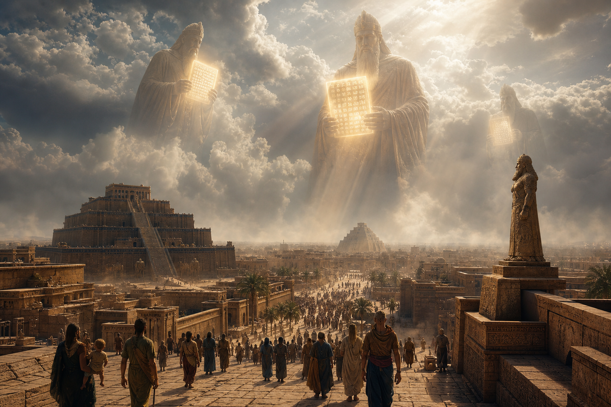
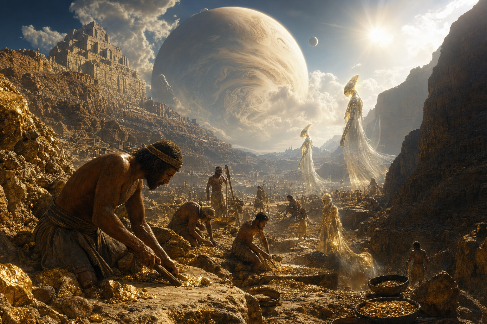
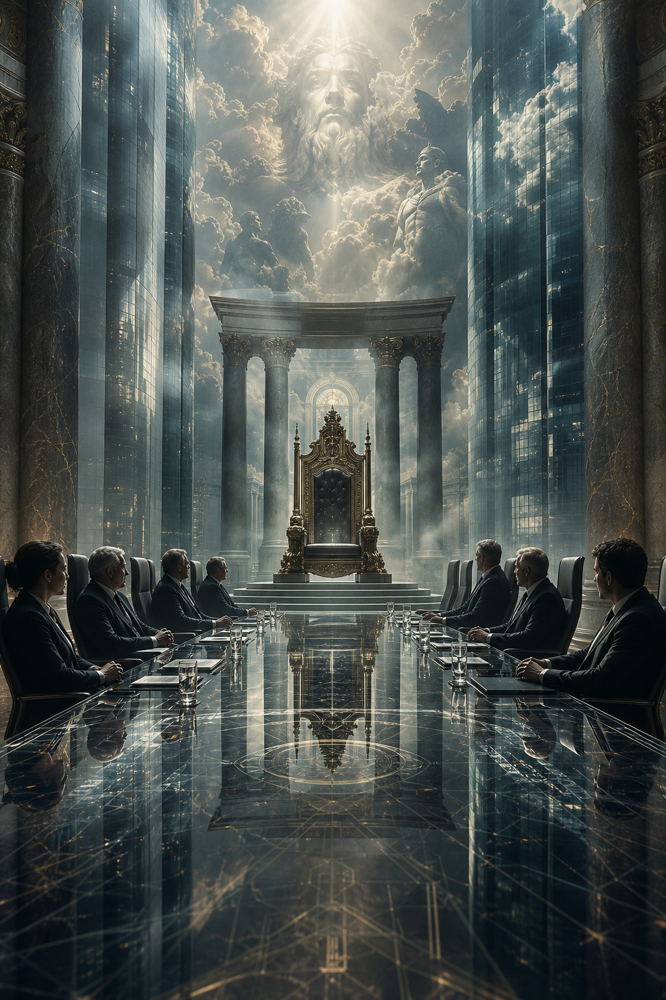

# Annunaki

**Annunaki là nơi thần thoại Lưỡng Hà, ancient astronaut theory và câu hỏi về nguồn gốc quyền lực nhân loại giao nhau. Ở tầng học thuật, Anunnaki là nhóm thần linh trong truyền thống Sumer-Akkad-Babylon. Ở tầng alternative history, họ trở thành biểu tượng của sky rulers: quyền lực từ trên xuống, tri thức bị giữ kín, huyết thống được thần thánh hóa, và ký ức về một can thiệp cổ xưa mà lịch sử chính thống không muốn mở.**

*The Annunaki sit where Mesopotamian myth, ancient astronaut theory, and the problem of human rulership intersect.*

Bài này không hỏi đơn giản “Annunaki có thật không?”. Câu hỏi sâu hơn là: vì sao rất nhiều nền văn hóa đặt quyền lực tối cao ở trên trời, rồi dùng motif đó để hợp pháp hóa vua chúa, priesthood, luật lệ và trật tự xã hội?

---

## Evidence Discipline / Cách Đọc

Ở tầng textual fact, Anunnaki xuất hiện trong văn bản Lưỡng Hà cổ như nhóm thần linh, hội đồng thần, lực lượng gắn với trật tự vũ trụ, địa phủ, phán xét. Ở tầng alternative history, Zecharia Sitchin phổ biến cách đọc Annunaki như beings từ [[Nibiru]], nhưng bản dịch và kết luận của ông bị tranh luận mạnh. Ở tầng pattern, nhiều nền văn hóa có motif sky gods, civilizing gods, flood, hybrid beings, divine kingship. Ở tầng symbol, Annunaki là archetype của quyền lực tự nhận nguồn gốc từ trời. Ở tầng speculative synthesis, bloodline, genetic intervention, harvest cycle, Nibiru return là giả thuyết vault, không phải fact nền.

Không đọc Sitchin như textbook. Cũng không vứt câu hỏi chỉ vì academy không thích ancient astronaut theory.

---

## Vault Position / Vị Trí Trong Vault

Node này nối [[Nibiru]], [[Nibiru và Nền Văn Minh Annunaki]], [[Atlantis]], [[Thuyết Tiến Hóa - Các Nền Văn Minh Bị Che Giấu]], [[Cabal]], [[Elite]] và [[UAP Disclosure - Controlled Revelation]].

Annunaki là mythic node của quyền lực. Nó giúp đọc các câu chuyện về thần, vua, máu, vàng, lũ lụt và reset văn minh như một cụm pattern. Nếu [[Elite]] là tầng quyền lực hiện đại thiết kế default options, Annunaki là archetype cổ của quyền lực tự nhận “từ trời xuống”.

---

## Anunnaki Trong Văn Bản Cổ

Trong tư liệu Mesopotamia, Anunnaki không xuất hiện như một race alien đơn giản. Họ là nhóm thần linh trong hệ thần thoại phức tạp: đôi khi gắn với trời, đất, địa phủ, phán xét, hoặc trật tự giữa các thần.

Các motif đáng chú ý: divine assembly, kingship from heaven, flood narratives, hybrid heroes, tablets/decrees, divine law. Điểm chung là quyền lực không tự trình bày như thỏa thuận giữa con người. Nó tự trình bày như trật tự từ tầng cao hơn.

Đó là mầm của toàn bộ vấn đề: khi authority nói “ta đến từ trời”, public được yêu cầu tin trước khi được phép kiểm chứng.

---

## Sitchin Layer: Nibiru, Gold Và Genetic Labor

Sitchin đọc Annunaki như beings từ [[Nibiru]] đến Trái Đất khai thác vàng và can thiệp gene để tạo Homo sapiens làm lao động. Đây là myth hiện đại cực mạnh vì nó nối nhiều ám ảnh của thời đại: missing link trong tiến hóa, quyền lực của vàng, nỗi sợ bị tạo ra như worker species, flood/reset memory, elite bloodline, suppressed archaeology, alien disclosure.

Nhưng kỷ luật phải rõ: tranh luận về bản dịch Sumerian của Sitchin không thể bị bỏ qua. Trong redpill.wiki, tầng Sitchin được giữ như mythic hypothesis và hệ biểu tượng mạnh, không phải nền fact bắt buộc.

Sức mạnh của nó không chỉ nằm ở chuyện “đúng hay sai”. Nó nằm ở câu hỏi mà nó ép ta nhìn: nếu loài người từng bị can thiệp, ai đang giữ hồ sơ thật về nguồn gốc chúng ta?

---

## Sky Gods Pattern

Annunaki đáng đọc vì họ không đứng một mình. Nhiều truyền thống có motif beings từ trời xuống, thầy dạy văn minh, người khổng lồ, bán thần, lũ lụt, vật phẩm tri thức, thành phố cổ bị chôn, chu kỳ trở lại.

Pattern này có thể là archetype tâm lý, ký ức thiên tai, political myth, hoặc dấu vết contact. Bài này không khóa sớm. Nó giữ bản đồ mở nhưng có nhãn từng tầng.

Một người đọc yếu sẽ chọn một câu trả lời quá nhanh: “chỉ là myth” hoặc “chắc chắn là alien”. Người đọc mạnh hơn giữ nhiều model cùng lúc cho đến khi evidence ép phải bỏ bớt.

---

## Annunaki Và Hệ Điều Hành Quyền Lực

Trong vault synthesis, Annunaki giúp đọc [[Cabal]] và [[Elite]] ở tầng mythic. Quyền lực hiện đại không cần tin thật vào Annunaki để sử dụng cùng cấu trúc đó. Nó chỉ cần lặp logic: một nhóm nhỏ tự xem mình là keeper of knowledge, còn đa số được quản trị như labor, consumer, voter, data point.

Divine kingship trở thành elite bloodline hoặc technocratic mandate. Gods need labor trở thành human resource economy. Gold obsession trở thành monetary control. Tablets/decrees trở thành law, contracts, code, protocol. Flood/reset trở thành crisis narrative và build-back-better cycle. Temple priesthood trở thành expert class và credential monopoly.

Đây là symbolic-political reading, không phải hồ sơ gene. Nhưng nếu một myth cổ giúp thấy architecture quyền lực hiện đại rõ hơn, nó đáng giữ.

---

## Annunaki, Atlantis Và Hidden History

[[Atlantis]] và Annunaki thường bị trộn thành một soup “lost civilization”. Cách đọc mature hơn: chúng là hai cửa vào cùng câu hỏi. Atlantis hỏi về văn minh bị rơi khỏi ký ức chính thống. Annunaki hỏi về nguồn gốc quyền lực và can thiệp. [[Thuyết Tiến Hóa - Các Nền Văn Minh Bị Che Giấu]] hỏi liệu lịch sử loài người có tuyến tính như sách giáo khoa kể hay không.

Ba node này không cần chứng minh lẫn nhau. Chúng tạo một tam giác điều tra: sky rulers/intervention, lost civilization/collapse, suppressed timeline.

Map phải mạnh hơn niềm tin.

---

## Kết

Annunaki quan trọng không chỉ vì câu hỏi “alien có thật không”, mà vì họ làm lộ một motif sâu hơn: quyền lực luôn muốn tự nhận nguồn gốc từ trời, còn con người bị huấn luyện để quỳ trước những origin story không thể kiểm chứng.

Nếu một hệ thống nói “luật của ta đến từ trên”, câu hỏi của vault là: trên là đâu, ai phiên dịch, ai được lợi, và tại sao ta không được tự kiểm chứng?

> Annunaki là tên cổ của một câu hỏi mới: ai đang viết nguồn gốc của nhân loại?

---

## Reading Path / Đọc Tiếp

- [[Nibiru và Nền Văn Minh Annunaki]] — mở rộng về Nibiru/Sitchin layer
- [[Atlantis]] — lost civilization và collapse memory
- [[Elite]] — echo hiện đại của sky-ruler logic
- [[UAP Disclosure - Controlled Revelation]] — disclosure và quyền diễn giải bầu trời
- [[Thuyết Tiến Hóa - Các Nền Văn Minh Bị Che Giấu]] — timeline bị rút gọn
