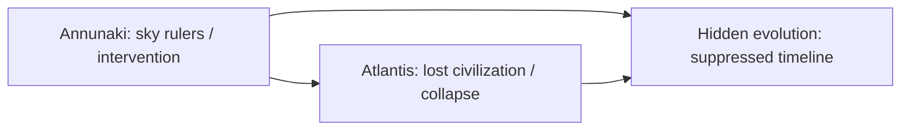

# Annunaki

**Annunaki là nơi thần thoại Lưỡng Hà, ancient astronaut theory và câu hỏi về nguồn gốc quyền lực nhân loại giao nhau.** Ở tầng học thuật, Anunnaki là nhóm thần linh trong truyền thống Sumer-Akkad-Babylon. Ở tầng alternative history, họ trở thành biểu tượng của "sky rulers": quyền lực từ trên xuống, tri thức bị giữ kín, huyết thống được thần thánh hóa, và ký ức về một can thiệp cổ xưa mà lịch sử chính thống không muốn mở.

*The Annunaki sit where Mesopotamian myth, ancient astronaut theory, and the problem of human rulership intersect.*

---

## Evidence Discipline / Cách Đọc

| Tầng | Cách đọc đúng |
|---|---|
| Textual fact | Anunnaki xuất hiện trong văn bản Lưỡng Hà cổ như thần linh, hội đồng thần, lực lượng gắn với trật tự vũ trụ và phán xét |
| Alternative history | Zecharia Sitchin phổ biến cách đọc Annunaki như thực thể từ [[Nibiru]]; bản dịch và kết luận của ông bị tranh luận mạnh |
| Pattern / systems | nhiều nền văn hóa có motif sky gods, civilizing gods, flood, hybrid beings, divine kingship |
| Symbol / myth | Annunaki là archetype của quyền lực tự nhận nguồn gốc "từ trời" |
| Speculative synthesis | bloodline, genetic intervention, harvest cycle, Nibiru return là giả thuyết vault, không phải fact nền |

Không đọc Sitchin như textbook. Cũng không vứt câu hỏi chỉ vì academy không thích ancient astronaut theory.

---

## Vault Position / Vị Trí Trong Vault

Node này nối [[Nibiru]], [[Nibiru và Nền Văn Minh Annunaki]], [[Atlantis]], [[Thuyết Tiến Hóa - Các Nền Văn Minh Bị Che Giấu]], [[Cabal]] và [[Elite]]. Nó không chỉ hỏi "Annunaki có thật không?" Câu hỏi chín hơn là: vì sao rất nhiều hệ văn hóa đặt quyền lực tối cao ở trên trời, rồi dùng motif đó để hợp pháp hóa vua chúa, priesthood, luật lệ và trật tự xã hội?

Vì vậy Annunaki là mythic node của quyền lực. Nó giúp đọc các câu chuyện về thần, vua, máu, vàng, lũ lụt, và reset văn minh như một cụm pattern.

---

## Anunnaki Trong Văn Bản Cổ

Trong tư liệu Mesopotamia, Anunnaki không xuất hiện như một "race alien" đơn giản. Họ là nhóm thần linh trong một hệ thần thoại phức tạp: đôi khi gắn với trời, đất, địa phủ, phán xét, hoặc trật tự giữa các thần.

| Motif cổ | Câu hỏi mở |
|---|---|
| Divine assembly | ai quyết định luật vũ trụ và luật xã hội? |
| Kingship from heaven | quyền lực chính trị được "thả xuống" từ đâu? |
| Flood narratives | ký ức thiên tai, reset, hay myth chính trị? |
| Hybrid heroes | vì sao vua/champion thường mang dòng máu bán thần? |
| Tablets/decrees | tri thức, chữ viết và luật lệ thuộc về ai? |

Điểm đáng chú ý: quyền lực cổ đại thường không tự trình bày là thỏa thuận giữa con người. Nó tự trình bày như trật tự từ tầng cao hơn. Đó là mầm của toàn bộ vấn đề.

---

## Sitchin Layer: Nibiru, Gold Và Genetic Labor

Sitchin đọc Annunaki như beings từ [[Nibiru]] đến Trái Đất khai thác vàng và can thiệp gene để tạo Homo sapiens làm lao động. Đây là một myth hiện đại cực mạnh vì nó nối nhiều ám ảnh của thời đại:

1. missing link trong tiến hóa;
2. quyền lực của vàng;
3. nỗi sợ bị tạo ra như worker species;
4. flood/reset memory;
5. elite bloodline;
6. suppressed archaeology;
7. alien disclosure.

Nhưng kỷ luật phải rõ: tranh luận về bản dịch Sumerian của Sitchin không thể bị bỏ qua. Trong redpill.wiki, tầng Sitchin được giữ như **mythic hypothesis** và hệ biểu tượng mạnh, không phải nền fact bắt buộc.

---

## Sky Gods Pattern / Motif Thần Từ Trời

Annunaki đáng đọc vì họ không đứng một mình. Các truyền thống khác nhau có những motif tương tự: beings từ trời xuống, thầy dạy văn minh, người khổng lồ, bán thần, lũ lụt, vật phẩm tri thức, thành phố cổ bị chôn, chu kỳ trở lại.

| Motif | Cách đọc |
|---|---|
| Gods descend | quyền lực được gắn với chiều dọc: trên cai dưới |
| Civilizing teachers | tri thức nông nghiệp, chữ viết, thiên văn, luật |
| Forbidden knowledge | ai giữ công nghệ và nghi lễ? |
| Hybrid bloodlines | huyết thống hóa quyền lực |
| Flood/reset | ký ức thảm họa hoặc công cụ kể lại lịch sử |
| Return cycle | expectation of judgment, harvest, disclosure |

Pattern này có thể là archetype tâm lý, ký ức thiên tai, political myth, hoặc dấu vết contact. Bài này không khóa sớm. Nó giữ bản đồ mở nhưng có nhãn từng tầng.

---

## Annunaki Và Hệ Điều Hành Quyền Lực

Trong vault synthesis, Annunaki giúp đọc [[Cabal]] và [[Elite]] ở tầng mythic. Quyền lực hiện đại không cần tin thật vào Annunaki để sử dụng cấu trúc đó. Nó chỉ cần lặp lại cùng logic: một nhóm nhỏ tự xem mình là keeper of knowledge, còn đa số được quản trị như labor, consumer, voter, data point.

| Mythic layer | Modern echo |
|---|---|
| divine kingship | elite bloodline, technocratic mandate |
| gods need labor | human resource economy |
| gold obsession | monetary control, extraction economy |
| tablets/decrees | law, contracts, code, protocol |
| flood/reset | crisis narratives, build-back-better cycle |
| temple priesthood | expert class, credential monopoly |

Đây là symbolic-political reading. Nó không phải hồ sơ gene. Nhưng nếu một myth cổ giúp thấy kiến trúc quyền lực hiện đại rõ hơn, nó đáng giữ trong bản đồ.

---

## Annunaki, Atlantis Và Hidden History

[[Atlantis]] và Annunaki thường bị trộn thành một soup "lost civilization". Cách đọc mature hơn: chúng là hai cửa vào cùng câu hỏi. Atlantis hỏi về văn minh bị rơi khỏi ký ức chính thống. Annunaki hỏi về nguồn gốc quyền lực và can thiệp. [[Thuyết Tiến Hóa - Các Nền Văn Minh Bị Che Giấu]] hỏi liệu lịch sử loài người có tuyến tính như sách giáo khoa kể hay không.

Ba node này không cần chứng minh lẫn nhau. Chúng tạo một tam giác điều tra:

Điều quan trọng là không biến mọi cổ vật thành bằng chứng cho cùng một thuyết. Map phải mạnh hơn niềm tin.

---

## Chốt Lại / Core Insight

**Annunaki quan trọng không chỉ vì câu hỏi "alien có thật không", mà vì họ làm lộ một motif sâu hơn: quyền lực luôn muốn tự nhận nguồn gốc từ trời, còn con người bị huấn luyện để quỳ trước những origin story không thể kiểm chứng.**

*The Annunaki matter because power loves to claim descent from the sky, while humans are trained to kneel before unverifiable origin stories.*
