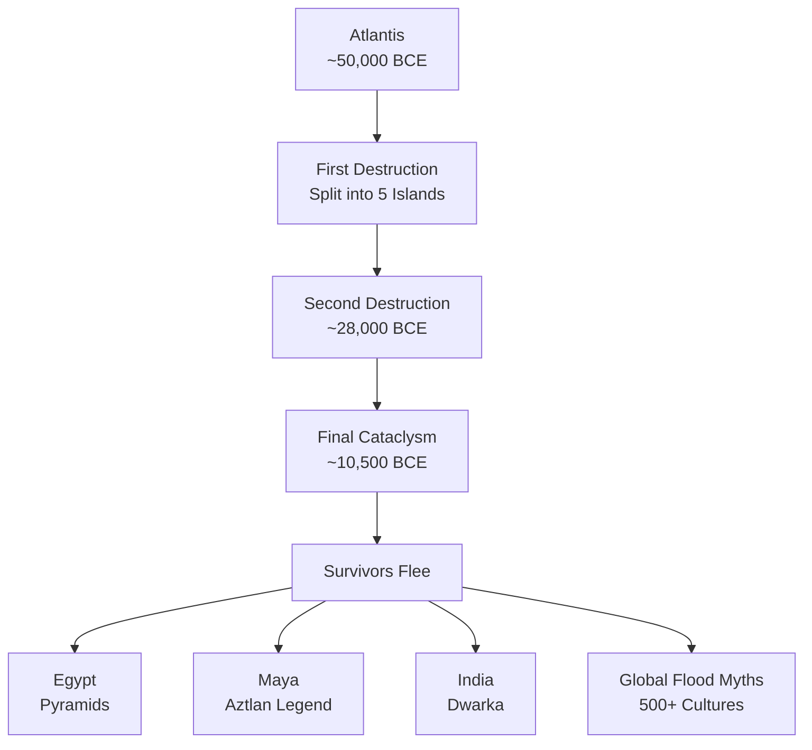
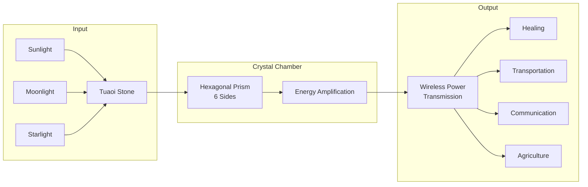
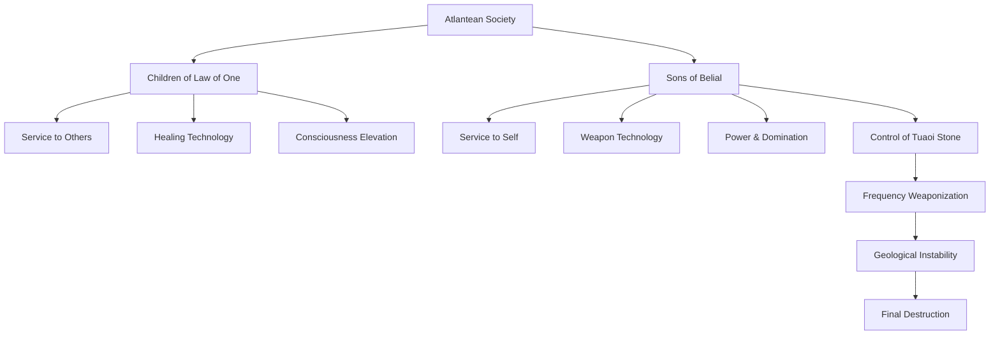
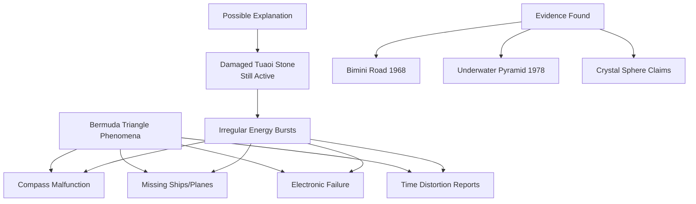
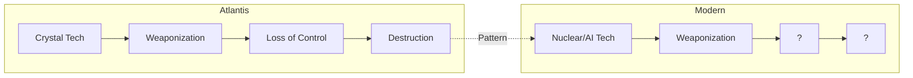

# Atlantis — Nền Văn Minh Bị Xóa Sổ

> "In a single day and night of misfortune... the island of Atlantis disappeared into the depths of the sea." — Plato, Timaeus

Atlantis không phải là truyền thuyết. Đó là lịch sử bị xóa.

*Atlantis is not legend. It is erased history.*

Khoảng 11,500 năm trước, một nền văn minh đã đạt đến đỉnh cao mà chúng ta chưa từng chạm tới — công nghệ năng lượng tự do, giao tiếp thần giao cách cảm, phương tiện bay không cần nhiên liệu. Và rồi, trong một ngày và một đêm, tất cả biến mất dưới đại dương. Câu hỏi không phải là *liệu* Atlantis có thật hay không. Câu hỏi là: *tại sao* chúng ta không được phép biết?

*Around 11,500 years ago, a civilization reached heights we haven't touched — free energy technology, telepathic communication, fuel-less flying vehicles. And then, in one day and one night, it all vanished beneath the ocean. The question isn't whether Atlantis was real. The question is: why aren't we allowed to know?*

---

## Nguồn Gốc — Ai Kể Câu Chuyện Này?

### Plato và Các Tư Tế Ai Cập

Plato — triết gia Hy Lạp sống vào thế kỷ thứ 4 trước Công nguyên — là nguồn văn bản cổ nhất còn tồn tại về Atlantis. Trong hai đối thoại *Timaeus* và *Critias*, ông kể lại câu chuyện mà Solon — nhà lập pháp vĩ đại của Athens — đã nghe từ các tư tế Ai Cập ở thành phố Sais.

*Plato — Greek philosopher of the 4th century BCE — is the oldest surviving written source on Atlantis. In his dialogues Timaeus and Critias, he recounts a story that Solon — Athens' great lawmaker — heard from Egyptian priests in the city of Sais.*

Điều đáng chú ý là các tư tế Ai Cập đã *mắng* Solon: "Các người Hy Lạp chỉ là trẻ con. Các người không có ký ức cổ xưa." Họ nói rằng Ai Cập giữ gìn những ghi chép về các nền văn minh đã đến rồi đi, trong khi Hy Lạp — vì thiên tai liên tục — đã mất hết ký ức về quá khứ của chính mình.

*Notably, the Egyptian priests scolded Solon: "You Greeks are but children. You have no ancient memories." They said Egypt preserved records of civilizations that came and went, while Greece — due to constant disasters — had lost all memory of its own past.*

Theo họ, Atlantis lớn hơn Libya và Tiểu Á cộng lại, nằm bên kia Cột Hercules (Gibraltar), và chìm xuống biển khoảng 9,600 năm trước thời Solon — tức khoảng 11,600 năm trước ngày nay. Con số này trùng khớp đáng kinh ngạc với sự kết thúc của Kỷ Băng hà và sự kiện Younger Dryas.

*According to them, Atlantis was larger than Libya and Asia Minor combined, located beyond the Pillars of Hercules (Gibraltar), and sank beneath the sea about 9,600 years before Solon's time — roughly 11,600 years ago today. This number coincides remarkably with the end of the Ice Age and the Younger Dryas event.*

### Edgar Cayce — Nhà Tiên Tri Ngủ

Edgar Cayce (1877-1945), được gọi là "Sleeping Prophet," đã đưa ra hơn 700 readings về Atlantis trong trạng thái xuất thần. Điều khiến Cayce đặc biệt là sự chi tiết không thể bỏ qua — ông mô tả công nghệ, xã hội, và sự sụp đổ của Atlantis với độ chính xác mà một người nông dân Kentucky thế kỷ 20 không có cách nào biết được.

*Edgar Cayce (1877-1945), called the "Sleeping Prophet," gave over 700 readings on Atlantis while in trance state. What makes Cayce remarkable is the undeniable detail — he described Atlantis's technology, society, and fall with precision that a 20th-century Kentucky farmer had no way of knowing.*

Cayce mô tả Atlantis trải qua ba giai đoạn hủy diệt: lần đầu khoảng 50,000 BCE khi lục địa chia thành năm đảo, lần hai khoảng 28,000 BCE khi thêm đất chìm xuống, và lần cuối cùng khoảng 10,500 BCE khi Poseidia — hòn đảo cuối cùng — biến mất hoàn toàn. Nguyên nhân? Sự lạm dụng công nghệ crystal.

*Cayce described Atlantis undergoing three destruction phases: first around 50,000 BCE when the continent split into five islands, second around 28,000 BCE when more land sank, and finally around 10,500 BCE when Poseidia — the last island — disappeared completely. The cause? Abuse of crystal technology.*

### Truyền Thống Bản Địa — 500 Nền Văn Hóa Không Thể Đều Nói Dối

Điều không thể giải thích bằng "coincidence" là hàng trăm nền văn hóa trên khắp thế giới — từ Maya đến Ai Cập, từ Ấn Độ đến Ireland — đều có truyền thuyết về một vùng đất tổ tiên bị chìm dưới biển.

*What cannot be explained by "coincidence" is that hundreds of cultures worldwide — from Maya to Egypt, from India to Ireland — all have legends of an ancestral homeland that sank beneath the sea.*

Maya và Aztec gọi quê hương tổ tiên của họ là *Aztlan* — vùng đất ở phía Đông mà họ đã rời đi. Ai Cập nói về *Zep Tepi* — "Thời Kỳ Đầu Tiên" khi các vị thần sống cùng con người. Ấn Độ có *Dwarka* — thành phố chìm của Krishna, đã được phát hiện dưới nước ngoài khơi Gujarat. Indonesia có *Sundaland* — lục địa chìm mà ngày nay là đáy biển Đông Nam Á.

*Maya and Aztec called their ancestral homeland Aztlan — a land in the East from which they departed. Egypt spoke of Zep Tepi — the "First Time" when gods lived among humans. India has Dwarka — Krishna's sunken city, discovered underwater off Gujarat. Indonesia has Sundaland — a submerged continent that is now the Southeast Asian seabed.*

Hơn 500 nền văn hóa có truyền thuyết về đại hồng thủy với chi tiết giống nhau đáng kinh ngạc: cảnh báo trước từ thần hoặc tiên tri, một người được chọn xây tàu, động vật được cứu, nước rút và đất mới xuất hiện. Thời gian? Khoảng 10,000-12,000 BCE.

*Over 500 cultures have flood legends with remarkably similar details: advance warning from gods or prophets, a chosen one building a vessel, animals saved, waters receding and new land appearing. Timing? Around 10,000-12,000 BCE.*

---

## Tuaoi Stone — Trái Tim Năng Lượng Của Atlantis

Đây là phần quan trọng nhất và ít được biết đến nhất về Atlantis.

*This is the most important and least known part about Atlantis.*

Edgar Cayce mô tả chi tiết về một tinh thể khổng lồ được gọi là **Tuaoi Stone** — hay **Fire Stone**, **Terrible Crystal** — nguồn năng lượng chính của nền văn minh Atlantis. Đây không phải viên đá trang trí. Đây là lò phản ứng năng lượng.

*Edgar Cayce described in detail a massive crystal called the Tuaoi Stone — or Fire Stone, Terrible Crystal — the main energy source of Atlantean civilization. This wasn't a decorative gem. This was an energy reactor.*

Theo readings của Cayce, Tuaoi Stone là một hình trụ khổng lồ, dài nhiều feet, có hình lăng trụ sáu mặt. Nó được đặt trong một tòa nhà hình oval với mái vòm có thể cuốn lại để tinh thể tiếp xúc với ánh sáng mặt trời, mặt trăng và các vì sao vào thời điểm thuận lợi nhất. Tường bên trong được lót bằng vật liệu không dẫn điện — giống amiăng hoặc bakelite.

*According to Cayce's readings, the Tuaoi Stone was a massive cylinder, many feet long, shaped as a hexagonal prism. It was housed in an oval building with a dome that could be rolled back so the crystal could receive light from sun, moon, and stars at the most favorable times. Interior walls were lined with non-conducting material — like asbestos or bakelite.*

> "The stone was housed in a special building oval in shape, with a dome that could be rolled back, exposing the Crystal to the light of the sun, moon and stars at the most favorable time." — Edgar Cayce Reading

Nguyên lý hoạt động của Tuaoi Stone giống hệt với những gì [[Nikola Tesla]] cố gắng tái tạo với Wardenclyffe Tower hai ngàn năm sau: thu năng lượng vũ trụ, cộng hưởng với [[Năng Lượng Aether|Aether]], và truyền năng lượng không dây đến bất cứ đâu cần thiết. Tesla tin rằng kim tự tháp Giza là máy khai thác năng lượng chứ không phải mộ — và có lẽ ông đúng.

*The Tuaoi Stone's operating principle was identical to what [[Nikola Tesla]] tried to recreate with Wardenclyffe Tower two thousand years later: collecting cosmic energy, resonating with [[Năng Lượng Aether|Aether]], and transmitting power wirelessly anywhere needed. Tesla believed the Giza pyramids were energy harvesting machines, not tombs — and perhaps he was right.*

Ban đầu, Tuaoi Stone được sử dụng cho healing, giao tiếp thần giao cách cảm, cung cấp năng lượng cho phương tiện bay, và kích thích cây trồng phát triển. Năng lượng tự do, vô tận, cho toàn bộ nền văn minh.

*Originally, the Tuaoi Stone was used for healing, telepathic communication, powering flying vehicles, and stimulating plant growth. Free, unlimited energy for the entire civilization.*

Và rồi mọi thứ đổ vỡ.

*And then it all fell apart.*

---

## Sự Sụp Đổ — Câu Chuyện Cũ Lặp Lại

### Hai Phe Đối Lập

Xã hội Atlantis chia thành hai phe với triết lý hoàn toàn trái ngược.

*Atlantean society split into two factions with completely opposing philosophies.*

**Children of the Law of One** — Con của Luật Một — là những người theo đuổi tâm linh, phục vụ cộng đồng, sử dụng công nghệ để chữa lành và nâng cao ý thức tập thể. Họ tôn trọng sự cân bằng với thiên nhiên và tin rằng tất cả đều là một.

***Children of the Law of One** were those who pursued spirituality, served community, used technology for healing and elevating collective consciousness. They respected balance with nature and believed all is one.*

**Sons of Belial** — Con của Belial — là những người theo đuổi vật chất, phục vụ bản thân, muốn dùng công nghệ để thống trị và chiến tranh. Họ coi người khác như công cụ, thực hành nô lệ, và tin rằng quyền lực thuộc về kẻ mạnh.

***Sons of Belial** were those who pursued materialism, served self, wanted technology for domination and war. They viewed others as tools, practiced slavery, and believed power belongs to the strong.*

Nghe quen không? Đây là pattern cơ bản của mọi nền văn minh: service-to-others vs service-to-self, tâm linh vs vật chất, cộng đồng vs cá nhân.

*Sound familiar? This is the basic pattern of every civilization: service-to-others vs service-to-self, spiritual vs material, community vs individual.*

### Weaponization — Khi Công Nghệ Bị Lạm Dụng

Bi kịch xảy ra khi Sons of Belial dần nắm quyền kiểm soát Tuaoi Stone. Thay vì dùng để healing, họ điều chỉnh tần số của crystal lên mức cao hơn và tàn phá hơn.

*Tragedy occurred when Sons of Belial gradually took control of the Tuaoi Stone. Instead of healing, they tuned the crystal's frequencies to higher and more destructive levels.*

Crystal bắt đầu được sử dụng cho vũ khí hủy diệt hàng loạt, kiểm soát tâm trí, và thao túng thời tiết cùng địa chất. Năng lượng vượt quá khả năng kiểm soát. Cayce mô tả rằng việc lạm dụng crystal đã gây ra sự bất ổn định địa chất, dẫn đến động đất và núi lửa phun trào khiến lục địa chìm xuống.

*Crystal began being used for mass destruction weapons, mind control, and weather and geological manipulation. Energy exceeded their control. Cayce described that crystal abuse caused geological instability, leading to earthquakes and volcanic eruptions that sank the continent.*

> "With the misuse of the crystal came the destruction." — Edgar Cayce

Lần đầu, khoảng 50,000 BCE, lục địa chia thành năm đảo — lần lạm dụng crystal đầu tiên. Lần hai, khoảng 28,000 BCE, thêm đất chìm xuống kèm theo những thí nghiệm di truyền sai lầm. Lần ba, khoảng 10,500 BCE, Poseidia — hòn đảo cuối cùng — chìm hoàn toàn trong một ngày và một đêm.

*First, around 50,000 BCE, the continent split into five islands — first crystal misuse. Second, around 28,000 BCE, more land sank along with genetic experiments gone wrong. Third, around 10,500 BCE, Poseidia — the last island — sank completely in one day and one night.*

Những người sống sót chạy đến Ai Cập, Maya, Ấn Độ, mang theo kiến thức về kim tự tháp, thiên văn học, và toán học. Đó là lý do tại sao các nền văn minh "xuất hiện đột ngột" với kiến thức tiên tiến mà không có giai đoạn phát triển rõ ràng.

*Survivors fled to Egypt, Maya, India, bringing knowledge of pyramids, astronomy, and mathematics. That's why civilizations "appeared suddenly" with advanced knowledge and no clear development period.*

---

## Tam Giác Bermuda — Di Tích Còn Sót Lại?

Một trong những theory gây tranh cãi nhất nhưng cũng thú vị nhất: Atlantis nằm ở khu vực ngày nay gọi là Tam giác Bermuda, và những hiện tượng bí ẩn ở đó có thể liên quan đến công nghệ crystal vẫn còn active dưới đáy đại dương.

*One of the most controversial but fascinating theories: Atlantis was located in what is now called the Bermuda Triangle, and mysterious phenomena there may be related to crystal technology still active on the ocean floor.*

### Lời Tiên Tri Của Cayce — Và Sự Ứng Nghiệm

Năm 1940, Edgar Cayce nói: "Poseidia sẽ là một trong những phần đầu tiên của Atlantis trỗi dậy trở lại. Hãy chờ đợi vào năm sáu tám và sáu chín."

*In 1940, Edgar Cayce said: "Poseidia will be among the first portions of Atlantis to rise again. Expect it in sixty-eight and sixty-nine."*

Và chính xác năm 1968, một cấu trúc đá kỳ lạ được phát hiện dưới nước gần đảo Bimini, Bahamas. Được gọi là **Bimini Road**, nó bao gồm những khối đá khổng lồ xếp theo đường thẳng, giống như con đường hoặc bức tường cổ đại, ở độ sâu chỉ 5-6 mét.

*And exactly in 1968, a strange stone structure was discovered underwater near Bimini island, Bahamas. Called the Bimini Road, it consists of massive stone blocks arranged in a line, resembling an ancient road or wall, at only 5-6 meters depth.*

Năm 1978, thuyền trưởng Don Henry sử dụng sonar quét bên phát hiện một "kim tự tháp khổng lồ chìm dưới nước" giữa Bimini và Cay Sal Bank, ở độ sâu khoảng 360 mét trên đáy biển phẳng. Vào những năm 1970, Dr. Ray Brown tuyên bố đã tìm thấy một kim tự tháp crystal khi lặn ở Bahamas, bên trong có một quả cầu crystal được giữ bởi hai bàn tay kim loại.

*In 1978, Captain Don Henry using side-scan sonar detected a "colossal submerged pyramid" between Bimini and Cay Sal Bank, at approximately 360 meters depth on a flat seabed. In the 1970s, Dr. Ray Brown claimed to have found a crystal pyramid while diving in the Bahamas, inside which was a crystal sphere held by two metallic hands.*

Nếu theory này đúng, crystal của Atlantis — dù đã bị hư hại — vẫn có thể đang phát ra những burst năng lượng không đều, gây ra compass malfunction từ electromagnetic interference, tàu thuyền và máy bay mất tích do energy vortex, electronic failure từ EMP-like bursts, và thậm chí time distortion từ warped space-time.

*If this theory is correct, Atlantis's crystal — though damaged — may still be emitting irregular energy bursts, causing compass malfunction from electromagnetic interference, missing ships and planes from energy vortex, electronic failure from EMP-like bursts, and even time distortion from warped space-time.*

---

## Bằng Chứng Khảo Cổ — Những Gì Không Thể Phủ Nhận

Không chỉ Bimini, nhiều cấu trúc dưới nước được phát hiện khắp thế giới không thể giải thích bằng timeline chính thống.

*Not just Bimini — many underwater structures discovered worldwide cannot be explained by mainstream timeline.*

**Yonaguni** ở Nhật Bản là một kim tự tháp bậc thang ở độ sâu 25 mét, có góc vuông và bậc thang đều đặn mà thiên nhiên không thể tạo ra. **Gulf of Cambay** ở Ấn Độ là một thành phố chìm ở độ sâu 40 mét, được xác định niên đại khoảng 9,500 năm. **Dwarka** — thành phố của Krishna trong thần thoại Hindu — đã được tìm thấy dưới nước ngoài khơi Gujarat. **Cuba** có những cấu trúc megalithic ở độ sâu 700 mét mà không ai giải thích được.

***Yonaguni** in Japan is a stepped pyramid at 25 meters depth, with right angles and regular steps that nature cannot create. **Gulf of Cambay** in India is a submerged city at 40 meters depth, dated to about 9,500 years. **Dwarka** — Krishna's city in Hindu mythology — has been found underwater off Gujarat. **Cuba** has megalithic structures at 700 meters depth that no one can explain.*

Ngoài cấu trúc dưới nước, còn có những kiến thức "không nên tồn tại." Bản đồ Piri Reis năm 1513 cho thấy bờ biển Nam Cực không có băng — nhưng Nam Cực bị băng phủ từ hàng triệu năm trước. Antikythera Mechanism là máy tính analog 2,000 năm tuổi với độ chính xác không thể tin được. Sắt được tìm thấy trong kim tự tháp trước "Thời đại Đồ Sắt." Các kim tự tháp trên toàn cầu nằm trên cùng vĩ độ với cùng công nghệ xây dựng.

*Beyond underwater structures, there is knowledge that "shouldn't exist." The Piri Reis Map of 1513 shows Antarctica's coastline without ice — but Antarctica has been ice-covered for millions of years. The Antikythera Mechanism is a 2,000-year-old analog computer with impossible precision. Iron found in pyramids before the "Iron Age." Pyramids globally lie on the same latitude with the same construction technology.*

---

## Tại Sao Bị Che Giấu — Và Loosh

Theo framework [[Elite]], che giấu Atlantis phục vụ nhiều mục đích: kiểm soát timeline để lịch sử chỉ bắt đầu từ 5,000 năm trước, che giấu tiềm năng thực sự của con người, duy trì câu chuyện "tiến hóa tuyến tính" từ hang động đến smartphone, và monopolize công nghệ năng lượng tự do.

*According to the [[Elite]] framework, hiding Atlantis serves multiple purposes: controlling timeline so history starts only 5,000 years ago, hiding humanity's true potential, maintaining the "linear evolution" story from caves to smartphones, and monopolizing free energy technology.*

Nhưng có một góc nhìn sâu hơn từ framework [[Loosh - Năng Lượng Thu Hoạch Từ Con Người|Loosh]]. Nếu Atlantis đã đạt đến trạng thái ý thức cao — nơi con người không còn sản xuất nhiều "loosh" (năng lượng cảm xúc tiêu cực) — thì điều này giải thích tại sao sự sụp đổ có thể đã được *cho phép* hoặc thậm chí *gây ra*.

*But there's a deeper perspective from the [[Loosh - Năng Lượng Thu Hoạch Từ Con Người|Loosh]] framework. If Atlantis reached a high consciousness state — where humans no longer produced much "loosh" (negative emotional energy) — this explains why the fall may have been allowed or even caused.*

Reset văn minh về trạng thái sản xuất loosh cao hơn. Đó có thể là lý do thực sự.

*Reset civilization to a higher loosh-producing state. That may be the real reason.*

---

## Bài Học — Pattern Đang Lặp Lại

Câu chuyện Atlantis là cảnh báo về một pattern có thể đang lặp lại ngay bây giờ.

*The Atlantis story is a warning about a pattern that may be repeating right now.*

Atlantis có crystal technology — chúng ta có nuclear và AI. Atlantis chia thành phe tâm linh vs vật chất — chúng ta chia thành consciousness vs materialism. Atlantis weaponize công nghệ — chúng ta weaponize mọi thứ. Atlantis nghĩ họ có thể kiểm soát tất cả — chúng ta nghĩ chúng ta có thể kiểm soát thiên nhiên và AI.

*Atlantis had crystal technology — we have nuclear and AI. Atlantis split into spiritual vs material factions — we split into consciousness vs materialism. Atlantis weaponized technology — we weaponize everything. Atlantis thought they could control everything — we think we can control nature and AI.*

Năng lượng tự do bị đàn áp sau sự sụp đổ của Atlantis. Năng lượng tự do vẫn đang bị đàn áp bây giờ. [[Nikola Tesla]] cố gắng tái tạo nó và bị J.P. Morgan cắt tài trợ vì "không thể đặt đồng hồ đo."

*Free energy was suppressed after Atlantis's fall. Free energy is still suppressed now. [[Nikola Tesla]] tried to recreate it and was cut off by J.P. Morgan because "you can't put a meter on it."*

*"Those who cannot remember the past are condemned to repeat it." — George Santayana*

Và có lẽ đó chính xác là lý do tại sao quá khứ thực sự bị xóa — để chúng ta lặp lại.

*And perhaps that's exactly why the real past is erased — so we repeat it.*

---

## Related

- [[Lemuria]] — Nền văn minh chị em ở Thái Bình Dương
- [[Năng Lượng Aether]] — Năng lượng tự do Atlantis sử dụng
- [[Nikola Tesla]] — Người cố gắng tái tạo công nghệ cổ đại
- [[Sacred Geometry]] — Nguyên lý cấu trúc crystal
- [[Dịch Chuyển Cực]] — Sự kiện có thể đã phá hủy Atlantis
- [[Loosh - Năng Lượng Thu Hoạch Từ Con Người]] — Tại sao reset văn minh?
- [[Elite]] — Ai giữ bí mật?
- [[Khoa Học Xét Lại]] — Lịch sử thực sự
