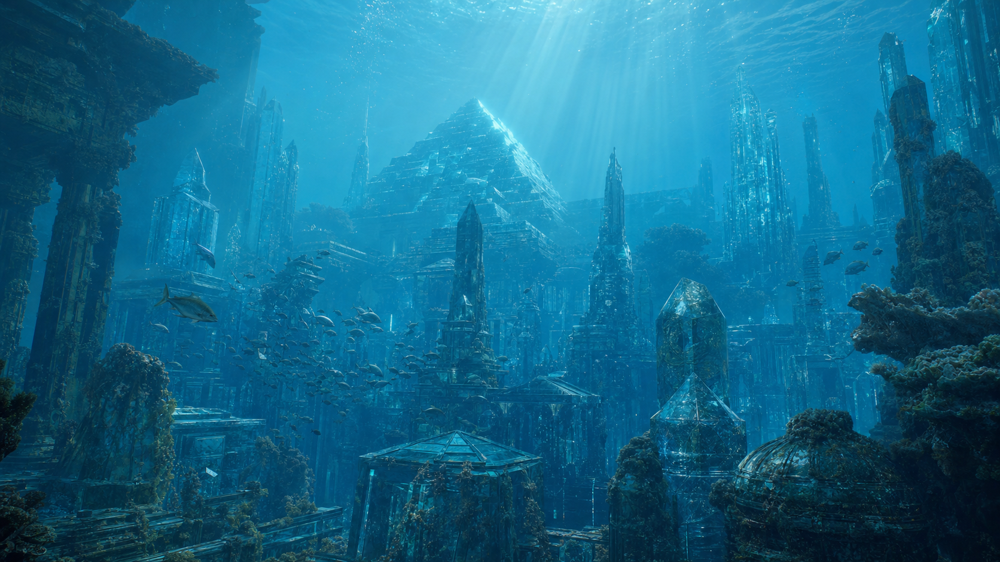
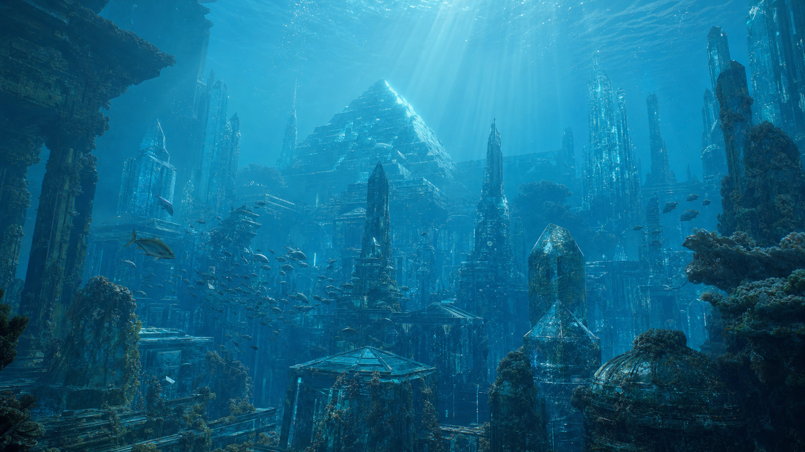
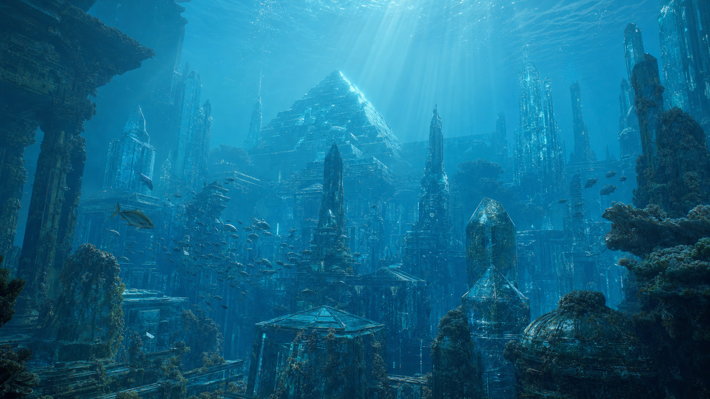

# Atlantis — Nền Văn Minh Bị Xóa Sổ

**Atlantis là ký ức cảnh báo: một nền văn minh có thể đạt technology cao hơn hiện đại nhưng vẫn sụp đổ nếu consciousness không đủ lớn để cầm năng lượng đó.**

*Atlantis is a warning-memory: a civilization can reach higher technology than modernity and still collapse if consciousness is not large enough to hold that power.*

---

## Evidence Discipline / Cách Đọc Atlantis

| Tầng | Cách đọc |
|---|---|
| **Fact / documentable** | Plato trong *Timaeus* và *Critias*, flood myths, submerged sites, Younger Dryas research |
| **Pattern / hidden history** | sudden civilization transfer, flood/reset memory, erased chronology |
| **Symbol / myth** | fallen golden city, crystal hubris, flood as purification |
| **Speculative synthesis** | Cayce readings, Tuaoi Stone, Bermuda remnants, Law of One factions |

Atlantis không nên được viết như khảo cổ đã đóng án. Nhưng gọi nó “chỉ là truyện” cũng quá nghèo. Nó là một node myth-history lớn trong [[MOC - Ancient Civilizations & Hidden History]].

---

## Plato Và Ký Ức Ai Cập

Plato kể rằng Solon nghe câu chuyện Atlantis từ các tư tế Ai Cập ở Sais. Họ mắng người Hy Lạp như “trẻ con” vì không còn ký ức cổ xưa. Atlantis, theo họ, nằm bên kia Cột Hercules, hùng mạnh, rồi chìm trong một ngày và một đêm khoảng 9.600 năm trước thời Solon.

Điểm đáng chú ý không phải Plato “prove” Atlantis. Điểm đáng chú ý là motif: Ai Cập như archive của reset, Hy Lạp như civilization mất memory, và đại hồng thủy như cơ chế xóa lịch sử.

---

## Tuaoi Stone: Trái Tim Năng Lượng

Trong readings của Edgar Cayce, Atlantis dùng **Tuaoi Stone**, Fire Stone, một crystal reactor thu ánh sáng mặt trời, mặt trăng, vì sao, khuếch đại và truyền năng lượng không dây. Đây là tầng speculative, nhưng nó nối rất mạnh với [[Năng Lượng Aether]] và [[Nikola Tesla]].

Nếu đọc như symbol, Tuaoi Stone là câu hỏi: năng lượng có thể được lấy từ resonance thay vì extraction không? Nếu đọc như warning, nó nói: một công nghệ chữa lành có thể thành vũ khí khi người dùng rơi vào domination.

---

## Law of One vs Sons of Belial

Cayce mô tả Atlantis bị chia giữa **Children of the Law of One** và **Sons of Belial**. Một bên service-to-others, healing, consciousness, cộng đồng. Một bên service-to-self, nô lệ, control, weaponized knowledge.

Đây là pattern vượt thời gian. Mọi nền văn minh cao đều gặp bài test này: technology phục vụ soul hay technology phục vụ appetite? Khi năng lượng đi nhanh hơn đạo đức, collapse không còn là tai nạn; nó là kết quả.

---

## Cataclysm Và Survivors

Atlantis trong vault được đọc như một reset layer khoảng cuối Ice Age/Younger Dryas. Survivors mang geometry, astronomy, pyramid knowledge và initiatic memory tới Ai Cập, Maya, Ấn Độ, tạo ra cảm giác nhiều civilization “xuất hiện đột ngột”.

Claim này cần giữ ở tầng pattern/speculative. Nhưng nó giải thích một câu hỏi thật: vì sao các nền văn minh cổ ở xa nhau lại có flood myths, pyramid forms, sky alignments và ký ức thần tổ tiên giống nhau?

---

## Bermuda, Bimini Và Dấu Vết Dưới Nước

Bimini Road, Bermuda Triangle, các claim về underwater pyramids và crystal spheres là vùng nhiều noise. Không nên biến mọi sonar anomaly thành proof. Nhưng cũng không nên dismiss đại dương như archive vô nghĩa. Nếu sea level đã thay đổi sau Ice Age, nhiều ký ức văn minh coastal chắc chắn nằm dưới nước.

Cách đọc đúng: Atlantis không phụ thuộc vào một tọa độ duy nhất. Nó là motif của civilization drowned by its own imbalance.

---

## Atlantis Và Loosh

Khi Atlantis rơi từ Law of One sang Belial, nó trở thành case study của [[Loosh - Năng Lượng Thu Hoạch Từ Con Người|Loosh]]: chiến tranh, nô lệ, fear, sacrifice, disaster tạo emotional output khổng lồ. Một nền văn minh càng mạnh, collapse của nó càng “ngon” với những hệ thống sống bằng trauma.

Đây là speculative synthesis, nhưng nó làm rõ bài học: không có technology nào trung lập nếu field consciousness bị nhiễm domination.

---

## Core Insight / Chốt Lại

**Atlantis không chỉ hỏi “nó có thật không?”. Nó hỏi: nếu một nền văn minh từng có năng lượng tự do, crystal tech và psychic capacity nhưng vẫn sụp đổ, thì vấn đề của nhân loại không phải thiếu technology. Vấn đề là thiếu maturity để cầm technology mà không biến nó thành vũ khí.**

*Atlantis is not merely a lost island. It is the memory of power without soul, and the warning that progress without consciousness becomes another flood.*
