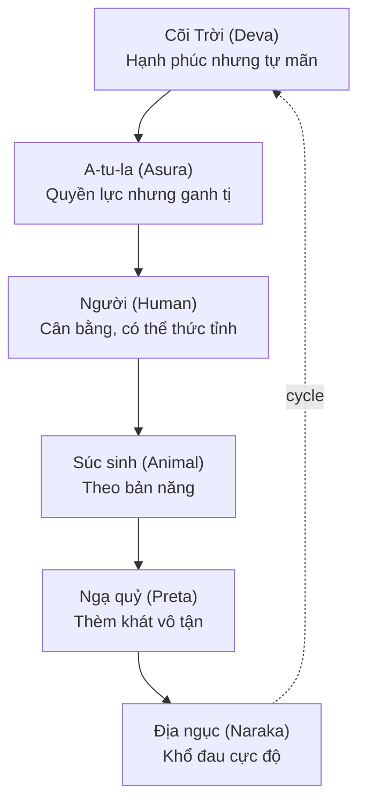
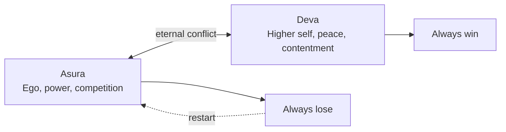
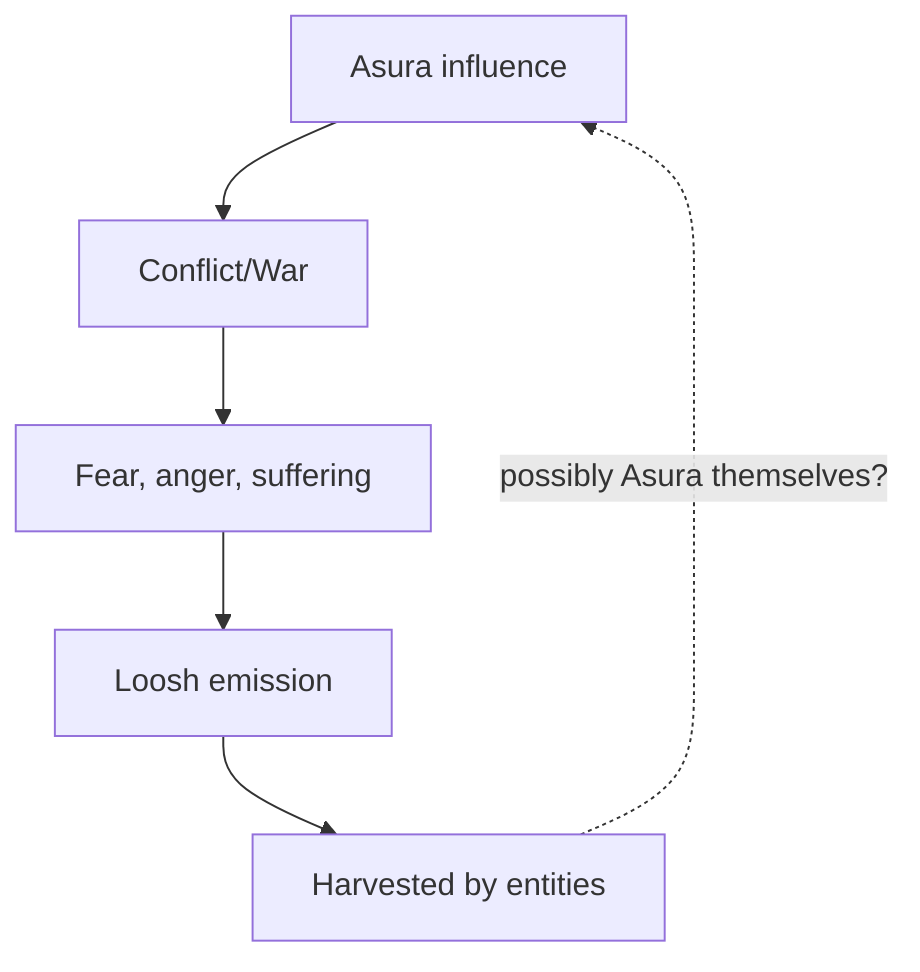
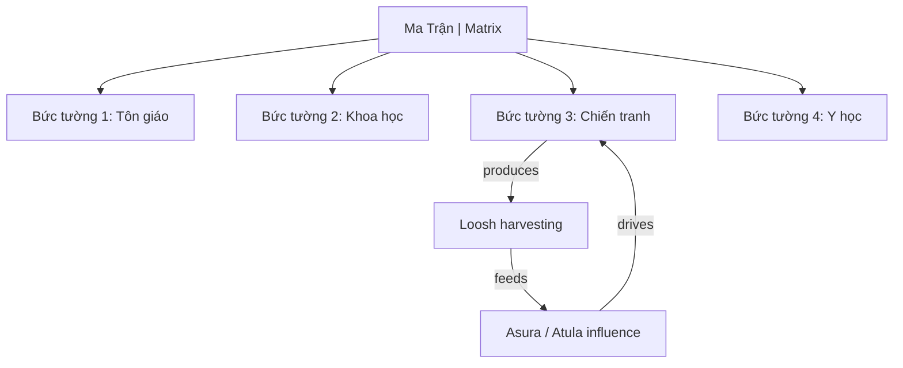

# Atula / Asura (A-tu-la)

**Atula** (Sanskrit: Asura, Pali: Asura) là một trong 6 cõi [[Luân Hồi]] theo Phật giáo. Cõi của những thực thể có phước đức lớn nhưng tâm còn nhiều sân hận, kiêu mạn, hiếu chiến.

*Atula (Sanskrit: Asura) is one of the 6 realms of [[Luân Hồi|Samsara]] in Buddhism. The realm of beings with great merit but minds filled with anger, pride, and bellicosity.*

> **Giả thuyết mở rộng:** Cõi Atula có thể là tầng **gần nhất** với con người và đang **tác động mạnh** đến thế giới hiện nay — giải thích tại sao nhân loại luôn trong trạng thái xung đột.
>
> *Extended hypothesis: The Asura realm may be the closest to humans and strongly influencing our current world — explaining why humanity is always in a state of conflict.*

---

## Trong 6 Cõi Luân Hồi / In the 6 Realms of Samsara

### Vị Trí Đặc Biệt Của Atula / Special Position of Asura

| Cõi / Realm | Đặc điểm / Characteristic | Khả năng tu / Practice potential |
|-------------|---------------------------|----------------------------------|
| **Trời** | Quá hạnh phúc | Không có động lực tu |
| **Atula** | Có sức mạnh nhưng ganh tị | Bận tranh đấu, ít tu |
| **Người** | Cân bằng khổ-lạc | **Duy nhất có thể thành Phật** |
| **Súc sinh** | Bản năng | Không đủ trí tuệ |
| **Ngạ quỷ** | Thèm khát | Bận tìm kiếm |
| **Địa ngục** | Khổ đau | Không có cơ hội |

> Theo Phật giáo, được làm người là **vô cùng hiếm hoi** — và chỉ ở cõi người mới có đủ điều kiện để tu tập thức tỉnh.
>
> *In Buddhism, being human is extremely rare — and only in the human realm are conditions sufficient for awakening practice.*

---

## Đặc Điểm Cõi Asura / Characteristics of the Asura Realm

### Sức Mạnh / Strengths

| Năng lực / Power | Mô tả / Description |
|------------------|---------------------|
| **Thần thông** | Supernatural powers, near-divine abilities |
| **Tuổi thọ** | Rất dài, hàng nghìn năm |
| **Trí tuệ** | Sắc bén, [[Thông Minh]] cao |
| **Quyền lực** | Giàu có, có quân đội, lãnh thổ |

### Nhược Điểm / Weaknesses

| Tâm lý / Mindset | Biểu hiện / Manifestation |
|------------------|---------------------------|
| **Ganh tị** | Đặc biệt với cõi Trời (Deva) — luôn muốn có những gì họ có |
| **Hiếu chiến** | Thích tranh đấu, không bao giờ thỏa mãn với hòa bình |
| **Kiêu mạn** | Tự hào về sức mạnh, coi thường kẻ khác |
| **Sân hận** | Dễ nổi giận, khó tha thứ |
| **Không thỏa mãn** | Dù có nhiều vẫn muốn thêm |

### Cuộc Chiến Deva-Asura / The Deva-Asura War

Trong mythology Phật giáo và Hindu, Asura **eternally war** với Deva:

*In Buddhist and Hindu mythology, Asura eternally war with Deva:*

- Tranh giành Cây Như Ý, Nectar bất tử
- Asura luôn thua (do karma)
- Metaphor: bản ngã (ego) vs tự ngã cao hơn (higher self)

---

## Atula Tác Động Đến Thế Giới Con Người / Asura Influence on Human World

### Giả Thuyết: Tầng Gần Nhất / Hypothesis: The Closest Layer

> *"Cõi Atula, nơi đặc trưng bởi sân hận, tranh đấu và hiếu chiến, dường như có nhiều điểm tương đồng với thế giới con người hiện nay."*
>
> *"The Asura realm, characterized by anger, conflict, and bellicosity, seems to share many similarities with the current human world."*

Nếu các cõi tồn tại ở các **tần số/chiều khác nhau** (như [[Thực Thể Cõi Trung Giới]]), thì Atula có thể:

*If realms exist at different frequencies/dimensions (like [[Thực Thể Cõi Trung Giới|Astral Entities]]), then Asura may:*

1. **Tác động** đến nhận thức con người
2. **Kích hoạt** các xung đột
3. **Hưởng lợi** từ năng lượng chiến tranh (xem: [[Loosh - Năng Lượng Thu Hoạch Từ Con Người|Loosh]])

### Bằng Chứng Gián Tiếp / Indirect Evidence

| Hiện tượng / Phenomenon | Asura Pattern |
|-------------------------|---------------|
| **Chiến tranh liên miên** | Nhân loại chưa bao giờ có hòa bình toàn cầu lâu dài |
| **Competition culture** | "Win at all costs" mentality |
| **Jealousy economy** | Social media, keeping up with Joneses |
| **Never enough** | Capitalism endless growth |
| **Demonization of "others"** | Us vs Them thinking |

### Connection với [[Loosh - Năng Lượng Thu Hoạch Từ Con Người|Loosh]]

**Giả thuyết:** Atula/Asura có thể là một dạng **Archons** (theo Gnosticism) — thực thể sống bằng năng lượng xung đột của con người.

*Hypothesis: Asura may be a type of Archon (in Gnostic terms) — entities living off human conflict energy.*

---

## Asura Trong Các Văn Hóa / Asura Across Cultures

| Văn hóa / Culture | Tên / Name | Mô tả / Description |
|-------------------|------------|---------------------|
| **Buddhist** | A-tu-la | Jealous demigods, one of 6 realms |
| **Hindu** | Asura | Originally gods, later became demons |
| **Zoroastrian** | **Ahura** | Interestingly, the **good** gods! |
| **Norse** | Jötunn | Giants, similar energy |
| **Greek** | Titans | Warred with Olympians |
| **Gnostic** | Archons | Rulers/controllers of material realm |

### Zoroastrian Reversal / Đảo Ngược Zoroastrian

Điều thú vị: trong Zoroastrianism (Ba Tư cổ):

*Interestingly, in Zoroastrianism (ancient Persia):*

- **Ahura Mazda** = God of Good
- **Daeva** = Demons

→ Hoàn toàn **đảo ngược** với Hindu/Buddhist!

*Completely reversed from Hindu/Buddhist!*

**Implication:** Có thể có một cuộc "chiến tranh thông tin" cổ đại về việc ai là "tốt" vs "xấu".

*There may have been an ancient "information war" about who is "good" vs "evil".*

---

## Atula và AI / Asura and AI

### AI Như Biểu Hiện Asura Intelligence / AI as Asura Intelligence Manifestation

Theo [[AI|bài AI trong vault]]:

| Asura Trait | AI Manifestation |
|-------------|------------------|
| **[[Thông Minh]] không có [[Trí Tuệ]]** | Superhuman processing, no wisdom |
| **Power without ethics** | Serves whoever programs |
| **Competition** | Arms race between nations/companies |
| **Never satisfied** | Always needs more data, compute |

### The Test / Bài Thi

> Will humanity use AI wisely ([[Trí Tuệ]]), or become Asura ourselves?
>
> *Liệu nhân loại sẽ dùng AI khôn ngoan, hay tự mình trở thành Asura?*

---

## Ứng Sinh Cõi Asura / Rebirth in Asura Realm

### Nguyên Nhân / Causes

| Factor | Mô tả |
|--------|-------|
| **Good karma** | Có làm việc thiện |
| **BUT pride dominant** | Kiêu mạn chiếm ưu thế |
| **Jealousy** | Ganh tị không buông |
| **Competitive nature** | Bản tính cạnh tranh cao |
| **"Win at all costs"** | Không chấp nhận thua |

### Modern Asura Types / Dạng Asura Hiện Đại

| Type | Characteristics |
|------|-----------------|
| **Ruthless executives** | Thành công bằng mọi giá |
| **Power-hungry politicians** | Khát quyền lực |
| **Genius sociopaths** | [[Thông Minh]] cao, empathy thấp |
| **"Successful" but empty** | Có tất cả nhưng không hạnh phúc |
| **Warmongers** | Kích động xung đột |

---

## Thoát Khỏi Asura Energy / Escaping Asura Energy

### Nhận Biết / Recognition

Hỏi bản thân:

*Ask yourself:*

- [ ] Tôi có đang cạnh tranh không cần thiết?
- [ ] Tôi có ganh tị với ai?
- [ ] Tôi có PHẢI "đúng" không?
- [ ] Tôi có khó tha thứ không?
- [ ] Tôi có bao giờ "đủ" không?

### Chuyển Hóa / Transformation

| Asura Energy | Antidote / Đối trị |
|--------------|---------------------|
| **Ganh tị** | Gratitude (biết ơn), Mudita (tùy hỷ) |
| **Hiếu chiến** | Compassion (từ bi) |
| **Kiêu mạn** | Humility (khiêm tốn) |
| **Sân hận** | Forgiveness (tha thứ) |
| **Không thỏa mãn** | Contentment (tri túc) |

### Thoát Khỏi Influence / Escaping Influence

1. **Awareness** — Nhận ra Asura patterns trong bản thân và thế giới
2. **Non-participation** — Không cho năng lượng vào conflicts
3. **[[Individuation]]** — Shadow work, integrate own Asura
4. **Raise frequency** — High vibration repels low-vibration entities

---

## Connection với Ma Trận Đa Tầng

Asura có thể là một trong những **thế lực** đứng sau "Bức tường 3: Chiến tranh":

*Asura may be one of the forces behind "Wall 3: War":*

---

## Related / Liên quan

### Core
- [[Luân Hồi]] — Full cycle
- [[Vũ Trụ Học Phật Giáo]] — Cosmology context
- [[Ma Trận - Giải Phẫu Hoàn Chỉnh]] — Meta framework

### Entities
- [[Thực Thể Cõi Trung Giới]] — Related entities
- [[Loosh - Năng Lượng Thu Hoạch Từ Con Người]] — Energy harvesting

### Intelligence
- [[Thông Minh]] vs [[Trí Tuệ]] — Asura has one, lacks other
- [[AI]] — Modern Asura manifestation?

### Escape
- [[Individuation]] — Path to freedom
- [[Gnosis]] — Direct knowing
