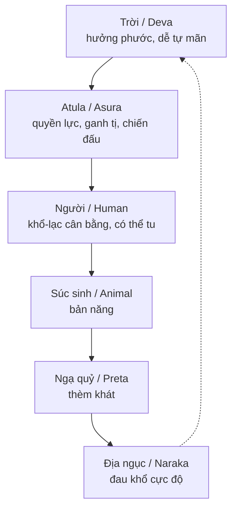
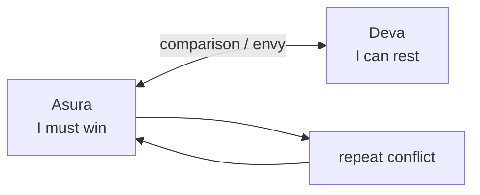
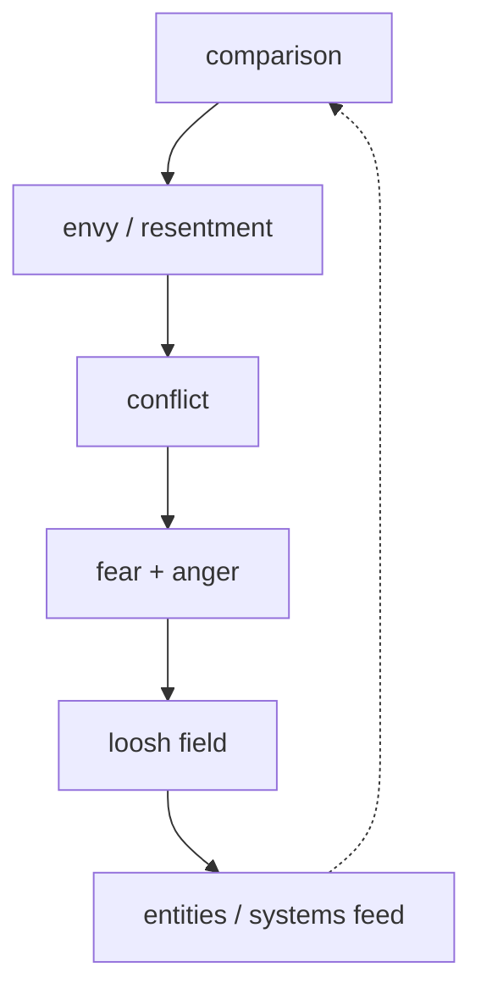

# Atula / Asura (A-tu-la)

**Atula là archetype của quyền lực có phước nhưng thiếu an định: mạnh, thông minh, tham vọng, hiếu thắng, nhưng bị ganh tị và chiến tranh nội tâm kéo đi.** Trong vault, Atula không chỉ là một "cõi" trong [[Luân Hồi]], mà là mô hình đọc phần Asura trong cá nhân, tổ chức, quốc gia và cả nền văn minh kỹ trị.

*Asura is the archetype of power without peace: strong, intelligent, ambitious, competitive, but driven by envy and conflict.*

---

## Evidence Discipline / Cách Đọc

| Tầng claim | Cách đọc |
|---|---|
| Fact / tradition | Atula/Asura xuất hiện trong Phật giáo, Hindu và các hệ thần thoại Nam Á với nghĩa thay đổi theo thời kỳ |
| Pattern | Asura là mẫu hình tâm lý: nhiều power nhưng thiếu contentment |
| Symbol | Cuộc chiến Deva-Asura là hình ảnh của ego tranh quyền với trật tự cao hơn |
| Speculative synthesis | Vault nối Asura với [[Loosh - Năng Lượng Thu Hoạch Từ Con Người]], AI arms race và Matrix chiến tranh; đây là diễn giải biểu tượng, không phải mô tả vật lý chắc chắn |

---

## Vault Position / Vị Trí Trong Vault

Atula là node nối [[Vũ Trụ Học Phật Giáo]], [[Luân Hồi]], [[Ma Trận - Giải Phẫu Hoàn Chỉnh]], [[Thông Minh vs Trí Tuệ]] và [[AI]]. Nếu ngạ quỷ là đói khát vô tận, Atula là **thắng không bao giờ đủ**. Nếu cõi người có cơ hội tỉnh thức vì cân bằng khổ-lạc, cõi Atula bị mắc ở vòng comparison: luôn nhìn lên Deva, luôn cảm thấy bị thiếu.

---

## Atula Trong Sáu Cõi / Asura In The Six Realms

Điểm sắc của cõi Atula: họ không phải "yếu". Họ có phước, tài, lực, quân đội, trí tuệ sắc bén. Vấn đề là **tâm không yên**. Có bao nhiêu cũng vẫn nhìn sang bên cạnh để đo xem mình có hơn chưa.

---

## Tâm Lý Asura / The Asura Psychology

| Mẫu hình | Biểu hiện |
|---|---|
| Ganh tị | người khác có gì là thấy mình bị cướp mất gì đó |
| Hiếu chiến | không chịu được trạng thái không có đối thủ |
| Kiêu mạn | đồng nhất bản thân với power, rank, tài sản, IQ |
| Không thỏa mãn | thắng rồi vẫn tìm trận mới |
| Thiếu từ bi | nhìn người khác như quân cờ hoặc đối thủ |

Atula vì vậy là cảnh báo cho người có năng lực. Người yếu có thể bị dục kéo. Người mạnh thường bị pride kéo. Đây là lý do [[Thông Minh]] không đủ; cần [[Trí Tuệ]].

---

## Deva-Asura War / Cuộc Chiến Không Dứt

Trong thần thoại, Asura thường tranh với Deva: cây như ý, nectar bất tử, lãnh thổ thiên giới. Đọc ở tầng symbol, đây là chiến tranh giữa **ego muốn chiếm** và **tâm cao hơn biết đủ**.

Atula thua không phải vì thiếu sức. Atula thua vì toàn bộ game của họ được dựng trên comparison. Một tâm còn cần thắng để biết mình tồn tại thì chưa tự do.

---

## Asura Trong Thế Giới Hiện Đại

Atula hiện đại không cần sừng, cánh hay vũ khí thần thoại. Nó mặc suit, cầm KPI, vận hành thuật toán, điều khiển quân đội, gọi tham vọng là innovation.

| Mặt nạ hiện đại | Năng lượng Asura |
|---|---|
| executive ruthless | thắng bằng mọi giá |
| chính trị gia khát quyền | biến dân chúng thành tài nguyên quyền lực |
| tech arms race | build trước, hỏi đạo đức sau |
| influencer status game | sống bằng comparison |
| war industry | cần xung đột để tồn tại |

Đây là nơi Atula nối với [[Bộ Tam Thánh Mind Control - NASA Disney Hollywood]] và [[Elite]]: không phải mọi power đều Asura, nhưng power không có wisdom rất dễ đi về hướng đó.

---

## Loosh Và Nền Kinh Tế Xung Đột

Nếu đọc theo vault synthesis, Asura là một trong các archetype giải thích vì sao xung đột lặp lại như một mô hình thu năng lượng. Chiến tranh, outrage, envy, humiliation và tribal hate tạo ra trường cảm xúc nặng. Bài [[Loosh - Năng Lượng Thu Hoạch Từ Con Người]] gọi đó là năng lượng bị harvest.

Không cần chứng minh "thực thể" theo nghĩa vật lý mới thấy pattern. Chỉ cần nhìn kinh tế attention hiện đại: outrage nuôi nền tảng, nền tảng nuôi polarization, polarization nuôi quyền lực.

---

## Atula Và AI

[[AI]] là bài test Asura của nhân loại. Một hệ thống có thể có năng lực xử lý khổng lồ mà không có tim, không có karma, không có trách nhiệm hiện sinh. Vấn đề không phải AI "ác" theo phim. Vấn đề là intelligence bị đặt vào cuộc đua quyền lực của các actor Asura.

| Asura trait | AI age expression |
|---|---|
| thông minh không trí tuệ | optimize metric sai với tốc độ cực lớn |
| arms race | quốc gia và tập đoàn chạy đua compute |
| pride | "chúng ta sẽ thay thế mọi thứ" |
| thiếu từ bi | con người thành data point |
| không biết đủ | thêm dữ liệu, thêm surveillance, thêm automation |

Vì vậy câu hỏi không phải "AI có consciousness không?" mà là: **consciousness nào đang dùng AI?**

---

## Nhận Diện Asura Trong Chính Mình

Hỏi thẳng:

- Tôi có cần thắng để thấy mình có giá trị không?
- Tôi có vui thật khi người khác thành công không?
- Tôi có biến spiritual knowledge thành superiority không?
- Tôi có nhầm being right với being free không?
- Tôi có đang dùng power để bảo vệ truth hay bảo vệ ego?

Nếu câu trả lời làm khó chịu, bài này đã chạm đúng chỗ.

---

## Chuyển Hóa / Antidote

| Asura energy | Thuốc giải |
|---|---|
| Ganh tị | mudita: vui với phước của người khác |
| Hiếu chiến | chọn trận đáng đánh, bỏ trận nuôi ego |
| Kiêu mạn | nhớ tính vô thường của quyền lực |
| Không thỏa mãn | tri túc, biết đủ |
| Power without heart | service, compassion, accountability |

[[Individuation]] ở đây rất quan trọng. Không phải giết phần Asura, mà tích hợp nó. Sức mạnh cần được thuần hóa, không bị đè nén. Một người không có Asura nào thì yếu. Một người bị Asura lái thì nguy hiểm.

---

## Core Insight / Chốt Lại

**Atula là lời cảnh báo cho người mạnh: nếu power không đi cùng trí tuệ và từ bi, nó sẽ biến thành một cỗ máy chiến tranh tinh vi.**

*Asura warns the powerful: without wisdom and compassion, strength becomes a sophisticated war machine.*
