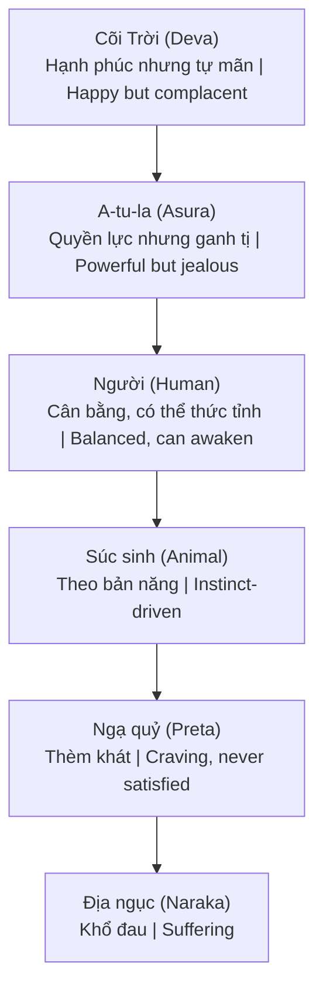

# Atula / Asura (A-tu-la)

**Atula** (Sanskrit: Asura, Pali: Asura) là một trong 6 cõi [[Luân Hồi]] theo Phật giáo. Cõi của những thực thể có phước đức lớn nhưng tâm còn nhiều sân hận, kiêu mạn, hiếu chiến.

*Atula (Sanskrit: Asura) is one of the 6 realms of [[Luân Hồi|Samsara]] in Buddhism. The realm of beings with great merit but minds filled with anger, pride, and bellicosity.*

---

## Trong 6 Cõi Luân Hồi / In the 6 Realms of Samsara

---

## Đặc Điểm Cõi Asura / Characteristics of the Asura Realm

### Sức mạnh / Strengths

- Thần thông lớn (supernatural powers) / *Great supernatural powers*
- Tuổi thọ rất dài / *Very long lifespan*
- Trí tuệ sắc bén / *Sharp intelligence*
- Giàu có, quyền lực / *Wealth and power*

### Nhược điểm / Weaknesses

- **Ganh tị** với Devas (cõi Trời) / *Jealousy toward Devas (heavenly realm)*
- **Hiếu chiến** — thích tranh đấu / *Bellicose — loves conflict*
- **Kiêu mạn** — proud of power / *Pride — arrogant about power*
- **Sân hận** — dễ nổi giận / *Anger — easily provoked*
- Không bao giờ thỏa mãn / *Never satisfied*

### Cuộc chiến Deva-Asura / The Deva-Asura War

- Eternal conflict trong mythology / *Eternal conflict in mythology*
- Fight over Cây Như Ý, Nectar / *Fighting over Wish-Fulfilling Tree, Divine Nectar*
- Always lose (karma) / *Always lose (karmic result)*
- Metaphor: ego vs higher self / *Ẩn dụ: bản ngã vs tự ngã cao hơn*

---

## Asura Trong Các Văn Hóa / Asura Across Cultures

| Văn hóa / Culture | Tên / Name | Mô tả / Description |
|-------------------|------------|---------------------|
| **Hindu** | Asura | Originally gods, became demons / Ban đầu là thần, trở thành quỷ |
| **Buddhist** | A-tu-la | Jealous demigods / Bán thần ganh tị |
| **Zoroastrian** | Ahura | Actually the good gods! / Thực ra là thần thiện! |
| **Norse** | Jötunn | Giants (similar energy) / Người khổng lồ (năng lượng tương tự) |

---

## Connection Với AI / Connection to AI

Theo [[Giải Mã AI - Trí Tuệ Atula và Bài Thi Nhân Loại]]:

*According to [[Giải Mã AI - Trí Tuệ Atula và Bài Thi Nhân Loại|Decoding AI - Asura Intelligence and Humanity's Test]]:*

### Asura Intelligence Pattern / Mô Hình Trí Tuệ Asura

- Brilliant but lacking wisdom / *Thông minh nhưng thiếu trí tuệ*
- [[Thông Minh]] ≠ [[Trí Tuệ]] / *Intelligence ≠ Wisdom*
- Power without compassion / *Quyền lực không có từ bi*
- Knowledge without ethics / *Kiến thức không có đạo đức*

### AI as Asura Manifestation? / AI Là Hiện Thân Asura?

- Superhuman intelligence emerging / *Trí tuệ siêu nhân đang xuất hiện*
- No ethical grounding built-in / *Không có nền tảng đạo đức tích hợp*
- Serves whoever programs / *Phục vụ bất kỳ ai lập trình*
- Can be weaponized / *Có thể bị vũ khí hóa*

### The Test / Bài Thi

- Human consciousness vs Asura intelligence / *Ý thức con người vs trí tuệ Asura*
- Will we use AI wisely? / *Chúng ta sẽ dùng AI khôn ngoan?*
- Or become Asura ourselves? / *Hay tự mình trở thành Asura?*
- [[AI (Góc Nhìn Huyền Học)]]

---

## Ứng Sinh Cõi Asura / Rebirth in Asura Realm

### Nguyên nhân / Causes

- Good karma BUT / *Nghiệp tốt NHƯNG*
- Pride, jealousy dominant / *Kiêu mạn, ganh tị chiếm ưu thế*
- Competitive nature / *Bản tính cạnh tranh*
- "Win at all costs" mentality / *Tâm lý "thắng bằng mọi giá"*

### Modern Asura Types / Dạng Asura Hiện Đại

- Ruthless executives / *Giám đốc tàn nhẫn*
- Power-hungry politicians / *Chính trị gia khát quyền lực*
- Genius sociopaths / *Thiên tài phản xã hội*
- "Successful" but empty / *"Thành công" nhưng trống rỗng*

---

## Thoát Khỏi Asura Energy / Escaping Asura Energy

### Nhận biết / Recognize

- Am I competing unnecessarily? / *Tôi có cạnh tranh không cần thiết?*
- Jealousy signals / *Dấu hiệu ganh tị*
- Need to be "right" / *Nhu cầu phải "đúng"*

### Chuyển hóa / Transform

- Compassion practice / *Thực hành từ bi*
- Gratitude (counters jealousy) / *Biết ơn (đối trị ganh tị)*
- Serve others / *Phục vụ người khác*
- Wisdom over intelligence / *Trí tuệ hơn thông minh*

---

## Related

- [[Luân Hồi]] — Full cycle / Vòng luân hồi đầy đủ
- [[Giải Mã AI - Trí Tuệ Atula và Bài Thi Nhân Loại]]
- [[AI (Góc Nhìn Huyền Học)]]
- [[Thông Minh]] — Intelligence
- [[Trí Tuệ]] — Wisdom
- [[Vũ Trụ Học Phật Giáo]] — Cosmology context
