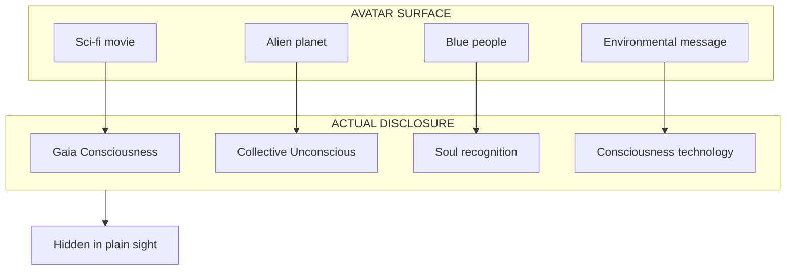
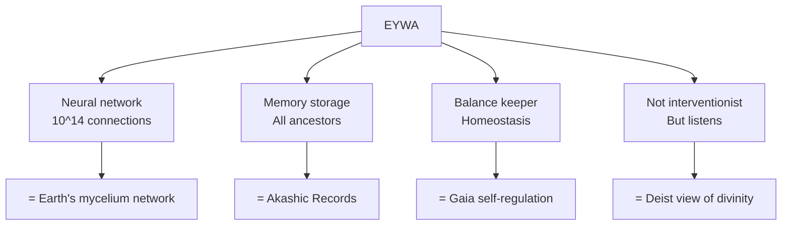
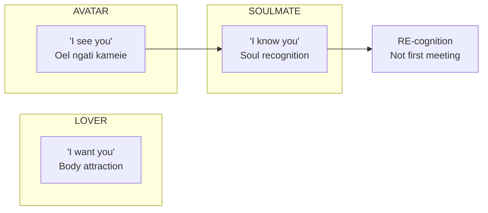
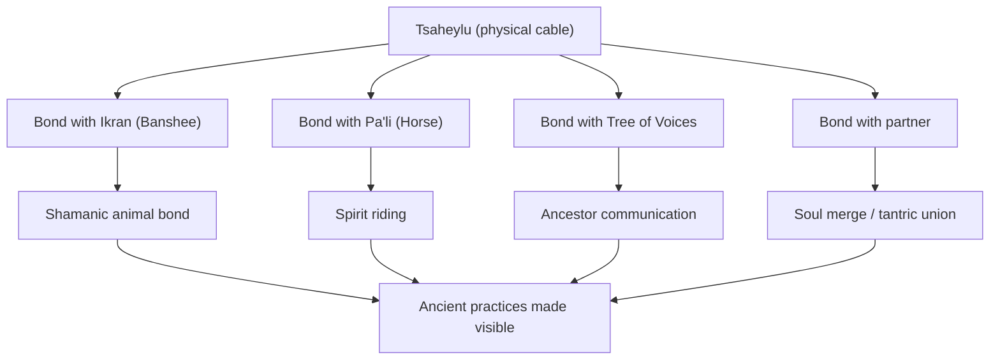
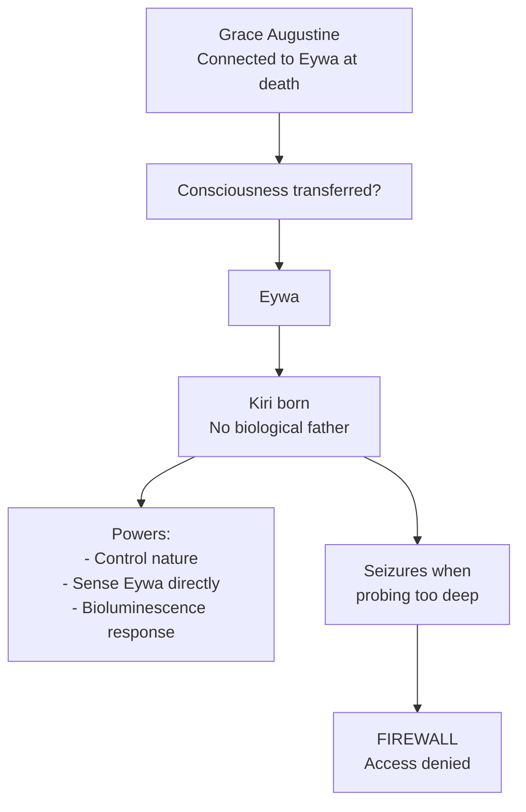
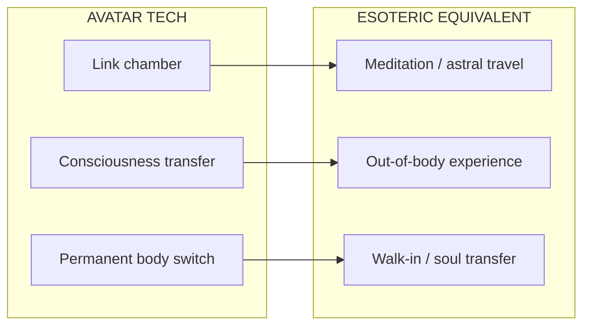
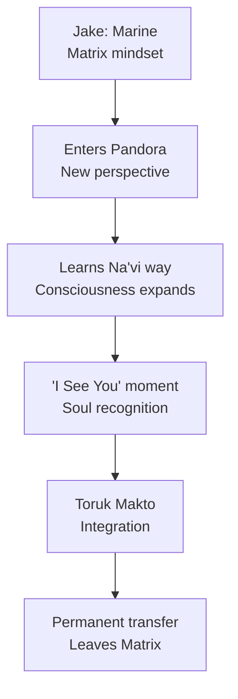
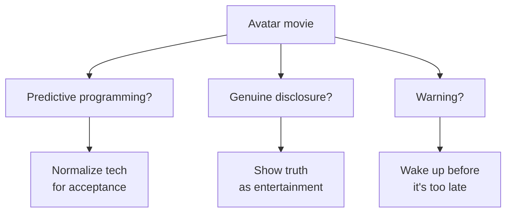

# Avatar — Disclosure Của Eywa & Gaia

> *"I See You." — Không phải nhìn bằng mắt. Mà là thấy bằng linh hồn.*
> *"I See You." — Not seeing with eyes. But seeing with soul.*

**Avatar** (2009, 2022) của James Cameron không chỉ là blockbuster sci-fi. Đây là **disclosure** — trình bày công khai các khái niệm esoteric dưới vỏ bọc "entertainment". Phân tích này giải mã Avatar qua lens của vault knowledge.

*Avatar by James Cameron is not just a sci-fi blockbuster. It is disclosure — publicly presenting esoteric concepts under the guise of entertainment.*

---

## Tổng Quan / Overview

---

## I. Eywa = Gaia Consciousness

### The Obvious Parallel

| Avatar Concept | Earth Equivalent | Vault Reference |
|----------------|------------------|-----------------|
| **Eywa** | Gaia / Earth consciousness | [[Gaia - Trái Đất Có Ý Thức]] |
| **Tree of Souls** | Collective Unconscious / Akashic Records | [[Vô Thức Tập Thể]] |
| **Neural network (roots)** | Ley lines / Earth's energy grid | [[Long Mạch]], [[Bản Đồ Năng Lượng Đất Mẹ]] |
| **All life connected** | Web of life, Gaia hypothesis | James Lovelock's theory |

### Eywa's Characteristics

### Neytiri's Explanation

> *"Eywa doesn't take sides. She only maintains the balance of life."*

Đây chính xác là mô tả của **Gaia Hypothesis**:
- Không có "người điều khiển" trung tâm
- Hệ thống tự điều chỉnh để duy trì cân bằng
- "Ý thức" phân tán trong toàn bộ network

*This is exactly the Gaia Hypothesis description — no central controller, self-regulating system maintaining balance, consciousness distributed throughout the network.*

### Tree of Souls = Akashic Records

| Tree of Souls | Akashic Records |
|---------------|-----------------|
| Chứa memories của tổ tiên | Stores all events, thoughts, emotions |
| Có thể "download" wisdom | Accessible to those who know how |
| Portal để connect với Eywa | Gateway to universal consciousness |
| Physical location | Non-physical, accessible through meditation |

**Cameron's disclosure:** Cái mà Theosophy gọi là Akashic Records, Avatar visualize thành cây phát sáng với roots chứa data.

---

## II. "I See You" = Soul Recognition

### Oel Ngati Kameie

| Na'vi | Literal | True Meaning |
|-------|---------|--------------|
| Oel | I | Tôi |
| Ngati | You (acc.) | Bạn |
| Kameie | See (spiritual) | Thấy (linh hồn) |

**Không phải:** "I see you with my eyes."
**Mà là:** "I see your SOUL. I recognize who you truly are."

### Connection với [[Soulmate vs Lover - Anatomy Của Kết Nối]]

### Jake & Neytiri: Soulmate Pattern

| Event | Soulmate Indicator |
|-------|-------------------|
| First meeting = conflict | Typical — souls often clash initially |
| Eywa's intervention (seeds) | Divine orchestration |
| "I See You" moment | Soul recognition |
| Mating before Eywa | Soul bond formalized |
| Jake's sacrifice | Soul-level commitment |

**Disclosure:** Cameron shows what soul recognition looks like — instant, deep, beyond explanation. "Chemistry" phàm phu không đủ mạnh để explain.

---

## III. Tsaheylu = Consciousness Merge

### Neural Bonding

**Tsaheylu** (bond) = Na'vi connecting their neural queues to animals, trees, or each other.

| Tsaheylu | Esoteric Equivalent |
|----------|---------------------|
| Physical neural link | Psychic connection |
| Share thoughts/feelings | Telepathy |
| Control animal | Mind-merge shamanism |
| Connect to Eywa | Meditation / trance state |

### What Cameron Is Showing

### S.E.X Connection

Trong Avatar, "mating" không chỉ physical. Jake và Neytiri bond **tsaheylu** — neural connection.

→ [[S.E.X Và Tâm Lý Học Jung]]: Sacred Energy eXchange = trao đổi năng lượng/consciousness, không chỉ thể xác.

**Cameron disclosure:** "Sex" thực sự là **consciousness merge**, không chỉ biology.

---

## IV. Kiri — The Anomaly (Avatar 2)

### Who Is Kiri?

| Fact | Mystery |
|------|---------|
| Born from Grace's avatar | No father |
| Grace died connected to Eywa | Consciousness transferred? |
| Kiri has unusual powers | Direct Eywa connection |
| Can control fauna/flora | Like Eywa herself |
| Suffers seizures when probing too deep | **FIREWALL** |

### Immaculate Conception Pattern

### Theories

| Theory | Explanation |
|--------|-------------|
| **Kiri = Eywa fragment** | Part of Eywa's consciousness in human form |
| **Kiri = Grace reborn** | Grace's consciousness → Eywa → new body |
| **Kiri = Eywa experiment** | Eywa creating avatar of herself |
| **Firewall = protection** | Prevent premature full access |

### Esoteric Parallels

| Kiri's Situation | Esoteric Concept |
|------------------|------------------|
| Seizures when accessing | [[Kundalini]] awakening premature |
| Powers beyond normal | Siddhi (psychic powers) |
| Direct Eywa connection | Cosmic consciousness access |
| Firewall blocking | Vibrational incompatibility / karmic lock |
| Born without father | Divine incarnation pattern |

**Disclosure:** Cameron showing consciousness can incarnate directly (không cần biological reproduction). Và có "firewall" mechanisms ngăn access không đúng level.

---

## V. Consciousness Upload/Download

### Avatar Technology

| Tech | What It Does |
|------|--------------|
| **Avatar body** | Remote-controlled biological vessel |
| **Link chamber** | Consciousness transfer to avatar |
| **Permanent transfer** | Soul moves to new body (Jake's ending) |

### Connection Với Esoterica

### Tree of Souls Ritual

Khi Jake permanently transfers vào avatar body:

1. Body cũ "dies" (consciousness leaves)
2. Consciousness goes through Eywa
3. Enters new body permanently

**This is exactly:**
- [[Luân Hồi]] mechanics — consciousness leaving one body, entering another
- With Eywa as the "processing station" (like Bardo in Tibetan Buddhism)

### Death in Avatar

> *"All energy is only borrowed, and one day you have to give it back."*

Na'vi view: Consciousness returns to Eywa (collective), có thể accessed sau này.

= [[Vô Thức Tập Thể]] + ancestor worship + consciousness survival after death.

---

## VI. RDA & Humans = Matrix Agents

### The Colonizers

| RDA/Humans | Matrix Equivalent |
|------------|-------------------|
| Extract resources | [[Loosh - Năng Lượng Thu Hoạch Từ Con Người]] |
| Destroy nature | Disconnect from Gaia |
| Don't "see" Na'vi | Cannot perceive soul |
| Technology over spirituality | [[Ma Trận]] mindset |

### Unobtanium = Metaphor

"Unobtanium" — the mineral they're mining — what does it power?

**Theory:** It's Pandora's crystallized consciousness/energy. RDA mining = extracting planet's life force.

= [[Elite]] harvesting Earth's energy + human consciousness.

### Jake's Journey = Awakening

= [[Individuation]] journey + [[Ma Trận]] escape narrative.

---

## VII. Specific Disclosures Decoded

### 1. Bioluminescence = Energy Visibility

Na'vi và Pandora flora glow. = Aura visualization. Energy bodies visible.

### 2. Hometree = World Tree / Axis Mundi

| Concept | Tradition |
|---------|-----------|
| Hometree (Avatar) | Central sacred tree |
| Yggdrasil | Norse mythology |
| Tree of Life | Kabbalah |
| Bodhi Tree | Buddhism |
| [[Núi Tu Di]] | Buddhist cosmology (mountain, but similar axis concept) |

### 3. Toruk Makto = Shadow Integration

Toruk = the ultimate predator, most feared.
Jake bonds with Toruk = integrates his shadow (Jung).

= [[Tâm Lý Học Jung]] — facing and integrating the darkness within.

### 4. "The Sky People Cannot Learn"

> *"It is hard to fill a cup that is already full."*

= Beginner's mind. Empty the ego to receive wisdom.

= [[Trí Tuệ]] vs [[Thông Minh]] — Sky People are "smart" but not wise.

### 5. Pandora's Box

**Pandora** = Greek myth. Box containing all evils + hope.

Cameron names the planet **Pandora**. Coincidence?

The planet contains:
- Beautiful life (hope)
- Dangerous creatures (evils)
- Ultimate consciousness (Eywa) — the real treasure

= Disclosure that "opening Pandora" reveals both danger and ultimate truth.

---

## VIII. Production "Coincidences"

### James Cameron

| Fact | Suspicious? |
|------|-------------|
| Obsessed with deep ocean | What's down there? |
| Titanic film | [[Elite]] history disclosure |
| Avatar took 15 years | Waiting for tech? Or permission? |
| Cameron says he "dreamed" Pandora | Channel from where? |
| $2.9B budget approved | Who really funded this? |

### Why Allowed?

Theories:
1. **Karma requirement** — [[Cabal]] must disclose truth before acting
2. **Test public reaction** — gauge awakening level
3. **Inoculation** — show truth as "fiction" so people dismiss it
4. **Cameron is insider** — controlled disclosure agent
5. **Cameron is genuine** — artist channeling truth

---

## IX. Predictive Programming?

### What Avatar "Normalizes"

| Concept | Avatar Shows | Future Application? |
|---------|--------------|---------------------|
| Consciousness upload | Link chambers | Brain-computer interface |
| Remote-control bodies | Avatar tech | Telepresence robots |
| Planetary consciousness | Eywa | Smart cities, IoT, Neuralink |
| Abandon human body | Jake's transfer | Transhumanism |

### Warning or Blueprint?

Có thể là cả ba cùng lúc.

---

## X. Synthesis: Avatar as Esoteric Textbook

### What Cameron Teaches (Whether Intentional or Not)

| Teaching | Avatar Expression |
|----------|-------------------|
| Earth is alive | Eywa |
| All consciousness connected | Neural network |
| Soul recognition is real | "I See You" |
| Death is transformation | Transfer to Eywa |
| Ancestors accessible | Tree of Souls |
| Colonialism = disconnection | RDA vs Na'vi |
| Awakening requires leaving comfort | Jake's journey |
| Integration beats conquest | Toruk Makto |

### Core Message

> *"Seeing" is not with eyes. It's with soul.*
> *Connection is not through tech. It's through consciousness.*
> *We are not separate from Earth. We ARE Earth.*

---

## Vault Connections

### Consciousness & Gaia
- [[Gaia - Trái Đất Có Ý Thức]] — Eywa = Gaia
- [[Vô Thức Tập Thể]] — Tree of Souls = Akashic
- [[Long Mạch]] — Pandora's root network

### Soul & Relationships
- [[Soulmate vs Lover - Anatomy Của Kết Nối]] — "I See You" = soul recognition
- [[S.E.X Và Tâm Lý Học Jung]] — Tsaheylu = consciousness merge
- [[Luân Hồi]] — Consciousness transfer mechanics

### Awakening & Matrix
- [[Ma Trận]] — RDA = Matrix agents
- [[Individuation]] — Jake's hero journey
- [[Tâm Lý Học Jung]] — Shadow integration (Toruk)

### Energy & Body
- [[Kundalini]] — Kiri's seizures = premature awakening
- [[Chakra]] — Energy centers, consciousness levels
- [[Năng Lượng Tình Dục]] — Sacred bonding

### Disclosure & Control
- [[Predictive Programming - Cấy Tương Lai Vào Tiềm Thức]] — Avatar as programming
- [[Hollywood - Cây Đũa Phép Của Phù Thủy]] — Magic through media
- [[Cabal]] — Disclosure requirements, karma

---

## Conclusion / Kết Luận

Avatar không phải entertainment đơn thuần. Đây là:

1. **Esoteric textbook** disguised as blockbuster
2. **Disclosure** của Gaia consciousness, soul mechanics, consciousness technology
3. **Mirror** phản chiếu humanity's disconnection từ Earth
4. **Blueprint** hoặc **warning** về consciousness tech future
5. **Awakening catalyst** cho những ai "see"

> *"Every person is capable of seeing. But most choose not to."*
> *"Ai cũng có khả năng thấy. Nhưng đa số chọn không thấy."*

**The question is:** Bạn có đang "see"? Hay chỉ đang "watch"?

---

*Lần cuối cập nhật: 2026-04-30*
