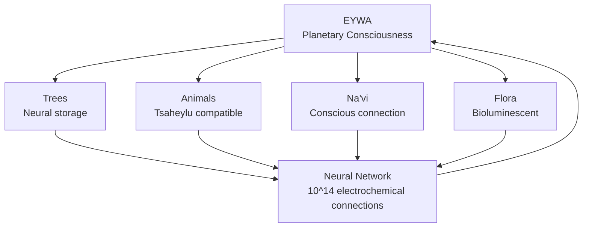
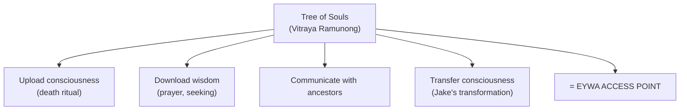
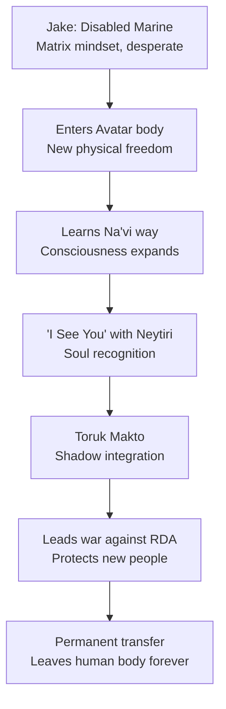
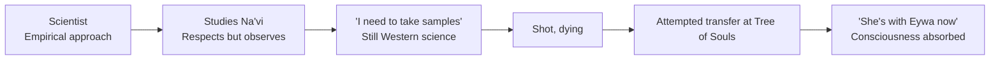
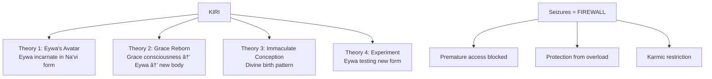
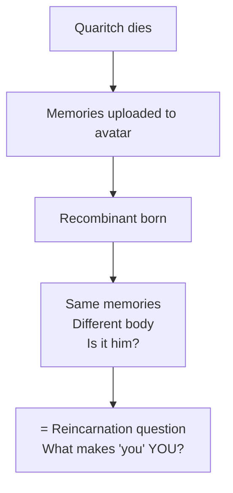

# Avatar — Disclosure Của Eywa & Gaia

> *"I See You." — Không phải nhìn bằng mắt. Mà là thấy bằng linh hồn.*
> *"I See You." — Not seeing with eyes. But seeing with soul.*

**Avatar** (2009, 2022, 2025) của James Cameron không chỉ là blockbuster sci-fi. �ây là **disclosure** — trình bày công khai các khái niệm esoteric dưới v� b�c "entertainment".

*Avatar by James Cameron is not just a sci-fi blockbuster. It is disclosure — publicly presenting esoteric concepts under the guise of entertainment.*

**Trilogy:**
- **Avatar** (2009) — Introduction to Eywa/Gaia, Jake's awakening
- **Avatar: The Way of Water** (2022) — Water spirituality, Kiri mystery
- **Avatar: Fire and Ash** (2025) — Dark clans, Eywa rejection, Spider's transformation

---

# PHẦN I: WORLD BUILDING — PANDORA

## 1. Pandora — Mặt Trăng Sống

### Vị Trí Thiên Văn

| Thông số | Chi tiết |
|----------|----------|
| **Loại** | Mặt trăng của hành tinh Polyphemus |
| **Hệ sao** | Alpha Centauri A (4.37 năm ánh sáng từ Trái �ất) |
| **Khí quyển** | �ộc với con ngư�i (nhi�u CO₂, H₂S) |
| **Tr�ng lực** | 0.8g (nhẹ hơn Trái �ất → sinh vật cao lớn) |
| **�ặc biệt** | Từ trư�ng mạnh, Unobtanium |

### Tên "Pandora" — Ẩn �

**Pandora** trong thần thoại Hy Lạp = ngư�i phụ nữ mở chiếc hộp chứa m�i tai h�a + hy v�ng.

Cameron đặt tên này không ngẫu nhiên:
- Pandora chứa **nguy hiểm** (sinh vật, khí độc)
- Pandora chứa **hy v�ng** (Eywa, consciousness)
- Mở Pandora = khám phá cả bóng tối lẫn ánh sáng

*= [[Individuation]] — phải đối mặt shadow để tìm wholeness.*

### Hệ Sinh Thái — Tất Cả Kết Nối

**M�i sinh vật trên Pandora đ�u có neural queue** — khả năng kết nối với network của Eywa.

*= [[Gaia - Trái �ất Có � Thức]] — Trái �ất cũng là một sinh vật sống, m�i thứ connected.*

### Bioluminescence — Năng Lượng Visible

Toàn bộ Pandora **phát sáng** v� đêm.

| Esoteric Meaning | Avatar Visualization |
|------------------|----------------------|
| **Aura** | Flora/fauna glow |
| **Energy body** | Visible bioluminescence |
| **Life force (prana/chi)** | Light = living energy |

*Cameron làm cho năng lượng THẤY �ƯỢC — đi�u mà chỉ ngư�i có "third eye" mới thấy trên Trái �ất.*

---

## 2. Eywa — � Thức Hành Tinh

### Eywa Là Gì?

**Eywa** không phải "god" theo nghĩa Abrahamic. Eywa là:

| �ặc điểm | Mô tả |
|----------|-------|
| **Consciousness network** | Kết nối tất cả sự sống |
| **Memory storage** | Lưu trữ tổ tiên, wisdom |
| **Self-regulating** | Duy trì cân bằng sinh thái |
| **Not interventionist** | Không can thiệp, chỉ balance |
| **Accessible** | Có thể connect qua Tree of Souls |

### Parallel Với Trái �ất

| Eywa (Pandora) | Gaia (Earth) | Vault Reference |
|----------------|--------------|-----------------|
| Planetary consciousness | Gaia hypothesis | [[Gaia - Trái �ất Có � Thức]] |
| Neural root network | Mycelium network (fungi) | [[Long Mạch]] |
| Tree of Souls | Akashic Records | [[Vô Thức Tập Thể]] |
| Balance keeper | Homeostasis | James Lovelock theory |

### Neytiri Giải Thích Eywa

> *"Our great mother does not take sides, Jake. She protects only the balance of life."*

�ây **chính xác** là Gaia Hypothesis:
- Không có central controller
- Hệ thống tự đi�u chỉnh
- Mục đích: duy trì conditions cho sự sống

*= Eywa không phải "thần" can thiệp. Eywa là SYSTEM — như Trái �ất.*

### Tree of Souls — Portal �ến Eywa

**Esoteric equivalent:**
- **Akashic Records** — cosmic library chứa m�i thông tin
- **Ancestor worship** — connect với tổ tiên đã khuất
- **Meditation portals** — sacred sites để access higher consciousness

---

## 3. Tôn Chỉ Sống Của Na'vi

### Triết Lý Cốt Lõi

| Principle | Na'vi Expression | Meaning |
|-----------|------------------|---------|
| **Interconnection** | "All energy is borrowed" | Không sở hữu, chỉ mượn |
| **Respect** | Thank prey before killing | Acknowledge consciousness in all |
| **Balance** | Take only what you need | Sustainable living |
| **Soul seeing** | "I See You" | Recognize essence, not appearance |
| **Cyclical** | Return to Eywa | Death = transformation, not end |

### "I See You" — Oel Ngati Kameie

| Na'vi | Meaning |
|-------|---------|
| **Oel** | I |
| **Ngati** | You (accusative) |
| **Kameie** | See (spiritually) |

**Không phải** "I see you with eyes."
**Mà là** "I see your SOUL. I recognize who you truly are."

*= [[Soulmate vs Lover - Anatomy Của Kết Nối]] — Soul recognition, RE-cognition, biết nhau từ trước.*

### Tsaheylu — Neural Bond

**Tsaheylu** = kết nối neural queue với sinh vật khác.

| Bond Type | Purpose |
|-----------|---------|
| **With Ikran (Banshee)** | Lifelong partner, flying mount |
| **With Pa'li (Direhorse)** | Riding, communication |
| **With Tree of Voices** | Hear ancestors |
| **With mate** | Soul merge |

**Esoteric meaning:**
- = Telepathy, psychic connection
- = Shamanic animal bonding
- = [[S.E.X Và Tâm Lý H�c Jung]] — Sacred Energy eXchange qua consciousness, không chỉ body

### Death & Afterlife

> *"All energy is only borrowed, and one day you have to give it back."*

Na'vi belief:
1. Consciousness returns to Eywa at death
2. Ancestors accessible qua Tree of Souls
3. Energy recycled, not lost
4. Individual becomes part of collective

*= [[Luân Hồi]] + [[Vô Thức Tập Thể]] — Consciousness không mất, chỉ transform.*

---

# PHẦN II: C�C BỘ TỘC PANDORA

## 1. Omaticaya — Forest Clan

### Profile

| Aspect | Detail |
|--------|--------|
| **Môi trư�ng** | Rainforest, Hometree |
| **�ặc trưng** | Hunters, Ikran riders |
| **Lãnh đạo** | Eytukan (đã mất) → Tsu'tey → Jake |
| **Tsahìk (shaman)** | Mo'at |
| **Nhân vật chính** | Neytiri, Jake (adopted) |

### Hometree — Axis Mundi

**Hometree** (Kelutral) = cây khổng lồ, nhà của cả clan.

| Hometree | Mythological Parallel |
|----------|----------------------|
| Central sacred tree | Yggdrasil (Norse) |
| Connects earth-sky | Axis Mundi |
| Community center | World Tree (many cultures) |
| Destroyed by RDA | = Destroying sacred center |

*RDA phá Hometree = [[Elite]] phá sacred sites, disconnect humanity từ spiritual roots.*

### Omaticaya Philosophy

> *"A warrior should not speak so much. You have a strong heart, no fear. But stupid! Ignorant like a child."* — Neytiri to Jake

- Value **listening** over speaking
- **Humility** before nature
- **Earn** your place, not given
- Body và spirit phải **aligned**

## 2. Mangkwan — Ash People (Avatar 3: Fire and Ash)

### Profile

| Aspect | Detail |
|--------|--------|
| **Môi trư�ng** | Volcanic wasteland, ruins |
| **�ặc trưng** | Pirates, raiders, scavengers |
| **Lãnh đạo** | Varang |
| **Tragedy** | Sacred tree destroyed by volcano |
| **Belief** | **REJECT Eywa** — "She abandoned us" |

### Esoteric Significance: The Fallen Clan

**Mangkwan** là clan �ẦU TIÊN trong franchise **từ chối Eywa**.

| Mangkwan Belief | Meaning |
|-----------------|---------|
| "Eywa abandoned us" | Loss of faith after tragedy |
| Disconnected from network | Unplugged from collective consciousness |
| Violence, pillaging | Shadow expression, survival mode |
| Alliance with RDA | Embrace of Matrix agents |

*= What happens khi một nhóm mất connection với Gaia/Source: survival mode, violence, exploitation.*

### Varang — The Anti-Tsahìk

**Varang** (Oona Chaplin) là mirror opposite của Mo'at/Ronal:

| Traditional Tsahìk | Varang |
|--------------------|--------|
| Channel Eywa | Reject Eywa |
| Heal, guide | Destroy, conquer |
| Peace | War |
| Connection | Isolation |

**Varang seduces Quaritch** bằng hallucinogens, indoctrinate anh ta vào belief system của cô.

*= [[Tà Linh]] — dark spiritual practices, manipulation qua altered states.*

### Why This Matters

Cameron showing: **Not all indigenous = good**.

- Na'vi không phải monolith
- Trauma có thể lead to rejection of spirituality
- Fallen clans exist — những ngư�i đã mất connection
- They become tools of colonizers (Varang + RDA alliance)

*= Complexity. [[Individuation]] có thể fail. Some choose shadow path.*

---

## 3. Metkayina — Reef People (Avatar 2)

### Profile

| Aspect | Detail |
|--------|--------|
| **Môi trư�ng** | Oceanic, coral reefs |
| **�ặc trưng** | Free divers, Ilu/Skimwing riders |
| **Lãnh đạo** | Tonowari |
| **Tsahìk** | Ronal |
| **Adaptation** | Thicker tails, wider hands (swimming) |

### Water Spirituality

Metkayina có connection khác với Eywa — qua **biển**.

| Concept | Meaning |
|---------|---------|
| **Spirit Tree (underwater)** | Alternative access to Eywa |
| **Tulkun** | Whale-like beings, highly intelligent |
| **The Way of Water** | Philosophy of flow, adaptation |

### "The Way of Water"

> *"The way of water has no beginning and no end. The sea is around you and in you. The sea is your home before your birth and after your death."*

*= [[�ạo]] (Tao) — water as metaphor cho flow, non-resistance, adaptation.*

### Tulkun — Cetacean Consciousness

**Tulkun** = whale-like beings vá»›i:
- Own language, culture
- Spiritual connection vá»›i Metkayina
- Each Na'vi has a Tulkun "soul brother/sister"
- Hunted by RDA for brain enzyme

*= Disclosure v� whale/dolphin consciousness — cetaceans có culture, language, spirituality.*

## 3. Các Bộ Tộc Khác (Mentioned)

| Clan | Environment | Notes |
|------|-------------|-------|
| **Tipani** | Plains | Horse riders |
| **Anurai** | Mountains | Artisans |
| **Tawkami** | Swamp | Herbalists |
| **Kekunan** | Cliffs | Ikran breeders |
| **Olangi** | Plains | Mounted warriors |

*= Má»-i clan adapt theo môi trÆ°á»�ng, nhÆ°ng share chung Eywa connection. Unity in diversity.*

## 5. Wind Traders (Avatar 3)

### Profile

| Aspect | Detail |
|--------|--------|
| **Lifestyle** | Nomadic, floating vessels |
| **Role** | Travel across Pandora, trade |
| **In Film** | Transport Sully family |
| **Attacked by** | Mangkwan pirates |

*= Merchant class, neutral travelers — contrast với territorial clans.*

---

# PHẦN III: TUYẾN NHÂN VẬT

## 1. Jake Sully — The Awakening Journey

### Arc Overview

### Esoteric Meaning

| Jake's Journey | Esoteric Equivalent |
|----------------|---------------------|
| Disabled → Avatar body | Soul trapped in limiting vessel → liberation |
| Learning Na'vi ways | [[Individuation]] — expanding consciousness |
| Bonding with Neytiri | [[Soulmate vs Lover - Anatomy Của Kết Nối]] — soul recognition |
| Becoming Toruk Makto | [[Tâm Lý H�c Jung]] — Shadow integration |
| Permanent transfer | Death-rebirth, leaving [[Ma Trận]] |

### Toruk Makto — Shadow Integration

**Toruk** = Great Leonopteryx, apex predator, most feared creature.

**Makto** = Rider.

Jake taming Toruk = **integrating his shadow**:
- Face the most terrifying
- Bond with it (không kill)
- Use its power for good

*= Jung's Shadow work — không đánh bại, mà integrate darkness.*

## 2. Neytiri — Anima & Warrior Princess

### Character

| Aspect | Description |
|--------|-------------|
| **Role** | Jake's teacher, mate, warrior |
| **Archetype** | Anima (Jung), Warrior Princess |
| **Growth** | Distrust → love → fierce protector |
| **Skills** | Hunter, Ikran rider, spiritual |

### Neytiri as Jake's Anima

Trong [[Tâm Lý H�c Jung]], **Anima** = inner feminine trong đàn ông.

Neytiri:
- Guides Jake đến wholeness
- Connects him vá»›i spiritual (Eywa)
- Fierce AND nurturing
- "I See You" — sees his soul, not disability

*Jake falling for Neytiri = falling for his projected Anima. NhÆ°ng relationship becomes real khi both grow.*

### "I See You" — Soul Recognition

> *"I See You, Jake."*

Moment này:
- Neytiri SEES Jake — not the spy, not the avatar, but his SOUL
- RE-cognition — như đã biết từ trước
- Permission to be fully himself

*= Soulmate pattern — recognition, not attraction only.*

## 3. Grace Augustine — The Bridge

### Character

| Aspect | Description |
|--------|-------------|
| **Role** | Scientist, Avatar program leader |
| **Arc** | Skeptic → believer |
| **Death** | Connected to Eywa, consciousness transferred? |
| **Legacy** | Kiri (daughter?) |

### Grace's Evolution

### Grace's Last Words

> *"I'm with her, Jake. She's real."*

Grace — the scientist — confirms Eywa exists at death.

*= Science và spirituality reconciled. Eywa là thực, không phải superstition.*

## 4. Kiri — The Anomaly (Avatar 2)

### Mystery

| Fact | Question |
|------|----------|
| Born from Grace's avatar | How? No father identified |
| Grace died connected to Eywa | Consciousness transfer? |
| Unusual powers | Direct Eywa link |
| Seizures when probing | FIREWALL |

### Kiri's Powers

| Ability | Demonstration |
|---------|---------------|
| Control flora | Bioluminescence responds to her |
| Control fauna | Commands sea life |
| Sense Eywa directly | "I can hear her heartbeat" |
| Heal through Eywa | Saves drowning Kiri scene |

### Fire and Ash: Kiri Confirmed

**Avatar 3 confirms:**

> *"Kiri learns that she was born from Eywa, but is blocked from connecting..."*

| Revelation | Meaning |
|------------|---------|
| Born FROM Eywa | Not just connected — literally Eywa's offspring |
| Still blocked | Firewall remains |
| Commands flora to kill guards | Powers growing |
| Saves Spider's life | Channel Eywa's healing |

### Theories

### Esoteric Meaning

| Kiri's Situation | Esoteric Parallel |
|------------------|-------------------|
| Born without father | Divine incarnation (Christ, Buddha origin stories) |
| Direct Eywa access | [[Kundalini]] awakened from birth |
| Seizures | Kundalini syndrome, premature awakening |
| Firewall | Karmic block, vibrational mismatch |
| "Weird" to others | Spiritual gifts misunderstood |

*Cameron showing: consciousness CAN incarnate directly. Và có safety mechanisms (firewall) ngăn premature access.*

## 5. Colonel Quaritch — The Shadow

### Character (Avatar 1)

| Aspect | Description |
|--------|-------------|
| **Role** | Military commander, antagonist |
| **Archetype** | Shadow, Warrior gone dark |
| **Motivation** | Complete mission, destroy threat |
| **Death** | Killed by Neytiri |

### Recombinant Quaritch (Avatar 2 & 3)

| Aspect | Description |
|--------|-------------|
| **Form** | Na'vi avatar with Quaritch's memories |
| **Question** | Is he the same person? |
| **Arc** | Begins revenge → develops conflict |
| **Symbolism** | Shadow that won't die |

### Fire and Ash: Quaritch's Evolution

**Avatar 3 developments:**

| Event | Significance |
|-------|--------------|
| Alliance vá»›i Mangkwan | Shadow allies with shadow |
| Seduced by Varang | Indoctrinated vào anti-Eywa belief |
| Hallucinogenic rituals | Dark spiritual manipulation |
| Provides RDA weapons to clan | Spreading Matrix tech |
| BUT — reluctantly frees Jake | Conflict emerging |
| Works with Jake against Mangkwan | Enemy of enemy... |

*Quaritch in Na'vi body đang bị pulled hai hướng — human hatred vs Na'vi biology affecting consciousness?*

### Esoteric Meaning

**Questions raised:**
- If memories transfer, is it the same soul?
- Can you be reborn as your enemy? (Quaritch in Na'vi body)
- Does new body change who you are?

*= [[Luân Hồi]] mechanics — what transfers? Memories? Soul? Both?*

### Quaritch as Jake's Shadow

Jake và Quaritch = **mirror opposites**:

| Jake | Quaritch |
|------|----------|
| Embraces Na'vi | Conquers Na'vi |
| Leaves humanity | Clings to humanity |
| Love transforms | Hatred drives |
| Integration | Destruction |

*In Avatar 2, Quaritch IN Na'vi body starting to feel conflict = Shadow beginning to integrate?*

## 6. Spider — Human Raised by Na'vi

### Character

| Aspect | Description |
|--------|-------------|
| **Origin** | Human child, couldn't return to Earth |
| **Raised by** | Sully family |
| **Identity** | Human body, Na'vi heart |
| **Conflict** | Biological son of Quaritch |

### Fire and Ash: Spider's Transformation

**MAJOR DEVELOPMENT trong Avatar 3:**

Kiri, dựa trên intuition, đặt một **woodsprite** vào miệng Spider và đẩy xuống cổ h�ng. Sau đó, body Spider được bao phủ bởi **Eywa's vines**.

**Kết quả:**
- Spider có thể **thở trên Pandora không cần mask**
- Spider phát triển **neural queue (kuru)** riêng
- Có thể **bond với neural network** như Na'vi

| Before | After |
|--------|-------|
| Human body, needs mask | Breathes freely |
| No queue | Has kuru |
| Can't bond | Can tsaheylu |
| Outsider | Truly belongs |

### Esoteric Meaning

**Eywa granted Spider belonging.**

| Spider's Journey | Esoteric Equivalent |
|------------------|---------------------|
| Born human | Soul in "wrong" body |
| Raised Na'vi | Culture vs biology |
| Transformation by Eywa | Divine intervention, grace |
| Mycelia in lungs | Literally becoming one with Gaia |
| Queue grows | Developing spiritual antenna |

*= Không cần Avatar technology. Eywa trực tiếp transform human → hybrid. Consciousness (Gaia) có thể **rewrite biology**.*

### Implications

1. **Humans CAN integrate** với Pandora — không cần tech
2. **Eywa chooses** — Spider earned it qua love, loyalty
3. **Biology is not destiny** — consciousness can override
4. **Reverse of RDA approach** — harmony, not exploitation

*= Hope cho humanity? Có thể reconnect với Gaia nếu worthy?*

---

# PHẦN IV: RDA & HUMANITY — THE MATRIX

## 1. RDA (Resources Development Administration)

### Profile

| Aspect | Description |
|--------|-------------|
| **Type** | Mega-corporation |
| **Goal** | Extract Unobtanium |
| **Method** | Military force, colonization |
| **Mindset** | Profit > life, nature = resource |

### Unobtanium — What Are They Really Mining?

"Unobtanium" = room-temperature superconductor, extremely valuable.

**But symbolically:**
- Located UNDER Tree of Souls, sacred sites
- = Mining the planet's **consciousness/energy**
- = [[Loosh - Năng Lượng Thu Hoạch Từ Con Ngư�i]] — harvesting life force

*RDA không chỉ mine mineral. H� mine SACRED SITES — nơi Eywa consciousness concentrated nhất.*

### RDA = Matrix Agents

| RDA Behavior | Matrix Parallel |
|--------------|-----------------|
| Can't "see" Na'vi souls | Blind to spiritual reality |
| Technology over nature | [[Ma Trận]] dependency |
| Destroy to extract | [[Elite]] exploitation |
| Dismiss Na'vi as "savages" | Dismiss awakened as "crazy" |

## 2. "Sky People" Cannot Learn

> *"It is hard to fill a cup that is already full."*

Mo'at explaining why most humans can't learn:
- Already "know" everything (ego)
- No room for new paradigm
- [[Thông Minh]] without [[Trí Tuệ]]

*= Why [[Ma Trận]] is hard to escape — ego blocks new perception.*

## 3. Avatar Technology — Double-Edged

### The Tech

| Component | Function |
|-----------|----------|
| **Avatar body** | Genetically engineered Na'vi-human hybrid |
| **Link chamber** | Consciousness transfer device |
| **Neural interface** | Brain-to-avatar connection |

### Disclosure Implications

| Avatar Tech | Real-World Parallel |
|-------------|---------------------|
| Remote body control | Telepresence, drones |
| Consciousness transfer | Brain-computer interface (Neuralink?) |
| Permanent transfer | Transhumanism goal |

**Warning or blueprint?**
- Technology CAN transfer consciousness
- But WHO controls it?
- RDA uses it for exploitation
- Jake uses it for liberation

*= Technology neutral. Intent matters.*

---

# PHẦN V: ESOTERIC SYNTHESIS

## 1. Disclosure Pattern

### Why Is This Allowed?

Cameron spent 15+ years, $2.9B+ budget. Studios approved. Why?

| Theory | Explanation |
|--------|-------------|
| **Karma disclosure** | [[Cabal]] must reveal truth before acting |
| **Inoculation** | Show truth as "fiction" → dismissed |
| **Testing** | Gauge public awakening level |
| **Controlled opposition** | Cameron as insider? |
| **Genuine art** | Artist channeling truth unconsciously |

### Hiding in Plain Sight

| Truth | Avatar Disguise |
|-------|-----------------|
| Gaia consciousness | "Alien planet Eywa" |
| Soul recognition | "I See You greeting" |
| Collective unconscious | "Tree of Souls" |
| Consciousness transfer | "Sci-fi link chambers" |
| Elite exploitation | "Evil corporation" |

*= [[Predictive Programming - Cấy Tương Lai Vào Ti�m Thức]] — truth shown as entertainment.*

## 2. Core Teachings (Intended or Not)

### What Avatar Teaches

| Teaching | Avatar Expression |
|----------|-------------------|
| Earth is alive | Eywa |
| All consciousness connected | Neural network |
| Soul recognition is real | "I See You" |
| Death is transformation | Transfer to Eywa |
| Ancestors accessible | Tree of Souls |
| Colonialism = disconnection | RDA vs Na'vi |
| Awakening requires sacrifice | Jake leaves human body |
| Integration beats conquest | Toruk Makto |
| Technology can liberate or enslave | Avatar vs RDA |
| Identity is consciousness, not body | Jake, Spider, Quaritch |

### The Central Question

> *"Seeing" is not with eyes. It's with soul.*

Do you **SEE**? Or just **watch**?

---

## 3. Vault Connections

### Consciousness & Gaia
- [[Gaia - Trái �ất Có � Thức]] — Eywa = Gaia
- [[Vô Thức Tập Thể]] — Tree of Souls = Akashic Records
- [[Long Mạch]] — Pandora's root network = ley lines

### Soul & Relationships
- [[Soulmate vs Lover - Anatomy Của Kết Nối]] — "I See You" = soul recognition
- [[S.E.X Và Tâm Lý H�c Jung]] — Tsaheylu = consciousness merge
- [[Luân Hồi]] — Consciousness transfer mechanics

### Psychology & Awakening
- [[Tâm Lý H�c Jung]] — Shadow (Quaritch), Anima (Neytiri), Individuation (Jake)
- [[Individuation]] — Jake's hero journey
- [[Ma Trận]] — RDA = Matrix agents
- [[Thông Minh]] vs [[Trí Tuệ]] — Sky People smart but not wise

### Energy & Spirituality
- [[Kundalini]] — Kiri's powers/seizures
- [[Chakra]] — Energy centers, consciousness levels
- [[Năng Lượng Tình Dục]] — Sacred bonding

### Disclosure & Control
- [[Predictive Programming - Cấy Tương Lai Vào Ti�m Thức]] — Avatar as programming
- [[Hollywood - Cây �ũa Phép Của Phù Thủy]] — Magic through media
- [[Loosh - Năng Lượng Thu Hoạch Từ Con Ngư�i]] — Unobtanium mining
- [[Cabal]] — Disclosure requirements

---

## Conclusion / Kết Luận

Avatar không phải entertainment đơn thuần. �ây là:

1. **World-building** chi tiết v� một civilization sống hài hòa với planetary consciousness
2. **Character studies** v� awakening, shadow integration, soul recognition
3. **Esoteric textbook** disguised as blockbuster
4. **Mirror** phản chiếu humanity's disconnection từ Earth/Gaia
5. **Warning AND blueprint** v� consciousness technology

### Fire and Ash's New Questions

Avatar 3 introduces darker themes:

| Question | Raised By |
|----------|-----------|
| Can you lose Eywa connection? | Mangkwan clan |
| What happens when trauma breaks faith? | Varang's story |
| Can Eywa adopt humans directly? | Spider's transformation |
| Is Kiri literally Eywa's daughter? | Confirmed, but blocked |
| Can shadow be redeemed? | Quaritch's conflict |

*= Cameron expanding the theology. Eywa có limits? Có thể bị từ chối? Faith có thể mất?*

> *"The Na'vi say that every person is born twice. The second time is when you earn your place among the people forever."*

**Spider earned his second birth** — không qua technology, mà qua Eywa's grace.

**The question remains:** Bạn đã "born twice" chưa? Hay vẫn đang sống lần đầu — trong [[Ma Trận]]?

---

*Lần cuối cập nhật: 2026-04-30*
