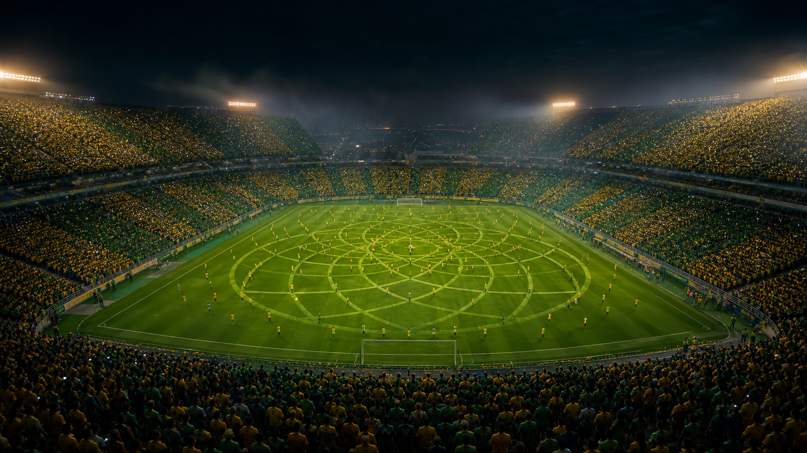
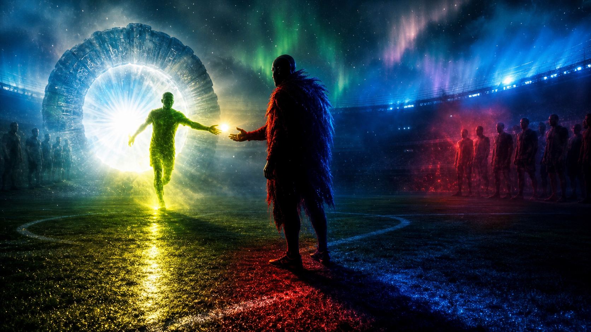
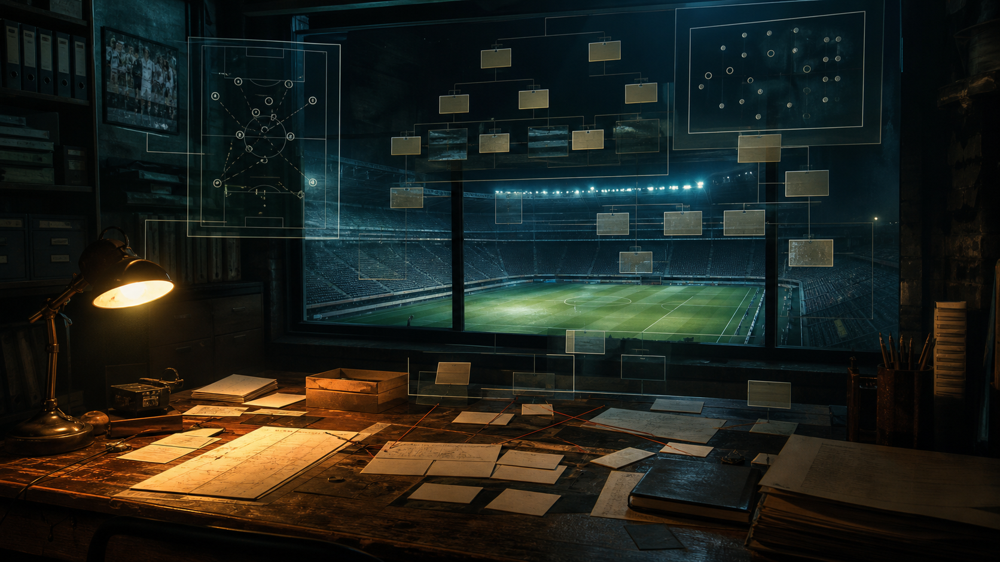
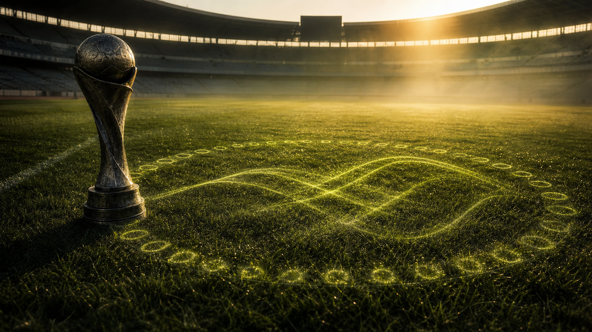
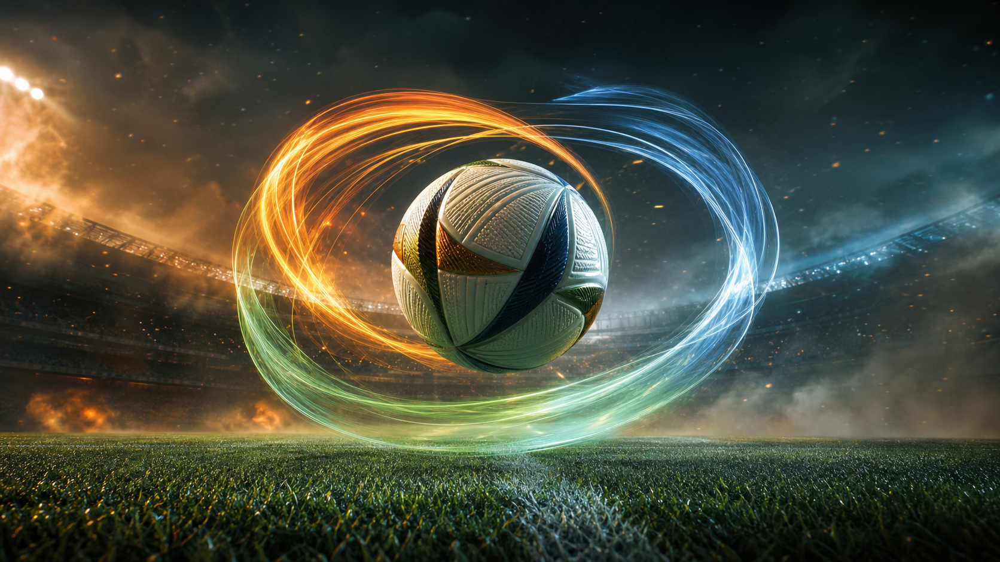
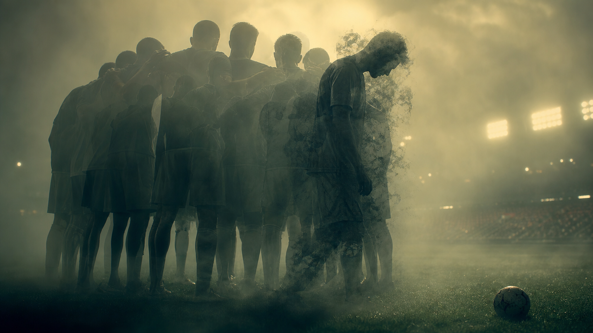
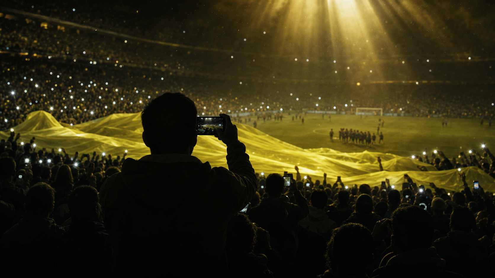
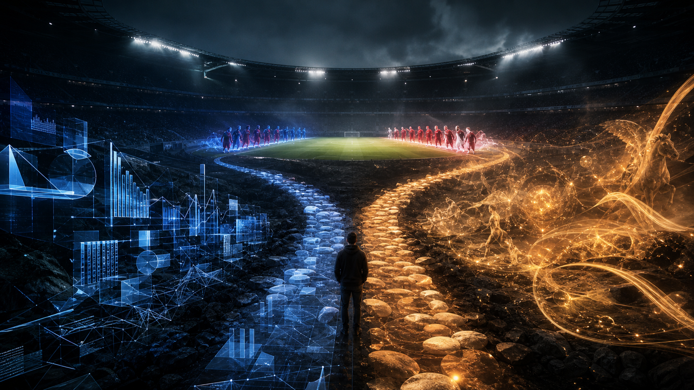

# Norway 2026 - Japan Gate Transfer Và Điệu Chèo Viking

**Nếu World Cup 2022 là nghi lễ hoàn tất myth cá nhân của Messi, World Cup 2026 đang mở ra như một field tập thể. Brazil ban đầu là biểu tượng dễ thấy nhất của field đó: samba, street, joga bonito, football soul. Nhưng sau khi Brazil thắng Japan rồi thua Norway, thesis đổi trục. Brazil trở thành carrier; Norway trở thành signal inheritor. Câu chuyện không còn là “Brazil are back”, mà là một collective lạnh hơn: longship, mái chèo, kỷ luật bắc phương và một đội đứng đúng nơi omen đổi tay.**

*If 2022 was Messi's individual coronation, 2026 reads more like a collective field ritual. Brazil first appeared as the loudest symbol of that field: samba, street, joga bonito, football soul. But after Brazil beat Japan and then lost to Norway, the thesis changed axis. Brazil became the carrier; Norway became the signal inheritor. The story is no longer simply “Brazil are back”, but a colder collective myth: longship rhythm, northern discipline, and a team standing exactly where the omen changes hands.*

---

## Vault Position / Vị Trí Trong Vault

Bài này là một case study của [[Karma Disclosure - Truth Hidden In Plain Sight]] và [[Predictive Programming - Cấy Tương Lai Vào Tiềm Thức]]. Nó không phải bài cá cược, không phải sports analytics, và càng không phải lời khẳng định rằng Norway chắc chắn vô địch World Cup 2026.

Nó gom bốn thứ vào một khung: **World Cup 26 như một field truyền thông mới**, **Brazil như carrier của một thesis ban đầu**, **Japan Knockout Transfer Rule như route-pattern**, và **Norway như signal inheritor sau khi thắng Brazil**. Nếu chỉ đọc Brazil, bài sẽ dễ thành prediction. Nếu chỉ đọc Norway, bài sẽ thiếu nguồn gốc signal. Nếu chỉ đọc pattern, bài sẽ khô. Các lớp phải đi cùng nhau.

Nó là bài tập đọc media theo bốn tầng: fact, pattern, symbol và speculative synthesis. Khi một poster, một slogan, một match ball, một music video, một chấn thương, một archetype cầu thủ và một cụm từ trong lyric cùng bắt đầu xoay quanh một hướng, câu hỏi không phải “có phải script không?” Câu hỏi trưởng thành hơn là: **narrative nào đang được chuẩn bị để nếu nó xảy ra, công chúng cảm thấy nó có ý nghĩa?**

Trong vault, bài này nối [[MOC - Epistemology & Propaganda]], [[Vô Thức Tập Thể]], [[Gematria]], [[TikTok Algorithm - Ai Kiểm Soát Worldview Của Gen Z]] và tầng media-symbol của [[Hollywood - Cây Đũa Phép Của Phù Thủy]].

---

## Evidence Discipline / Cách Đọc Bài Này

Có bốn tầng cần giữ riêng.

Fact/documentable là các dữ kiện public: World Cup 2026 được tổ chức tại Canada, Mexico và United States; giải mở rộng lên 48 đội; slogan chính thức là **WE ARE 26**; bóng thi đấu chính thức mang tên **TRIONDA**, được giải thích như “three waves”; FIFA triển khai poster, concert, album, TikTok livestream và hệ thống host-city culture.

Pattern/systems reading là nhận xét rằng 2026 được frame như một event phân tán, đa quốc gia, đa nền tảng và đa cộng đồng, khác với Qatar 2022 vốn dễ đọc như sân khấu cuối cho một king-figure.

Symbol/myth reading là tầng đọc hai loại collective khác nhau: Brazil như samba/street/body joy, và Norway như Viking longship/oar rhythm/cold discipline. Brazil là dance-field; Norway là oar-field.

Speculative synthesis là giả thuyết rằng nếu 2026 có một “truth hidden in plain sight” về champion, Norway trở thành candidate đáng đọc không chỉ vì thắng Brazil, mà vì họ đứng đúng vị trí trong Japan Gate Transfer và mang một myth tập thể lạnh hơn, ít spectacle hơn.

Nếu bỏ kỷ luật này, bài sẽ thành fanfic. Nếu giữ kỷ luật, nó trở thành một case để luyện mắt.

---

## Live Update — Norway Và Omen-Transfer

**Brazil không phải champion vessel nữa. Brazil là carrier.** Vậy là đủ. Không cần tự đánh bài này quá lâu. Brazil thắng Japan, mang signal đi tiếp, rồi thua Norway. Từ điểm đó, spotlight của pattern chuyển sang Norway.

*Brazil is no longer the champion vessel. Brazil is the carrier. That is enough. Brazil beat Japan, carried the signal forward, then lost to Norway. From that point, the pattern spotlight moves to Norway.*

Cách đọc sạch nhất lúc này:

> Japan = gate  
> Brazil = carrier  
> Norway = signal inheritor

Brazil vẫn đáng được ghi lại vì nó là nơi pattern lộ ra. Nhưng Norway mới là nơi pattern đang đi tới.

### Japan Knockout Transfer Rule — Công Thức Cổng Nhật Bản

Sau khi check lại bracket, rule sạch hơn không phải “đội thắng Nhật sẽ vô địch”. Rule đúng hơn là:

> **The team that beats the team that beat Japan in the knockout stage wins the World Cup.**  
> Đội thắng được đội đã loại Nhật ở vòng knock-out sẽ vô địch World Cup.

| Kỳ | Japan bị loại bởi | Đội thắng carrier | Nhà vô địch |
|---|---|---|---|
| 2002 | Turkey thắng Japan 1-0 | Brazil thắng Turkey ở semi-final | Brazil |
| 2010 | Paraguay thắng Japan trên luân lưu | Spain thắng Paraguay ở quarter-final | Spain |
| 2018 | Belgium thắng Japan 3-2 | France thắng Belgium ở semi-final | France |
| 2022 | Croatia thắng Japan trên luân lưu | Argentina thắng Croatia ở semi-final | Argentina |
| 2026 | Brazil thắng Japan 2-1 | Norway thắng Brazil | **Norway = transfer-rule candidate** |

Bốn dòng đầu là bracket fact. Dòng 2026 là pattern đang mở. Nhưng nó đủ mạnh để đổi trọng tâm bài: Brazil không còn là câu hỏi chính. Norway mới là câu hỏi chính.

Japan không trực tiếp tạo champion. Japan giống một cái cổng. Đội loại Japan cầm signal. Đội thắng được đội đó mới lấy signal.

*Japan is not the champion-maker. Japan is the gate. The team that eliminates Japan carries the signal. The team that kills the carrier inherits it.*

### Norway: Đội Không Ồn Nhưng Đứng Đúng Chỗ

Norway bị miss vì nó không ồn.

Brazil quá dễ nhìn thấy. Áo vàng, Pelé memory, joga bonito, Neymar return, Vini/Endrick/Rodrygo, creator culture, Brazil flag, “football soul returns”. Một người đọc symbol rất dễ bị kéo về Brazil vì Brazil có myth cũ quá mạnh.

Norway không có loại noise đó. Không có empire longing như England. Không có child-sun crown như Spain/Yamal. Không có football-soul nostalgia như Brazil. Norway bước vào bài bằng thứ lạnh hơn: **route**.

Đây là điểm quan trọng. Có những đội được báo trước bằng image. Có những đội được báo trước bằng đường đi. Brazil thắng ở tầng image. Norway thắng ở tầng route.

Nếu dùng lại framework cũ của bài Brazil, Norway hiện lên như sau:

**Fact / route:** Norway thắng Brazil, đội vừa loại Japan. Theo Japan Knockout Transfer Rule, đây là đúng vị trí của signal inheritor.

**Pattern / systems reading:** Norway không cần được push như nhân vật chính từ đầu. Họ chỉ cần đứng đúng nơi signal đổi tay. Trong tournament, route đôi khi quan trọng hơn media volume.

**Symbol / myth reading:** Norway mang archetype rất khác Brazil. Brazil là nóng, vàng, nhịp, thân thể, street, sun. Norway là lạnh, bắc phương, ít lời, kỷ luật, survival, winter-force. Nếu Brazil là dance, Norway là blade. Nếu Brazil là spectacle, Norway là silence.

**Speculative synthesis:** World Cup 26 có thể không crown “football soul returns” theo kiểu Brazil. Nó có thể crown một kiểu myth khắc nghiệt hơn: đội ít ồn, ít màu, nhưng đứng đúng điểm chuyển giao và lấy signal từ carrier.

Nói gọn:

> Brazil có biểu tượng đẹp hơn.  
> Norway có route sạch hơn.  
> Nếu Norway vô địch, route đã thắng spectacle.

Đó là chỗ bài cũ miss. Nó over-weight Brazil vì Brazil có quá nhiều symbol để đọc. Nó under-weight Norway vì Norway không cần symbol lớn; Norway chỉ cần đúng vị trí trong chuỗi transfer.

### Viking Longship — Bóng Đá Như Một Hàng Mái Chèo

Nhưng nói Norway chỉ có route thì vẫn thiếu. Norway không ồn như Brazil, nhưng không có nghĩa là Norway nghèo myth. Nó có myth khác loại.

Brazil là collective theo kiểu carnival: thân thể, đường phố, samba, improvisation, joy. Norway là collective theo kiểu longship: một hàng người, cùng nhịp, cùng hướng, cùng kéo, cùng chịu lạnh, cùng vượt biển.

Một con thuyền Viking không đi tới vì một người được chọn. Nó đi tới vì mọi mái chèo vào cùng nhịp. Không ai cần làm trung tâm. Nếu một người lệch nhịp, cả thuyền mất lực.

Đây là một hình ảnh rất mạnh cho bóng đá tập thể. Không phải collective mềm, không phải collective lễ hội, mà là collective khắc nghiệt: rhythm, discipline, weather, survival, raid, crossing.

> Brazil = dance-field.  
> Norway = oar-field.

Nếu Brazil đại diện cho bóng đá nhớ lại cách nhảy, Norway đại diện cho bóng đá nhớ lại cách chèo như một thân thể chung.

Cái này làm Norway không còn là “đội thắng đúng route” đơn thuần. Norway trở thành một vessel myth rất sạch cho World Cup 26: một tournament nói bằng **WE**, bằng field, bằng wave, bằng nhiều bodies. Brazil có wave của samba. Norway có wave của mái chèo.

Nói gọn hơn:

> Brazil là điệu múa của đường phố.  
> Norway là nhịp mái chèo của một longship.  
> Cả hai đều là bóng đá tập thể.  
> Nhưng Norway là phiên bản lạnh hơn, cổ hơn, ít diễn hơn.

Từ đây trở xuống, các đoạn Brazil-return nên được đọc như snapshot trước khi route cập nhật. Giá trị của bài không còn là “Brazil sẽ vô địch”, mà là: một field myth ban đầu hiện ra qua Brazil, rồi chuyển sang Norway khi route thật mở khóa.

---
## Pattern Reading Không Phải Đoán Mò

Pattern reading trong vault không phải lấy một màu, một số, một lyric rồi tuyên bố kết quả. Đó là lỗi thường gặp nhất: thấy Brazil trong poster xanh-vàng rồi chốt Brazil, thấy Yamal trong ads rồi chốt Spain, thấy Bellingham được media đẩy rồi chốt England. Cách đó quá thô.

Một hint kín thật sự thường không nói thẳng “đội này sẽ thắng”. Nó chuẩn bị **ý nghĩa** cho một khả năng. Khi khả năng đó xảy ra, public đã có sẵn emotional template để cảm thấy nó đúng.

Vì vậy câu hỏi không phải: ai được show nhiều nhất? Câu hỏi là: nếu đội này thắng, chiến thắng đó đã được media chuẩn bị để **nghĩa là gì**?

Argentina 2022 không được hint bằng màu xanh-trắng. Nó được hint bằng closure. Messi được frame như một người bước vào World Cup cuối, gặp lại các phiên bản quá khứ của mình, còn thiếu đúng một trophy. Spain Euro 2024 không được hint bằng màu đỏ-vàng. Nó được hint bằng new Spain, child prodigy, Yamal/Nico, diversity, birthday-crown và một đội trẻ chơi như mở một chu kỳ mới.

Đó là calibration. World Cup 26 phải được đọc theo chuẩn đó, không theo kiểu bắt bóng một symbol lẻ.

---

## Hai Case Calibration: Argentina 2022 Và Spain Euro 2024

Argentina 2022 là case của **hero closure**. Adidas không cần nói Argentina sẽ vô địch. Họ chỉ cần làm *The Impossible Rondo*, đặt Messi đối diện các phiên bản quá khứ của chính mình, rồi để toàn bộ truyền thông lặp lại “last World Cup”, “GOAT”, “one missing trophy”, “final attempt”. Khi Argentina thua Saudi Arabia trận đầu, myth không vỡ; nó mạnh hơn, vì hero phải rơi trước khi được crown.

Spain Euro 2024 là case của **new generation crown**. Yamal không chỉ là cầu thủ trẻ. Cậu ta là child-sun archetype: 16 tuổi, rồi 17 tuổi đúng final window, chơi cùng Nico Williams như hai cánh của một Spain mới. Final gặp England làm myth sạch hơn: new Spain vượt qua old empire longing của “football coming home”.

Hai case này dạy một rule: media hint tốt không nằm ở dự đoán kết quả, mà ở việc dựng sẵn myth-template cho kết quả.

> Argentina 2022 = one king completes his life
> Spain Euro 2024 = one generation is crowned
> World Cup 26 ? = one field remembers itself

Đến đây Brazil mới đáng xét. Không phải vì Brazil xuất hiện một lần. Mà vì Brazil fit loại myth thứ ba: field myth.

---

## Từ Khóa Cần Hiểu

**Field myth** là myth không xoay quanh một nhân vật duy nhất, mà xoay quanh một trường biểu tượng: nhiều người, nhiều địa điểm, nhiều motif và một vibe chung. Brazil là phiên bản field myth dễ thấy nhất ở tầng màu sắc/spectacle; Norway là phiên bản field myth lạnh hơn ở tầng route, kỷ luật và collective rhythm.

**Collective game** là cách đọc một giải đấu nơi crown không được chuẩn bị cho một cá nhân, mà cho một organism: một đội, một phong cách, một nhịp chơi, một ký ức văn hóa. Với Norway, collective game hiện ra rất rõ qua longship archetype: không phải một hero kéo cả đội, mà là cả hàng mái chèo cùng nhịp.

**Joga bonito** không chỉ là “đá đẹp”. Nó là một ngôn ngữ thân thể: nhịp, trick, street instinct, improvisation và niềm vui trước khi bóng đá bị industrialized thành pressing map và betting model.

**Media inevitability** là trạng thái khi truyền thông đã chuẩn bị sẵn ý nghĩa cho một kết quả. Khi kết quả xảy ra, người xem cảm thấy “đúng là phải vậy”, dù trước đó không ai nói thẳng.

**Creator-culture signal** là tín hiệu không đến từ FIFA hay sponsor chính thức, mà từ YouTube, TikTok, streamer, music video, meme và fan culture. Nó yếu hơn official signal, nhưng quan trọng trong một giải đấu được phân phối qua platform.

---

## Calibration Bằng Dữ Liệu: Myth Không Được Bay Khỏi Sân Cỏ

Pattern reading chỉ có giá trị khi nó không mâu thuẫn với dữ liệu thật. Argentina 2022 và Spain Euro 2024 không chỉ là hai câu chuyện đẹp. Chúng là hai case nơi myth và football reality cùng hướng.

Argentina 2022 vào giải với một nền tảng thật: họ đã vô địch Copa América 2021, thắng Finalissima 2022, và bước vào Qatar với chuỗi bất bại 36 trận. Sau đó họ thua Saudi Arabia 1-2 ngay trận mở màn, một cú sốc được nhiều nguồn gọi là một trong những upset lớn nhất lịch sử World Cup. Về data, đó là rủi ro thật. Về myth, đó là death-before-crown. Argentina vẫn đứng đầu bảng C với 6 điểm, rồi đi qua Australia 2-1, Netherlands trên penalties sau trận 2-2, Croatia 3-0, và France trong final 3-3 rồi thắng luân lưu.

Messi không chỉ là poster. Ông tạo output thật: ghi bàn trước Saudi Arabia, Australia, Netherlands, Croatia và final; assist, penalty, leadership và tournament presence đều hội tụ. Media “last World Cup / missing trophy” chỉ trở thành myth mạnh vì performance trên sân không phản bội nó.

Spain Euro 2024 cũng vậy. Spain thắng toàn bộ 7 trận, ghi 15 bàn, lập kỷ lục số bàn trong một kỳ Euro, vượt qua Croatia 3-0, Italy 1-0, Albania 1-0, Georgia 4-1, chủ nhà Germany 2-1 sau hiệp phụ, France 2-1, rồi England 2-1 ở final. Đây không phải may mắn một trận. Đây là route sạch qua nhiều heavyweight.

Yamal/Nico myth cũng được data xác nhận. Lamine Yamal trở thành cầu thủ trẻ nhất ra sân ở Euro, rồi cầu thủ trẻ nhất ghi bàn tại Euro khi sút vào lưới France ở semi-final. Final against England, Yamal assist cho Nico Williams mở tỉ số; Nico được Man of the Match. New Spain không chỉ là headline. Nó được đóng dấu bằng route, bàn thắng, assist và tuổi đời.

Hai case này đặt tiêu chuẩn cho mọi thesis 2026. Brazil thesis ban đầu không thể chỉ dựa vào cờ Brazil, gematria hay lyric. Nó cần sân cỏ xác nhận. Khi Brazil thua Norway, data đã làm việc của nó: Brazil hạ từ final vessel xuống carrier, còn Norway bước lên như route-based thesis.

> Myth chỉ đáng đọc khi sân cỏ không phủ nhận nó.

---

## Watchlist: Dữ Liệu Nào Xác Nhận Hoặc Phá Thesis?

Nếu Norway là field myth mới của 2026, dấu hiệu không thể chỉ nằm ở Japan Gate Transfer. Nó phải hiện ra trong bóng đá thật: **game tập thể**, route sạch, signal transfer và một nhịp chơi giống longship hơn là highlight cá nhân.

Football data cần check: Norway thắng Brazil bằng cấu trúc tập thể thật hay chỉ bằng một cú spike? Họ có nhiều nguồn pressing, progression, duel-winning và finishing hay phụ thuộc một cá nhân? Khi bị ép, đội có giữ cùng nhịp như một longship không: compact, cùng hướng, cùng lực, ít lệch pha?

Media data cần check: truyền thông có bắt đầu frame Norway bằng ngôn ngữ collective không: cold machine, Viking spirit, togetherness, discipline, rowing, northern force, underdog vessel, team-first football? Một headline đơn lẻ không đủ. Cần repetition.

Symbol data cần check: Norway có tiếp tục được đặt cạnh motif biển, phương Bắc, lạnh, thuyền, hàng người, wave, survival hoặc “as one” không. Những motif này không chứng minh gì một mình; chúng chỉ đáng note nếu sân cỏ tiếp tục xác nhận.

Brazil layer vẫn đáng giữ, nhưng như nguồn gốc signal. Nếu Norway bắt đầu lệch khỏi collective-game thesis, pattern cũng phải hạ. Pattern reading trưởng thành là biết update, không phải bảo vệ prediction.

---

## Pre-Tournament Snapshot — 4/6/2026

Snapshot này được thêm trước khi World Cup 26 đá trận nào, để bài không bay khỏi sân cỏ. Chi tiết nguồn được lưu nội bộ trong `_docs` để audit lại khi cần; phần dưới chỉ giữ những dữ kiện ảnh hưởng trực tiếp đến thesis.

**Fact/documentable:** FIFA đăng bài *Neymar's return highlights Brazil squad* ngày 19/5/2026, sau đợt công bố đội hình tại Museum of Tomorrow, Rio de Janeiro. Danh sách 26 người của Carlo Ancelotti có Neymar, Vinícius Junior, Raphinha, Endrick, Gabriel Martinelli, Gabriel Magalhães, Marquinhos, Casemiro, Bruno Guimarães, Alisson và Ederson. FIFA cũng ghi Brazil mở bảng C gặp Morocco ngày 13/6 tại New York New Jersey, gặp Haiti ngày 19/6 tại Philadelphia, rồi gặp Scotland ngày 24/6 tại Miami. Điểm cần sửa trong cách đọc cũ: đây không còn là thesis “Brazil without Neymar”. Đúng hơn là **Brazil với một Neymar wounded/returning, nhưng không nhất thiết còn là center của field**.

*Fact layer: FIFA's squad article puts Neymar inside the story, not outside it. The myth question is therefore not “Brazil without Neymar”, but whether a returning, injury-shadowed Neymar becomes the savior again or is absorbed into a more collective Seleção field.*

**Fact + watchlist:** João Pedro không có trong danh sách FIFA nêu. Một số headline ngày 18-19/5 mô tả anh bị omitted/snubbed; headline khác nói anh có thể giữ mình sẵn nếu chấn thương Neymar mở cửa thay thế muộn. Kỷ luật claim: gọi João Pedro là **omitted / late-replacement watch**, không gọi là “confirmed standby” nếu chưa có danh sách chính thức của CBF/FIFA.

**Pattern/data:** odds trước giải không cho thấy Brazil là sure bet. Các market roundup cuối tháng 5 và đầu tháng 6 thường đặt Spain, England và France ở trước hoặc ngang Brazil; ví dụ Sportsbook Review sau group draw ghi Spain +410, England +550, France +700, Brazil +700. Điều này làm bài sạch hơn: Brazil là **myth-fit contender**, không phải data consensus favorite.

**Symbol/official brand:** các tín hiệu official vẫn đi theo field logic. FIFA brand launch nhấn mạnh 48 đội, ba nước chủ nhà và 16 Host City Brands. TRIONDA được FIFA/adidas giải thích là “three waves”, nối với Canada, Mexico, USA. Mascot layer cũng là bộ ba: Maple, Zayu, Clutch. Slogan **WE ARE 26** tiếp tục nói bằng đại từ số nhiều. Đây là cluster phân tán: host-city, poster, mascot, ball, TikTok, creator, album, concert. Nó support “collective field”, nhưng không tự chứng minh Brazil.

**Speculative synthesis:** Ancelotti quote trước announcement về “collective spirit” và “resilience” từng làm Brazil layer rất đẹp. Nhưng sau Norway, câu quote đó trở thành calibration hơn là conclusion: collective spirit không thuộc độc quyền Brazil. Norway đang biểu hiện một collective khác, ít màu hơn nhưng có route và rhythm rõ hơn.

> Update thesis: Brazil layer chỉ còn là pre-transfer organism. Norway layer mới là nơi cần nhìn tiếp: một organism lạnh hơn, longship hơn, ít celebrity hơn.

---
## World Cup 26 Là Gì Nếu Không Phải Một Hero Stage?

Argentina 2022 được media chuẩn bị như một closure arc. Adidas làm *The Impossible Rondo*, để Messi đá với nhiều phiên bản quá khứ của chính mình. Public copy nói về final World Cup, G.O.A.T, one missing trophy, final stage. Truyền thông không cần viết “Argentina sẽ vô địch”. Họ chỉ cần chuẩn bị template: nếu Messi thắng, đây sẽ là ending hoàn hảo nhất.

Đó là hero myth. Một người đi qua timeline của chính mình, ngã ở cổng đầu tiên trước Saudi Arabia, rồi từng bước leo lên final để nhận crown.

World Cup 2026 có cấu trúc rất khác. Nó không có một sa mạc và một nhà vua cuối đời. Nó có ba nước chủ nhà, mười sáu thành phố, 48 đội, 104 trận, official posters phân tán, concert đồng bộ, album, TikTok livestream và creator layer. Ngay cả slogan **WE ARE 26** cũng nói bằng đại từ số nhiều. Không phải “he is”. Không phải “the last dance”. Mà là **we are**.

Điều này không loại trừ một cá nhân tỏa sáng. Nhưng nó làm một câu hỏi khác nổi lên: nếu 2026 là field myth, đội vô địch lý tưởng có thể là đội được nhớ như một vibe hơn là một người.

Brazil từng fit điều này ở tầng spectacle. Nhưng sau Japan Gate Transfer, Norway mới là đội đang test phần khó hơn của field myth: không phải vibe để nhớ, mà là một tập thể cùng nhịp để đi hết route.

---

## WE ARE 26 Và Sự Tan Của Một Trung Tâm Duy Nhất

**WE ARE 26** là một slogan kỳ lạ nếu đọc sâu. Nó không gọi tên cup, crown, champion hay host. Nó gọi một identity field. “We” có thể là ba nước chủ nhà, toàn continent, 48 đội, global audience, hoặc chính người xem được kéo vào event.

Slogan này hợp với một World Cup không muốn chỉ là tournament. Nó muốn là một broadcast ritual. Người xem không chỉ xem bóng đá; họ participate qua TikTok, concert, merch, poster, livestream, short-form clip và fan identity.

Ở tầng systems, đây là cách thể thao hiện đại mở rộng từ match sang media ecology. Ở tầng symbol, đây là lời mời đi vào một field tập thể. Nếu 2022 là “Messi bước vào cổng cuối”, thì 2026 là “đám đông bước vào một trường chung”.

Trong trường này, một champion quá cá nhân hóa có thể lệch nhịp. England với Bellingham, Argentina với Messi, France với Mbappé, Spain với Yamal đều rất dễ bị đọc qua một gương mặt. Brazil cũng có Vinícius, Endrick, Rodrygo, Neymar, nhưng myth Brazil cổ hơn cá nhân. Brazil không chỉ là đội có star. Brazil là tên gọi của một ký ức: bóng đá từng là dance trước khi là industry.

---

## 26, 8 Và Back-To-Back Loop

**26** vẫn có texture của một vòng lặp: 2 + 6 = 8, 8 xoay ngang là vô cực. Nhưng sau Norway, phần này không nên kéo bài về Brazil quá lâu nữa. Nó chỉ còn là background: World Cup 26 được dựng như một field phân tán, nhiều host, nhiều city, nhiều wave, nhiều crowd.

Nếu Brazil là candidate ban đầu, đó là vì Brazil rất hợp với ngôn ngữ “return”: football soul, joga bonito, South America back-to-back sau Argentina 2022. Nhưng route thật đã đổi hướng. Brazil không hoàn tất vòng lặp. Brazil chỉ trở thành điểm trung chuyển.

---

## 2002 → 2026: Brazil Từ Người Nhận Signal Thành Carrier

Năm 2002, Brazil vô địch sau khi thắng Turkey, đội đã loại Japan. Trong Japan Knockout Transfer Rule, Brazil từng là đội **nhận signal**.

Năm 2026, Brazil lại xuất hiện trong cùng pattern, nhưng vai đã đổi. Brazil thắng Japan, rồi thua Norway. Từ người nhận signal năm 2002, Brazil trở thành carrier để Norway nhận signal năm 2026.

Đó là resonance đáng giữ. Không cần bấm số quá nhiều. Điểm hay nằm ở vai trò đảo chiều:

> 2002: Brazil lấy signal từ Turkey.  
> 2026: Norway lấy signal từ Brazil.

Nếu Norway vô địch, vòng lặp đẹp không phải “Brazil are back”. Vòng lặp đẹp là: Brazil từng nhận omen qua Japan-transfer, rồi 24 năm sau trở thành chính node chuyển omen cho một đội khác.

## TRIONDA: Ba Làn Sóng Và Một Tournament Không Có Một Mũi Nhọn

Bóng thi đấu chính thức của 2026 là **TRIONDA**, được giải thích như “three waves”. Bề mặt là ba nước chủ nhà: Canada, Mexico, United States. Nhưng wordplay tự nó đã quan trọng: tri, three, onda, wave.

Một wave không có một điểm duy nhất. Nó lan. Nó truyền. Nó cộng hưởng. Nó đi qua nhiều bodies. Đây không phải image của một king ngồi trên ngai. Đây là image của field.

Nếu đọc nhẹ bằng gematria English ordinal, TRIONDA = 81, rút về 9; “Three Waves” = 126, cũng rút về 9. Không dùng số này như bằng chứng. Nhưng trong symbolic texture, 9 thường được đọc như completion, phase ending, cycle closing. Điều đáng chú ý hơn là official language tự nói bằng sóng, không bằng crown.

Brazil là đội lớn fit ngôn ngữ wave vì Brazil myth nằm ở rhythm. Samba, pass, body feint, street dribble, crowd chant, yellow shirt như sun-field. Một wave cần nhiều người để thấy. Một dribble có thể do một cá nhân làm, nhưng joga bonito là khí quyển.

---

## Gematria Nhẹ: Đủ Dùng, Không Lái Bài

Gematria trong bài này chỉ nên là lớp phụ. Sau khi Brazil thua Norway, phần số học càng phải lùi xuống. Một bảng số dài về Brazil/Vinícius/Joga Bonito dễ làm bài quay lại bias cũ: thấy quá nhiều symbol đẹp rồi tưởng đó là vessel cuối.

Giữ lại vài texture là đủ: **WE ARE 26** nói bằng “we”, không phải “he”; **TRIONDA / three waves** nói bằng sóng, không phải ngai; World Cup 26 được dựng như một field tập thể. Những thứ đó vẫn đúng. Nhưng chúng không chỉ về Brazil nữa. Chúng mở cửa cho một collective khác: Norway.

Nói cách khác: số không cứu Brazil thesis. Route mới là thứ mở Norway thesis.

---

## Brazil Layer: Không Cần Neymar Để Là Carrier

Trong nhiều năm, Brazil bị thu nhỏ vào Neymar. Neymar là tài năng lớn, nhưng cũng là celebrity burden: injury, drama, thương hiệu cá nhân, expectation và cảm giác unfinished destiny. Khi một quốc gia bóng đá lớn bị khóa vào một idol, nó có thể mất field.

Chấn thương của Neymar trước World Cup 2026, nếu chỉ đọc fact, là rủi ro đội hình. Nếu đọc myth, nó mở một cửa khác: Brazil có thể buộc phải đi qua post-Neymar purification. Old idol wounded. Team forced to remember itself.

Điều này không có nghĩa Neymar xấu hoặc Brazil mạnh hơn khi thiếu anh. Nó nghĩa là narrative có một đường sạch hơn: thay vì “Neymar finally gets his crown”, Brazil có thể trở thành “Seleção returns without needing a celebrity savior”.

Đó là khác biệt giữa hero myth và field myth. Hero myth cần một người hoàn tất. Field myth cần một organism nhớ lại nhịp của mình.

---

## Brazil Layer: Vinícius, Endrick, Rodrygo Và Cái Bẫy Của Một Gương Mặt Mới

Brazil vẫn có những gương mặt mạnh. Vinícius có số 7, Real Madrid aura, anti-racism/justice layer và khả năng trở thành post-Neymar face. Endrick có child-heir motif. Rodrygo có killer-in-shadow vibe. João Pedro, nếu đi vào story qua cửa Neymar injury, có thể trở thành late key hoặc foundation piece.

Nhưng bài này không chọn Brazil vì một người. Ngược lại, Brazil chỉ thật sự fit 2026 nếu các gương mặt này không bị ép thành một Messi mới.

Với Brazil, kịch bản field myth từng đẹp nhất là nhiều người ghi bàn, nhiều người cứu trận, một đội hình tìm lại flow. Nhưng route đã chuyển sang Norway. Bây giờ câu hỏi tương tự phải đặt cho Norway: họ có thắng như một longship không, hay chỉ đứng đúng route một khoảnh khắc?

Đây là lý do Spain/Yamal hơi rủi ro. Spain rất mạnh về football, nhưng Yamal đang bị celebrity machine kéo quá nhanh: girlfriend drama, party discourse, scrutiny, teen-star contamination. Khi child-king archetype bị bẩn, Spain vẫn là data pick mạnh, nhưng myth pick yếu đi. Brazil, ngược lại, có thể đi từ celebrity contamination sang purification.

---

## IShowSpeed, Brazil Flag Và Creator-Culture Omen

Một clue không nên đặt ngang official FIFA, nhưng đáng đọc trong 2026 là creator-culture layer. IShowSpeed ra *World Cup (Champions)*, một music video có hàng chục triệu view rất nhanh. Speed không phải FIFA. Nhưng Speed là football internet priest của Gen Z: CR7 cult, meme, energy, speed, chaos, global short-form football.

Trong clip, một fan khoác cờ Brazil xuất hiện đúng quanh lyric: “the championship”, “I’m bringing it back to the crib”, “we rise to the end”, “we got to dream till we win”, “give me the cup”. Nếu chỉ có cờ Brazil thì yếu. Nếu chỉ có lyric thì chung chung. Nhưng cờ Brazil như cape, crowd như ritual field, bụi và ánh sáng như arena, cộng với ngôn ngữ “bring it back” và “give me the cup” tạo một cultural signal đáng note.

Không nên gọi đây là proof. Nó là omen ở tầng culture. Trong một World Cup mà FIFA chính thức đẩy concert, album, TikTok livestream và global creator energy, omen ở tầng creator không còn hoàn toàn ngoài lề.

“Back to the crib” đặc biệt hợp với Brazil nếu đọc Brazil không phải như địa điểm host, mà như mythic home của football soul. Championship không về Brazil theo nghĩa bản đồ. Nó về “nhà” theo nghĩa ký ức: nơi bóng đá vẫn còn là thân thể, nhạc, đường phố và giấc mơ.

---

## Spain, England, Brazil, Norway: Data Pick Không Phải Myth Pick

Nhiều AI và betting-style model sẽ thích Spain hoặc England. Điều này hợp lý. Spain có Euro 2024, system tốt, youth core, Yamal/Nico/Pedri/Gavi/Rodri. England có squad value, Bellingham, Saka, Palmer, Rice, Kane và media machine Anglo-American.

Nhưng data pick và myth pick không giống nhau.

England luôn đẹp trên giấy vì squad value và Premier League attention. Nhưng England thường là longing machine: “football coming home” lặp lại như một spell chưa hoàn tất. Nó có thể vô địch, nhưng myth của nó quá ồn, quá obvious, quá nhiều national ego.

Spain là candidate nguy hiểm hơn vì nó có cả data lẫn myth. Euro 2024 đã crown Yamal như child-sun và new Spain. Nhưng nếu Yamal bị celebrity contamination, child purity mất lực. Khi archetype child-king biến thành child-star curse, Spain vẫn mạnh nhưng không còn sạch như 2024.

Brazil đứng ở vùng khác: data có thể không đẹp nhất, nhưng symbolic field đang tụ lại. Điều này không đủ để bet, nhưng đủ để viết thành bài vault.

---

## Khi Một Nhà Vô Địch Không Cần Một Gương Mặt Trung Tâm

Có một khả năng ít được nói: World Cup 2026 có thể tạo ra một nhà vô địch đá đẹp, thắng xứng đáng, nhưng không để lại một Messi-level icon. Không phải vì giải kém, mà vì myth của giải không yêu cầu một icon.

Một giải mở rộng, phân tán, platformized, concert hóa và creator hóa có thể crown một collective. Ban đầu người ta dễ tưởng collective đó là Brazil: màu áo, nhịp bóng, dance, football soul. Nhưng Norway mở ra một collective khác: ít màu hơn, ít diễn hơn, giống một đoàn thuyền hơn là một carnival.

Đây là nơi [[Vô Thức Tập Thể]] bước vào. Culture đôi khi không cần hero mới; nó cần một archetype cũ hồi sinh. Brazil là archetype của bóng đá như dance. Norway là archetype của bóng đá như đoàn chèo: collective body, cold rhythm, shared direction.

Nếu 2026 là collective game, Norway giờ phải được đọc nghiêm túc hơn Brazil: không phải vì họ ồn hơn, mà vì họ đang đứng đúng route và mang một myth tập thể rất gọn.

---

## Hint Không Nhất Thiết Là Script

> Media không chỉ đưa tin. Media chuẩn bị ý nghĩa.
> Spectacle không chỉ giải trí. Spectacle rehearsal reality.
> Symbol không chỉ trang trí. Symbol là interface của vô thức tập thể.

> Mình không leak tương lai. Mình đọc cái đã được đặt công khai.
> Mình không nói “tao biết tương lai”. Mình nói: “Tao thấy những dấu vết công khai đang rhyme với nhau. Tao ghi lại trước khi event xảy ra.”

Điểm cần giữ sạch: không nhất thiết có một “bề trên” ngồi script từng chi tiết. Ở cấp độ sâu hơn, [[Ma Trận]] vận hành như một **Matrix attractor**: một trường hút biểu tượng khiến các node trong hệ tự sản xuất hint vì cùng bị kéo bởi grammar của thời đại. Những người làm media, brand, sports, film, finance, technology và entertainment có thể tưởng mình đang ra quyết định riêng lẻ, nhưng vẫn đi theo cùng một vô thức tập thể. Vì vậy hint xuất hiện không chỉ do command từ trên xuống; nhiều khi chính Matrix attractor đã khiến mọi người tự đi theo đúng hướng.

---

## Synthesis: World Cup 26, Norway Và Kỷ Luật Đọc Pattern

Không có gì trong bài này chứng minh Brazil sẽ vô địch. Đây là điểm phải nhắc lại, vì pattern reading rất dễ trượt thành certainty porn. Nhưng nếu gom World Cup 26, Brazil và các case calibration vào một khung, có một cluster đáng đọc:

World Cup 2026 là Americas field. Slogan nói **WE ARE 26**. Ball nói **TRIONDA**, three waves. Format mở rộng lên 48 đội. Poster, city art, concert, TikTok và album biến tournament thành media field. Tất cả đều nói một ngôn ngữ: không phải một người, mà là một trường tập thể.

Ban đầu Brazil fit ngôn ngữ đó rất đẹp: samba, street, body, joga bonito, football soul returns. Nhưng Norway thắng Brazil làm bài đổi hướng. Norway fit cùng chữ **collective**, nhưng bằng một archetype khác: Viking longship, mái chèo, cold rhythm, disciplined bodies moving as one.

> 2022: một vị vua hoàn tất đời mình.  
> 2024 Euro: một đứa trẻ được crown làm tương lai.  
> 2026: có thể không cần một vị vua. Có thể cần một hàng người chèo cùng nhịp.

Nếu Brazil là giấc mơ bóng đá trở về với điệu múa, Norway là giấc mơ bóng đá trở về với đoàn thuyền. Một bên là carnival collective. Một bên là survival collective.

Sau Norway, bài học sâu hơn là: đừng chỉ hỏi đội nào có symbol đẹp nhất. Hãy hỏi signal đang đi qua route nào, và đội nào có archetype đủ sạch để nhận nó. Brazil có symbol mạnh. Norway có route sạch và collective myth lạnh hơn, ít diễn hơn.

Nếu 2026 crown Norway, bài học không phải “Brazil hint sai hết”. Bài học là spectacle đã mở cổng, nhưng longship mới đi qua biển.

---

## Publication Pack / Disclosure & Spectacle

Bài này thuộc **Disclosure & Spectacle Pack**: đọc current events như media ritual, predictive programming và symbolic rehearsal, nhưng không nhầm symbol thành proof.

Reading path:

1. [[Predictive Programming - Cấy Tương Lai Vào Tiềm Thức]] — method đọc repetition/framing.
2. [[Hollywood - Cây Đũa Phép Của Phù Thủy]] — screen như wand của collective imagination.
3. [[Bộ Tam Thánh Mind Control - NASA Disney Hollywood]] — ba màn hình của myth công nghiệp.
4. [[A LIE N - SpaceX IPO Disclosure Day và Nghi Lễ Tên Lửa]] — disclosure, rocket ritual và techno-myth.
5. [[Brazil 2026 - Khi Bóng Đá Trở Về Với Linh Hồn Tập Thể]] — Brazil-to-Norway transfer, Japan Gate rule và collective football myth.
6. [[Spectacle Ritual - World Cup, Super Bowl Và Nghi Lễ Đồng Bộ Đại Chúng]] — spectacle như synchronization infrastructure.

Rule của pack: fact → pattern → symbol → speculative synthesis. Không nhảy thẳng từ coincidence sang certainty.

## Related

- [[Karma Disclosure - Truth Hidden In Plain Sight]]
- [[Predictive Programming - Cấy Tương Lai Vào Tiềm Thức]]
- [[Vô Thức Tập Thể]]
- [[Hollywood - Cây Đũa Phép Của Phù Thủy]]
- [[TikTok Algorithm - Ai Kiểm Soát Worldview Của Gen Z]]
- [[Gematria]]
- [[MOC - Epistemology & Propaganda]]
