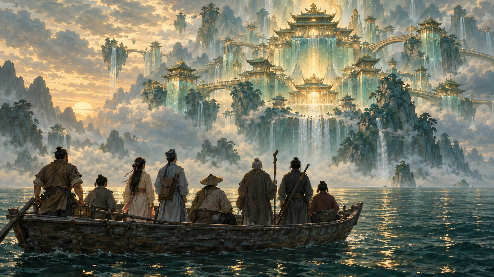
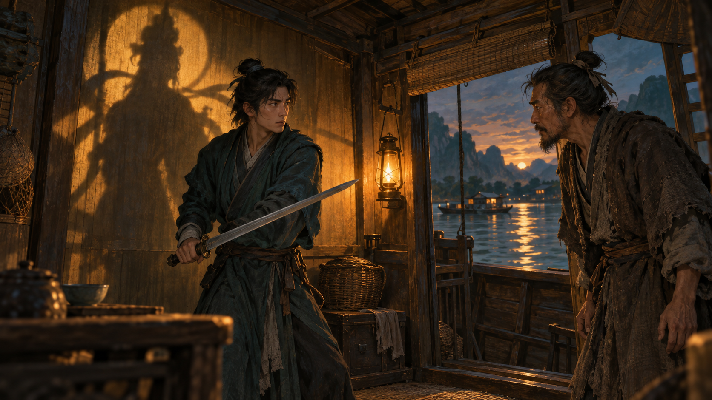
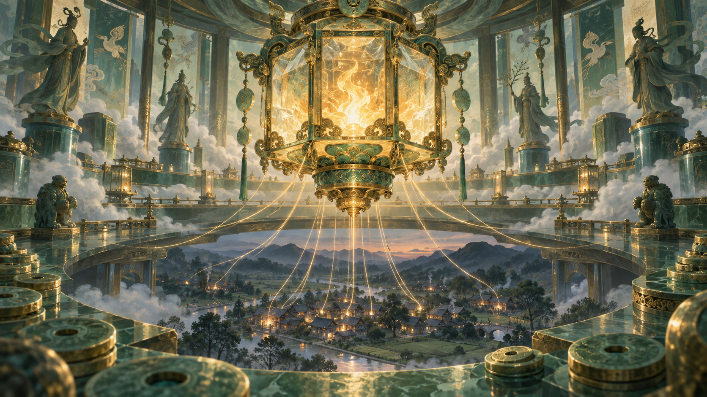
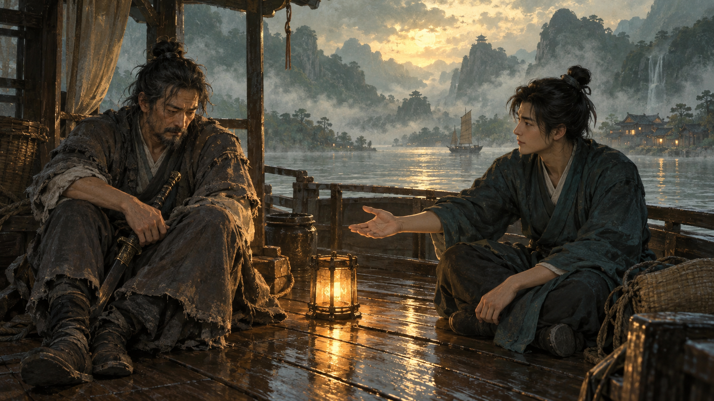

# Bát Tiên! — Man Thiên Quá Hải Và Quyền Định Nghĩa Thần Tiên

**Một câu nói thật có thể khiến bạn hiểu sai cả một con người. Một người có pháp lực có thể quên cách đối xử với người yếu hơn mình. Và một kẻ đã quen sống bằng lừa lọc vẫn có thể đứng ra làm điều đáng tin. Bát Tiên! đặt ba nghịch lý ấy vào cùng một phi vụ, rồi để khán giả tự mắc vào những cái nhãn mà nhân vật đang dùng để nhìn nhau.**

*A truthful statement can lead you to misunderstand an entire person. Someone with divine power can forget how to treat those weaker than themselves. And a person accustomed to deception can still choose to do something worthy of trust. All Wishes Come True! brings these three tensions into a single heist, drawing viewers into the labels its characters use to understand one another.*

Điểm hấp dẫn của phim nằm ở hai cuộc tranh chấp diễn ra cùng lúc. Cuộc thứ nhất là giành lại Lưu Ly Đăng, bảo vật có liên quan đến sự an nguy của chúng sinh. Cuộc thứ hai là giành lại quyền định nghĩa: ai là kẻ phản bội, ai là người cứu giúp, điều gì được gọi là sự thật, và hành động nào khiến một phàm nhân xứng đáng với chữ “tiên”. Đọc qua mạch Ma Trận của vault, đây là câu chuyện về một khung nhận thức được dựng lên, rồi phải trả giá khi khung ấy thay thế con người thật.

*The film’s appeal lies in two struggles unfolding together. One concerns the recovery of the Glazed Lantern, a treasure tied to the safety of living beings. The other concerns the power to define: who is a betrayer, who is a rescuer, what counts as truth, and which actions make a mortal worthy of being called an immortal. Through the vault’s Matrix lens, it becomes a story about a frame of perception and the cost of allowing that frame to replace an actual person.*

Bài viết có tiết lộ các nút thắt chính. Các cảnh được kể lại đủ để người chưa đọc phân tích khác vẫn theo được; lời thoại Việt được diễn ý. Phần nguồn ở cuối phân biệt phỏng vấn trực tiếp, tường thuật cảnh phim và giả thuyết. Những kết nối với Ma Trận, Gnosis hay Loosh là cách đọc biểu tượng của bài viết, không được dùng làm bằng chứng về một âm mưu ngoài đời.

*This essay discusses major revelations. Scenes are explained so that no prior analysis is required; Vietnamese dialogue is paraphrased. The source note distinguishes direct interviews, accounts of scenes, and hypotheses. Connections to the Matrix, Gnosis, and Loosh are interpretive lenses, not evidence of a conspiracy outside the film.*

---

## 1. Trước Khi Là Thần Tiên, Họ Là Ai? / Who Are They Before Becoming Immortals?

Bát Tiên! Truy Tìm Lưu Ly Đăng, tên quốc tế All Wishes Come True!, là phim hoạt hình do Mưu Chính Dương viết kịch bản và đạo diễn. Bản phát hành tại Việt Nam có thời lượng 144 phút. Câu chuyện bắt đầu khi tám con người tìm đường đổi đời bằng một vụ trộm bảo vật ở Bồng Lai, rồi bị cuốn vào một mối nguy lớn hơn món lợi họ theo đuổi. [Thông tin phát hành tại Galaxy Cinema](https://www.galaxycine.vn/phim/all-wishes-come-true/)

*All Wishes Come True!, released in Vietnam as Bát Tiên! Truy Tìm Lưu Ly Đăng, is an animated film written and directed by Mou Zhengyang. Its Vietnamese release runs 144 minutes. Eight people seek a better life through a treasure heist in Penglai, only to become entangled in a danger far greater than the reward they originally sought.*

Nhóm mang những tên quen thuộc của Bát Tiên: Chung Ly Quyền, Lữ Động Tân, Hà Tiên Cô, Hàn Tương Tử, Thiết Quải Lý, Trương Quả Lão, Tào Quốc Cữu và Lam Thái Hòa. Tuy nhiên, ở điểm xuất phát của câu chuyện, họ vẫn là những phàm nhân có giới hạn. Riêng trục Chung Ly Quyền–Lữ Động Tân giữ phần lớn bí mật và sức nặng tình cảm. Chung Ly Quyền có tài xoay xở, chế tác và làm giả; Lữ Động Tân chủ động tìm đến anh để lần ra chiếc đèn thất lạc.

*The group carries the familiar names of the Eight Immortals: Zhongli Quan, Lü Dongbin, He Xiangu, Han Xiangzi, Tieguai Li, Zhang Guolao, Cao Guojiu, and Lan Caihe. At the story’s starting point, however, they remain limited mortals. Zhongli Quan and Lü Dongbin carry much of its mystery and emotional weight. Zhongli is resourceful and skilled at making and disguising objects; Lü approaches him to locate the missing lantern.*

Phía đối diện là một trật tự đã có sẵn quyền lực. Tam Tinh gồm Phúc, Lộc và Thọ nắm những bảo vật mà nhóm muốn tiếp cận. Dương Tiễn là vị thần đầy uy thế, có Thiên Nhãn và khả năng áp đảo họ. Tôn Ngộ Không xuất hiện như một người hùng đi trước, khiến cả nhân vật lẫn người xem có lý do để hy vọng vào sự trợ giúp. Những vị trí ấy tạo ra chênh lệch nền tảng: tám phàm nhân phải tính toán từng bước trong một thế giới nơi đối thủ có thể dùng sức mạnh để bỏ qua nhiều bước.

*Opposing them is an order whose power is already established. The Three Star Gods—Fu, Lu, and Shou—hold the treasures the group wants to reach. Yang Jian possesses formidable authority, a Heavenly Eye, and overwhelming force. Sun Wukong appears as a hero of an earlier generation, giving both characters and viewers reason to hope for help. This creates the central imbalance: eight mortals must calculate every move in a world where their opponents can bypass many obstacles through power.*

Bởi vậy, việc giả làm thần tiên vừa là một mẹo sinh tồn, vừa đặt ra câu hỏi của toàn bộ phim. Nếu người phàm có thể diễn đúng những dấu hiệu mà thiên hạ dùng để nhận ra thần tiên, thì chúng ta đang kính trọng phẩm chất, hay đang phản ứng trước cách một người được trình diện?

*Pretending to be immortals is therefore both a survival tactic and the film’s underlying question. If mortals can reproduce the signs by which everyone recognises divinity, are people honouring a quality, or responding to the way someone has been presented?*

---

## 2. Chiếc Đèn Đã Biến Mất Bằng Cách Nào? / How Does the Lantern Disappear?

Lưu Ly Đăng là mắt xích nối phi vụ trộm với hiểm họa lớn hơn. Người bảo hộ đã bán đèn cho Tam Tinh. Để che giấu, họ nhờ Chung Ly Quyền thay đổi hình dạng bên ngoài, khiến nó mang dáng bình Tịnh Thủy, rồi đặt giữa những bảo vật khác trong Tàng Bảo Các. “Giấu lá trong rừng” ở đây có nghĩa rất cụ thể: vật cần tìm vẫn ở trong tầm mắt, nhưng dấu hiệu để nhận ra nó đã bị đổi.

*The Glazed Lantern connects the heist to the larger danger. Its guardian sells it to the Three Star Gods. To conceal it, they have Zhongli Quan alter its appearance into that of a purifying-water vase and place it among other treasures in the vault. Hiding a leaf in a forest becomes a precise operation: the object remains visible, while the signs by which it could be recognised have changed.*

Chi tiết ấy giải thích vì sao Lữ Động Tân cần Chung Ly Quyền. Người từng làm lớp vỏ có khả năng nhận ra thứ nằm dưới lớp vỏ. Một tay thợ bị xem như chỉ giỏi làm giả bỗng trở thành người giữ phần tri thức mà pháp lực cũng không tự thay thế được. Đây là một cách phim cho năng lực phàm nhân có trọng lượng: hiểu vật liệu, hiểu mánh khóe và nhớ một việc mình từng làm có thể trở thành lợi thế trước thần tiên.

*This explains why Lü needs Zhongli: the person who made the disguise can recognise what lies beneath it. A craftsman associated with forgery suddenly holds knowledge that divine power cannot simply replace. The film gives mortal competence weight through this arrangement. Knowledge of materials, familiarity with deception, and memory of one’s own work can become advantages against the gods.*

Nhóm mở đạo quán, giả làm thần tiên để mưu sinh và che giấu phi vụ. Họ vừa phải diễn trước thiên hạ, vừa tìm cách tiếp cận bảo vật. Đạo quán đưa lớp hài đời thường và lớp trộm cắp vào chung một không gian. [Yicai](https://m.yicai.com/news/103287544.html)

*The group runs a Taoist temple, impersonating immortals to earn a living and conceal its heist. Performing for others while seeking the treasure brings everyday comedy and theft into the same setting.*

Đèn đổi hình còn chuẩn bị cho một cấu trúc lặp lại suốt phim. Một bảo vật mang vỏ của bảo vật khác. Một con người bị nhìn như một người khác. Một hành động được đặt vào câu chuyện có sẵn nên mang ý nghĩa khác. Cùng một phép đánh tráo diễn ra ở đồ vật, danh tính và động cơ. Người xem được tập cho quen với hình thức của sự vật, rồi phải học lại cách nhìn khi hình thức ấy không còn đủ tin cậy.

*The disguised lantern also prepares a structure that recurs throughout the film. One treasure wears another’s appearance. One person is perceived as somebody else. An action acquires a different meaning because it is placed inside an existing story. The same substitution operates across objects, identities, and motives. Viewers learn to rely on appearances, then must reconsider that reliance when appearances cease to be dependable.*

---

## 3. Lữ Động Tân: Một Danh Tính Được Người Khác Hoàn Thành / Lü Dongbin: An Identity Completed by Someone Else

Trong cảnh nhà bè được tường thuật, Lữ Động Tân dẫn Chung Ly Quyền đến ý nghĩ rằng cậu chính là Thần tiên Bảo hộ Lưu Ly Đăng. Cậu không cần phát biểu trọn vẹn câu nhận mình giữ chức ấy. Chung Ly Quyền tự ghép các dấu hiệu rồi nói ra kết luận. Khi bị gọi đúng cái danh phận đang mượn, Lữ Động Tân chau mày, rút kiếm và đẩy không khí sang căng thẳng.

*In the reported houseboat scene, Lü guides Zhongli toward the belief that he is the guardian of the Glazed Lantern. He does not need to make a complete statement claiming that office. Zhongli assembles the signs and voices the conclusion himself. When addressed by the identity he is borrowing, Lü frowns, draws his sword, and makes the situation tense.*

Một hành động như thế có thể mang nhiều nghĩa. Cậu có thể đang che giấu điều gì khác; cũng có thể muốn duy trì hiểu lầm. Nhưng với Chung Ly Quyền, người vừa tin mình đã khám phá ra thân phận đối phương, phản ứng ấy dễ trở thành lời xác nhận: bị lộ nên mới muốn đe dọa. Cách đọc đã có trước, hành động đến sau chỉ việc rơi vào đúng ô.

*Such an action can carry several meanings. Lü may be concealing something else, or deliberately maintaining the misunderstanding. To Zhongli, who believes he has just uncovered the other man’s identity, the reaction readily becomes confirmation: exposure explains the threat. The interpretation is already in place; the subsequent action merely falls into its assigned slot.*

Điều đáng chú ý là khán giả có thể đi cùng đường với Chung Ly Quyền. Máy quay cho thấy một người kết luận, một người phản ứng và một tình thế căng lên. Người xem tự lấp phần còn thiếu giữa chúng. Phim có thể khiến ta nhớ rằng danh tính đã được xác nhận, dù thứ thực sự được trình bày là một suy luận chưa được kiểm tra độc lập.

*Viewers can travel the same route as Zhongli. The scene presents one person reaching a conclusion, another reacting, and tension rising between them. The audience supplies the missing connection. We may remember the identity as confirmed, although what has actually been presented is an inference without independent verification.*

Vì vậy, nhận xét “Lữ Động Tân chưa từng tự nói mình là Thần tiên Bảo hộ” không xóa trách nhiệm lừa dối của cậu. Chủ động sắp đặt để người khác hiểu sai vẫn là lừa dối. Giá trị của thủ pháp nằm ở cách kịch bản để người bị lừa tham gia hoàn thành cái bẫy. Chính Chung Ly Quyền góp phần làm danh tính giả trở nên đáng tin với mình.

*The observation that Lü never explicitly claims to be the guardian does not remove his responsibility for deception. Deliberately arranging a misunderstanding remains deceptive. The technique matters because the person being deceived helps complete the trap. Zhongli himself contributes to making the false identity convincing.*

---

## 4. Thiên Nhãn Nói Đúng, Vì Sao Chung Ly Quyền Vẫn Hiểu Sai? / How Can a True Revelation Produce a False Conclusion?

Mâu thuẫn bùng lên khi Dương Tiễn dùng Thiên Nhãn tiết lộ mối liên hệ giữa người giữ đèn và kẻ từng phản bội Chung Ly Quyền: Lương Ký. Nhưng Chung Ly Quyền đang mặc định người giữ đèn chính là Lữ Động Tân. Một thông tin mới vì thế bị gắn vào một nhận dạng sai đã có từ trước.

*The conflict intensifies when Yang Jian’s Heavenly Eye reveals a connection between the lantern’s guardian and Zhongli’s former betrayer, Liang Ji. Zhongli, however, already assumes that Lü is the guardian. New information is therefore attached to an earlier misidentification.*

Đây là điểm cần tách cho rõ: “người bảo hộ là kẻ phản bội” và “Lữ Động Tân là người bảo hộ” là hai mệnh đề khác nhau. Sự đúng đắn của mệnh đề thứ nhất không thể tự bảo đảm mệnh đề thứ hai. Nhưng trong cơn giận, chúng có thể nhập lại thành một câu chuyện liền mạch: người vừa đồng hành với mình chính là kẻ từng hại mình.

*Two propositions must be separated: “the guardian is the betrayer” and “Lü is the guardian.” The truth of the first cannot establish the second. In anger, however, they can merge into a seamless story: the person who has been beside me is the same person who once harmed me.*

Chung Ly Quyền hỏi, diễn ý: những gì Dương Tiễn nói có thật không? Lữ Động Tân đáp rằng đúng. Anh lại hỏi có phải bấy lâu nay cậu vẫn lừa mình; Lữ bắt đầu bằng câu “ban đầu tôi không muốn…” rồi chưa nói trọn ý. Câu trả lời đầu có thể đúng nếu chỉ xác nhận chuyện của người giữ đèn. Câu sau còn dang dở nên chưa cho biết đầy đủ ý định của cậu. Cả hai vẫn chưa phải lời thú nhận rằng Lữ Động Tân chính là người phản bội năm xưa.

*Zhongli asks, in paraphrase, whether Yang Jian’s account is true. Lü says that it is. Zhongli then asks whether Lü has been deceiving him all along; Lü begins with “at first I did not want to…” without completing the thought. The first answer can be true if it confirms only the guardian’s history. The unfinished second answer does not fully establish Lü’s intention. Neither is an admission that Lü himself was the original betrayer.*

Thiên Nhãn làm đoạn này sắc vì nó đại diện cho thẩm quyền nhìn thấu. Người nghe dễ nghĩ rằng một nguồn đáng tin đã khóa toàn bộ câu chuyện, trong khi nguồn ấy chỉ cung cấp một phần. Kịch bản cho thấy một đường đi khác của sai lầm: dữ kiện có thể đúng, người tiếp nhận có thể suy luận rất tự tin, nhưng kết luận vẫn sai vì một giả định nằm giữa chưa từng được kiểm tra.

*The Heavenly Eye sharpens the scene because it represents authoritative insight. A listener can assume that a reliable source has settled the entire story when it has supplied only part of it. The screenplay exposes another route to error: accurate information and confident reasoning can still produce a false conclusion when an intervening assumption has never been tested.*

---

## 5. Dương Tiễn Và Mẹ: Một Động Cơ Được Ghép Thành Như Thế Nào? / How Is Yang Jian’s Motive Assembled?

Với Dương Tiễn, phim đặt trước nhóm Bát Tiên một chuỗi dấu vết thay vì cho khán giả nghe ngay lời tự thú của đối thủ. Tam Tinh, những vị thần có liên hệ với ông, giữ chiếc đèn đã đổi hình. Khi vào Tàng Bảo Các, nhóm phát hiện những đồng tiền mang dấu đổi thọ và tên Vân Hoa. Vân Hoa là mẹ Dương Tiễn. Từ đây, một vụ trộm bảo vật bắt đầu nối với một câu chuyện gia đình.

*With Yang Jian, the film places a chain of clues before the Eight Immortals rather than immediately supplying a confession from their opponent. The Three Star Gods, who are connected to him, hold the disguised lantern. Inside the vault, the group finds coins bearing lifespan-exchange marks and the name Yunhua—Yang Jian’s mother. A treasure theft begins to connect with a family story.*

Theo lời kể mà các nhân vật dùng để lý giải, Vân Hoa từng bị trừng phạt vì yêu người phàm, bị giam dưới núi Đào Sơn và chỉ còn một phần nguyên hồn. Lữ Động Tân nhắc chuyện Dương Tiễn từng bổ núi cứu mẹ. Trong khi đó, Lưu Ly Đăng có thể thu hút nguyên khí. Đặt các mảnh cạnh nhau, nhóm đi đến khả năng: Dương Tiễn đang gom nguồn lực để đưa mẹ trở lại.

*In the account the characters use to interpret these clues, Yunhua was punished for loving a mortal, confined beneath Mount Tao, and reduced to a surviving fragment of spirit. Lü recalls Yang Jian splitting the mountain to rescue her. Meanwhile, the lantern can draw in vital energy. Together, these elements suggest that Yang Jian is accumulating the means to bring his mother back.*

Chung Ly Quyền chưa lập tức xem suy luận ấy là đủ. Anh đặt câu hỏi về tính khả thi. Hàn Tương Tử sau đó nhớ một trận pháp chiêu hồn từng đọc trong sách; cách sắp xếp chỗ ngồi tại yến tiệc lại tương ứng với hình trận. Khả năng thành công được nhắc đến như vô cùng mong manh, chỉ một phần vạn trong bản kể cảnh phim. Tuy nhiên, trước một nguy cơ đang diễn ra, nhóm vẫn phải chọn cách ứng phó. Họ đang hành động bằng giả thuyết tốt nhất có trong tay, chưa phải bằng hiểu biết toàn bộ nội tâm đối phương.

*Zhongli does not immediately accept this as sufficient. He questions whether such a plan could work. Han Xiangzi then recalls a spirit-summoning formation from a book; the banquet’s seating arrangement corresponds to it. The reported scene describes an extraordinarily small chance of success, one in ten thousand. Nevertheless, an unfolding danger demands a response. The group is acting on its best available hypothesis, not complete access to its opponent’s mind.*

Chiếc hộp mã hóa của Dương Tiễn dùng mật khẩu “Mama”. Chi tiết ấy làm câu chuyện có sức nặng cảm xúc: một người có thể đứng rất cao trong trật tự quyền lực mà vẫn giữ một điểm yếu trẻ nhỏ ở bên trong. Nhưng riêng mật khẩu chỉ cho thấy sự gắn bó với mẹ; để đi từ tình cảm đến kết luận về kế hoạch, vẫn cần những dấu vết khác. Sự xúc động khiến suy luận dễ được tiếp nhận hơn, chứ không thay thế công việc kiểm tra suy luận.

*Yang Jian’s coded box uses the password “Mama.” This gives the hypothesis emotional weight: someone can stand at the top of a hierarchy while retaining a childlike point of vulnerability. The password alone points to attachment to his mother; connecting that attachment to a specific plan still requires other evidence. Emotional force makes an inference easier to accept without replacing the work of testing it.*

Tuy nhiên, phỏng vấn Yicai ngày 22/7 ghi nhận đạo diễn giải thích động cơ hồi sinh mẹ và cái giá người khác phải chịu. Vì vậy, “nhân vật chưa tự nói” không bác bỏ động cơ ấy. Phim vẫn có thể để dành mục đích khác, nhưng cứu mẹ hiện có căn cứ ngoài suy luận của khán giả. [Phỏng vấn trên Yicai](https://m.yicai.com/news/103287544.html)

*However, Yicai’s July 22 interview records the director discussing resurrection and its cost to others. The character’s silence therefore does not disprove that motive. Further purposes may remain unrevealed, but the rescue explanation has support beyond audience inference.*

Theo Movie Wikia, trận pháp lấy sức mạnh của chư tiên và thu hồn, tuổi thọ của dân Bồng Lai qua chiếc đèn. Đổi thọ lấy đi thời gian sống. Nhóm phải ngăn việc tước đoạt sinh mạng, thay vì tiếp tục chia nhau kho báu. [Tóm tắt diễn biến](https://moviewikia.com/movies/all-wishes-come-true-2026/)

*Movie Wikia describes the formation draining divine power and taking inhabitants’ souls and lifespan through the lantern. The exchange takes living time. The group must prevent loss of life rather than divide treasure.*

---

## 6. Ngộ Không: Sự Trợ Giúp Và Cái Bẫy Chờ Người Hùng / Wukong: Help and the Temptation to Wait for a Hero

Giữa yến tiệc đông thần tiên, Ngộ Không chú ý đến Chung Ly Quyền và Lữ Động Tân, cho họ một nhúm lông và hứa giúp khi cần. Với người xem vốn biết danh tiếng Tề Thiên Đại Thánh, chi tiết này gần như đặt một phương án dự phòng vào đầu: nếu mọi chuyện quá sức, nhân vật mạnh hơn sẽ xuất hiện. Chính ký ức của khán giả về Ngộ Không trở thành một phần công cụ kể chuyện.

*At a banquet crowded with immortals, Wukong singles out Zhongli and Lü, gives them hairs from his body, and offers help when needed. For viewers familiar with the Great Sage, this installs something like a contingency plan: if the situation becomes impossible, a stronger hero will appear. The audience’s existing memory of Wukong becomes part of the storytelling apparatus.*

Đây là ngữ cảnh của câu “Ngộ Không chưa từng nói mình muốn đánh Dương Tiễn”. Hứa giúp Bát Tiên có thể bao gồm nhiều việc: trao phương tiện, bảo vệ, gợi cách thoát hoặc trực tiếp giao chiến. Khi người xem chọn ngay khả năng cuối cùng, họ đã bổ sung một cam kết mà lời hứa chưa nhất thiết chứa. Uy danh của Đại Thánh khiến phần bổ sung ấy nghe rất tự nhiên.

*This is the context for the observation that Wukong never says he wants to fight Yang Jian. Promising help can mean providing tools, protection, an escape route, or direct combat. Viewers who immediately choose the last possibility add a commitment the promise does not necessarily contain. The Great Sage’s reputation makes that addition feel natural.*

Việc ông chọn đúng hai người đáng để suy nghĩ. Có thể ông thấy phẩm chất nào đó ở họ; có thể ông biết nhiều hơn điều đã nói. Nhưng từ một hành động chọn người giúp đỡ đến kết luận ông biết toàn bộ kế hoạch của Dương Tiễn là một khoảng cách lớn. Một chi tiết có thể tạo câu hỏi mà chưa cung cấp câu trả lời. Nếu tự lấp khoảng ấy bằng một âm mưu hoàn chỉnh, người xem đang làm đúng công việc mà phim đã khiến Chung Ly Quyền làm với Lữ Động Tân.

*His choice of these two men invites reflection. Perhaps he recognises a quality in them; perhaps he knows more than he reveals. Yet choosing whom to help is far from proof of knowing Yang Jian’s entire plan. A detail can create a question without supplying an answer. Filling that gap with a complete conspiracy repeats the very operation the film makes Zhongli perform when interpreting Lü.*

Trong phỏng vấn 娱理, đạo diễn mô tả Ngộ Không như người hùng thế hệ trước trao phương tiện cho người đến sau; ông cũng giải thích Ngộ Không đã say nên không tới. Phần giải quyết cuối cùng thuộc về Bát Tiên. Cách dùng nhân vật này giữ lại giá trị của sự trợ giúp mà vẫn buộc người nhận trợ giúp tự chịu trách nhiệm. [Phỏng vấn trực tiếp với 娱理](https://www.weibo.com/ttarticle/p/show?id=2309405322066135482808)

*In his interview with Yuli, the director describes Wukong as an earlier generation’s hero providing resources for those who follow; he also explains that Wukong was drunk and did not arrive. Resolving the crisis remains the Eight Immortals’ task. This use of the character preserves the value of assistance while requiring its recipients to take responsibility.*

Một người dẫn đường có thể cho bạn dụng cụ, kinh nghiệm hoặc lòng can đảm. Việc chờ họ sống thay phần đời khó nhất của mình lại là chuyện khác. Đó là ý nghĩa đáng giữ của Ngộ Không trong cách đọc này: sự xuất hiện của một biểu tượng mạnh có thể nâng đỡ con người, nhưng cũng dễ khiến họ trì hoãn hành động vì tưởng đã có ai đó gánh phần quyết định.

*A guide can offer tools, experience, or courage. Expecting that guide to live the hardest part of your life is another matter. This is the value of Wukong in the present reading: a powerful symbol can support people, but it can also encourage delay if they believe someone else has already assumed the decisive responsibility.*

Ở cao trào, lông khỉ hóa thành thế thân giao chiến với Dương Tiễn, còn nhóm thật phá kế hoạch và lấy lại đèn. Thất bại trước mắt che một hành động ở nơi khác, theo mô tả phần kết của Movie Wikia. [Tóm tắt phần kết](https://moviewikia.com/movies/all-wishes-come-true-2026/)

*In Movie Wikia’s account of the climax, hair-made doubles fight Yang Jian while the real group disrupts his plan and recovers the lantern. Apparent defeat conceals action elsewhere.*

Phép thuật hỗ trợ mưu kế, còn mưu kế quyết định dùng phép thuật vào đâu. Vì vậy, chiến thắng có ý nghĩa khi mục tiêu là cứu người và tháo ngòi hiểm họa. Nếu chỉ đo xem ai đánh mạnh hơn ai, ta sẽ bỏ lỡ loại năng lực mà phim dành cho những nhân vật yếu hơn.

*Magic supports the strategy, while strategy determines what magic is used for. Victory matters because its aim is to save people and dismantle the danger. Measuring only who hits harder misses the kind of agency the film gives its weaker characters.*

---

## 7. Man Thiên Quá Hải: Người Xem Cũng Ở Trong Phi Vụ / The Audience Is Inside the Heist

Trong một cuộc giao lưu được China Film News tường thuật, đạo diễn nói rõ cấu trúc ba lớp của phim: giả làm thần tiên, đấu trí với thần tiên và cú đảo chiều cuối. Điều này đặt “man thiên quá hải” thành nguyên tắc tổ chức câu chuyện. Nhân vật thao túng cách đối thủ hiểu tình thế, còn bộ phim tổ chức cách khán giả hiểu nhân vật. [China Film News](https://chinafilmnews.cn/Html/2026-07-29/21515.html)

*At an audience event reported by China Film News, the director describes three layers: impersonating immortals, outwitting immortals, and the final reversal. Deception thus becomes an organising principle. Characters shape their opponents’ understanding of the situation while the film shapes the audience’s understanding of those characters.*

Khán giả ngồi ngoài màn ảnh nhưng vẫn chỉ được biết những gì phim cho biết, vào thời điểm phim lựa chọn. Ở tuyến Lữ Động Tân, ta thường theo sự nhận diện của Chung Ly Quyền. Ở tuyến Dương Tiễn, ta nhận quá khứ và động cơ thông qua lời kể, dấu vết và suy luận của Bát Tiên. Một cảnh hồi tưởng xuất hiện trên màn ảnh có thể rất thuyết phục; vẫn cần hỏi nó đang trình bày sự kiện được xác nhận hay trực quan hóa điều một nhân vật đang kể.

*Viewers sit outside the screen but receive only the information the film chooses to provide, when it chooses to provide it. In Lü’s story, we often follow Zhongli’s identification of him. In Yang Jian’s story, the past and its motives arrive through accounts, clues, and the group’s reasoning. A flashback can be highly persuasive; we must still ask whether it presents an established event or visualises what a character is recounting.*

Đó là cầu nối với Inception trong vault: điều được dẫn dắt có thể mang cảm giác như điều tự phát hiện. Một lời giải đặt ngay trước mặt dễ khiến ta đề phòng. Một lời giải do chính ta ghép từ vài mảnh gợi ý lại dễ được bảo vệ bằng lòng tự trọng. Kết luận không chỉ nói về thế giới; nó còn trở thành bằng chứng rằng mình tinh ý, mình hiểu chuyện, mình đã nhìn thấy thứ người khác bỏ lỡ.

*This connects with the vault’s reading of Inception: guided understanding can feel like independent discovery. An explanation handed to us may trigger caution. One we assemble from selected clues can become tied to pride. The conclusion is no longer merely about the world; it also becomes evidence that we are perceptive, informed, and capable of noticing what others miss.*

Nhịp cảnh, phản ứng, khoảng im lặng và nhạc nền đều có thể làm một cách hiểu trở nên có vẻ hiển nhiên. Chúng không phải lời khai để kiểm đúng sai từng câu, nhưng chúng định hướng sự chú ý và cảm giác của người xem. Bởi vậy, xem lại một cú twist hay là dịp phân biệt ba thứ: điều mình thực sự được cho thấy, điều một nhân vật tin, và điều mình tự thêm vào. Khoảng cách giữa ba thứ ấy chính là nơi trò lừa hoạt động.

*Pacing, reactions, silences, and music can make one interpretation feel self-evident. They are not statements whose truth can be checked sentence by sentence, yet they direct attention and feeling. Revisiting an effective twist therefore means separating what we were shown, what a character believed, and what we supplied ourselves. The distance between those three is where the deception operates.*

---

## 8. Lưu Ly Đăng Và Cái Giá Của Sự Cao Quý / The Lantern and the Cost of Grandeur

Những đồng tiền mang dấu đổi thọ khiến kho báu trở nên đáng ngại theo một cách rất cụ thể. Tiền ở đây liên hệ với thời gian sống. Chiếc đèn liên hệ với nguyên khí. Khi cả hai được gom về cùng một trung tâm quyền lực, sự thịnh vượng của nơi ấy bắt đầu đặt ra câu hỏi: nó chứa những vật vô tri, hay đang chứa phần đời bị chuyển khỏi người khác?

*Coins marked by lifespan exchange make the treasure vault troubling in a precise way. Money is connected to living time, while the lantern is connected to vital energy. As both accumulate around a centre of power, its wealth raises a question: does it hold inert objects, or portions of life transferred away from others?*

Đọc ở tầng biểu tượng, hình ảnh này gặp mạch Loosh trong vault: một mô hình tưởng tượng về việc sự sống hoặc năng lượng của số đông bị thu gom làm nguồn lực cho phía có khả năng chiếm giữ. Sự tương ứng chỉ nằm ở cấu trúc thu hoạch. Phim không chứng minh thuyết Loosh, và việc hai câu chuyện cùng dùng mô-típ ấy cũng không xác nhận rằng nhà làm phim đang công bố một bí mật siêu hình.

*At the symbolic level, this meets the vault’s Loosh theme: an imagined model in which the life or energy of many is collected as a resource for those able to capture it. The correspondence lies in the structure of extraction. The film does not prove Loosh, nor does a shared motif establish that its makers are revealing a metaphysical secret.*

Câu hỏi đạo đức vẫn đứng vững mà không cần bước sang khẳng định siêu hình. Tình yêu dành cho một người có cho phép mình biến người khác thành phương tiện không? Dương Tiễn có thể thật lòng thương mẹ, và chính tình cảm thật ấy làm xung đột khó hơn một phản diện chỉ muốn phá hoại. Một động cơ dễ đồng cảm vẫn phải được xét cùng cách thực hiện và những người bị buộc trả giá cho nó.

*The ethical question remains valid without a metaphysical claim. Does love for one person permit turning others into means? Yang Jian can sincerely love his mother, and that sincerity makes the conflict more difficult than a villain’s simple wish to destroy. A sympathetic motive must still be considered alongside the method chosen and the people forced to pay for it.*

Đây cũng là giới hạn của sự kính phục quyền lực. Một người chịu đau khổ không tự có quyền phân phối đau khổ cho người khác. Một mục tiêu thiêng liêng đối với cá nhân không tự trở thành nghĩa vụ hy sinh của cộng đồng. Nếu Bồng Lai rực rỡ nhờ một phần sống bị lấy khỏi những người không được quyết định, vẻ đẹp của nó phải được nhìn cùng hóa đơn mà ai đó đang trả.

*This also marks a limit to reverence for power. A person’s suffering does not automatically entitle them to distribute suffering to others. A goal sacred to one individual does not become everyone else’s duty of sacrifice. If Penglai’s splendour depends on life taken from people without a choice, its beauty must be considered alongside the bill somebody is paying.*

---

## 9. Chung Ly Quyền: Sau Phản Bội, Còn Có Thể Tin Không? / Zhongli Quan: Can Trust Survive Betrayal?

Quá khứ giúp giải thích vì sao hiểu lầm về Lữ Động Tân gây tổn thương đến vậy. Theo tường thuật của The Paper, Chung Ly Quyền từng làm mưa cứu dân, bị đuổi khỏi sư môn và chịu lời nguyền gắn với nghề trộm. Lữ Động Tân là đứa trẻ từng được anh cứu, về sau trở thành hiệp đạo Vô Tâm Xương; Hà Tiên Cô lại tiếp nhận ảnh hưởng từ người hiệp đạo ấy. Các mối liên hệ chỉ sáng rõ dần về sau. [Phỏng vấn và tường thuật trên The Paper](https://www.thepaper.cn/newsDetail_forward_33621105)

*The past explains why the misunderstanding about Lü hurts so deeply. The Paper reports that Zhongli once brought rain to save people, was expelled from his school, and received a curse tied to thievery. Lü was a child he had saved and later became the outlaw hero Wuxinchang; He Xiangu in turn inherited that hero’s influence. These connections become clear only gradually.*

Vô Tâm Xương là danh hiệu hiệp đạo. Biết Lữ Động Tân mang tên ấy, ta phải đọc lại người bị nghi phản bội như người kế tục ảnh hưởng của Chung Ly Quyền.

*Wuxinchang is a heroic outlaw’s alias. Lü’s identity reframes the suspected betrayer as someone carrying forward Zhongli’s influence.*

Với một người như Chung Ly Quyền, mánh khóe có thể trở thành cách tự bảo vệ. Nếu tin rằng mọi quan hệ đều có tính toán, ta sẽ chuẩn bị trước cho sự phụ bạc. Nếu diễn vai người chẳng còn lý tưởng, ta đỡ phải thừa nhận rằng lý tưởng cũ vẫn có thể làm mình đau. Nhưng cái giá của sự phòng vệ ấy là người đến với mình bằng ý tốt cũng phải đứng ngoài cánh cửa đã khóa.

*For someone like Zhongli, cunning can become a form of self-protection. Believing that every relationship is calculated prepares us for betrayal. Performing the role of someone without ideals saves us from admitting that an old ideal can still hurt. Yet this defence has a cost: someone approaching in good faith must also remain outside the locked door.*

Lữ Động Tân làm xáo trộn cách tự bảo vệ đó vì cậu mang theo hệ quả của một việc tốt mà Chung Ly Quyền đã không còn tin đủ vào. Trong khi người cứu có thể nhớ điều mình phải chịu, người được cứu vẫn đang sống tiếp và hành động từ ảnh hưởng ấy. Sự tốt lành có một đời sống vượt khỏi ký ức thất bại của người từng làm điều tốt.

*Lü disturbs that defence because he carries the consequences of a good act in which Zhongli no longer has sufficient faith. While the rescuer may remember what he suffered, the rescued person continues living and acting under its influence. A good action has a life beyond its maker’s memory of disappointment.*

Đây là chỗ có thể dùng Gnosis như một lăng kính tâm lý: cái biết làm thay đổi cách sống. Chung Ly Quyền không chỉ cần sửa thông tin về thân phận Lữ Động Tân. Anh còn phải nhìn lại câu chuyện về chính mình: một người đã bị đời dạy rằng lòng tốt vô ích, hay một người có việc tốt vẫn tiếp tục sinh ra tác động mà mình chưa thấy? Việc nhìn lại ấy mở khả năng hành động, thay vì chỉ thêm một bí mật để kể.

*Here Gnosis can function as a psychological lens: knowing that changes how one lives. Zhongli must do more than correct information about Lü’s identity. He must reconsider his own story: is he someone taught by life that kindness is useless, or someone whose earlier kindness continues producing effects he has not seen? That reconsideration opens the possibility of action rather than merely adding another secret to recount.*

Lòng tin trưởng thành trong cách đọc này vẫn giữ khả năng phân biệt và đặt giới hạn. Nó không buộc một người bỏ qua tổn thương hoặc quay lại một quan hệ có hại. Nó chỉ từ chối để một lần bị phản bội có quyền định nghĩa mọi người sẽ đến sau. Cái khó của Chung Ly Quyền là lấy lại khả năng lựa chọn ấy, sau khi sự cay đắng đã trở thành một phần căn tính của mình.

*Mature trust in this reading retains discernment and boundaries. It does not require dismissing harm or returning to a damaging relationship. It refuses to let one betrayal define everyone who comes afterwards. Zhongli’s difficulty is recovering that capacity to choose after bitterness has become part of his identity.*

---

## 10. Ai Có Quyền Cấp Danh Phận Thần Tiên? / Who Has the Authority to Confer Divinity?

Phần giả danh ban đầu khiến chữ “tiên” trở thành một vai có thể diễn. Cuộc khủng hoảng về sau buộc vai ấy gặp một phép thử: người mang danh tiên làm gì khi người khác gặp nạn? Một bộ áo, một chức vị hay sự công nhận của đám đông có thể tạo uy tín. Việc đứng lại cứu một sinh mạng đặt uy tín đó trước hành động cụ thể.

*The early impersonation makes “immortal” a role that can be performed. The later crisis subjects that role to a test: what does the person bearing the title do when others are in danger? Clothing, office, and public recognition can produce prestige. Remaining to save a life places that prestige alongside a concrete action.*

Mạch “Dân tâm là thiên tâm” trong vault giúp đọc sự chuyển dịch này như một câu hỏi về tính chính đáng. Người có quyền lực phải trả lời được việc quyền lực ấy phục vụ ai và gây hệ quả gì. Áp vào thế giới của phim, pháp lực chứng minh khả năng; lòng kính trọng còn đòi một điều khác. Một vị thần có thể rất mạnh mà vẫn cần bị chất vấn về lựa chọn của mình.

*The vault’s discussion of the people’s heart and the Mandate of Heaven helps read this shift as a question of legitimacy. Power must answer whom it serves and what consequences it produces. Within the film’s world, supernatural ability establishes capacity; deserving respect requires something further. A god can be immensely powerful and still be answerable for his choices.*

Tám người phàm trở nên đáng tin ở chỗ họ có thể sợ, có thể đau và có thể mất thứ đang có, nhưng vẫn nhận phần trách nhiệm. Sự giới hạn khiến hành động của họ có trọng lượng. Nếu mọi rủi ro đều được miễn trừ bằng pháp thuật, lòng can đảm sẽ dễ trở thành một màn biểu diễn không phải trả giá.

*The eight mortals become credible because they can be afraid, suffer, and lose what they possess, yet still accept responsibility. Their limits give their actions weight. If magic exempted them from every risk, courage could become a performance that costs nothing.*

Vì thế, sự “thành tiên” đáng bàn trước hết nằm ở phẩm chất được bộc lộ. Danh tiếng của nhóm có ý nghĩa khi nó theo sau hành động. Bộ phim cho phép ta hỏi lại thói quen trao lòng tin theo chiều ngược: thấy danh phận trước, rồi tự suy ra người mang danh phận hẳn phải có phẩm chất tương ứng.

*The meaningful sense in which they become immortals begins with the qualities they reveal. Their reputation matters when it follows their conduct. The film lets us question the opposite habit: encountering a title first, then assuming its bearer must possess the corresponding qualities.*

Cảnh hậu danh đề còn đưa vào một người thay thế Dương Tiễn. Đạo diễn xác nhận danh tính và cách hành xử của người ấy được để ngỏ. [Phỏng vấn 娱理](https://www.weibo.com/ttarticle/p/show?id=2309405322066135482808)

*The post-credits scene introduces Yang Jian’s replacement. The director leaves that figure’s identity and future conduct unresolved.*

Ở tầng biểu tượng, cái kết ấy trả câu hỏi về danh phận lại cho cả bộ máy. Nếu một vị trí có thể tiếp tục tồn tại sau khi người giữ nó bị thay, ta phải nhìn thêm vào quy tắc của vị trí ấy: ai được quyền chọn người kế nhiệm, ai kiểm tra họ và điều gì bảo đảm người dưới không tiếp tục trả giá? Đánh bại một đối thủ giải quyết được một hiểm họa; nó chưa tự trả lời mọi câu hỏi về trật tự đã trao quyền cho đối thủ đó.

*Symbolically, that ending returns the question of status to the institution itself. If an office survives the replacement of its holder, its rules also require examination: who appoints the successor, who holds them accountable, and what prevents those below from continuing to bear the cost? Defeating an opponent resolves a danger without automatically answering every question about the order that empowered them.*

---

## 11. Hình Ảnh, Tiếng Cười Và Nhịp Kể / Images, Comedy, and Narrative Rhythm

Một cách đọc biểu tượng chỉ có ích khi còn bám vào cách bộ phim được làm. Ở phần hình ảnh, đạo diễn mô tả mỹ thuật lưu ly chuyển sắc, lấy cảm hứng từ sơn thủy xanh lục và chất liệu của hiện vật Bồng Lai trong Cố Cung. Cách xây dựng ấy tạo cho tiên cảnh một vẻ đẹp có nguồn tham chiếu, thay vì chỉ dùng độ lớn và ánh sáng để báo rằng đây là nơi phi thường. [Đạo diễn nói về mỹ thuật](https://www.thepaper.cn/detail/33641675)

*A symbolic reading remains useful only while connected to filmmaking. Visually, the director describes shifting glazed colours inspired by blue-green landscape painting and the material qualities of a Penglai object in the Palace Museum. This gives the realm a grounded visual vocabulary rather than relying solely on scale and brightness to announce that it is extraordinary.*

Vẻ đẹp ấy phù hợp với trục danh phận của câu chuyện. Bồng Lai cần đủ hấp dẫn để người ta muốn bước vào, đủ uy nghi để con người có thể nhỏ lại trước nó. Khi xung đột lộ ra, sự tráng lệ vẫn còn nhưng cách hiểu đã đổi. Một không gian đẹp có thể vừa gây ngưỡng vọng vừa khiến người xem hỏi điều gì đang được vẻ đẹp ấy che khuất. Đây là diễn giải của bài viết về quan hệ giữa thiết kế và chủ đề.

*That beauty suits the story’s concern with status. Penglai must be desirable enough to enter and imposing enough to make people feel small. When the conflict emerges, its splendour remains while its meaning changes. A beautiful space can inspire admiration and also prompt questions about what its beauty obscures. This connection between design and theme is the essay’s interpretation.*

Chất hài có nền tảng thuận lợi ở một nhóm người nhiều khuyết điểm phải giữ vai thần tiên. Họ cần phối hợp để người ngoài tin, trong khi ở bên trong vẫn có lợi ích riêng, sự tự ái và những hiểu lầm. Tiếng cười xuất hiện ở khoảng lệch giữa hình ảnh nhóm đang bán cho thiên hạ và khả năng thật của nhóm. Đến lúc hiểm nguy buộc họ đoàn kết, chính những va chạm trước đó tạo phần việc mà tình đồng đội phải vượt qua.

*Comedy has a productive foundation in flawed people trying to maintain the role of immortals. They must cooperate to convince outsiders while retaining private interests, pride, and misunderstandings. Humour arises from the gap between the image they present and their actual capacities. When danger requires solidarity, those earlier frictions become obstacles that teamwork must overcome.*

The Movie Couple khen hình ảnh, hành động nhưng thấy đoạn giữa hụt đà. Cinespot đánh giá cao sản xuất, đồng thời chê thoại và chuyển cảnh dồn dập, phần kết kéo dài. Từ hai nhận xét ấy, có thể thấy vấn đề phân bổ: từng cảnh nhanh vẫn có thể nằm trong một câu chuyện tiến chậm. [The Movie Couple](https://themoviecouple.com/all-wishes-come-true-review/), [Cinespot](https://www.cinespot.com/hkmreviews/八仙)

*The Movie Couple praises visuals and action but finds the middle slow. Cinespot admires production while criticising rapid dialogue, transitions, and a prolonged ending. Together, these suggest an allocation problem: fast individual scenes can coexist with slow overall progress.*

Đây là giới hạn quan trọng của lối kể nhiều cú đảo chiều. Người xem cần thời gian để một phát hiện đi từ “à, hóa ra vậy” sang cảm giác hiểu thêm một con người. Nếu bí mật kế tiếp đến quá nhanh, cảm xúc có thể bị thay bằng công việc cập nhật sơ đồ. Một kịch bản khép được nhiều đầu mối vẫn phải giải quyết bài toán khó hơn: làm cho những đầu mối ấy có trọng lượng trong đời sống nhân vật.

*This is an important limit of reversal-heavy storytelling. Viewers need time for a revelation to move from “so that is what happened” toward a deeper feeling for a person. If the next secret arrives too quickly, emotion can give way to updating a diagram. A screenplay that closes many threads still faces the harder task of making those threads matter within its characters’ lives.*

Cinespot còn nhận xét hai nhân vật trung tâm được ưu tiên hơn sáu người còn lại. Đây là một giới hạn đáng kể của phim mang tên cả tập thể: người xem cần hiểu lựa chọn của từng người, bên cạnh công dụng của họ trong phi vụ. [Cinespot](https://www.cinespot.com/hkmreviews/八仙)

*Cinespot also finds the central pair favoured over the other six. For a film named after its ensemble, this matters: viewers need to understand each person’s choices alongside their usefulness to the heist.*

---

## 12. Một Bộ Phim Đáng Xem Lại, Và Giới Hạn Của Việc Giải Mã / A Film Worth Revisiting—and the Limits of Decoding

Bát Tiên! có một thiết kế đáng chú ý: một cuộc phiêu lưu dùng chuyện nhận nhầm để thử lòng tin, dùng chênh lệch quyền lực để thử danh phận, và dùng quá khứ bị tổn thương để thử khả năng tiếp tục làm điều đúng. Phim có chất riêng ở việc đưa các phép thử ấy vào cùng một phi vụ thay vì để thông điệp đứng bên ngoài câu chuyện.

*All Wishes Come True! has a distinctive design: an adventure that tests trust through misidentification, status through unequal power, and the capacity to do right through a wounded past. Its character comes from placing these tests within the same heist rather than keeping the message outside the story.*

Giá trị xem lại nằm ở khả năng đổi nghĩa những cảnh cũ. Khi biết một thân phận, một quan hệ hoặc một phần quá khứ, ta có thể nhận ra lý do khác cho ánh mắt, sự im lặng và một lựa chọn từng thấy khó hiểu. Nhưng xem lại cũng là cơ hội nhận ra chỗ kịch bản chưa đủ rõ. Cả hai khả năng đều cần được giữ. Một chi tiết chưa hiểu không mặc nhiên là thiên tài cài cắm; một nhân vật nói ít cũng chưa chắc đang giấu kế hoạch lớn hơn.

*A repeat viewing can change the meaning of familiar scenes. Knowledge of an identity, relationship, or past event can reveal another reason for a glance, a silence, or a puzzling choice. It can also reveal where the writing was insufficiently clear. Both possibilities deserve room. An unexplained detail is not automatically a masterful clue, and a quiet character is not necessarily concealing a larger plan.*

Đánh giá công bằng vì vậy cần giữ hai điều cùng lúc: sự thích thú trước cách phim tổ chức hiểu lầm, và yêu cầu về nhịp kể, động cơ, chiều sâu tập thể. Những liên hệ với Ma Trận, Gnosis hay thiên mệnh giúp mở thêm cách đọc; chúng không bù thay phần xây dựng nhân vật còn thiếu. Một bài giải mã hay phải làm ta thấy bộ phim rõ hơn, kể cả những chỗ nó chưa làm được.

*A fair assessment holds two things together: pleasure in the organisation of misunderstanding, and demands concerning pacing, motivation, and ensemble depth. Connections to the Matrix, Gnosis, or legitimacy open interpretive possibilities; they cannot supply missing character development. Good analysis should make the film clearer, including its limitations.*

Điều đáng mang ra khỏi câu chuyện có lẽ rất gần đời thường. Khi một người bị gọi là kẻ phản bội, ta còn nhìn được hành động hiện tại của họ không? Khi một người mang danh đáng kính, ta có còn kiểm tra điều họ làm không? Khi đã nhận ra mình từng tin sai, ta sửa cách kiểm tra hay chỉ đổi sang một câu chuyện mới khiến mình cảm thấy thông minh hơn?

*What is worth carrying beyond the story is close to ordinary life. When someone is labelled a betrayer, can we still see their present actions? When someone carries a respected title, do we continue examining their conduct? After discovering that a belief was mistaken, do we improve how we test claims, or adopt a new story that makes us feel more intelligent?*

**Bát Tiên! có sức hút khi khiến người xem nhận ra mình đã góp phần hoàn thành một cú lừa. Nó có chiều sâu khi câu hỏi ấy đi tiếp: sau khi nhìn lại cách mình tin, mình có đối xử công bằng hơn với người khác và có dám làm việc cần làm hay không?**

*All Wishes Come True! is compelling when it makes viewers recognise their own part in completing a deception. It gains depth when the question continues: after reconsidering how we believe, can we treat others more fairly and find the courage to do what needs doing?*

---

## Nguồn Và Phạm Vi Diễn Giải / Sources and Interpretive Scope

Bài viết tổng hợp phỏng vấn trực tiếp với đạo diễn, tường thuật báo chí, phê bình độc lập và một bản phân tích cốt truyện tiếng Việt được cung cấp làm tư liệu. Các chi tiết nhà bè, Lương Ký, dấu đổi thọ, nguyên hồn Vân Hoa, hình trận và hai câu đối đáp Chung–Lữ dựa vào bản tường thuật ấy. Movie Wikia bổ sung mô tả cơ chế thu hồn và thế thân trong cao trào; đây là nguồn tóm tắt thứ cấp. Những chi tiết cảnh phim này chưa được đối chiếu với bản phim hoặc kịch bản chính thức. Bài viết giải thích chúng đầy đủ để người đọc không phải có sẵn tư liệu gốc; đây là phân tích tổng hợp, không phải ghi chép của một buổi xem phim trực tiếp.

*This essay draws on direct interviews with the director, published reporting, independent criticism, and a supplied Vietnamese plot analysis. The houseboat details, Liang Ji, lifespan-exchange marks, Yunhua’s remaining spirit, the formation, and the two exchanges between Zhongli and Lü rely on that account. Movie Wikia supplies additional descriptions of the soul extraction and doubles in the climax, as a secondary synopsis. These scene details have not been checked against the film or an official screenplay. They are explained here so that the original material is not required. This is a researched synthesis rather than a first-hand viewing diary.*

Ba phát biểu thường được dẫn về Lữ Động Tân, Dương Tiễn và Ngộ Không xuất hiện trong bài của blogger 口袋电影 ngày 26/7, được Sina hiển thị lại; bản ghi Q&A gốc chưa được xác minh. Bài này cũng chứa suy đoán của người đăng, nên không thể quy toàn bộ nội dung cho đạo diễn. Riêng con số bản dựng 180 phút bị cắt còn 144 phút chưa có nguồn gốc đủ chắc trong tư liệu đã kiểm tra và được loại khỏi lập luận. [Bài tường thuật trên Sina](https://www.sina.cn/news/detail/5324724989335165.html)

*The three frequently repeated observations about Lü, Yang Jian, and Wukong appear in a July 26 post by film blogger 口袋电影 reproduced on Sina; the original Q&A recording has not been verified. That post also contains the blogger’s speculation, so its entire content cannot be attributed to the director. The claim that a 180-minute cut became 144 minutes lacks a sufficiently established source in the material checked and has been excluded from the argument.*

Các minh họa trong bài được tạo bằng AI cho mục đích biên tập. Chúng diễn giải không gian, hiểu lầm, quyền lực và lòng tin bằng hình ảnh, không phải ảnh chụp từ phim, thiết kế nhân vật chính thức hay bằng chứng về diễn biến một cảnh.

*The illustrations were generated with AI for this editorial essay. They interpret setting, misunderstanding, power, and trust visually; they are not film stills, official character designs, or evidence of how a scene unfolds.*

---

## Đọc Tiếp / Further Reading

Đọc tiếp [[Ma Trận]] để xem một cách hiểu trở thành mặc định như thế nào, rồi đến [[Inception - Predictive Programming Về Kiểm Soát Tâm Trí]] để khảo sát cảm giác tự khám phá một ý tưởng đã được dẫn đường. [[Gnosis]] nối câu hỏi nhận thức với thay đổi trong cách sống; [[Dân Tâm Là Thiên Tâm - Thiên Mệnh Và Giới Hạn Của Quyền Lực]] đưa nó sang tính chính đáng, trách nhiệm và hệ quả đối với con người.

*Continue with The Matrix to examine how an interpretation becomes a default, then Inception to explore the feeling of independently discovering a guided idea. Gnosis connects knowing with changes in conduct; The People’s Heart and the Mandate of Heaven extends the inquiry toward legitimacy, responsibility, and consequences for human lives.*
