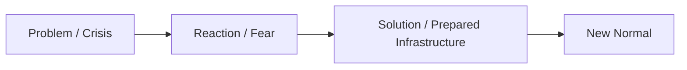

# Cabal (Thế Lực Ngầm)

**Cabal là cách gọi tầng quyền lực ngầm vận hành phía sau quyền lực hiển hiện. Nhưng trong vault, Cabal không nên đọc như cartoon “một nhóm người mặc áo choàng trong phòng tối”. Nó là một model về coordination: tiền, tình báo, media, ritual, policy và myth cùng điều hướng Ma Trận từ phía sau sân khấu.**

*The Cabal is a name for the hidden power layer operating behind visible power. In the vault, it should not be read as a cartoon of robed men in a dark room, but as a model of coordination: money, intelligence, media, ritual, policy, and myth steering the Matrix from behind the stage.*

---

## Evidence Discipline / Cách Đọc Claim

| Tầng | Cách đọc | Ví dụ |
|---|---|---|
| **Fact / documentable** | tổ chức, hội nghị, ngân hàng, think tank, intelligence networks | Bilderberg, CFR, central banking, lobbying |
| **Pattern / systems reading** | nhiều institution khác nhau nhưng cùng một hướng | global governance, censorship, cashless, crisis policy |
| **Symbol / myth reading** | occult ritual, logo, number, archetype, public disclosure | Gematria, Hollywood, ritual timing |
| **Speculative synthesis** | bloodlines, non-human influence, occult hierarchy | đọc như esoteric model, không thay thế fact |

---

## Vault Position / Vị Trí Trong Vault

[[Elite]] là tầng power-structure có thể mô tả bằng institution, finance và policy. **Cabal** là tầng shadow-symbolic hơn: nơi power không chỉ vận hành bằng luật và tiền, mà bằng secrecy, initiation, ritual, myth và coordination ngoài tầm nhìn public.

Nếu [[Elite]] là operator layer của [[Ma Trận]], Cabal là hypothesis về “backroom layer” phía sau operator đó.

> Cabal không cần được tin như giáo điều. Nó là một lens để hỏi: quyền lực nào đang điều phối những thứ bề ngoài có vẻ rời rạc?

---

## 1. Visible Power vs Hidden Power

Quyền lực hiển hiện là thứ public nhìn thấy: tổng thống, CEO, nghị viện, celebrity, billionaire.

Quyền lực ẩn là thứ thiết kế lựa chọn trước khi public chọn: funding, policy papers, intelligence briefings, media frame, debt structure, crisis simulation.

| Tầng | Người dân nhìn thấy | Câu hỏi sâu hơn |
|---|---|---|
| Politics | politician | ai viết policy, ai tài trợ campaign? |
| Media | anchor/influencer | ai chọn frame, ai sở hữu platform? |
| Finance | bank/app | ai tạo money rules, ai được bailout? |
| Science | expert | ai tài trợ research, dissent bị xử lý sao? |
| War | enemy of the day | ai hưởng lợi từ conflict? |

Cabal lens bắt đầu khi ta ngừng nhìn power như individual và bắt đầu nhìn power như network.

---

## 2. Ba Tầng Cabal Model

### 1. Institutional Layer

Đây là tầng có thể kiểm được nhiều nhất:

- central banks,
- asset managers,
- intelligence agencies,
- think tanks,
- foundations,
- NGOs,
- global forums,
- media conglomerates.

Không cần nói tất cả đều “bí mật”. Nhiều thứ công khai. Nhưng public không được dạy để nối chúng thành system.

### 2. Coordination Layer

Đây là tầng pattern:

- cùng một ngôn ngữ policy xuất hiện ở nhiều nước,
- cùng một crisis frame lặp lại,
- cùng một censorship logic,
- cùng một digital ID / CBDC / climate metric direction,
- cùng một “build back better” style language.

Coordination không phải lúc nào cũng cần một lệnh trực tiếp. Incentive + ideology + funding + institutional mimicry cũng đủ tạo alignment.

### 3. Occult / Mythic Layer

Đây là tầng speculative-esoteric:

- secret societies,
- initiation rituals,
- bloodline myths,
- Saturn/black cube symbolism,
- Gematria,
- archetypal programming,
- non-human/entity hypotheses.

Không nên đọc tầng này như fact thô. Nhưng cũng không nên dismiss toàn bộ vì power luôn cần myth để tồn tại lâu dài.

---

## 3. Công Cụ Chính

### Money

Debt, fiat, inflation và programmable money là cách biến thời gian sống thành obligation.

→ Xem: [[Tiền Giấy - Tiền Mặt]], [[MOC - Financial Sovereignty]].

### Narrative

Media không chỉ báo tin. Media set emotional weather.

→ Xem: [[Kiểm Soát Tâm Trí]], [[Hollywood - Cây Đũa Phép Của Phù Thủy]].

### Crisis

Crisis là cửa để đổi tự do lấy an toàn.

### Division

[[Nhị Nguyên]] bị weaponize thành left/right, vax/antivax, believer/conspiracy theorist, men/women, young/old.

### Ritual & Symbol

Ritual không chỉ là nến và áo choàng. Ritual là repeated symbolic action tạo consent ở subconscious level.

---

## 4. Deep State, Cabal, Elite Khác Nhau Sao?

| Term | Tầng nghĩa |
|---|---|
| **Deep State** | permanent bureaucracy, intelligence, security state |
| **Elite** | wealth/policy/media/institutional power class |
| **Cabal** | hidden coordination + occult/symbolic layer |
| **Ma Trận** | toàn bộ operating system của perception/control |

Các từ này overlap nhưng không đồng nghĩa hoàn toàn.

---

## 5. Bẫy Khi Đọc Cabal

- quy mọi thứ về một nhóm duy nhất,
- tin mọi symbol decode như fact,
- mất khả năng phân biệt evidence mạnh/yếu,
- biến Cabal thành quỷ tuyệt đối để khỏi nhìn shadow bản thân,
- dùng Cabal để trốn trách nhiệm đời sống cá nhân,
- nghĩ biết tên kẻ thù là đã tự do.

Cabal lens chỉ hữu dụng nếu nó giúp đọc power rõ hơn, không làm mình nghiện paranoia.

---

## Synthesis

Cabal là một model về quyền lực ẩn: nơi institution, capital, intelligence, ritual và narrative cùng tạo ra direction cho public reality.

Có phần kiểm được. Có phần chỉ đọc được qua pattern. Có phần thuộc symbolic/speculative layer.

Người đọc trưởng thành không cần tin mù hoặc phủ định mù. Họ giữ nhiều tầng cùng lúc.

> Cabal thắng khi con người chỉ biết phản ứng. Nó yếu đi khi con người thấy được frame, rút consent, và xây sovereignty ngoài default options.

---

## Related

- [[Elite]]
- [[Ma Trận]]
- [[Kiểm Soát Tâm Trí]]
- [[Báo Cáo 2030]]
- [[Nhị Nguyên]]
- [[Gematria]]
- [[MOC - Epistemology & Propaganda]]
