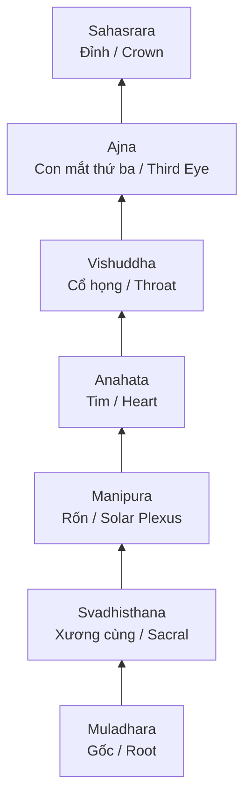
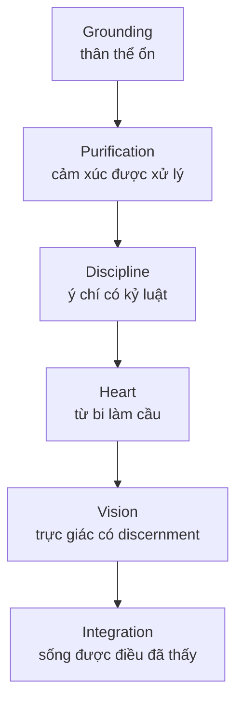

# Chakra (Luân Xa)

**Chakra là bản đồ đọc con người như một trục năng lượng sống: từ bản năng sinh tồn ở thân dưới, qua tim, tiếng nói, trực giác, rồi lên ý thức hợp nhất.** Trong vault, chakra không được dùng như "y học chính thống", mà như ngôn ngữ biểu tượng để nối [[Kundalini]], [[Tuyến Tùng]], [[Tinh Khí Thần]], [[Năng Lượng Tình Dục]] và quá trình thoát khỏi [[Ma Trận]] nhận thức.

*Chakra is a symbolic map of the human being as a living energy axis: survival, sexuality, will, heart, speech, intuition, and unity.*

---

## Vault Position / Vị Trí Trong Vault

Bài này nằm ở giao điểm giữa ba đường đọc:

| Đường đọc | Chakra giữ vai trò gì |
|---|---|
| [[Kundalini]] | Cột mốc mà năng lượng đi qua khi thức dậy |
| [[Tinh Khí Thần]] | Bản đồ chuyển hóa từ sinh lực thô sang ý thức tinh |
| [[Ma Trận]] | Mô hình đọc cách fear, porn, media và lifestyle kéo ý thức xuống các tầng thấp |
| [[Gnosis]] | Ngôn ngữ nội quan để phân biệt biết bằng đầu và biết trực tiếp |

Điểm quan trọng: chakra không phải bằng chứng vật lý theo nghĩa giải phẫu học. Nó là **map of experience**: bản đồ kinh nghiệm thân-tâm-tinh thần.

---

## Evidence Discipline / Kỷ Luật Đọc

| Tầng claim | Cách đọc đúng |
|---|---|
| Fact / truyền thống | Chakra xuất hiện trong các truyền thống Hindu, Tantra, Yoga và Phật giáo mật truyền với nhiều hệ thống khác nhau, không chỉ một bản 7 luân xa hiện đại |
| Pattern / hệ thống | Bảy chakra là mô hình hữu ích để đọc sự đi lên của năng lượng, chú ý, ham muốn, ý chí và trực giác |
| Symbol / biểu tượng | Màu sắc, âm thanh, nguyên tố và tuyến nội tiết là ngôn ngữ tượng trưng, không nên đọc như xét nghiệm sinh học |
| Speculative synthesis | Vault dùng chakra để nối năng lượng tình dục, pineal, porn, fear media và awakening; đây là synthesis, không phải khẳng định y khoa |

---

## Trục Bảy Chakra / The Seven-Center Axis

| Chakra | Vị trí tượng trưng | Chủ đề chính |
|---|---|---|
| Muladhara | Đáy cột sống | An toàn, thân thể, nền móng |
| Svadhisthana | Bụng dưới | Cảm xúc, khoái cảm, sáng tạo, tình dục |
| Manipura | Vùng rốn | Ý chí, kỷ luật, quyền lực cá nhân |
| Anahata | Tim | Tình yêu, tha thứ, kết nối |
| Vishuddha | Cổ họng | Nói thật, biểu đạt, lời thề |
| Ajna | Giữa trán | Trực giác, hình ảnh nội tâm, discernment |
| Sahasrara | Đỉnh đầu | Hợp nhất, siêu cá nhân, Source |

---

## Ba Tầng Dưới / Survival, Desire, Will

Ba chakra dưới là tầng con người dễ bị điều khiển nhất vì chúng liên quan trực tiếp tới sinh tồn, khoái cảm và quyền lực.

**Muladhara** hỏi: "Tôi có an toàn không?" Khi tầng này bị kích hoạt bằng sợ hãi, con người dễ đổi tự do lấy bảo hộ. Đây là cửa vào của fear-based programming trong [[Ma Trận]].

**Svadhisthana** hỏi: "Tôi dùng năng lượng sáng tạo để sinh thành hay để tiêu tán?" Đây là điểm nối tự nhiên với [[Năng Lượng Tình Dục]], [[S.E.X]] và bài [[Sự Thật Đen Tối Về Phim Khiêu Dâm]]. Khi năng lượng tình dục bị biến thành addiction loop, con người mất drive sáng tạo.

**Manipura** hỏi: "Ý chí của tôi thuộc về ai?" Một người có solar plexus yếu dễ sống bằng validation, sợ xung đột, hoặc giao quyền quyết định cho đám đông. Một người bị méo ở tầng này có thể biến ý chí thành domination.

---

## Tim Là Cầu / Heart As Bridge

**Anahata** là bản lề giữa ba tầng dưới và ba tầng trên. Nếu không qua tim, spiritual practice dễ thành ego nâng cấp: nhiều trải nghiệm, nhiều ngôn ngữ huyền học, nhưng thiếu từ bi và thiếu trách nhiệm.

Trong vault, tim nối với [[Tình Yêu Tỉnh Thức]] và [[Sự Nhất Thể]]. Nó không làm yếu con người; nó làm cho power bớt thành control. Đây là lý do nhiều truyền thống coi heart purification là điều kiện trước khi chạm vào năng lượng mạnh hơn như Kundalini.

> Không có tim, "thức tỉnh" rất dễ trở thành một identity mới.

---

## Ba Tầng Trên / Speech, Vision, Unity

**Vishuddha** là cổ họng: lời nói, sự thật, lời thề, khả năng gọi đúng tên sự vật. Một người không nói thật sẽ khó giữ năng lượng thẳng vì toàn bộ hệ thần kinh phải bảo trì một persona.

**Ajna** là con mắt thứ ba: discernment, inner vision, khả năng nhìn pattern mà không rơi vào hoang tưởng. Đây là điểm liên kết với [[Tuyến Tùng]], [[Gnosis]] và [[Kỹ Thuật Thiền Định Kogi]]. Claim "pineal là ghế ngồi linh hồn" nên đọc ở tầng symbol/esoteric, còn vai trò điều hòa melatonin là tầng sinh học.

**Sahasrara** là đỉnh: trải nghiệm hợp nhất, vượt khỏi bản ngã cá nhân. Nếu các tầng dưới chưa ổn, nói chuyện crown quá sớm dễ thành dissociation spiritualized.

---

## Kundalini Và Trục Thức Tỉnh

[[Kundalini]] là mô hình nói rằng năng lượng nguyên thủy nằm ở tầng gốc có thể đi lên qua toàn bộ trục chakra. Khi đọc đúng, đây không phải lời mời ép trải nghiệm mạnh. Đây là cảnh báo: năng lượng càng mạnh, container càng phải sạch.

Chakra vì vậy là bản đồ **integration**, không phải bảng thành tích tâm linh.

---

## Matrix Exploitation / Cách Ma Trận Kéo Năng Lượng Xuống

| Tầng | Cách bị khai thác | Hậu quả |
|---|---|---|
| Root | tin tức sợ hãi, khủng hoảng liên tục | sống trong survival mode |
| Sacral | porn, hookup culture, dopamine loop | sáng tạo bị drain |
| Solar plexus | shame, status game, outrage | ý chí bị điều khiển |
| Heart | cynicism, trauma bonding | mất khả năng tin và yêu |
| Throat | kiểm duyệt, self-censorship | không dám nói thật |
| Third eye | overload thông tin, fake insight | nhìn pattern nhưng mất discernment |
| Crown | spiritual bypass | bay khỏi đời sống thay vì nhập thế |

Đây là nơi chakra nối với [[Dopamine Economy - Nền Kinh Tế Của Sự Thèm Muốn]]: attention bị kéo xuống liên tục, khiến năng lượng không còn đi lên thành clarity.

---

## Thực Hành An Toàn / Practical Grounding

Thực hành chakra nên bắt đầu từ thân, không bắt đầu từ fantasy. Ngủ đủ, ăn sạch, thở sâu, vận động, nói thật, giữ năng lượng tình dục có ý thức, làm shadow work, và quan sát cảm xúc trước khi cố "mở" bất cứ thứ gì.

Các thực hành phù hợp với vault:

| Hướng | Thực hành |
|---|---|
| Thân | yoga nhẹ, đi bộ, grounding, breathwork cơ bản |
| Năng lượng | tiết chế dopamine, quan sát ham muốn, [[Tinh Khí Thần]] |
| Tâm lý | journaling, [[Individuation]], đối diện shadow |
| Trực giác | thiền im lặng, [[Gnosis]], kiểm chứng bằng đời sống |
| Sức khỏe | [[Y Tế Tự Nhiên]] nhưng không thay thế chẩn đoán y khoa khi có triệu chứng nghiêm trọng |

---

## Core Insight / Chốt Lại

**Chakra không phải trò tô màu aura. Nó là bản đồ hỏi một câu rất thẳng: năng lượng sống của bạn đang bị kẹt ở survival, bị drain ở desire, bị méo thành control, hay đang được nâng lên thành love, truth và direct knowing?**

*The chakra map asks where life-force is trapped, drained, distorted, or integrated into love, truth, and direct knowing.*
