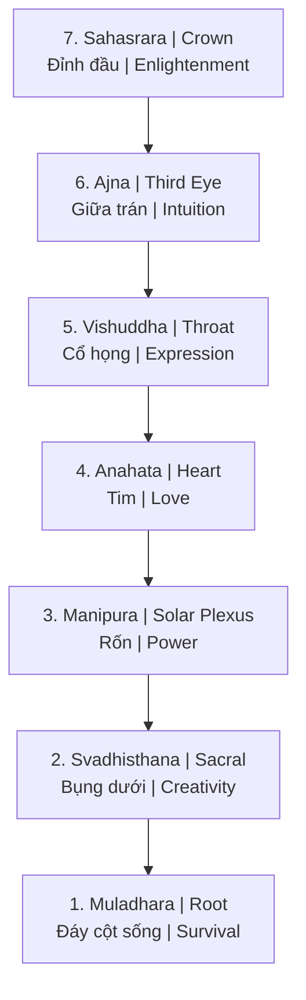
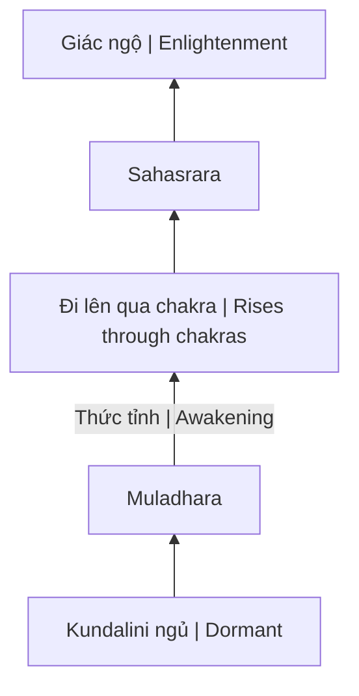
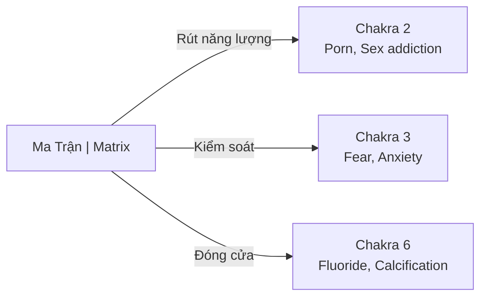

# Chakra (Luân Xa)

**Chakra** (Sanskrit: चक्र = "bánh xe") là các trung tâm năng lượng trong cơ thể con người theo truyền thống Ấn Độ giáo và Phật giáo. Có 7 chakra chính chạy dọc cột sống, mỗi chakra liên kết với các khía cạnh khác nhau của thể chất, cảm xúc và tâm linh.

*Chakra (Sanskrit: चक्र = "wheel") are energy centers in the human body according to Hindu and Buddhist traditions. There are 7 main chakras running along the spine, each linked to different physical, emotional, and spiritual aspects.*

---

## 7 Chakra Chính / The 7 Main Chakras

---

## Chi Tiết 7 Chakra / Detailed 7 Chakras

| # | Tên Sanskrit | Tên Việt | Vị trí | Màu sắc | Chức năng |
|---|--------------|----------|--------|---------|-----------|
| **7** | Sahasrara | Luân xa Đỉnh | Đỉnh đầu | Tím/Trắng | Giác ngộ, kết nối vũ trụ |
| **6** | Ajna | Luân xa Con Mắt Thứ Ba | Giữa trán | Chàm | Trực giác, tầm nhìn |
| **5** | Vishuddha | Luân xa Cổ Họng | Cổ họng | Xanh dương | Giao tiếp, biểu đạt |
| **4** | Anahata | Luân xa Tim | Ngực | Xanh lá | Tình yêu, từ bi |
| **3** | Manipura | Luân xa Rốn | Bụng trên | Vàng | Ý chí, quyền lực cá nhân |
| **2** | Svadhisthana | Luân xa Xương Cùng | Bụng dưới | Cam | Sáng tạo, tình dục |
| **1** | Muladhara | Luân xa Gốc | Đáy cột sống | Đỏ | Sinh tồn, nền tảng |

---

## 1. Muladhara — Luân Xa Gốc / Root Chakra

**Vị trí:** Đáy cột sống / Base of spine

*Location: Base of spine*

### Đặc điểm / Characteristics

| Khía cạnh | Chi tiết |
|-----------|----------|
| **Element** | Đất (Earth) |
| **Màu sắc** | Đỏ (Red) |
| **Âm thanh** | LAM |
| **Tuyến** | Thượng thận (Adrenal) |

### Khi Cân Bằng / When Balanced
- Cảm giác an toàn, ổn định / Feeling safe, stable
- Kết nối với cơ thể / Connected to body
- Có nền tảng vững chắc / Grounded

### Khi Mất Cân Bằng / When Imbalanced
- Lo âu, sợ hãi / Anxiety, fear
- Vấn đề tài chính / Financial problems
- Mất kết nối với thực tại / Disconnected from reality

---

## 2. Svadhisthana — Luân Xa Xương Cùng / Sacral Chakra

**Vị trí:** Bụng dưới, dưới rốn / Lower abdomen, below navel

*Location: Lower abdomen, below navel*

### Đặc điểm / Characteristics

| Khía cạnh | Chi tiết |
|-----------|----------|
| **Element** | Nước (Water) |
| **Màu sắc** | Cam (Orange) |
| **Âm thanh** | VAM |
| **Tuyến** | Sinh dục (Gonads) |

### Liên Kết Với / Connected To
- [[Năng Lượng Tình Dục]] — Sexual energy
- [[S.E.X Và Tâm Lý Học Jung]] — Sacred energy exchange
- Sáng tạo và cảm xúc / Creativity and emotions

### Khi Mất Cân Bằng / When Imbalanced
- Nghiện (porn, sex, food) / Addictions
- Thiếu sáng tạo / Lack of creativity
- Vấn đề cảm xúc / Emotional issues

> **Cảnh báo:** Đây là chakra bị khai thác nhiều nhất bởi [[Ma Trận]] thông qua [[Sự Thật Đen Tối Về Phim Khiêu Dâm|ngành công nghiệp porn]] — năng lượng sáng tạo bị rút kiệt thay vì được chuyển hóa.
>
> *Warning: This is the chakra most exploited by [[Ma Trận|the Matrix]] through the [[Sự Thật Đen Tối Về Phim Khiêu Dâm|porn industry]] — creative energy is drained instead of transmuted.*

---

## 3. Manipura — Luân Xa Rốn / Solar Plexus Chakra

**Vị trí:** Bụng trên, vùng dạ dày / Upper abdomen, stomach area

*Location: Upper abdomen, stomach area*

### Đặc điểm / Characteristics

| Khía cạnh | Chi tiết |
|-----------|----------|
| **Element** | Lửa (Fire) |
| **Màu sắc** | Vàng (Yellow) |
| **Âm thanh** | RAM |
| **Tuyến** | Tụy (Pancreas) |

### Liên Kết Với / Connected To
- [[Hệ Tiêu Hóa - Bộ Não Thứ Hai (The Second Brain)]]
- Ý chí, quyền lực cá nhân / Willpower, personal power
- Lòng tự trọng / Self-esteem

---

## 4. Anahata — Luân Xa Tim / Heart Chakra

**Vị trí:** Ngực, vùng tim / Chest, heart area

*Location: Chest, heart area*

### Đặc điểm / Characteristics

| Khía cạnh | Chi tiết |
|-----------|----------|
| **Element** | Không khí (Air) |
| **Màu sắc** | Xanh lá (Green) |
| **Âm thanh** | YAM |
| **Tuyến** | Ức (Thymus) |

### Liên Kết Với / Connected To
- [[Tình Yêu Tỉnh Thức]] — Conscious love
- Từ bi, tha thứ / Compassion, forgiveness
- Cầu nối giữa 3 chakra dưới và 3 chakra trên / Bridge between lower 3 and upper 3 chakras

---

## 5. Vishuddha — Luân Xa Cổ Họng / Throat Chakra

**Vị trí:** Cổ họng / Throat

*Location: Throat*

### Đặc điểm / Characteristics

| Khía cạnh | Chi tiết |
|-----------|----------|
| **Element** | Ether/Âm thanh (Sound) |
| **Màu sắc** | Xanh dương (Blue) |
| **Âm thanh** | HAM |
| **Tuyến** | Giáp (Thyroid) |

### Liên Kết Với / Connected To
- Giao tiếp chân thật / Authentic communication
- Biểu đạt sáng tạo / Creative expression
- Nói sự thật / Speaking truth

---

## 6. Ajna — Luân Xa Con Mắt Thứ Ba / Third Eye Chakra

**Vị trí:** Giữa trán, giữa hai lông mày / Forehead, between eyebrows

*Location: Forehead, between eyebrows*

### Đặc điểm / Characteristics

| Khía cạnh | Chi tiết |
|-----------|----------|
| **Element** | Ánh sáng (Light) |
| **Màu sắc** | Chàm (Indigo) |
| **Âm thanh** | OM |
| **Tuyến** | [[Tuyến Tùng]] (Pineal) |

### Liên Kết Với / Connected To
- [[Tuyến Tùng]] — Pineal gland (seat of the soul)
- Trực giác / Intuition
- Tầm nhìn nội tại / Inner vision
- [[Gnosis (Ngộ Đạo)]] — Direct knowing

> **Quan trọng:** [[Tuyến Tùng]] là "ghế ngồi của linh hồn" theo Descartes. Chakra này bị calcify (vôi hóa) bởi fluoride, thuốc, và lifestyle hiện đại — một phần của [[Ma Trận]] để ngăn con người thức tỉnh.
>
> *Important: The [[Tuyến Tùng|Pineal gland]] is the "seat of the soul" according to Descartes. This chakra is calcified by fluoride, medications, and modern lifestyle — part of [[Ma Trận|the Matrix]] to prevent awakening.*

---

## 7. Sahasrara — Luân Xa Đỉnh / Crown Chakra

**Vị trí:** Đỉnh đầu / Top of head

*Location: Top of head*

### Đặc điểm / Characteristics

| Khía cạnh | Chi tiết |
|-----------|----------|
| **Element** | Tư tưởng/Vũ trụ (Thought/Cosmos) |
| **Màu sắc** | Tím/Trắng (Violet/White) |
| **Âm thanh** | Silence |
| **Tuyến** | Yên (Pituitary) |

### Liên Kết Với / Connected To
- [[Sự Nhất Thể]] — Oneness
- Giác ngộ / Enlightenment
- Kết nối với nguồn / Connection to Source
- [[Vô Thức Tập Thể]] — Collective unconscious

---

## Kundalini — Năng Lượng Rắn Lửa

**Kundalini** (Sanskrit: "cuộn tròn") là năng lượng nguyên thủy nằm cuộn ở đáy cột sống (Muladhara). Khi được đánh thức, nó đi lên qua tất cả 7 chakra.

*Kundalini (Sanskrit: "coiled") is the primal energy coiled at the base of the spine (Muladhara). When awakened, it rises through all 7 chakras.*

### Cảnh Báo / Warning

Kundalini awakening không nên bị ép buộc. Nếu không chuẩn bị, có thể gây:
- Khủng hoảng tâm lý / Psychological crisis
- Vấn đề sức khỏe / Health issues
- "Spiritual emergency"

*Kundalini awakening should not be forced. Without preparation, it can cause psychological crisis, health issues, and "spiritual emergency."*

---

## Ma Trận Khai Thác Chakra / Matrix Exploitation

[[Elite]] hiểu rõ hệ thống chakra và khai thác nó:

*The [[Elite]] understand the chakra system and exploit it:*

| Chakra | Cách khai thác | Mục đích |
|--------|---------------|----------|
| **2 (Sacral)** | Porn, hypersexualization | Rút kiệt năng lượng sáng tạo |
| **3 (Solar Plexus)** | Fear-based media | Kiểm soát ý chí |
| **6 (Third Eye)** | Fluoride, processed food | Ngăn trực giác, thức tỉnh |

---

## Thực Hành Cân Bằng / Balancing Practices

### Thiền Định / Meditation
- Tập trung vào từng chakra / Focus on each chakra
- Hình dung màu sắc tương ứng / Visualize corresponding colors
- [[Kỹ Thuật Thiền Định Kogi]]

### Âm Thanh / Sound
- Mantra cho từng chakra (LAM, VAM, RAM, YAM, HAM, OM)
- Singing bowls tuned to chakra frequencies
- [[Tần Số Schumann]]

### Thể Chất / Physical
- Yoga poses for each chakra
- Breathwork (Pranayama)
- [[Tinh Khí Thần]] — Energy cultivation

### Lối Sống / Lifestyle
- Tránh fluoride / Avoid fluoride
- Clean diet
- [[Y Tế Tự Nhiên (Anti-Matrix Health)]]

---

## Related

### Năng Lượng / Energy
- [[Năng Lượng Tình Dục]] — Sexual/creative energy
- [[Tinh Khí Thần]] — Jing, Qi, Shen
- [[Kundalini]] — Serpent energy
- [[Tuyến Tùng]] — Pineal gland

### Tâm Linh / Spirituality
- [[Gnosis (Ngộ Đạo)]] — Direct knowing
- [[Sự Nhất Thể]] — Oneness
- [[Vô Thức Tập Thể]] — Collective unconscious

### Ma Trận / Matrix
- [[Sự Thật Đen Tối Về Phim Khiêu Dâm]] — Energy harvesting
- [[Ma Trận]] — Control system
- [[Kiểm Soát Tâm Trí]] — Mind control
- [[Thực Thể Cõi Trung Giới (Astral Entities)]] — Parasitic entities
