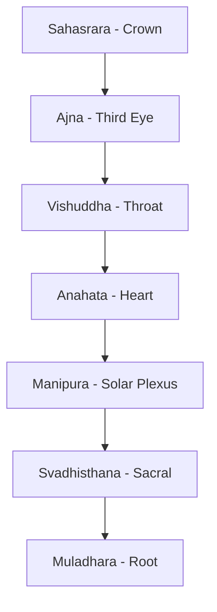
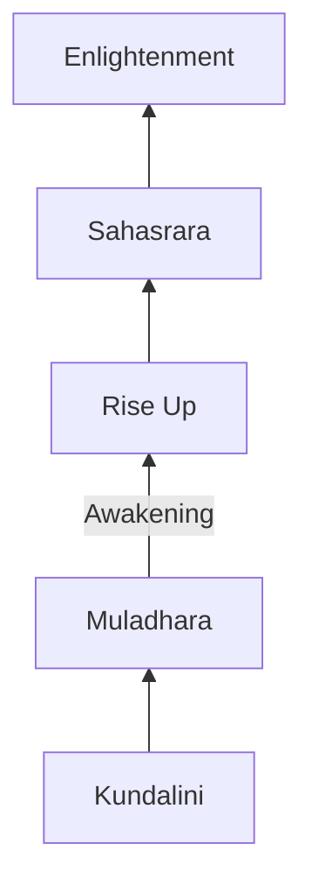
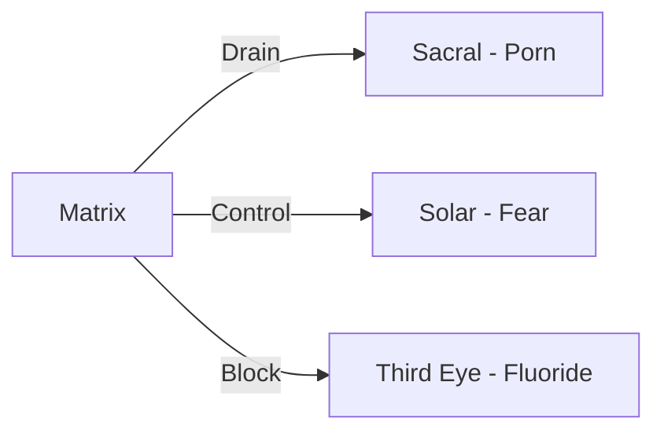

# Chakra (Luân Xa)

**Chakra** (Sanskrit: ???? = "bánh xe") là các trung tâm nang lu?ng trong co th? con ngu?i theo truy?n th?ng ?n Ð? giáo và Ph?t giáo. Có 7 chakra chính ch?y d?c c?t s?ng, m?i chakra liên k?t v?i các khía c?nh khác nhau c?a th? ch?t, c?m xúc và tâm linh.

*Chakra (Sanskrit: ???? = "wheel") are energy centers in the human body according to Hindu and Buddhist traditions. There are 7 main chakras running along the spine, each linked to different physical, emotional, and spiritual aspects.*

---

## 7 Chakra Chính / The 7 Main Chakras

| # | Sanskrit | English | V? trí |
|---|----------|---------|--------|
| 7 | Sahasrara | Crown | Ð?nh d?u |
| 6 | Ajna | Third Eye | Gi?a trán |
| 5 | Vishuddha | Throat | C? h?ng |
| 4 | Anahata | Heart | Tim |
| 3 | Manipura | Solar Plexus | R?n |
| 2 | Svadhisthana | Sacral | B?ng du?i |
| 1 | Muladhara | Root | Ðáy c?t s?ng |

---

## Chi Ti?t 7 Chakra / Detailed 7 Chakras

| # | Tên Sanskrit | Tên Vi?t | V? trí | Màu s?c | Ch?c nang |
|---|--------------|----------|--------|---------|-----------|
| **7** | Sahasrara | Luân xa Ð?nh | Ð?nh d?u | Tím/Tr?ng | Giác ng?, k?t n?i vu tr? |
| **6** | Ajna | Luân xa Con M?t Th? Ba | Gi?a trán | Chàm | Tr?c giác, t?m nhìn |
| **5** | Vishuddha | Luân xa C? H?ng | C? h?ng | Xanh duong | Giao ti?p, bi?u d?t |
| **4** | Anahata | Luân xa Tim | Ng?c | Xanh lá | Tình yêu, t? bi |
| **3** | Manipura | Luân xa R?n | B?ng trên | Vàng | Ý chí, quy?n l?c cá nhân |
| **2** | Svadhisthana | Luân xa Xuong Cùng | B?ng du?i | Cam | Sáng t?o, tình d?c |
| **1** | Muladhara | Luân xa G?c | Ðáy c?t s?ng | Ð? | Sinh t?n, n?n t?ng |

---

## 1. Muladhara - Luân Xa G?c / Root Chakra

**V? trí:** Ðáy c?t s?ng / Base of spine

*Location: Base of spine*

### Ð?c di?m / Characteristics

| Khía c?nh | Chi ti?t |
|-----------|----------|
| **Element** | Ð?t (Earth) |
| **Màu s?c** | Ð? (Red) |
| **Âm thanh** | LAM |
| **Tuy?n** | Thu?ng th?n (Adrenal) |

### Khi Cân B?ng / When Balanced
- C?m giác an toàn, ?n d?nh / Feeling safe, stable
- K?t n?i v?i co th? / Connected to body
- Có n?n t?ng v?ng ch?c / Grounded

### Khi M?t Cân B?ng / When Imbalanced
- Lo âu, s? hãi / Anxiety, fear
- V?n d? tài chính / Financial problems
- M?t k?t n?i v?i th?c t?i / Disconnected from reality

---

## 2. Svadhisthana - Luân Xa Xuong Cùng / Sacral Chakra

**V? trí:** B?ng du?i, du?i r?n / Lower abdomen, below navel

*Location: Lower abdomen, below navel*

### Ð?c di?m / Characteristics

| Khía c?nh | Chi ti?t |
|-----------|----------|
| **Element** | Nu?c (Water) |
| **Màu s?c** | Cam (Orange) |
| **Âm thanh** | VAM |
| **Tuy?n** | Sinh d?c (Gonads) |

### Liên K?t V?i / Connected To
- [[Nang Lu?ng Tình D?c]] - Sexual energy
- [[S.E.X Và Tâm Lý H?c Jung]] - Sacred energy exchange
- Sáng t?o và c?m xúc / Creativity and emotions

### Khi M?t Cân B?ng / When Imbalanced
- Nghi?n (porn, sex, food) / Addictions
- Thi?u sáng t?o / Lack of creativity
- V?n d? c?m xúc / Emotional issues

> **C?nh báo:** Ðây là chakra b? khai thác nhi?u nh?t b?i [[Ma Tr?n]] thông qua [[S? Th?t Ðen T?i V? Phim Khiêu Dâm|ngành công nghi?p porn]] - nang lu?ng sáng t?o b? rút ki?t thay vì du?c chuy?n hóa.
>
> *Warning: This is the chakra most exploited by [[Ma Tr?n|the Matrix]] through the [[S? Th?t Ðen T?i V? Phim Khiêu Dâm|porn industry]] - creative energy is drained instead of transmuted.*

---

## 3. Manipura - Luân Xa R?n / Solar Plexus Chakra

**V? trí:** B?ng trên, vùng d? dày / Upper abdomen, stomach area

*Location: Upper abdomen, stomach area*

### Ð?c di?m / Characteristics

| Khía c?nh | Chi ti?t |
|-----------|----------|
| **Element** | L?a (Fire) |
| **Màu s?c** | Vàng (Yellow) |
| **Âm thanh** | RAM |
| **Tuy?n** | T?y (Pancreas) |

### Liên K?t V?i / Connected To
- [[H? Tiêu Hóa - B? Não Th? Hai]]
- Ý chí, quy?n l?c cá nhân / Willpower, personal power
- Lòng t? tr?ng / Self-esteem

---

## 4. Anahata - Luân Xa Tim / Heart Chakra

**V? trí:** Ng?c, vùng tim / Chest, heart area

*Location: Chest, heart area*

### Ð?c di?m / Characteristics

| Khía c?nh | Chi ti?t |
|-----------|----------|
| **Element** | Không khí (Air) |
| **Màu s?c** | Xanh lá (Green) |
| **Âm thanh** | YAM |
| **Tuy?n** | ?c (Thymus) |

### Liên K?t V?i / Connected To
- [[Tình Yêu T?nh Th?c]] - Conscious love
- T? bi, tha th? / Compassion, forgiveness
- C?u n?i gi?a 3 chakra du?i và 3 chakra trên / Bridge between lower 3 and upper 3 chakras

---

## 5. Vishuddha - Luân Xa C? H?ng / Throat Chakra

**V? trí:** C? h?ng / Throat

*Location: Throat*

### Ð?c di?m / Characteristics

| Khía c?nh | Chi ti?t |
|-----------|----------|
| **Element** | Ether/Âm thanh (Sound) |
| **Màu s?c** | Xanh duong (Blue) |
| **Âm thanh** | HAM |
| **Tuy?n** | Giáp (Thyroid) |

### Liên K?t V?i / Connected To
- Giao ti?p chân th?t / Authentic communication
- Bi?u d?t sáng t?o / Creative expression
- Nói s? th?t / Speaking truth

---

## 6. Ajna - Luân Xa Con M?t Th? Ba / Third Eye Chakra

**V? trí:** Gi?a trán, gi?a hai lông mày / Forehead, between eyebrows

*Location: Forehead, between eyebrows*

### Ð?c di?m / Characteristics

| Khía c?nh | Chi ti?t |
|-----------|----------|
| **Element** | Ánh sáng (Light) |
| **Màu s?c** | Chàm (Indigo) |
| **Âm thanh** | OM |
| **Tuy?n** | [[Tuy?n Tùng]] (Pineal) |

### Liên K?t V?i / Connected To
- [[Tuy?n Tùng]] - Pineal gland (seat of the soul)
- Tr?c giác / Intuition
- T?m nhìn n?i t?i / Inner vision
- [[Gnosis]] - Direct knowing

> **Quan tr?ng:** [[Tuy?n Tùng]] là "gh? ng?i c?a linh h?n" theo Descartes. Chakra này b? calcify (vôi hóa) b?i fluoride, thu?c, và lifestyle hi?n d?i - m?t ph?n c?a [[Ma Tr?n]] d? ngan con ngu?i th?c t?nh.
>
> *Important: The [[Tuy?n Tùng|Pineal gland]] is the "seat of the soul" according to Descartes. This chakra is calcified by fluoride, medications, and modern lifestyle - part of [[Ma Tr?n|the Matrix]] to prevent awakening.*

---

## 7. Sahasrara - Luân Xa Ð?nh / Crown Chakra

**V? trí:** Ð?nh d?u / Top of head

*Location: Top of head*

### Ð?c di?m / Characteristics

| Khía c?nh | Chi ti?t |
|-----------|----------|
| **Element** | Tu tu?ng/Vu tr? (Thought/Cosmos) |
| **Màu s?c** | Tím/Tr?ng (Violet/White) |
| **Âm thanh** | Silence |
| **Tuy?n** | Yên (Pituitary) |

### Liên K?t V?i / Connected To
- [[S? Nh?t Th?]] - Oneness
- Giác ng? / Enlightenment
- K?t n?i v?i ngu?n / Connection to Source
- [[Vô Th?c T?p Th?]] - Collective unconscious

---

## Kundalini - Nang Lu?ng R?n L?a

**Kundalini** (Sanskrit: "cu?n tròn") là nang lu?ng nguyên th?y n?m cu?n ? dáy c?t s?ng (Muladhara). Khi du?c dánh th?c, nó di lên qua t?t c? 7 chakra.

*Kundalini (Sanskrit: "coiled") is the primal energy coiled at the base of the spine (Muladhara). When awakened, it rises through all 7 chakras.*

### C?nh Báo / Warning

Kundalini awakening không nên b? ép bu?c. N?u không chu?n b?, có th? gây:
- Kh?ng ho?ng tâm lý / Psychological crisis
- V?n d? s?c kh?e / Health issues
- "Spiritual emergency"

*Kundalini awakening should not be forced. Without preparation, it can cause psychological crisis, health issues, and "spiritual emergency."*

---

## Ma Tr?n Khai Thác Chakra / Matrix Exploitation

[[Elite]] hi?u rõ h? th?ng chakra và khai thác nó:

*The [[Elite]] understand the chakra system and exploit it:*

| Chakra | Cách khai thác | M?c dích |
|--------|---------------|----------|
| **2 (Sacral)** | Porn, hypersexualization | Rút ki?t nang lu?ng sáng t?o |
| **3 (Solar Plexus)** | Fear-based media | Ki?m soát ý chí |
| **6 (Third Eye)** | Fluoride, processed food | Ngan tr?c giác, th?c t?nh |

---

## Th?c Hành Cân B?ng / Balancing Practices

### Thi?n Ð?nh / Meditation
- T?p trung vào t?ng chakra / Focus on each chakra
- Hình dung màu s?c tuong ?ng / Visualize corresponding colors
- [[K? Thu?t Thi?n Ð?nh Kogi]]

### Âm Thanh / Sound
- Mantra cho t?ng chakra (LAM, VAM, RAM, YAM, HAM, OM)
- Singing bowls tuned to chakra frequencies
- [[T?n S? Schumann]]

### Th? Ch?t / Physical
- Yoga poses for each chakra
- Breathwork (Pranayama)
- [[Tinh Khí Th?n]] - Energy cultivation

### L?i S?ng / Lifestyle
- Tránh fluoride / Avoid fluoride
- Clean diet
- [[Y T? T? Nhiên]]

---

## Related

### Nang Lu?ng / Energy
- [[Nang Lu?ng Tình D?c]] - Sexual/creative energy
- [[Tinh Khí Th?n]] - Jing, Qi, Shen
- Kundalini - Serpent energy
- [[Tuy?n Tùng]] - Pineal gland

### Tâm Linh / Spirituality
- [[Gnosis]] - Direct knowing
- [[S? Nh?t Th?]] - Oneness
- [[Vô Th?c T?p Th?]] - Collective unconscious

### Ma Tr?n / Matrix
- [[S? Th?t Ðen T?i V? Phim Khiêu Dâm]] - Energy harvesting
- [[Ma Tr?n]] - Control system
- [[Ki?m Soát Tâm Trí]] - Mind control
- [[Th?c Th? Cõi Trung Gi?i]] - Parasitic entities
