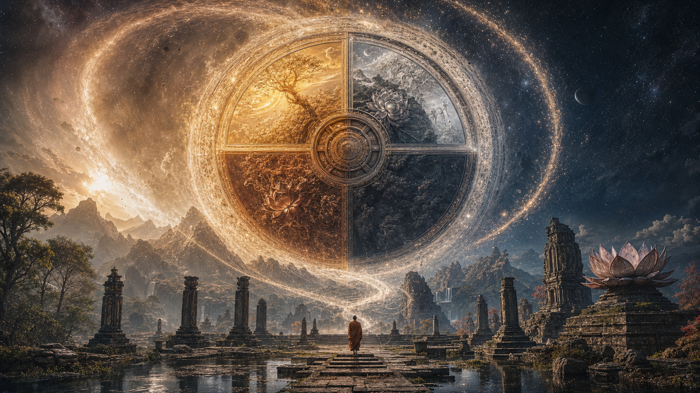
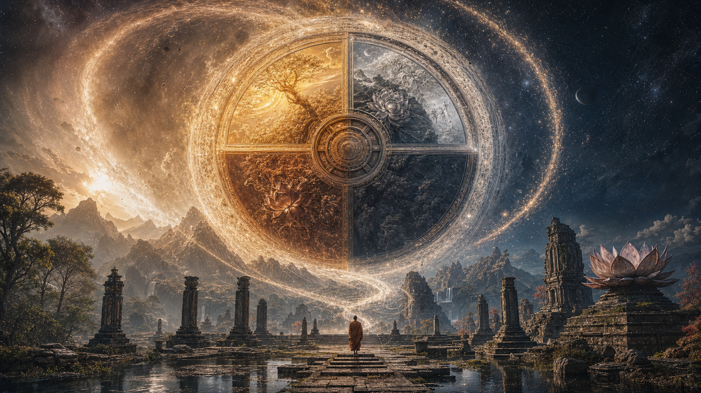
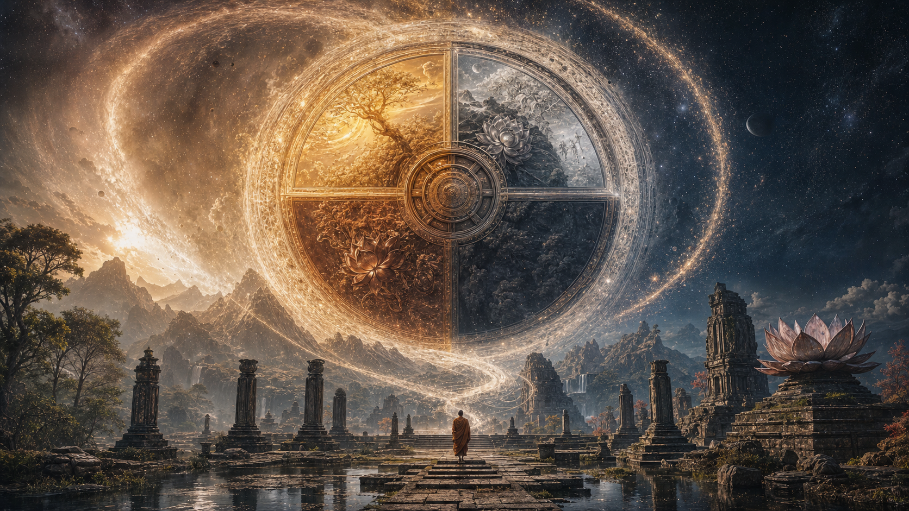

# Chu Kỳ Vũ Trụ - Yugas & Kalpas

**Yugas & Kalpas là bản đồ thời gian như vòng xoắn: văn minh không chỉ tiến lên, mà đi qua mùa vàng, mùa bạc, mùa đồng, mùa sắt, rồi reset để nhớ lại thứ đã quên.**

*Yugas and Kalpas read time as a spiral: civilization does not simply progress upward; it cycles through golden, silver, bronze, iron seasons, then resets into remembrance.*

---

## Evidence Discipline / Cách Đọc

Bài này thuộc tầng **mythic time + civilizational pattern**, không phải lịch thiên văn đã được chứng minh theo chuẩn hiện đại.

| Tầng | Cách đọc |
|---|---|
| **Fact / documentable** | Yuga, Kalpa là khái niệm có trong truyền thống Hindu, Buddhist và các hệ huyền học liên quan |
| **Pattern / systems** | chu kỳ suy tàn/tái sinh giúp đọc lịch sử văn minh như season |
| **Symbol / myth** | thời đại vàng/sắt, giant, tuổi thọ dài là ngôn ngữ mythic về consciousness |
| **Speculative synthesis** | liên hệ với Atlantis, resets, Loosh, disclosure thuộc tầng mô hình vault |

Đừng biến con số mythic thành prediction cứng. Nhưng cũng đừng vứt myth đi chỉ vì nó không nói bằng ngôn ngữ lab.

---

## Vì Sao Nó Quan Trọng

Nếu lịch sử là đường thẳng tiến lên, quá khứ luôn primitive hơn hiện tại. Kim tự tháp chỉ là dây thừng và nô lệ. [[Atlantis]] chỉ là truyện. Giants chỉ là phóng đại. Ancient tech không thể tồn tại vì “họ chưa phát triển tới mức đó”.

Nhưng nếu lịch sử là vòng xoắn suy thoái và reset, mọi thứ đổi chiều. Một số nền văn minh cổ có thể không thấp hơn ta, mà khác ta: khác consciousness, khác relationship với đất, khác technology stack, khác relation với trường năng lượng.

---

## Hindu Yugas: Bốn Mùa Của Dharma

Hindu tradition chia thời gian thành bốn Yugas. **Satya Yuga** là mùa vàng: dharma vững, consciousness trong, con người gần thần tính. **Treta Yuga** bắt đầu suy giảm: form, ritual, hierarchy xuất hiện. **Dvapara Yuga** là mùa đồng: chiến tranh, phân cực, trí nhớ giảm. **Kali Yuga** là mùa sắt: vật chất hóa, đảo ngược giá trị, money thay virtue, noise thay wisdom.

Dù các con số truyền thống rất lớn, điểm cần giữ không phải calculator. Điểm cần giữ là pattern: khi consciousness giảm, society cần luật nhiều hơn, violence nhiều hơn, external authority nhiều hơn. Cái từng là tự nhiên phải được ép bằng policy.

---

## Buddhist Kalpas: Thành, Trụ, Hoại, Không

Trong Phật giáo, Kalpa là đơn vị thời gian vũ trụ dài đến mức chỉ có thể nói bằng ẩn dụ. Một thế giới đi qua **Thành**, **Trụ**, **Hoại**, **Không**: hình thành, tồn tại, tan rã, rồi nghỉ trong hư không trước chu kỳ mới.

Đây là antidote cho arrogance hiện đại. Modernity nghĩ mình là end point. Kalpa nói: không, em chỉ là một phase. Những gì em gọi là permanent có thể chỉ là một breath của cosmos.

---

## Giants, Architecture Và Ký Ức Thân Thể

Các truyền thống cổ nói con người từng lớn hơn, sống lâu hơn, có năng lực tinh thần mạnh hơn. Đọc literal đến đâu là chuyện cần kỷ luật, nhưng pattern quá rộng để bỏ qua: Nephilim, Titans, Jotnar, Daitya, Rakshasa, folklore Đông Nam Á, cửa khổng lồ, bậc thang quá lớn, ngai đá không fit body hiện đại.

Vault không cần kết luận “tất cả giants là fact khảo cổ”. Câu hỏi đúng hơn là: tại sao nhiều nền văn hóa độc lập đều nhớ một nhân loại lớn hơn, gần trời hơn, rồi mất dần?

---

## Atlantis, Lemuria, Reset Và Loosh

Nếu Yugas/Kalpas là lens đúng một phần, [[Atlantis]] có thể là ký ức về một reset trong chu kỳ lớn. [[Lemuria]] là memory mềm hơn: oceanic, intuitive, Gaia-aligned. [[Tartaria]] và mudflood lens đặt câu hỏi về reset gần hơn trong historical memory.

Theo framework [[Loosh - Năng Lượng Thu Hoạch Từ Con Người|Loosh]], Kali Yuga là mùa harvest dày đặc: fear, anger, despair, shame, scarcity. Nếu consciousness thấp sản xuất emotional energy mạnh hơn, thì “suy thoái” không chỉ là tai nạn; nó có thể là environment được duy trì.

Đây là speculative synthesis, không phải fact. Nhưng nó giải thích tại sao mọi hệ thống “tiến bộ” lại thường tăng anxiety, fragmentation và dependency.

---

## Future: Đi Xuống Hay Đi Lên?

Có hai cách đọc lớn. Traditional Hindu chronology nói Kali Yuga còn rất dài. Sri Yukteswar nói chúng ta đã qua Kali Yuga và đang lên Dvapara ascending, giải thích bùng nổ electricity, information và subtle energy awareness.

Vault không cần chọn dogma. Cả hai đều hữu ích: một lens cảnh báo về decay; một lens nhắc rằng ascent cũng có thể đang diễn ra dưới bề mặt chaos.

---

## Core Insight / Chốt Lại

**Yugas & Kalpas không chỉ nói “ngày xưa tốt hơn”. Nó phá spell tuyến tính của modernity. Nếu thời gian là vòng xoắn, thì nhiệm vụ không phải worship quá khứ hay sợ tương lai, mà nhớ lại cái đã mất và không lặp lại shadow của chu kỳ cũ.**

*Cosmic cycles are not nostalgia. They are a discipline of remembering: civilization rises, forgets, falls, and is invited to remember again.*
