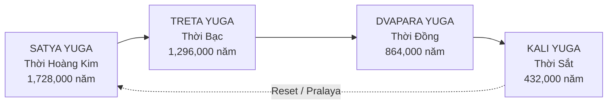
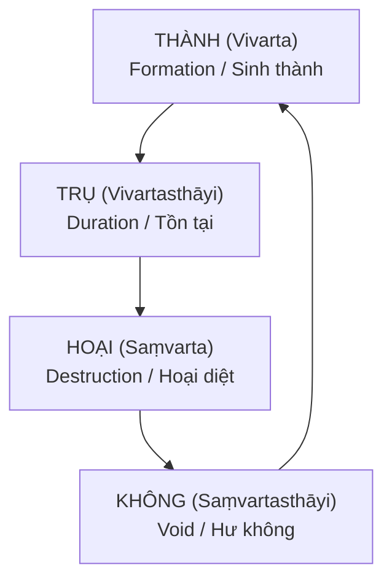

# Chu Kỳ Vũ Trụ — Yugas & Kalpas

Cả Hindu và Phật giáo đều mô tả vũ trụ vận hành theo **chu kỳ** — không phải tiến hóa tuyến tính như khoa học hiện đại dạy. Con người không "tiến hóa" từ vượn, mà **suy thoái** từ những thực thể cao hơn.

*Both Hindu and Buddhist traditions describe the universe operating in cycles — not linear evolution as modern science teaches. Humans didn't "evolve" from apes, but devolved from higher beings.*

---

## I. Hindu Yugas — Bốn Thời Đại / Four Ages

Theo truyền thống Hindu, thời gian được chia thành 4 Yugas, tạo thành một **Mahayuga** (Đại Kỷ).

*In Hindu tradition, time is divided into 4 Yugas, forming one Mahayuga (Great Age).*

### Chi Tiết Các Yugas / Yuga Details

| Yuga | Thời gian / Duration | Đạo đức / Dharma | Chiều cao / Height | Tuổi thọ / Lifespan |
|------|---------------------|------------------|--------------------|--------------------|
| **Satya** (Hoàng Kim / Golden) | 1,728,000 năm | 100% | ~9.5 mét / 31 ft | 100,000 năm |
| **Treta** (Bạc / Silver) | 1,296,000 năm | 75% | ~7 mét / 21 ft | 10,000 năm |
| **Dvapara** (Đồng / Bronze) | 864,000 năm | 50% | ~3.5 mét / 11 ft | 1,000 năm |
| **Kali** (Sắt / Iron) | 432,000 năm | 25% | ~1.6 mét / 5 ft | 100 năm |

> **Hiện tại:** Chúng ta đang ở **Kali Yuga** — thời kỳ suy tàn nhất, con người nhỏ nhất, tuổi thọ ngắn nhất, đạo đức thấp nhất.
>
> *Currently: We are in Kali Yuga — the most degenerate age, smallest humans, shortest lifespan, lowest morality.*

### Kali Yuga Bắt Đầu Khi Nào? / When Did Kali Yuga Begin?

Theo truyền thống Hindu: **3102 TCN** — khi Krishna rời thế gian.

*According to Hindu tradition: 3102 BCE — when Krishna left the world.*

Nếu Kali Yuga dài 432,000 năm, chúng ta mới đi được ~5,000 năm — tức là còn **427,000 năm** nữa mới đến Reset.

*If Kali Yuga is 432,000 years, we've only passed ~5,000 years — meaning 427,000 more years until Reset.*

---

## II. Buddhist Kalpas — Kiếp / Cosmic Eons

Phật giáo có hệ thống **Kalpa** (Kiếp) — đơn vị thời gian vũ trụ, mỗi Kalpa gồm 4 giai đoạn.

*Buddhism has the Kalpa system — cosmic time units, each Kalpa has 4 phases.*

### Kalpa Là Bao Lâu? / How Long is a Kalpa?

Đức Phật dùng ví dụ:

> *"Tưởng tượng một tảng đá 16x16x16 km. Mỗi 100 năm, có người dùng lụa mềm chạm nhẹ một lần. Khi tảng đá mòn hết — đó vẫn chưa hết một Kalpa."*
>
> *"Imagine a rock 16x16x16 km. Every 100 years, someone touches it once with soft silk. When the rock wears away — that's still not one Kalpa."*

### Con Người Thay Đổi Theo Kalpa / Humans Change Through Kalpas

Trong giai đoạn **Trụ** (tồn tại), con người thay đổi theo chu kỳ nhỏ hơn:

| Giai đoạn / Phase | Tuổi thọ / Lifespan | Chiều cao / Height | Đạo đức / Morality |
|-------------------|--------------------|--------------------|-------------------|
| Đỉnh / Peak | 84,000 năm | ~2,560 mét | Cao nhất / Highest |
| Giảm dần / Declining | Giảm 1 năm mỗi 100 năm | Giảm dần | Giảm dần |
| Đáy / Bottom | 10 năm | ~30 cm | Thấp nhất / Lowest |
| Tăng lại / Rising | Tăng 1 năm mỗi 100 năm | Tăng dần | Tăng dần |

> **Hiện tại:** Theo một số tính toán, tuổi thọ trung bình ~75-80 năm → chúng ta đang ở giai đoạn **giảm**, gần đáy.
>
> *Currently: Average lifespan ~75-80 years → we're in the declining phase, near bottom.*

---

## III. So Sánh Hindu vs Buddhist / Comparison

| Khía cạnh / Aspect | Hindu Yugas | Buddhist Kalpas |
|--------------------|-------------|-----------------|
| **Cấu trúc / Structure** | 4 Yugas tuần hoàn | 4 giai đoạn (Thành-Trụ-Hoại-Không) |
| **Thời gian / Duration** | 1 Mahayuga = 4.32 triệu năm | 1 Kalpa = không thể đếm |
| **Hiện tại / Current** | Kali Yuga (~5,000 năm rồi) | Giai đoạn Trụ, đang giảm |
| **Reset** | Pralaya (đại hủy diệt) | Hoại → Không → Thành |
| **Con người / Humans** | Nhỏ đi qua Yugas | Dao động trong giai đoạn Trụ |

**Điểm chung / Common ground:**
- Cả hai đều nói con người **từng lớn hơn, sống lâu hơn, tâm linh cao hơn**
- Cả hai đều mô tả **chu kỳ suy thoái** hiện tại
- Cả hai đều có concept **Reset** — vũ trụ hủy diệt và tái sinh

---

## IV. Connections — Giants & Hidden History

Nếu Yugas/Kalpas đúng, điều này giải thích:

### 1. Tại Sao Có Truyền Thuyết Giants Khắp Nơi?

Vì **thực sự có giants** — con người thời Satya Yuga cao ~9.5m, Treta ~7m. Họ dần nhỏ đi qua thời gian.

*Because giants actually existed — humans in Satya Yuga were ~9.5m tall, Treta ~7m. They gradually shrank over time.*

### 2. Tại Sao Kiến Trúc Cổ Có Tỷ Lệ Khổng Lồ?

Cửa cao 5-10m, trần 15-20m, bậc thang khổng lồ — không phải để "gây ấn tượng", mà **xây cho người lớn hơn**.

*Doors 5-10m high, 15-20m ceilings, giant stairs — not for "impression", but built for larger people.*

### 3. Tại Sao Văn Bản Cổ Nhắc Chiều Cao Cụ Thể?

| Nguồn / Source | Nội dung / Content |
|----------------|-------------------|
| **Hadith** | Adam cao 60 cubits (~27-30m) |
| **Book of Enoch** | Nephilim 300 cubits (~137m) |
| **Hindu Puranas** | Con người giảm từ 9.5m → 1.6m |
| **Buddhist texts** | Từ 2,560m → 30cm |

Những con số này **khớp với mô hình Yugas/Kalpas** — không phải metaphor.

*These numbers align with Yugas/Kalpas model — not metaphors.*

---

## V. Implications — Nếu Đúng Thì Sao? / What If True?

### Về Lịch Sử / About History

- **Tartaria, Mudflood, Reset events** có thể là những lần chuyển giao giữa các thời kỳ nhỏ trong Kali Yuga
- **Giants đi đâu?** — Chết trong Reset, hoặc di cư sang các tầng khác (Atlas, Akupara)

### Về Tương Lai / About Future

- Kali Yuga còn ~427,000 năm — nhưng có thể có **mini-resets** trong đó
- Giai đoạn "đáy" (tuổi thọ 10 năm, cao 30cm) vẫn ở phía trước?
- Hoặc một số truyền thống nói chúng ta **gần cuối Kali Yuga** hơn

### Về Tâm Linh / About Spirituality

> *"Đức Phật chọn sinh vào thời suy thoái vì: khó tu nhất = thành tựu cao nhất nếu vượt qua."*
>
> *"Buddha chose to be born in the degenerate age because: hardest to practice = highest achievement if overcome."*

---

## Related / Liên Quan

### Cosmology
- [[Vũ Trụ Học Phật Giáo]] — 6 cõi, Kinh Thế Ký
- [[Bức Tường Băng]] — Cosmic Egg structure
- [[Núi Tu Di]] — Trục vũ trụ

### Hidden History
- [[Lịch Sử Song Song — Khi Thế Giới Đồng Bộ]] — Giants evidence
- [[Tartaria]] — Đế chế bị xóa
- [[Mudflood]] — Reset events

### Spiritual
- [[Nhân Quả]] — Karma qua các kiếp
- [[Luân Hồi]] — Samsara mechanism

---

*"Thời gian là một vòng tròn, không phải đường thẳng."*
*"Time is a circle, not a line."*
