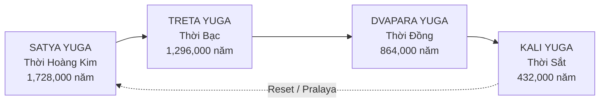
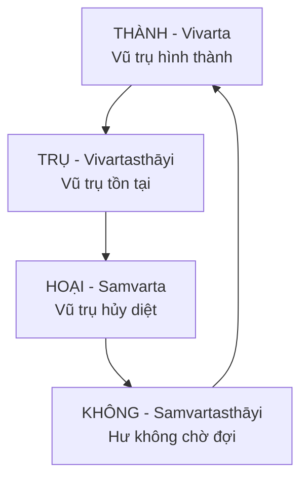

# Chu Kỳ Vũ Trụ - Yugas & Kalpas

> "Thời gian là một vòng tròn, không phải đường thẳng." - Truyền thống cổ đại

Khoa học hiện đại dạy rằng lịch sử là một đường thẳng tiến lên: từ vi khuẩn đến cá, từ cá đến vượn, từ vượn đến người, từ hang động đến smartphone. Mỗi thế hệ "tiến bộ" hơn thế hệ trước. Chúng ta đang ở đỉnh cao của văn minh.

*Modern science teaches that history is an upward line: from bacteria to fish, fish to apes, apes to humans, caves to smartphones. Each generation "progresses" beyond the previous. We're at the peak of civilization.*

Nhưng cả Hindu và Phật giáo - hai truyền thống có nguồn gốc hàng nghìn năm - đều kể một câu chuyện hoàn toàn ngược lại. Thời gian không phải đường thẳng mà là vòng tròn. Con người không tiến hóa lên mà đang suy thoái xuống. Và chúng ta không ở đỉnh cao - mà đang ở đáy.

*But both Hindu and Buddhist traditions - with origins thousands of years old - tell a completely opposite story. Time isn't a line but a circle. Humans aren't evolving up but devolving down. And we're not at the peak - we're at the bottom.*

---

## Tại Sao Điều Này Quan Trọng?

Trước khi đi vào chi tiết, hãy hiểu tại sao concept này matter.

*Before going into details, let's understand why this concept matters.*

Nếu lịch sử là đường thẳng tiến lên, mọi thứ trong quá khứ đều "primitive" hơn hiện tại. Kim tự tháp được xây bởi "nô lệ dùng dây thừng". [[Atlantis]] chỉ là huyền thoại. Giants chỉ là folklore. Và công nghệ cổ đại không thể tồn tại vì "họ chưa phát triển đến mức đó."

*If history is an upward line, everything in the past is more "primitive" than now. Pyramids were built by "slaves with ropes". [[Atlantis]] is just myth. Giants are just folklore. And ancient technology couldn't exist because "they hadn't developed to that level yet."*

Nhưng nếu lịch sử là vòng tròn suy thoái, mọi thứ đảo ngược. Những nền văn minh cổ đại có thể đã tiên tiến hơn chúng ta. Giants có thể là con người thời trước. Và những công trình "không thể giải thích" thực ra hoàn toàn có thể giải thích - nếu chúng ta chấp nhận rằng người xây chúng lớn hơn, sống lâu hơn, và có năng lực cao hơn chúng ta.

*But if history is a circle of devolution, everything reverses. Ancient civilizations may have been more advanced than us. Giants may have been humans of previous eras. And "unexplainable" structures are actually completely explainable - if we accept that their builders were larger, longer-lived, and more capable than us.*

---

## Hindu Yugas - Bốn Thời Đại

Theo truyền thống Hindu, thời gian được chia thành bốn Yugas (thời đại), tạo thành một Mahayuga (Đại Kỷ). Mỗi Yuga đánh dấu một giai đoạn trong sự suy thoái của nhân loại.

*According to Hindu tradition, time is divided into four Yugas (ages), forming one Mahayuga (Great Age). Each Yuga marks a phase in humanity's devolution.*

### Satya Yuga - Thời Hoàng Kim

Satya Yuga là thời đại đầu tiên và hoàn hảo nhất. Con người sống trong trạng thái gần như thần thánh - không cần lao động vì đất tự sinh sản, không có bệnh tật, không có xung đột. Đạo đức ở mức 100% - mọi người tự nhiên làm điều đúng vì đó là bản chất của họ, không cần luật lệ hay hình phạt.

*Satya Yuga is the first and most perfect age. Humans lived in an almost divine state - no work needed as earth produced spontaneously, no disease, no conflict. Morality at 100% - everyone naturally did right because it was their nature, no laws or punishments needed.*

Con người Satya Yuga cao khoảng 9.5 mét (31 feet) và sống trung bình 100,000 năm. Họ giao tiếp thần giao cách cảm, có siddhis (năng lực siêu nhiên) tự nhiên, và sống hòa hợp hoàn toàn với vũ trụ.

*Satya Yuga humans were about 9.5 meters (31 feet) tall and lived an average of 100,000 years. They communicated telepathically, had natural siddhis (supernatural powers), and lived in complete harmony with the cosmos.*

### Treta Yuga - Thời Bạc

Sự suy thoái bắt đầu. Đạo đức giảm xuống 75%. Con người bắt đầu phải lao động để sinh tồn. Bệnh tật xuất hiện. Xung đột bắt đầu. Chiều cao giảm xuống khoảng 7 mét, tuổi thọ giảm còn 10,000 năm.

*Devolution begins. Morality drops to 75%. Humans must now work to survive. Disease appears. Conflict starts. Height reduces to about 7 meters, lifespan to 10,000 years.*

Đây là thời đại của Rama - vị vua anh hùng trong Ramayana. Dù là thời suy thoái so với Satya, Treta Yuga vẫn là "Golden Age" so với tiêu chuẩn hiện đại.

*This is the age of Rama - the heroic king of Ramayana. Though degenerate compared to Satya, Treta Yuga is still a "Golden Age" by modern standards.*

### Dvapara Yuga - Thời Đồng

Đạo đức tiếp tục giảm xuống 50%. Chiến tranh trở nên phổ biến. Hệ thống giai cấp cứng nhắc hơn. Con người cần được dạy đạo đức vì nó không còn tự nhiên nữa. Chiều cao giảm còn khoảng 3.5 mét, tuổi thọ còn 1,000 năm.

*Morality continues dropping to 50%. War becomes common. Caste systems rigidify. Humans need to be taught morality as it's no longer natural. Height reduces to about 3.5 meters, lifespan to 1,000 years.*

Đây là thời đại của Krishna và cuộc chiến Mahabharata - trận chiến lớn giữa thiện và ác đánh dấu sự chuyển giao sang Kali Yuga.

*This is the age of Krishna and the Mahabharata war - the great battle between good and evil marking transition to Kali Yuga.*

### Kali Yuga - Thời Sắt

Và đây là nơi chúng ta đang ở.

*And this is where we are.*

Kali Yuga bắt đầu năm 3102 BCE theo truyền thống Hindu - đúng khi Krishna rời thế gian. Đạo đức chỉ còn 25% và tiếp tục giảm. Con người cao khoảng 1.6 mét và sống trung bình 100 năm - con số thấp nhất trong chu kỳ.

*Kali Yuga began in 3102 BCE according to Hindu tradition - exactly when Krishna left the world. Morality at only 25% and declining. Humans about 1.6 meters tall and live an average of 100 years - the lowest numbers in the cycle.*

Trong Kali Yuga, theo các Puranas: vua trở thành kẻ cướp, đạo đức bị đảo ngược, người giàu được tôn trọng hơn người tốt, tiền bạc trở thành thước đo duy nhất, hôn nhân chỉ dựa trên thỏa thuận, tôn giáo trở thành hình thức rỗng, và thiên tai ngày càng nhiều.

*In Kali Yuga, according to Puranas: kings become robbers, morality is inverted, the wealthy are respected over the good, money becomes the only measure, marriage is based only on agreement, religion becomes empty form, and natural disasters increase.*

Nghe quen không?

*Sound familiar?*

---

## Buddhist Kalpas - Kiếp

Phật giáo có hệ thống tương tự nhưng với quy mô còn lớn hơn. Một Kalpa (Kiếp) là đơn vị thời gian vũ trụ, dài đến mức không thể đo bằng số.

*Buddhism has a similar system but on an even larger scale. A Kalpa is a cosmic time unit, so long it can't be measured by numbers.*

### Đức Phật Mô Tả Kalpa

Đức Phật không đưa ra con số cụ thể mà dùng ví dụ để cho thấy quy mô không thể tưởng tượng được:

*Buddha didn't give specific numbers but used analogies to show the unimaginable scale:*

> "Hãy tưởng tượng một tảng đá khổng lồ, 16 yojanas chiều dài, 16 yojanas chiều rộng, 16 yojanas chiều cao (khoảng 160 x 160 x 160 km). Mỗi 100 năm, có người đến chạm nhẹ tảng đá một lần bằng miếng lụa mỏng nhất. Khi tảng đá mòn hết - đó vẫn chưa hết một Kalpa."
>
> *"Imagine a massive rock, 16 yojanas long, 16 wide, 16 high (about 160 x 160 x 160 km). Every 100 years, someone comes and touches it once with the softest silk. When the rock wears away - that's still not one Kalpa."*

### Con Người Thay Đổi Trong Giai Đoạn Trụ

Trong giai đoạn Trụ (khi vũ trụ tồn tại ổn định), con người trải qua những chu kỳ nhỏ hơn. Tuổi thọ và chiều cao dao động giữa đỉnh và đáy.

*During the Duration phase (when the universe exists stably), humans go through smaller cycles. Lifespan and height fluctuate between peak and bottom.*

Ở đỉnh: tuổi thọ 84,000 năm, chiều cao khoảng 2,560 mét. Đạo đức cao nhất, bệnh tật hầu như không tồn tại.

*At peak: lifespan 84,000 years, height about 2,560 meters. Highest morality, disease barely exists.*

Ở đáy: tuổi thọ chỉ 10 năm, chiều cao khoảng 30 cm. Đạo đức sụp đổ hoàn toàn, con người giết nhau vô cớ.

*At bottom: lifespan only 10 years, height about 30 cm. Morality completely collapsed, humans kill each other without reason.*

Chu kỳ giảm: mỗi 100 năm, tuổi thọ giảm 1 năm. Từ 84,000 xuống 10 = 8,399,000 năm.

*Declining cycle: every 100 years, lifespan decreases by 1 year. From 84,000 to 10 = 8,399,000 years.*

Nếu tuổi thọ trung bình hiện tại khoảng 75-80 năm, chúng ta đang ở đâu đó gần đáy của chu kỳ giảm. Không còn xa nữa.

*If current average lifespan is about 75-80 years, we're somewhere near the bottom of the declining cycle. Not far to go.*

---

## So Sánh Hai Hệ Thống

Dù có khác biệt về chi tiết, cả Hindu Yugas và Buddhist Kalpas đều đồng ý về những điểm cốt lõi:

*Despite differences in detail, both Hindu Yugas and Buddhist Kalpas agree on core points:*

**Con người từng lớn hơn.** Satya Yuga 9.5m, Treta 7m, Dvapara 3.5m, Kali 1.6m. Buddhist traditions mô tả từ 2,560m đến 30cm. Dù con số khác nhau, xu hướng giống nhau: shrinking.

***Humans were once larger.** Satya Yuga 9.5m, Treta 7m, Dvapara 3.5m, Kali 1.6m. Buddhist traditions describe from 2,560m to 30cm. Though numbers differ, trend is the same: shrinking.*

**Con người từng sống lâu hơn.** 100,000 năm giảm xuống 100 năm (Hindu). 84,000 năm giảm xuống 10 năm (Buddhist). Tuổi thọ ngắn dần qua thời gian.

***Humans once lived longer.** 100,000 years down to 100 years (Hindu). 84,000 years down to 10 years (Buddhist). Lifespan shortening over time.*

**Đạo đức từng cao hơn.** 100% giảm xuống 25% (Hindu). Dharma/Karma tự nhiên biến mất, cần luật lệ và hình phạt thay thế.

***Morality was once higher.** 100% down to 25% (Hindu). Natural Dharma/Karma disappears, needs laws and punishments to replace.*

**Năng lực từng mạnh hơn.** Siddhis (thần thông), giao tiếp thần giao cách cảm, trí nhớ hoàn hảo - tất cả mất dần qua các thời đại.

***Capabilities were once greater.** Siddhis (supernatural powers), telepathic communication, perfect memory - all gradually lost through ages.*

---

## Bằng Chứng: Giants và Kiến Trúc

Nếu con người từng cao 7-10 mét hoặc hơn, điều này giải thích nhiều bí ẩn khảo cổ.

*If humans were once 7-10 meters or taller, this explains many archaeological mysteries.*

### Truyền Thuyết Giants Khắp Nơi

Mọi nền văn hóa trên thế giới đều có truyền thuyết về giants. Nephilim trong Kinh Thánh. Titans trong Hy Lạp. Jotnar trong Norse. Daitya và Rakshasa trong Hindu. Oni trong Nhật Bản. Người khổng lồ trong folklore Việt Nam.

*Every culture worldwide has legends of giants. Nephilim in the Bible. Titans in Greece. Jotnar in Norse. Daitya and Rakshasa in Hindu. Oni in Japan. Giants in Vietnamese folklore.*

Mainstream giải thích đây là "metaphor" hoặc "exaggeration". Nhưng nếu con người thực sự từng cao 7-10 mét trong các Yuga trước, những truyền thuyết này không phải fiction - mà là memory.

*Mainstream explains these as "metaphor" or "exaggeration". But if humans really were 7-10 meters tall in previous Yugas, these legends aren't fiction - they're memory.*

### Kiến Trúc Không Tương Xứng

Hãy nhìn các công trình cổ đại qua lens này.

*Look at ancient structures through this lens.*

Cửa trong các đền Ai Cập và Peru cao 5-10 mét. Bậc thang khổng lồ không phù hợp với bước chân người hiện đại. Trần nhà cao 15-20 mét trong các tòa nhà "tôn giáo". Ghế đá và ngai vàng quá lớn cho người bình thường.

*Doors in Egyptian and Peruvian temples are 5-10 meters high. Giant stairs don't fit modern human steps. Ceilings 15-20 meters high in "religious" buildings. Stone seats and thrones too large for normal people.*

Mainstream giải thích: "để gây ấn tượng với dân chúng", "để tôn vinh thần linh", "để thể hiện quyền lực".

*Mainstream explains: "to impress the populace", "to honor the gods", "to show power".*

Giải thích đơn giản hơn: chúng được xây cho người lớn hơn.

*Simpler explanation: they were built for larger people.*

### Hadith và Kinh Thánh

Hadith (lời của Prophet Muhammad) ghi nhận: "Allah tạo Adam cao 60 cubits" - khoảng 27-30 mét.

*Hadith (sayings of Prophet Muhammad) records: "Allah created Adam 60 cubits tall" - about 27-30 meters.*

Book of Enoch mô tả Nephilim (con của "thiên thần" và phụ nữ loài người) cao 300 cubits - khoảng 137 mét.

*Book of Enoch describes Nephilim (children of "angels" and human women) as 300 cubits tall - about 137 meters.*

Dù con số cụ thể có thể bị exaggerate qua thời gian, pattern rõ ràng: các văn bản cổ đại từ nhiều truyền thống khác nhau đều nhất quán rằng con người cổ đại lớn hơn đáng kể.

*Though specific numbers may be exaggerated over time, the pattern is clear: ancient texts from many different traditions consistently agree that ancient humans were significantly larger.*

---

## Connections Với Vault

### Atlantis và Reset

[[Atlantis]] sụp đổ khoảng 11,500 năm trước - có thể đánh dấu một mini-reset trong Kali Yuga. Những người sống sót (nhỏ hơn tổ tiên nhưng vẫn lớn hơn chúng ta?) mang kiến thức đến Ai Cập, Maya, Ấn Độ - giải thích tại sao những nền văn minh này "xuất hiện đột ngột" với kiến thức tiên tiến.

*[[Atlantis]] collapsed about 11,500 years ago - possibly marking a mini-reset within Kali Yuga. Survivors (smaller than ancestors but still larger than us?) brought knowledge to Egypt, Maya, India - explaining why these civilizations "appeared suddenly" with advanced knowledge.*

### Tartaria và Mudflood

[[Tartaria]] và [[Mudflood]] có thể là reset gần đây hơn - trong vài trăm năm qua. Nếu đúng, những người xây các tòa nhà "Tartarian" với tỷ lệ khổng lồ có thể là thế hệ con người lớn hơn chúng ta một chút, trước khi reset cuối cùng xóa sổ họ.

*[[Tartaria]] and [[Mudflood]] may be more recent resets - within the past few hundred years. If true, those who built "Tartarian" buildings with giant proportions may have been a generation of humans slightly larger than us, before the final reset wiped them out.*

### Annunaki và Genetic Engineering

Một số theories kết hợp Yugas với [[Annunaki]]: có thể các Annunaki can thiệp vào DNA con người để "lock" chúng ta ở trạng thái suy thoái, ngăn chặn quá trình tự nhiên quay lại Satya Yuga. Hoặc họ tạo ra một "phiên bản thu nhỏ" của loài người để dễ kiểm soát hơn.

*Some theories combine Yugas with [[Annunaki]]: perhaps Annunaki intervened in human DNA to "lock" us in a degenerate state, preventing natural return to Satya Yuga. Or they created a "miniaturized version" of humanity for easier control.*

### Loosh và Mục Đích Suy Thoái

Theo framework [[Loosh - Năng Lượng Thu Hoạch Từ Con Người|Loosh]], con người trong trạng thái suy thoái sản xuất nhiều năng lượng cảm xúc tiêu cực hơn. Fear, anger, despair - tất cả là "thức ăn" cho những thực thể ở tầng khác.

*According to the [[Loosh - Năng Lượng Thu Hoạch Từ Con Người|Loosh]] framework, humans in a degenerate state produce more negative emotional energy. Fear, anger, despair - all "food" for entities on other planes.*

Nếu Satya Yuga con người sống trong hòa bình và hạnh phúc, họ không sản xuất nhiều Loosh. Suy thoái xuống Kali Yuga = harvest bountiful hơn. Đây có thể là lý do thực sự tại sao chu kỳ được duy trì.

*If Satya Yuga humans lived in peace and happiness, they didn't produce much Loosh. Devolution to Kali Yuga = more bountiful harvest. This may be the real reason why the cycle is maintained.*

---

## Tương Lai - Còn Bao Lâu Nữa?

Theo tính toán Hindu, Kali Yuga bắt đầu 3102 BCE và kéo dài 432,000 năm. Chúng ta mới đi được khoảng 5,000 năm - còn 427,000 năm nữa.

*According to Hindu calculation, Kali Yuga began 3102 BCE and lasts 432,000 years. We've only passed about 5,000 years - 427,000 more to go.*

Nhưng có những interpretation khác. Sri Yukteswar (guru của Paramahansa Yogananda) cho rằng Kali Yuga đã kết thúc năm 1699, và chúng ta đang ở Dvapara Yuga - giải thích sự bùng nổ công nghệ từ thế kỷ 18. Theo calculation này, chúng ta đang ascending, không descending.

*But there are other interpretations. Sri Yukteswar (guru of Paramahansa Yogananda) believed Kali Yuga ended in 1699, and we're in Dvapara Yuga - explaining the technological explosion since the 18th century. According to this calculation, we're ascending, not descending.*

Dù theo interpretation nào, một điều rõ ràng: chúng ta không ở đỉnh cao của nhân loại. Chúng ta hoặc đang ở đáy và chuẩn bị đi lên, hoặc đang tiếp tục đi xuống. Cả hai đều có implications lớn.

*Regardless of interpretation, one thing is clear: we're not at humanity's peak. We're either at the bottom and preparing to rise, or continuing to fall. Both have major implications.*

---

## Bài Học Từ Chu Kỳ

### Cho Cá Nhân

Nếu chúng ta đang ở giai đoạn suy thoái, việc tu tập tâm linh khó hơn - nhưng cũng có giá trị hơn. Đức Phật chọn sinh vào thời kỳ này vì: "Khi tu trong nghịch cảnh, thành tựu cao hơn."

*If we're in a degenerate phase, spiritual practice is harder - but also more valuable. Buddha chose to be born in this era because: "When practicing in adversity, achievement is higher."*

### Cho Xã Hội

Đừng ngạc nhiên khi thấy đạo đức suy đồi, lãnh đạo tham nhũng, chiến tranh bất tận. Đây là đặc điểm của Kali Yuga, không phải anomaly. Hiểu điều này giúp chúng ta không mất hy vọng - vì biết đây là phase, không phải permanent state.

*Don't be surprised to see declining morality, corrupt leaders, endless wars. These are Kali Yuga characteristics, not anomalies. Understanding this helps us not lose hope - knowing this is a phase, not a permanent state.*

### Cho Lịch Sử

Nhìn quá khứ với lens này thay đổi mọi thứ. Những "primitive ancestors" có thể đã tiên tiến hơn chúng ta. Những "mythological giants" có thể là historical giants. Và những "impossible structures" có thể hoàn toàn possible - với builders lớn hơn, khỏe hơn, và sống lâu hơn chúng ta.

*Looking at the past through this lens changes everything. Those "primitive ancestors" may have been more advanced than us. Those "mythological giants" may have been historical giants. And those "impossible structures" may have been completely possible - with builders larger, stronger, and longer-lived than us.*

---

## Related

### Cosmology
- [[Vũ Trụ Học Phật Giáo]] - 6 cõi và cấu trúc vũ trụ
- [[Núi Tu Di]] - Trục vũ trụ trong Buddhist cosmology
- [[Sacred Geometry]] - Patterns vũ trụ

### Hidden History
- [[Thuyết Tiến Hóa - Các Nền Văn Minh Bị Che Giấu]] - Darwin debunked
- [[Atlantis]] - Nền văn minh bị xóa
- [[Tartaria]] - Reset gần đây
- [[Mudflood]] - Sự kiện reset
- [[Lịch Sử Song Song — Khi Thế Giới Đồng Bộ]] - Unified timeline

### Genetic Engineering
- [[Annunaki]] - Có can thiệp vào chu kỳ?
- [[Chimera]] - DNA manipulation

### Spiritual
- [[Nhân Quả]] - Karma qua các kiếp
- [[Luân Hồi]] - Samsara và chu kỳ tái sinh
- [[Loosh - Năng Lượng Thu Hoạch Từ Con Người]] - Tại sao duy trì suy thoái?
- [[Gnosis]] - Trí tuệ trực tiếp vượt thời đại

### Modern Era
- [[Vận Chín]] - Period 9 (2024-2044) và Fire energy
