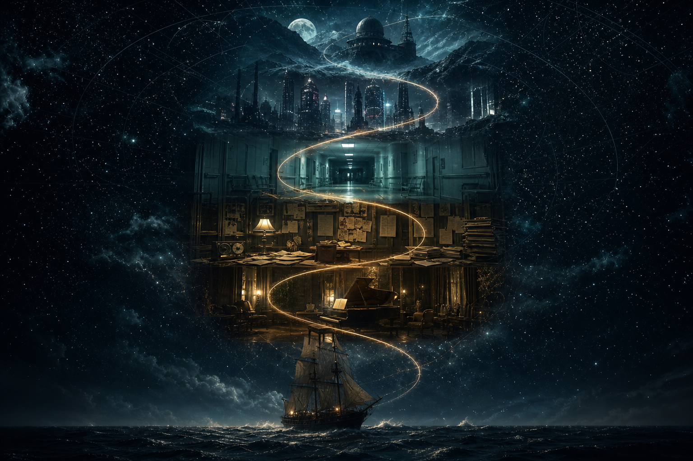
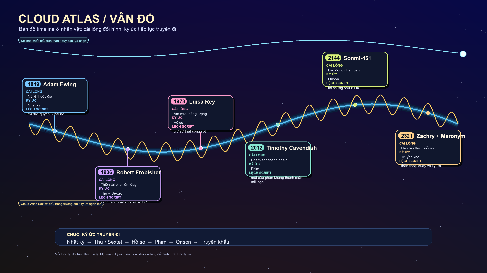
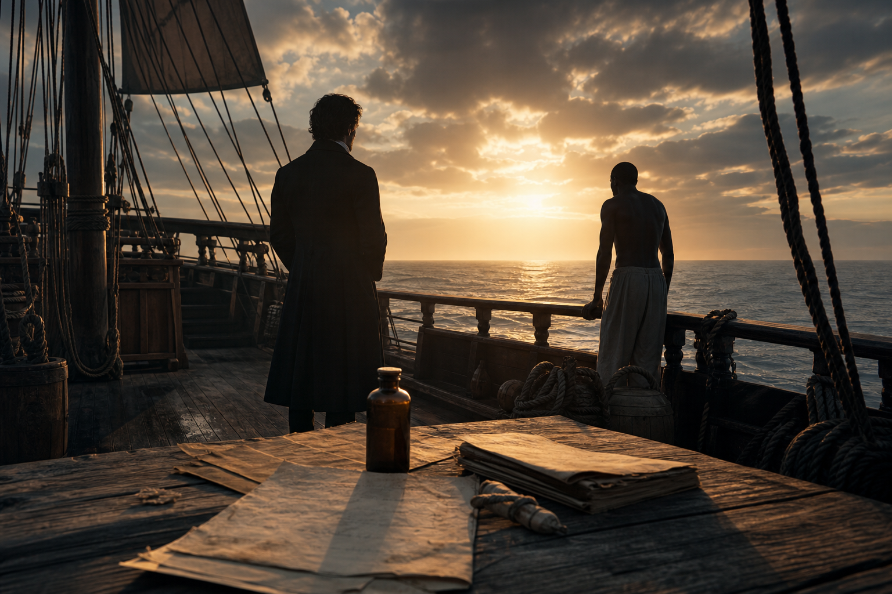
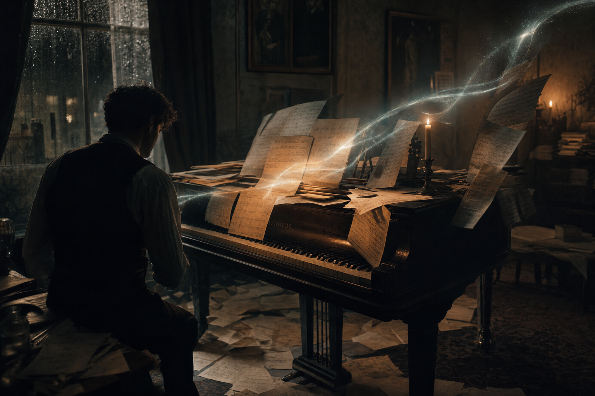
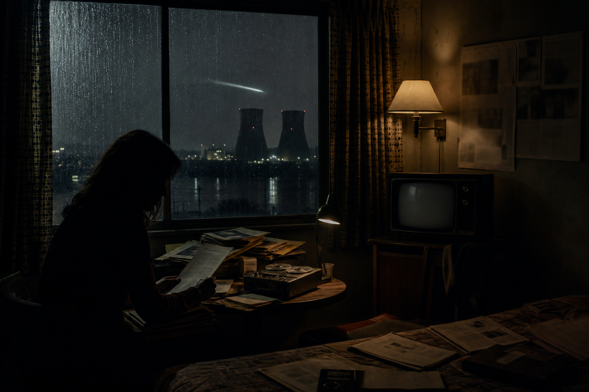
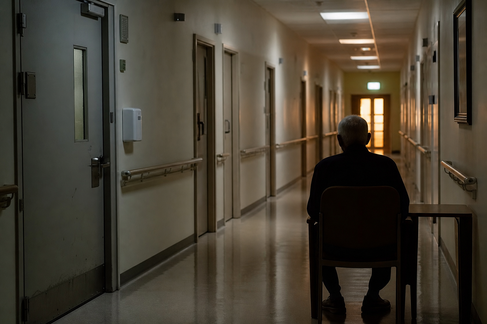
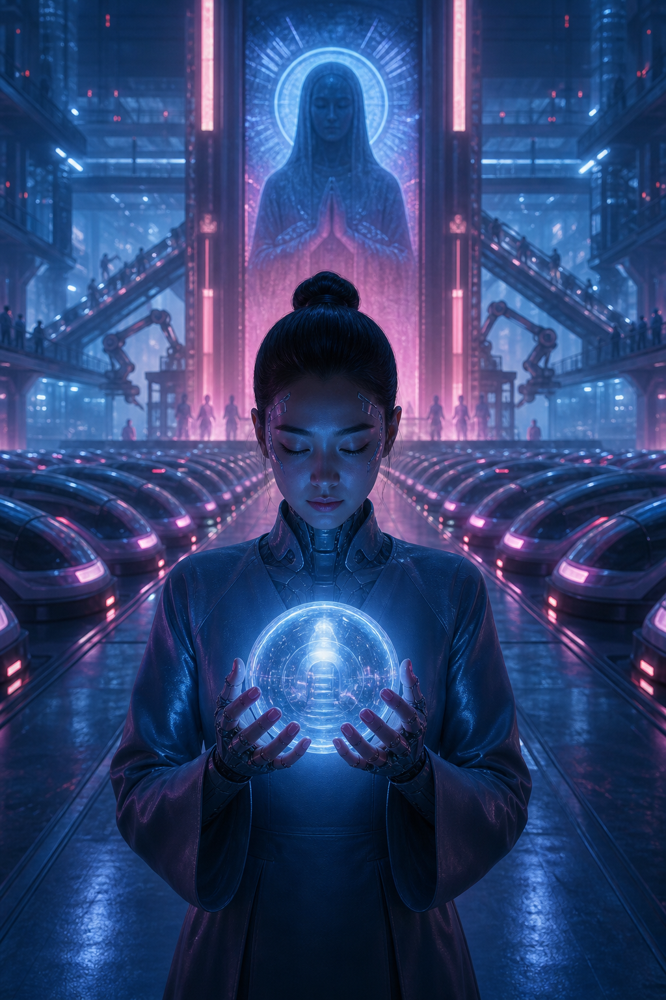
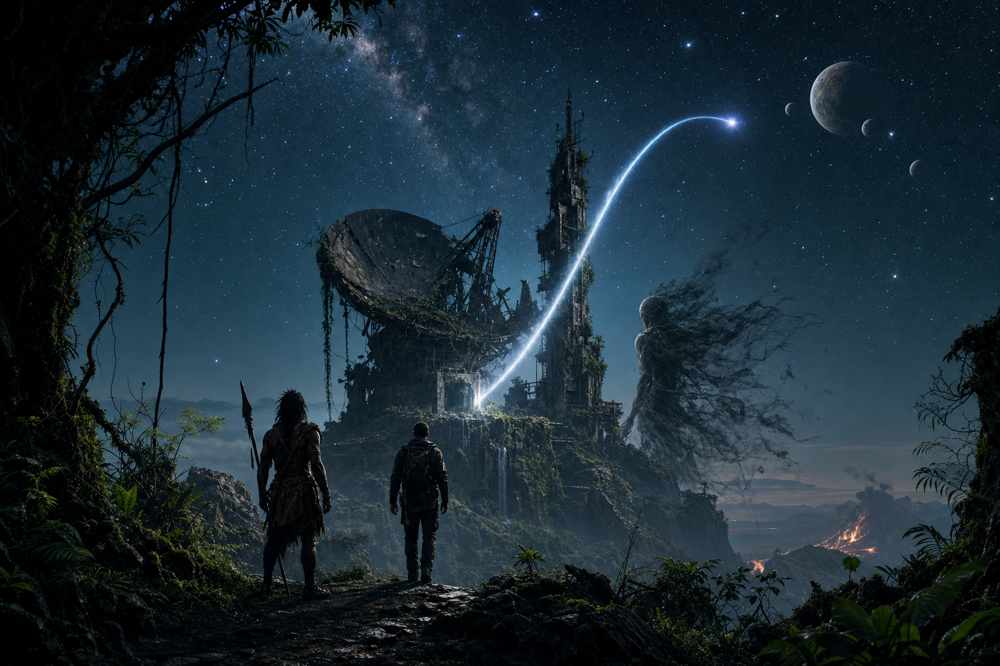

# Cloud Atlas — Vân Đồ Của Luân Hồi, Ma Trận Và Lời Chứng Xuyên Thời Gian

**Cloud Atlas không chỉ là một bộ phim về luân hồi. Nó là một bản đồ sáu thời đại của [[Ma Trận]]: mỗi thời có một hình thức nô lệ riêng, nhưng ký ức, nghệ thuật, lời chứng và một hành động đúng có thể truyền qua thời gian để phá vòng lặp nhân quả.**

Nếu *The Matrix* hỏi: “Thực tại này có phải một giao diện không?”, thì *Cloud Atlas* hỏi câu sâu hơn: nếu giao diện đó lặp lại qua nhiều thế kỷ, nhiều thân phận và nhiều hình thức quyền lực, điều gì trong con người đủ thật để không bị tái lập thành nô lệ?

Câu trả lời của phim không phải một giáo điều. Nó là một nhịp ba bước: **nhớ lại, làm chứng, hành động**.

---

## Lưu Ý Trước Khi Đọc

Bài này có phân tích trực tiếp các tuyến truyện, lời chứng của Sonmi và cấu trúc kết thúc của *Cloud Atlas*. Nếu bạn chưa xem phim và muốn giữ trải nghiệm nguyên vẹn, nên xem phim trước rồi quay lại đọc. Bộ phim này giống một bản nhạc hơn là một câu đố: biết trước vài sự kiện không phá hỏng toàn bộ trải nghiệm, nhưng cảm giác khi tự nghe thấy giai điệu lặp lại qua các thời đại thì đáng được giữ.

---

## Cách Đọc Bài Này

Bài này đặt *Cloud Atlas* trong cụm [[Ma Trận]], [[Gnosis]], [[Luân Hồi]], [[Nhân Quả]] và [[Hollywood - Cây Đũa Phép Của Phù Thủy]]. Không nên đọc nó như bằng chứng rằng luân hồi vận hành đúng một mô hình duy nhất. Cũng không nên đọc nó như một bài điểm phim đơn thuần. Đây là một nghiên cứu trường hợp về cách điện ảnh có thể nén những câu hỏi lớn của vault vào hình ảnh, nhạc nền, nhân vật và lời chứng.

Ở tầng sự kiện, phim kể sáu tuyến thời gian. Ở tầng hệ thống, sáu tuyến đó là sáu cái lồng. Ở tầng biểu tượng, dấu sao chổi và *Cloud Atlas Sextet* là hai sợi chỉ nối ký ức xuyên thời đại. Ở tầng tổng hợp suy đoán, phim gợi ý rằng linh hồn, hành động và lời chứng có thể tạo tiếng vọng vượt khỏi một đời người.

Điểm quan trọng là giữ đúng kỷ luật nguồn: biểu tượng mạnh không biến nó thành sự kiện, nhưng tầng sự kiện cũng không đủ để giải thích vì sao một câu chuyện chạm sâu vào linh hồn người xem.

*Bản đồ đọc nhanh: mỗi thời đại đổi “cái lồng”, nhưng một mảnh ký ức luôn thoát khỏi lồng đó để đánh thức thời đại sau.*

---

## Vân Đồ, Sao Chổi Và Bản Nhạc

“Vân đồ” là bản đồ của mây. Mây luôn đổi hình, nhưng khi nhìn đủ xa, ta thấy hướng gió, dòng khí và cấu trúc ẩn phía sau. *Cloud Atlas* cũng vậy. Các nhân vật tưởng rời rạc, nhưng khi đặt cạnh nhau, họ tạo thành một bản đồ của những mẫu hình nổi lên rồi tan đi trên bầu trời thời gian.

Dấu sao chổi là đường bằng ánh sáng. Nó xuất hiện trên các nhân vật trung tâm như một vết khắc của quỹ đạo. Không cần đọc nó cứng thành “đây chắc chắn là cùng một linh hồn”. Cách đọc sạch hơn là: sao chổi đánh dấu một sợi liên tục xuyên qua hiện thân, thời đại và căn tính. Sao chổi không đứng yên như huy hiệu. Nó đi qua bầu trời, để lại vệt sáng rồi biến mất. Nhân vật trong phim cũng vậy: xuất hiện ngắn ngủi trong một đời, nhưng để lại quỹ đạo cho đời sau.

Điểm đẹp của biểu tượng sao chổi là nó không thuộc hoàn toàn về đất cũng không thuộc hoàn toàn về trời. Nó là vật thể đi ngang qua nhận thức của con người, khiến người dưới mặt đất ngước lên và nhớ rằng đời mình nằm trong một quỹ đạo lớn hơn. Vì vậy dấu sao chổi không chỉ là “dấu nhận diện linh hồn”. Nó là lời nhắc rằng có những lựa chọn đời này chỉ hiện ra như một vệt sáng ngắn, nhưng vẫn đổi hướng bầu trời của người đến sau.

*Cloud Atlas Sextet* là đường bằng âm thanh. Bản nhạc của Frobisher không chỉ là một tác phẩm trong tuyến 1936. Nó là trường giai điệu của toàn bộ phim, vang lên khi rõ, khi chìm dưới nền, như một ký ức không chịu biến mất. Nếu dấu sao chổi là dấu trên thân thể, thì Sextet là dấu trong trường. Một cái đánh dấu hiện thân; một cái đánh dấu tần số. Cả hai cùng nói rằng sự liên tục không chỉ nằm trong niên đại, mà còn nằm trong cộng hưởng.

Sextet còn làm một việc mà hình ảnh không làm được: nó đi qua lý trí. Một bản nhạc không cần giải thích trước khi chạm vào người nghe. Luisa Rey không cần biết Frobisher là ai để cảm thấy bản nhạc quen. Người xem cũng không cần nắm hết cấu trúc phim để nhận ra có một giai điệu đang gọi các đời sống rời rạc về cùng một trường ký ức. Đây là chỗ *Cloud Atlas* rất gần với [[Vô Thức Tập Thể]]: ký ức không chỉ là thứ được kể lại, mà còn là thứ được ngân lên.

### Dấu Vết Khi Xem Phim

Nếu xem lại phim, có hai dấu vết nên để ý. Dấu thứ nhất là **bản nhạc**. *Cloud Atlas Sextet* được sinh ra trong tuyến Frobisher: Ayrs nghe một giai điệu trong mơ, Frobisher nhận ra và gọi nó thành Sextet. Sau đó nó không ở yên trong năm 1936. Luisa Rey nghe bản thu ở cửa hàng đĩa và có cảm giác quen lạ, như thể ký ức không đi bằng lời mà đi bằng âm. Về sau, motif của Sextet tiếp tục vang trong score của phim, khi rõ thành bản nhạc, khi chìm thành nền cảm xúc. Nó là cách phim cho người xem “nghe” thấy sự liên tục trước khi hiểu nó bằng đầu óc.

Dấu thứ hai là **birthmark hình sao chổi**. Trong phim, dấu này xuất hiện trên các nhân vật trung tâm của từng tuyến: Adam Ewing, Robert Frobisher, Luisa Rey, Timothy Cavendish, Sonmi-451 và Zachry. Vị trí trên cơ thể không phải điều quan trọng nhất; điều quan trọng là phim dùng cùng một hình sao chổi để đánh dấu những người đang mang một điểm lệch khỏi kịch bản của thời đại mình. Họ không giống nhau về tính cách, đạo đức hay mức độ tỉnh thức. Nhưng họ cùng là những chỗ dòng thời gian đổi hướng.

Vì vậy, sao chổi và Sextet là một cặp dấu vết: một cái nhìn thấy trên thân thể, một cái nghe thấy trong trường âm. Sao chổi nói: có một quỹ đạo đang đi qua nhiều hiện thân. Sextet nói: có một ký ức đang vang qua nhiều thời đại. Một dấu bằng ánh sáng, một dấu bằng âm thanh. Cả hai giúp người xem cảm được điều mà phim không cần giải thích trực tiếp: đời sống không khép lại ở biên giới của một cá nhân.

---

## Sáu Thời Đại, Sáu Cái Lồng

*Cloud Atlas* không kể sáu chuyện riêng. Nó chơi một bản nhạc sáu bè. Mỗi bè có một thời đại, một cái lồng, một khoảnh khắc chống lại cái lồng, và một mảnh ký ức được gửi sang tương lai.

Cách dễ nắm nhất là nhìn sáu tuyến như sáu phiên bản của cùng một câu hỏi: nô lệ đang mặc áo gì trong thời đại này? Khi còn thô, nó là xiềng xích và chủng tộc. Khi tinh vi hơn, nó là quyền sở hữu nghệ thuật, quyền sở hữu thông tin, quyền sở hữu tuổi già, quyền sở hữu thân xác nhân bản, rồi cuối cùng là quyền sở hữu nỗi sợ trong tâm thức hậu tận thế.

Năm 1849, Adam Ewing bước vào câu chuyện bằng một lời nói dối cổ nhất của văn minh: người này có quyền sở hữu người kia vì chủng tộc, đế chế, luật pháp, thần học hoặc “trật tự tự nhiên”. Adam không phải phản diện. Anh là một người tử tế nhưng vẫn nằm trong thế giới quan của giai cấp mình. Chính điều đó mới nguy hiểm. Ma Trận không cần mọi người đều là quỷ. Nó chỉ cần người tử tế chấp nhận một khung sai là bình thường.

Dr. Henry Goose là hình tượng của người chữa lành giả: nói bằng ngôn ngữ y học, nhưng chức năng là khai thác. Autua là người phá khung. Sự tồn tại của Autua buộc Adam phải chọn giữa trật tự xã hội an toàn và sự thật đơn giản rằng một con người không phải tài sản. Khi Adam chọn đứng về phong trào bãi nô, anh không lật đổ nô lệ ngay. Nhưng anh tạo một điểm lệch trong dòng thời gian. Một người đổi phe khỏi đặc quyền của chính mình. Đại dương được tạo bởi từng giọt nước.

Năm 1936, Robert Frobisher bị kẹt trong một cái lồng khác. Không phải xiềng xích vật lý, mà là gác cổng giai cấp, đe dọa tình dục, bảo trợ nghệ thuật và quyền sở hữu sáng tạo. Vyvyan Ayrs muốn sở hữu tác phẩm như đế chế sở hữu đất và chủ nô sở hữu thân xác. Ở tầng mẫu hình, đây vẫn là nô lệ: không phải nô lệ của thân xác, mà là nô lệ của lửa sáng tạo.

Frobisher để lại bản nhạc khi thân xác không còn. *Cloud Atlas Sextet* trở thành vật thể ký ức, nhưng còn hơn một vật thể. Nó là giai điệu của một đời không chịu bị xóa. Khi Luisa Rey nghe bản nhạc ấy ở tuyến 1973, cô có cảm giác như mình đã biết nó từ trước. Phim không cần nhân vật nói “tôi nhớ tiền kiếp”. Nó cho thấy ký ức có thể trở lại dưới dạng hấp dẫn, âm nhạc, déjà vu, nỗi buồn không rõ nguồn, hoặc lòng can đảm không biết học từ đâu.

Năm 1973, Luisa Rey đối diện Ma Trận của quyền lực năng lượng doanh nghiệp. Không còn roi da, không còn chủ nô, không còn người bảo trợ quý tộc. Ở đây cái lồng là báo cáo bị giấu, người tố giác bị giết, truyền thông bị thao túng và an toàn công chúng bị hy sinh cho lợi nhuận.

Sixsmith khi già mang ký ức từ Frobisher sang tuyến này. Một người từng nhận thư tình của Frobisher nay cố gắng gửi một bản báo cáo cứu mạng người khác. Tình yêu bị cấm trong 1936 trở thành lương tri trong 1973. Bill Smoke là tay vận hành của hệ thống: không cần tin hệ tư tưởng, chỉ cần làm việc được giao. Luisa không thắng bằng sức mạnh. Cô thắng bằng sự bền bỉ của lời chứng. Cô giữ câu hỏi sống sót đủ lâu để hệ thống không chôn được hoàn toàn.

Năm 2012, tuyến Timothy Cavendish nhìn như mảng hài giảm căng, nhưng rất redpill. Một viện dưỡng lão được trình bày như định chế chăm sóc, nhưng vận hành như nhà tù. Người vào không ra được. Liên lạc với bên ngoài bị kiểm soát. Y học, lịch trình và giấy tờ pháp lý biến sự giam giữ thành “quy trình”.

Đây là Ma Trận ở dạng mềm: không cần gọi là nhà tù nếu giấy tờ gọi nó là chăm sóc. Cavendish đọc câu chuyện Luisa Rey như hư cấu, nhưng ngay khi bị nhốt, hư cấu biến thành tấm gương. Sau này Sonmi xem phim Cavendish và giữ lại một câu phản kháng: “Tôi sẽ không chịu sự lạm dụng tội phạm.” Một khoảnh khắc trốn thoát gần như hài hước trong 2012 trở thành mầm nổi loạn trong 2144. Đó là cách thần thoại hoạt động: nó giữ lại một nhịp từ chối để truyền sang một ý thức đang chờ tín hiệu.

---

## Sonmi-451 Và Gnosis Của Nô Lệ Nhân Tạo

Sonmi-451 là trái tim huyền học của *Cloud Atlas*. Cô sinh ra trong một tôn giáo doanh nghiệp hoàn chỉnh. Fabricant được tạo ra để phục vụ. Soap giữ họ ngoan ngoãn. Papa Song là ngôi đền của chủ nghĩa tiêu dùng. “Nghỉ hưu” là huyền thoại thiên đường. Sự vâng lời được đóng gói thành đức hạnh.

Đây là [[Ma Trận]] ở dạng tinh khiết: không chỉ kiểm soát hành vi, mà kiểm soát bản thể luận. Sonmi không chỉ bị bắt làm nô lệ. Cô được dạy rằng nô lệ là bản chất của cô.

Gnosis xảy ra khi bản thể luận đó sụp.

Cảnh Sonmi thấy các fabricant bị giết mổ và tái chế thành thức ăn là một nghi lễ thánh thể đen: hệ thống cho nô lệ ăn chính thân xác của nô lệ, rồi gọi đó là dinh dưỡng. Đây là kinh tế ăn thịt người ở dạng biểu tượng. Lao động bị hút. Thân xác bị tái chế. Ký ức bị xóa. Đau khổ bị che bằng thần thoại về phục vụ.

Không nên đọc cảnh này như bằng chứng rằng ngoài đời có đúng mô hình đó. Đọc đúng hơn: đây là nén biểu tượng của mọi hệ thống ăn con người rồi gọi đó là tiến bộ.

Sonmi không sống sót. Nhưng lời chứng sống sót. Đó là điểm phim vượt qua ảo tưởng anh hùng. Gnosis không phải lúc nào cũng cứu hiện thân. Đôi khi Gnosis biến hiện thân thành orison để các đời sau còn đường mà nhớ.

Đây là nghịch lý mạnh nhất của Sonmi: hệ thống có thể giết người nói, nhưng không chắc giết được lời đã được đặt đúng vào dòng thời gian. Ở tầng hiện tại, Sonmi thua. Ở tầng thần thoại, Sonmi thắng. Lời chứng của cô không cần tồn tại như bằng chứng pháp lý mãi mãi; nó cần tồn tại như một hạt giống đủ mạnh để một người ở thời đại khác nhận ra: cái lồng của mình không phải toàn bộ thực tại.

> Sự thật có thể thua ở tòa án, thua trên truyền thông, thua trong phòng hành quyết, nhưng vẫn thắng trong thần thoại.

### Tuyên Ngôn Của Sonmi

Sonmi quan trọng không chỉ vì cô nổi loạn. Cô quan trọng vì lời nói của cô thoát khỏi khuôn dạng cá nhân để trở thành mệnh đề siêu hình.

> “Nếu tôi tiếp tục vô hình, sự thật sẽ vẫn bị che giấu. Tôi không thể cho phép điều đó.”

Đây là đạo đức làm chứng. Sự thật không tự lộ nếu tất cả người thấy nó chọn vô hình để sống yên. Theo ngôn ngữ vault, người làm chứng là hạ tầng của ký ức.

> “Sự thật là duy nhất. Các phiên bản của nó là ngụy thật.”

Câu này nguy hiểm nếu đọc cẩu thả, vì nó có thể biến thành giáo điều. Nhưng trong miệng Sonmi, nó không phải lời tuyên bố “tôi độc quyền sự thật”. Nó là sự từ chối chủ nghĩa tương đối của Ma Trận: hệ thống tạo ra nhiều “phiên bản” để hòa tan sự thật vào nhiễu.

> “Tri thức là một tấm gương, và lần đầu tiên trong đời, tôi được phép nhìn thấy mình là ai, và mình có thể trở thành ai.”

Đây là [[Gnosis]] ở dạng thuần. Tri thức không phải tích lũy dữ liệu. Tri thức là tấm gương. Nó cho một sinh thể thấy bản ngã giả và cái tôi khả thể cùng lúc. Sonmi không chỉ được thêm thông tin. Cô được nhìn thấy mình.

> “Đời ta không chỉ thuộc về ta. Từ bụng mẹ đến nấm mồ, ta bị ràng buộc với người khác, quá khứ và hiện tại. Và qua mỗi tội ác hay mỗi lòng tốt, ta sinh ra tương lai của mình.”

Đây là [[Nhân Quả]] không còn là thưởng phạt. Đây là sinh thái nhân quả. Một tội ác không dừng ở nạn nhân trực tiếp. Một lòng tốt không dừng ở người được giúp. Mỗi hành động sinh ra tương lai như một đứa trẻ.

Sonmi vì vậy bị xử tử ở tầng câu chuyện, nhưng ở tầng thần thoại cô trở thành bộ truyền tín hiệu. Cô không chỉ nói cho Người Lưu Trữ. Cô nói cho dòng thời gian.

---

## Khi Lời Chứng Trở Thành Tôn Giáo

Tuyến hậu tận thế là nơi phim tự phê bình chính mình. Sonmi từng là một người nhân tạo bị xử tử. Nhiều thế kỷ sau, cô trở thành nữ thần. Lời chứng trở thành kinh văn. Lịch sử trở thành thần thoại.

Đây là hai mặt của ký ức. Ký ức sống giữ lại lời chứng, giúp người sau thức tỉnh và truyền can đảm. Ký ức méo biến nhân vật thành thần tượng bất khả vấn, đóng băng sự thật thành tôn giáo và thay nguồn bằng biểu tượng của nguồn.

Zachry sống trong thế giới sau Đại Sụp Đổ, nhưng Ma Trận chưa biến mất. Nó đổi dạng thành Old Georgie: ác quỷ sợ hãi, tiếng nói của sự hèn nhát, kẻ cám dỗ trong ảo giác. Khi định chế sụp, lập trình không tự động sụp. Nó rút vào tâm thức.

Meronym là một cây cầu khác: tri thức tiên tiến quay lại gặp bộ lạc thần thoại. Cô không đến như đấng cứu thế tuyệt đối. Cô cũng cần Zachry. Công nghệ tương lai cần con đường bản địa; người sống sót trong thần thoại cần ký ức vũ trụ.

Tuyến này nói một điều rất sâu: tận thế không giải phóng con người nếu ý thức vẫn bị nỗi sợ điều khiển.

---

## Mạng Lưới Nhân Vật

Phim dùng cùng diễn viên qua nhiều thời đại, khiến người xem thấy một loại ngữ pháp linh hồn. Nhưng thay vì hỏi “ai là ai ở kiếp trước?”, câu hỏi sắc hơn là: chức năng nào đang lặp lại qua nhiều mặt nạ?

Có chức năng làm chứng: Adam viết nhật ký, Frobisher viết thư và nhạc, Sixsmith giữ báo cáo, Luisa giữ cuộc điều tra sống sót, Cavendish biến khổ nạn thành phim, Sonmi để lại tuyên ngôn, Zachry kể lại cho thế hệ sau. Người làm chứng là chức năng chống mất ký ức. Không có người làm chứng, đau khổ bị hệ thống nuốt mất.

Có chức năng giữ cổng: Haskell Moore giữ trật tự nô lệ, Ayrs giữ cổng nghệ thuật, Lloyd Hooks giữ cổng sự thật năng lượng, Nurse Noakes giữ cổng định chế, Boardman Mephi giữ cổng xã hội nhân bản, Old Georgie giữ cổng nỗi sợ bên trong Zachry. Người giữ cổng đổi trang phục nhưng chức năng không đổi: bắt mọi sinh thể ở yên trong làn đường của nó.

Có chức năng mở khóa: Autua mở mắt Adam, Frobisher mở tần số âm nhạc cho Luisa, Sixsmith mở hồ sơ cho Luisa, Cavendish vô tình mở mầm nổi loạn cho Sonmi, Hae-Joo mở thế giới bên ngoài cho Sonmi, Meronym mở đường trời cho Zachry. Người mở khóa không cứu thay. Họ chỉ chứng minh cái lồng không phải toàn bộ thực tại.

Và có chức năng ăn người: Goose đầu độc Adam để lấy vàng, Ayrs hút thiên tài của Frobisher, tập đoàn năng lượng hy sinh an toàn công chúng, viện dưỡng lão hút tự do người già, Neo Seoul ăn thân xác fabricant, bộ lạc Kona hiện thực hóa motif ăn thịt người. Đây là mẫu hình loosh/ăn thịt người ở nhiều tầng: vật chất, sáng tạo, thông tin, tuổi già, thân xác và sinh tồn bộ lạc.

---

## Ma Trận Không Biến Mất, Nó Đổi Nhãn

Một trong những điều *Cloud Atlas* làm tốt nhất là cho thấy nô lệ không biến mất. Nó được đổi nhãn.

Năm 1849, cái lồng nói: “Đó là trật tự tự nhiên.” Năm 1936, nó nói: “Không có người bảo trợ, ngươi không là gì.” Năm 1973, nó nói: “Công chúng không cần biết.” Năm 2012, nó nói: “Chúng tôi đang chăm sóc ông.” Năm 2144, nó nói: “Phục vụ là thiêng liêng.” Năm 2321, nó nói: “Nỗi sợ giữ mày sống sót.”

Càng đi xa về tương lai, cái lồng càng ít cần tự nhận là cái lồng. Nó học cách nói bằng ngôn ngữ của đạo đức, an toàn, chăm sóc, phục vụ và sinh tồn. Đó cũng là lý do phim hợp với vault: Ma Trận hiếm khi xuất hiện như kẻ ác tuyên bố “ta muốn kiểm soát ngươi”. Nó thường xuất hiện như một câu chuyện nghe có vẻ hợp lý đến mức người bên trong tự bảo vệ nó.

Ma Trận không cần nói cùng một câu. Nó chỉ cần giữ cùng một chức năng: biến một sinh thể có [[Monad]] thành vai trò, tài nguyên, tù nhân, người tiêu thụ, tín đồ hoặc gia súc.

Đây cũng là chỗ phim chạm vào [[Karma Disclosure - Truth Hidden In Plain Sight]]. Sự thật được đặt trước mắt người xem, nhưng dưới dạng hư cấu nên người xem được phép không xử lý nó như tri thức. Câu hỏi không phải “phim này dự đoán đúng chưa?” Câu hỏi là: phim này đang dạy hệ thần kinh của mình nhận ra cái lồng nào, yêu tự do nào, và sợ sự thật nào?

---

## Karma Là Tiếng Vọng

*Cloud Atlas* không đọc [[Nhân Quả]] như kiểu trẻ con: làm tốt được thưởng, làm xấu bị phạt ngay. Phim đọc nhân quả như tiếng vọng.

Một hành động cứu người có thể thành lời thề bãi nô. Một bản nhạc có thể đánh thức ký ức không lời. Một báo cáo bị giấu có thể trở lại qua người khác. Một phim hài có thể thành chân ngôn cách mạng. Một lời chứng bị xử tử có thể thành tôn giáo. Một câu chuyện kể cho cháu có thể giữ nhân loại không rơi lại vào mất ký ức.

Karma ở đây là sự liên tục của hệ quả. Nó không cần một ông kế toán vũ trụ ngồi ghi sổ. Nó vận hành qua ký ức, khuynh hướng, văn hóa, nghệ thuật, định chế và tâm thức.

Nhìn vậy thì câu “đời ta không chỉ thuộc về ta” không phải là phủ định tự do. Nó là lời nhắc rằng tự do không phải quyền làm gì tùy thích trong một đời cô lập. Tự do là trách nhiệm với những tiếng vọng mình thả vào dòng thời gian.

---

## Những Cái Bẫy Khi Đọc Cloud Atlas

Có ba cái bẫy cần tránh.

Thứ nhất là lãng mạn hóa đau khổ. Không phải đau khổ nào cũng là “bài học linh hồn” đẹp đẽ. Nô lệ, bóc lột, ám sát, giam giữ và tái chế thân xác không cần được tâm linh hóa để trở nên có ý nghĩa. Vault đọc [[Luân Hồi]] cẩn thận: một trường học không có ký ức và đồng thuận rõ ràng rất dễ thành nhà tù.

Thứ hai là biến biểu tượng thành bằng chứng. Sonmi-451 là biểu tượng cực mạnh về lao động nhân bản, thu hoạch thân xác và tôn giáo doanh nghiệp. Nhưng biểu tượng không phải hồ sơ pháp lý. Đọc đúng là thấy văn hóa đang tưởng tượng về tương lai nào, nỗi sợ nào, và logic nào nếu đẩy chủ nghĩa tư bản/chủ nghĩa doanh nghiệp tới tận cùng.

Thứ ba là hy vọng rỗng. Thông điệp “hành động nhỏ cũng có trọng lượng” rất đẹp, nhưng dễ bị làm mềm thành câu truyền cảm hứng. Trong phim, mỗi hành động nhỏ đều có cái giá. Adam mất sự an toàn của giai cấp. Frobisher mất mạng. Sixsmith bị giết. Luisa bị truy sát. Cavendish bị nhốt. Sonmi bị xử tử. Zachry phải đối diện nỗi sợ và mất bộ lạc.

Cloud Atlas không nói “hãy tử tế rồi vũ trụ sẽ thưởng”. Nó nói: hãy làm đúng kể cả khi hiện thân đời này không thấy kết quả trọn vẹn.

---

## Tại Sao Phim Này Chạm Sâu?

*Cloud Atlas* chạm những người có cảm giác đời mình không phải một đường thẳng.

Có người xem phim này và thấy buồn không rõ vì sao. Có người thấy nhớ một thứ chưa từng xảy ra. Có người thấy một tình yêu, một bản nhạc, một cảnh Sonmi, một câu của Cavendish, rồi cảm giác như có phần nào trong mình được gọi tên.

Đó là chức năng của thần thoại thật. Thần thoại không chỉ kể chuyện. Thần thoại gõ vào ký ức nằm dưới tiểu sử cá nhân.

Nếu [[Gnosis]] là nhớ lại tia lửa thần tính, thì *Cloud Atlas* là một tác phẩm về các mức độ nhớ: nhớ người khác cũng là người; nhớ nghệ thuật không thuộc về kẻ cướp nó; nhớ sự thật không chết khi người làm chứng bị giết; nhớ định chế có thể là nhà tù dù mặc áo chăm sóc; nhớ nô lệ không sinh ra để phục vụ; nhớ nữ thần từng là một người bị hệ thống xử tử; nhớ nỗi sợ không phải tiếng nói của Nguồn.

---

## Tổng Hợp

*Cloud Atlas* là một bản đồ mây vì mọi thứ trong phim đều đổi hình: thân xác, thời đại, quyền lực, ngôn ngữ, tình yêu, tôn giáo, công nghệ. Nhưng dưới lớp mây đó có một câu hỏi không đổi:

> **Điều gì trong con người không thể bị sở hữu?**

Nô lệ muốn sở hữu thân xác. Người bảo trợ muốn sở hữu thiên tài. Tập đoàn muốn sở hữu sự thật. Định chế muốn sở hữu tuổi già. Neo Seoul muốn sở hữu đời sống nhân bản. Nỗi sợ muốn sở hữu tương lai.

Cloud Atlas trả lời bằng sáu dạng từ chối. Tôi sẽ không gọi người khác là tài sản. Tôi sẽ không để tác phẩm của mình bị đánh cắp. Tôi sẽ không để báo cáo bị chôn. Tôi sẽ không bị lạm dụng dưới danh nghĩa chăm sóc. Tôi sẽ không phục vụ một hệ thống ăn thịt mình. Tôi sẽ không để nỗi sợ quyết định câu chuyện cuối cùng của nhân loại.

Đây là lý do phim kết nối tốt với vault. Nó không chỉ nói về kiếp trước kiếp sau. Nó nói về một việc thực tế hơn và nguy hiểm hơn:

**Nếu Ma Trận tái sinh qua mỗi thời đại, thì Gnosis cũng phải tái sinh qua mỗi hành động đúng.**

---

## Đọc Tiếp

- [[Ma Trận]] — hệ điều hành của nhận thức.
- [[Gnosis]] — sự nhớ lại trực tiếp, không qua trung gian.
- [[Luân Hồi]] — vòng lặp linh hồn như trường học hoặc cái bẫy.
- [[Nhân Quả]] — sự liên tục của hệ quả, không chỉ thưởng phạt.
- [[Hollywood - Cây Đũa Phép Của Phù Thủy]] — điện ảnh như diễn tập nghi lễ.
- [[Karma Disclosure - Truth Hidden In Plain Sight]] — sự thật được nói công khai dưới dạng giải trí.
- [[Vô Thức Tập Thể]] — nơi thần thoại và nguyên mẫu sống lâu hơn chu kỳ tin tức.
