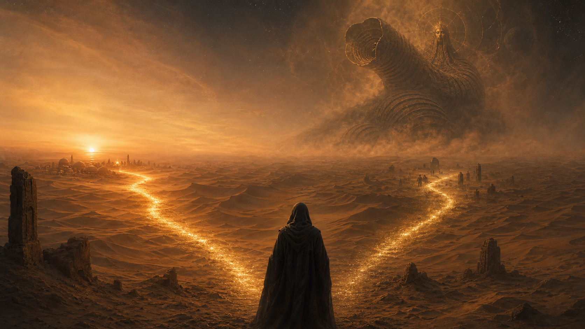
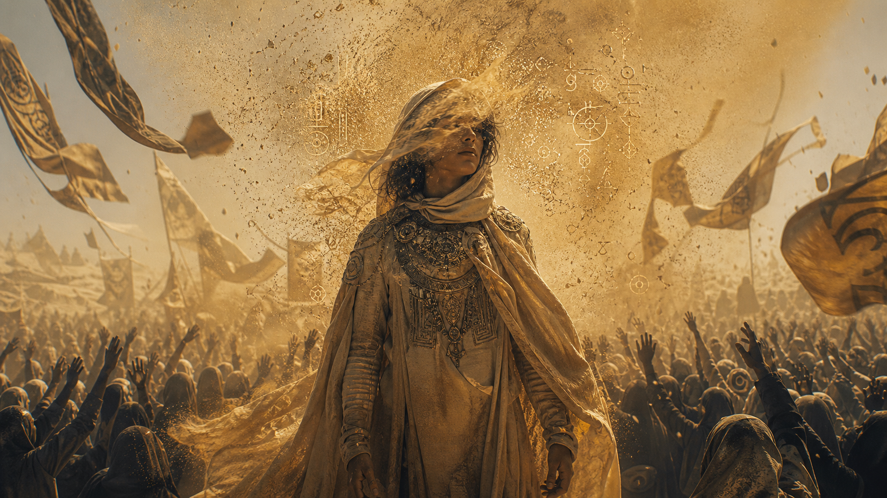
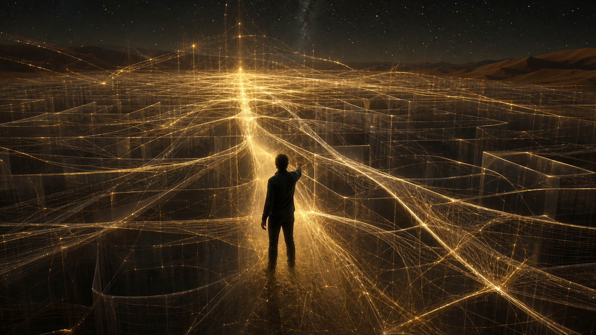
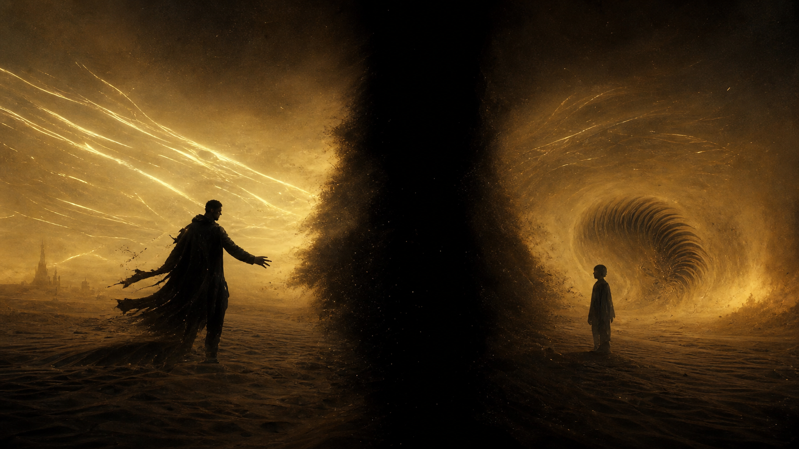
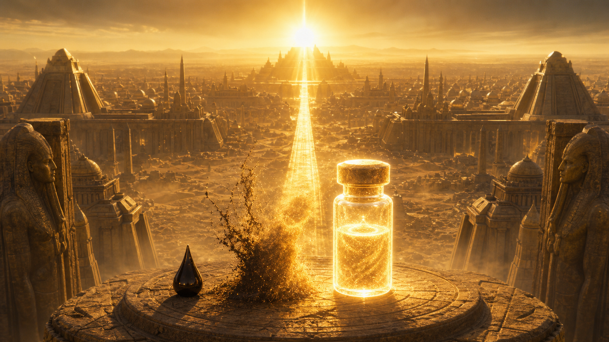
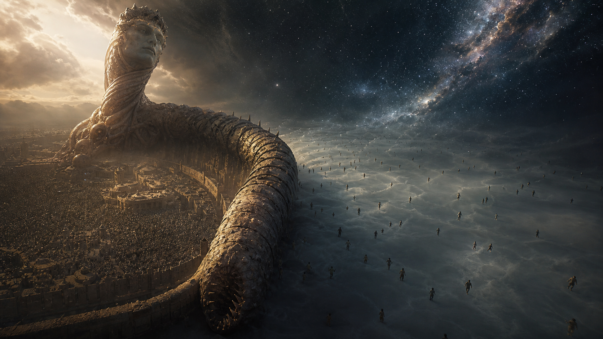
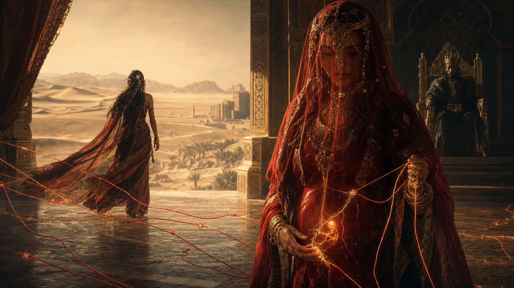
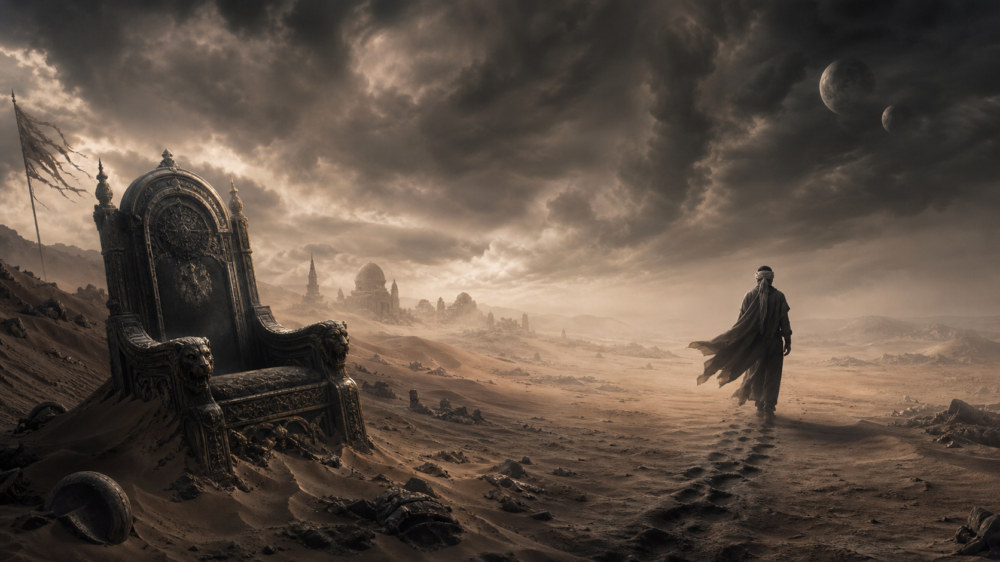

# Dune — Paul, Leto II Và Golden Path

**Dune không phải câu chuyện về một đấng cứu thế giải phóng dân tộc rồi lên ngôi. Nó là bản giải phẫu của cái bẫy đấng cứu thế: Paul Atreides thấy đủ xa để biết nhân loại cần một con đường kinh hoàng, nhưng vẫn còn quá người để tự biến mình thành quái vật cuối cùng. Leto II sinh ra như phần định mệnh mà người cha từ chối: không phải để chọn con đường khác, mà để hoàn tất Golden Path.**

Nếu đọc hời hợt, *Dune* là câu chuyện một hoàng tử mất nhà, học cách sống với dân sa mạc, trả thù Harkonnen, đánh bại Hoàng Đế và trở thành kẻ thống trị mới. Nhưng Frank Herbert không viết một truyện anh hùng kỳ ảo về người được chọn. Ông viết một lời cảnh báo về người được chọn.

Denis Villeneuve hiểu điểm này rất rõ. Hai phần phim đầu không dựng Paul như một Luke Skywalker sa mạc. Phim dựng Paul như một người trẻ bị kẹp giữa di truyền, tôn giáo, tài nguyên, chiến tranh, chấn thương và tương lai. Mỗi lần Paul tiến gần ngôi vị Mahdi, bộ phim không cho ta cảm giác chiến thắng thuần khiết. Nó cho ta cảm giác một cỗ máy cổ xưa đang khóa lại quanh một con người.

Dune 3, nếu đi đúng tinh thần *Dune Messiah*, sẽ không phải phần “Paul thắng tiếp”. Nó sẽ là phần Paul nhận ra chiến thắng đã biến mình thành nhà tù. Và nếu bộ ba phim của Denis còn chạm được bóng của *God Emperor of Dune*, ta sẽ thấy câu hỏi sâu hơn: phải chăng Paul không thoát khỏi Golden Path, mà chỉ đẩy phần kinh hoàng nhất của nó sang Leto II?

---

## Lưu Ý Trước Khi Đọc

Bài này có tiết lộ nội dung trực tiếp cho hướng đi của *Dune Messiah*, *Children of Dune* và *God Emperor of Dune*, đồng thời dự đoán cốt truyện *Dune 3* dựa trên hai phần phim của Denis Villeneuve và cấu trúc sách của Frank Herbert. Nếu bạn chỉ muốn xem phim mà không biết trước trục bi kịch của Paul, Chani, Irulan, Duncan/Hayt và Leto II, nên dừng ở đây.

Nếu đã chấp nhận tiết lộ nội dung, hãy đọc bài này không như một tóm tắt tri thức nội bộ của truyện, mà như một bản đọc về [[Ma Trận]], lời tiên tri, quyền lực tôn giáo và cái giá của việc nhìn thấy tương lai.

---

## Vị Trí Trong Vault

Bài này nằm trong cụm [[Ma Trận]], [[Gnosis]], [[Nhân Quả]], [[Luân Hồi]], [[Predictive Programming - Cấy Tương Lai Vào Tiềm Thức]] và [[Hollywood - Cây Đũa Phép Của Phù Thủy]]. Nhưng khác với *The Matrix*, nơi cái lồng hiện ra như một hệ thống giả lập, *Dune* đưa cái lồng vào trong lời tiên tri, dòng máu và sinh thái học.

Ở tầng sự kiện, *Dune* là tác phẩm hư cấu về một đế chế phụ thuộc vào spice, một hành tinh sa mạc, một dòng tộc bị phản bội và một dân tộc bị áp bức. Ở tầng hệ thống, nó là mô hình về cách tài nguyên chiến lược, tôn giáo cài sẵn và chiến tranh có thể sản xuất ra một đấng cứu thế. Ở tầng biểu tượng, Paul và Leto II là hai hình thái của cùng một câu hỏi: nếu thấy trước thảm họa, ta có quyền trở thành bạo chúa để tránh thảm họa lớn hơn không? Ở tầng tổng hợp suy đoán, *Dune* là bài suy tưởng về một Ma Trận không kiểm soát con người bằng dối trá đơn giản, mà bằng định mệnh.

Điểm cần giữ: *Dune* không chứng minh siêu hình học ngoài đời. Nó là một bản đồ biểu tượng. Nhưng bản đồ này sắc vì nó không tô hồng sự tỉnh thức. Trong *Dune*, biết nhiều hơn không làm người ta tự do hơn. Có khi biết nhiều hơn chỉ cho người ta thấy rõ hơn cái lồng.

---

## Từ Khóa Cần Hiểu

**Prescience** là khả năng thấy các nhánh tương lai. Nhưng trong *Dune*, prescience không phải toàn tri. Nó không biến người thấy thành Thượng Đế toàn năng. Nó giống một mê cung ánh sáng: càng thấy nhiều đường, người nhìn càng dễ bị khóa vào những đường mình có thể thấy.

**Golden Path** là con đường sống còn dài hạn của nhân loại. Nó không phải con đường đẹp. Nó là con đường ít chết nhất trong số các con đường kinh hoàng. Golden Path đòi hỏi một giai đoạn áp bức cực độ để nhân loại cuối cùng phân tán, miễn dịch với đế chế tập trung và thoát khỏi khả năng bị một bạo chúa có prescience gom lại mãi mãi.

**Kwisatz Haderach** là sản phẩm mà Bene Gesserit muốn tạo qua chương trình lai tạo: một nam giới có thể đi vào vùng ký ức và prescience mà Bene Gesserit nữ không chạm tới. Paul xuất hiện sớm hơn kế hoạch, nên anh vừa là thành tựu vừa là lỗi hệ thống.

**Missionaria Protectiva** là chương trình gieo huyền thoại của Bene Gesserit vào các nền văn hóa để khi cần, một nữ tu Bene Gesserit có thể kích hoạt truyền thuyết đó để sinh tồn hoặc thao túng. Trên Arrakis, lời tiên tri về Lisan al-Gaib/Mahdi đã được gieo sẵn trước khi Paul đến.

**God Emperor / Thần Hoàng** là hình thái tận cùng của Leto II: không chỉ là vua, không chỉ là đấng cứu thế, mà là một bạo chúa sống hàng nghìn năm, hợp thể với sandworm, kiểm soát spice, tôn giáo, lai tạo và hướng đi của nhân loại. Ông trở thành Ma Trận cuối cùng để phá khả năng tồn tại của mọi Ma Trận cuối cùng sau đó.

---

## Paul Không Bước Vào Lời Tiên Tri. Paul Bị Lời Tiên Tri Chờ Sẵn

Điểm đáng sợ nhất của *Dune* là Paul không tự sáng tạo ra huyền thoại của mình. Huyền thoại đã chờ sẵn trên Arrakis.

Bene Gesserit đã gieo các lời tiên tri vào nhiều thế giới như một mạng lưới bảo hiểm quyền lực. Khi Jessica và Paul rơi vào sa mạc, họ không bước vào một vùng tâm linh nguyên sơ. Họ bước vào một hệ sinh thái niềm tin đã được lập trình trước. Fremen thật sự đau khổ. Harkonnen thật sự áp bức họ. Arrakis thật sự là một nhà tù tài nguyên. Nhưng lời giải phóng mà họ nhận diện qua Paul đã được cấy sẵn bởi một hội kín có chương trình di truyền riêng.

Đây là chỗ *Dune* rất gần [[Predictive Programming - Cấy Tương Lai Vào Tiềm Thức]]. Truyền thông ngoài đời có thể làm tương lai trở nên quen thuộc trước khi nó được triển khai. Missionaria Protectiva trong *Dune* làm việc tương tự ở tầng tôn giáo: cấy một hình ảnh cứu thế vào vô thức tập thể của dân bản địa, để khi đúng nhân vật xuất hiện, hệ thần kinh xã hội lập tức nhận ra.

Paul hiểu điều đó. Trong phim của Denis, Paul nhiều lần kháng lại việc bị biến thành Lisan al-Gaib. Anh biết nếu mình đi xuống miền Nam, uống Nước Sự Sống và nhận vai đấng cứu thế, một dòng máu lớn sẽ mở ra. Nhưng hiểu cái bẫy không có nghĩa là thoát khỏi cái bẫy. Khi sinh tồn, trả thù, tình yêu, bổn phận và tương lai sụp lại ép vào cùng một điểm, Paul dùng chính huyền thoại mà anh biết là nguy hiểm.

Từ đó, huyền thoại không còn là công cụ. Huyền thoại trở thành cái lồng.

---

## Prescience Là Nhà Tù, Không Phải Siêu Năng Lực

Hollywood thường biến nhìn thấy tương lai thành quyền năng. *Dune* làm ngược lại. Prescience là một dạng nhà tù.

Paul càng thấy nhiều tương lai, anh càng thấy ít tự do. Một người không thấy tương lai còn có thể tưởng mình tự chọn. Paul thấy các nhánh nên biết mỗi lựa chọn đều có giá. Nhưng vì anh chỉ thấy những nhánh nằm trong trường prescience của mình, chính cái thấy đó bắt đầu định hình cái có thể xảy ra. Người nhìn tương lai dễ trở thành tù nhân của những tương lai mình nhìn thấy.

Đây là nghịch lý sâu: nếu bạn thấy một thảm họa và cố tránh nó, hành động tránh né có thể đưa bạn vào thảm họa khác. Nếu bạn thấy một nhánh ít kinh hoàng hơn và chọn nó, bạn vẫn phải chịu trách nhiệm cho cái kinh hoàng còn lại. Paul không chọn giữa thiện và ác. Paul chọn giữa các hình thức hư hại.

Trong logic của vault, đây là một dạng [[Ma Trận]] tinh vi hơn hệ thống kiểm soát bằng dối trá. Ma Trận của Paul không giấu tương lai. Nó cho anh thấy quá nhiều tương lai, rồi khiến anh lầm rằng đường mình thấy là đường duy nhất có thể đi.

> Cái lồng đáng sợ nhất không phải bóng tối. Có khi nó là ánh sáng quá mạnh, khiến người nhìn không còn thấy được vùng ngoài ánh sáng đó.

---

## Paul Và Leto II Là Hai Điểm Mù Của Nhau

Trục sâu nhất không nằm ở việc Paul có thấy tương lai hay không. Trục sâu nhất là Paul và Leto II không thể nhìn nhau như hai vật thể minh bạch trong lời tiên tri.

Những sinh thể có prescience làm nhiễu nhau. Người thấy tương lai có thể trở thành điểm mù cho người thấy tương lai khác. Vì vậy Paul không nắm Leto II như một quân cờ hoàn toàn. Leto cũng không chỉ là người “tiếp tục kế hoạch của cha” theo nghĩa đơn giản. Họ là hai vùng nhiễu trong cùng một cơn bão định mệnh.

Paul thấy Golden Path. Anh thấy nhân loại có thể đi tới tuyệt chủng, đình trệ hoặc bị khóa bởi những hệ thống có prescience trong tương lai. Anh hiểu cần một lực đủ lớn để bẻ hướng toàn bộ loài người. Nhưng Paul vẫn còn là Paul. Anh còn tình yêu với Chani. Anh còn ghê tởm bạo quyền. Anh còn sợ mất phần người cuối cùng. Anh không muốn trở thành một sinh vật sống hàng nghìn năm chỉ để áp bức nhân loại đến khi nhân loại học được cách không bao giờ bị áp bức tập trung nữa.

Leto II sinh ra ở phía bên kia của sự do dự đó. Leto không có đặc quyền được từ chối như Paul. Leto thừa hưởng ký ức, prescience, dòng Atreides, spice, Fremen huyền thoại và hậu quả của thánh chiến. Khi nhìn vào Golden Path, Leto không chỉ thấy một lựa chọn. Ông thấy một bổn phận không thể né.

Nếu Paul là người thấy cánh cửa địa ngục và dừng lại trước ngưỡng, Leto là người sinh ra bên trong ngưỡng cửa đó.

---

## Paul Chọn Giữ Phần Người. Leto Chọn Giữ Loài Người

Nói Paul “không đủ dũng cảm” rất dễ, nhưng chưa công bằng. Paul không hèn. Paul đã bước qua quá nhiều ranh giới rồi: dùng huyền thoại, kích hoạt thánh chiến, chiếm ngai vàng, chấp nhận mình trở thành hình ảnh tôn giáo mà hàng tỷ người sẽ nhân danh để giết.

Nhưng Paul có một giới hạn anh không vượt qua: tự biến mình thành God Emperor, tức Thần Hoàng.

Paul chọn giữ một mảnh nhân tính. Leto II chọn giữ tương lai của loài người. Hai lựa chọn đều có bi kịch riêng. Nếu Paul đi hết Golden Path, anh phải giết chính Paul bên trong mình. Nếu Leto không đi, nhân loại có thể giữ cảm giác tự do thêm một thời gian, rồi chết trong một tương lai lớn hơn.

Leto hiểu điều mà Paul không chịu hiện thân trọn vẹn: đôi khi để phá một mô thức, một người phải trở thành hình thái cực đoan nhất của mô thức đó. Leto trở thành bạo chúa có prescience không phải vì yêu quyền lực, mà vì chỉ một bạo chúa có prescience tuyệt đối mới có thể ép nhân loại phát triển miễn dịch với mọi bạo chúa có prescience về sau.

Đây là tầng khó chịu nhất của *Dune*: nó không cho người đọc một đạo đức sạch. Nó đặt câu hỏi mà không ai muốn trả lời.

> Một người có quyền trở thành quái vật nếu chỉ bằng cách đó loài người mới thoát khỏi mọi quái vật tương lai không?

---

## Golden Path Là Liều Độc Tạo Miễn Dịch

Golden Path không phải thiên đường. Nó là một liều độc tạo miễn dịch.

Leto II khóa nhân loại trong một đế chế nghẹt thở. Ông kiểm soát spice, kiểm soát di chuyển, kiểm soát tôn giáo và kiểm soát lai tạo. Ông trở thành đối tượng vừa được thờ phụng vừa bị căm ghét. Ông nén sự bành trướng của loài người như nén lò xo.

Nhìn ở tầng nhân đạo ngắn hạn, đó là bạo quyền. Nhìn ở tầng sinh tồn dài hạn, đó là một chiến lược tạo miễn dịch. Khi Leto chết, Đại Phân Tán xảy ra: nhân loại bung ra khắp vũ trụ, phân tán đến mức không một đế chế, không một Guild, không một Bene Gesserit, không một kẻ thống trị có prescience nào còn có thể gom toàn bộ loài người vào một điểm bóp nghẹt.

Đây là điều Paul không muốn làm. Paul muốn tránh nỗi kinh hoàng mà không trở thành nỗi kinh hoàng. Leto nhìn thấy rằng chính mong muốn giữ mình khỏi nỗi kinh hoàng có thể để lại một nỗi kinh hoàng lớn hơn cho tương lai.

Trong ngôn ngữ [[Nhân Quả]], Paul không xóa nghiệp của con đường. Anh trì hoãn phần nặng nhất của nó. Leto là người nhận cục nghiệp đó vào thân.

---

## Leto II: Ma Trận Cuối Cùng Để Phá Ma Trận

Nếu đọc trong cụm [[Ma Trận]], Leto II là một nghịch lý sống.

Ông là bạo chúa, nhưng mục tiêu cuối là phá khả năng bạo quyền tuyệt đối. Ông là hình tượng thần thánh, nhưng mục tiêu cuối là khiến nhân loại không bao giờ tin trọn vào một hình tượng thần thánh nữa. Ông là trung tâm của đế chế, nhưng mục tiêu cuối là làm nhân loại phân tán khỏi mọi trung tâm. Ông là người kiểm soát lai tạo, nhưng mục tiêu cuối là tạo ra những dòng người không còn bị prescience nhìn thấy và kiểm soát hoàn toàn.

Leto không chống Ma Trận bằng cách đứng ngoài Ma Trận. Ông chui vào lõi Ma Trận, trở thành lõi đó, rồi thiết kế sự sụp đổ của nó từ bên trong.

Đây là lý do Leto đáng sợ hơn Paul, và cũng cô độc hơn Paul. Paul bị huyền thoại nuốt. Leto tự biến mình thành huyền thoại để bóp cổ huyền thoại.

Một cách nói sắc hơn:

**Paul từ chối trở thành Ma Trận cuối cùng. Leto II chấp nhận trở thành Ma Trận cuối cùng để phá khả năng tồn tại của mọi Ma Trận cuối cùng sau đó.**

---

## Chani, Irulan Và Chiến Trường Của Dòng Máu

Hai phần phim của Denis làm Chani quan trọng hơn rất nhiều. Chani không chỉ là tình yêu của Paul. Chani là cái neo giữ nhân tính: người còn nhìn Paul như một con người khi kẻ khác đã bắt đầu nhìn anh như đấng cứu thế.

Ở cuối *Dune: Part Two*, Chani rời đi. Đây là thay đổi cực mạnh so với cảm giác mà nhiều độc giả nhớ từ sách. Nó biến Dune 3 thành một cuộc đối đầu không chỉ giữa Paul và các thế lực chính trị, mà giữa Paul con người và Paul biểu tượng. Chani có thể trở thành tiếng nói của Fremen chưa bị hoàn toàn nuốt bởi cỗ máy đấng cứu thế.

Irulan cũng không chỉ là người vợ chính trị. Trong thế giới *Dune*, hôn nhân, tử cung và dòng máu là hạ tầng quyền lực. Bene Gesserit không cần luôn thắng bằng quân đội. Họ thắng bằng thế hệ sau. Cơ thể của Paul, Chani, Irulan và những đứa trẻ tương lai đều trở thành chiến trường.

Đây là điểm *Dune* nối thẳng với câu hỏi về [[Elite]]: quyền lực dài hạn không chỉ kiểm soát tài nguyên hiện tại. Nó kiểm soát kế vị, ký ức, giao phối/chọn bạn đời, giáo dục, huyền thoại và những thân thể tương lai.

*Dune* nhìn đế chế không phải như một ngai vàng, mà như một chương trình sinh sản kéo dài nhiều thế hệ.

---

## Dune 3 Sẽ Không Phải Chiến Thắng. Nó Sẽ Là Hậu Quả

Nếu Denis theo *Dune Messiah*, *Dune 3* sẽ mở trong phần hậu quả của chiến thắng. Paul đã là Hoàng Đế. Fremen đã trở thành lực lượng đế chế-tôn giáo. Thánh chiến đã lan ra ngoài Arrakis. Các thế lực cũ như Bene Gesserit, Spacing Guild, Tleilaxu và Irulan sẽ tìm cách bẻ gãy Paul hoặc lấy lại quyền kiểm soát lai tạo dòng máu.

Trung tâm phim nhiều khả năng không phải một trận đánh lớn hơn Part Two. Trung tâm sẽ là sự mệt mỏi của một đấng cứu thế đã thắng. Paul sẽ bị thờ phụng, nhưng càng được thờ, anh càng ít được phép là người. Anh sẽ có ngai vàng, nhưng ngai vàng là nhà tù. Anh sẽ thấy tương lai, nhưng tương lai là cái lồng. Anh sẽ có Chani, hoặc cố lấy lại Chani, nhưng chính huyền thoại quanh anh làm tình yêu đó không còn đứng trong một đời sống bình thường.

Duncan Idaho trở lại dưới dạng Hayt gần như chắc là một trục điện ảnh lớn. Hayt không chỉ là một cú gợi nhớ cho người còn nhớ Duncan. Ông là câu hỏi về ký ức, căn tính và lập trình. Nếu ký ức có thể phục dựng, người đó còn là người cũ không? Nếu tình cảm có thể được dùng như vũ khí, đâu là phần cái tôi không bị lập trình?

Và nếu Denis dám đi tới kết thúc của *Dune Messiah*, Dune 3 sẽ kết bằng một Paul mất mắt, mất Chani, mất ảo tưởng rằng mình có thể giữ cả tình yêu lẫn đế chế, rồi đi vào sa mạc. Đó không phải là cái kết anh hùng. Đó là một người rời khỏi huyền thoại vì huyền thoại đã ăn gần hết phần người còn lại.

Nhưng Leto II vẫn ở phía trước. Golden Path chưa biến mất chỉ vì Paul quay lưng. Nó chỉ tìm một thân thể khác.

---

## Dune Là Cảnh Báo Về Người Hùng Được Sản Xuất

Frank Herbert từng cảnh báo người đọc không nên tin vào lãnh tụ có sức hút. *Dune* làm điều đó bằng cách tạo ra một lãnh tụ có sức hút gần như không thể cưỡng lại: Paul đẹp, thông minh, đau khổ, có chính nghĩa, có quyền năng, có tình yêu, có kẻ thù rõ ràng, có một dân tộc bị áp bức đứng sau.

Nói cách khác, Paul là cái bẫy hoàn hảo cho chính người xem.

Nếu ta ghét Harkonnen, ta muốn Paul thắng. Nếu ta thương Fremen, ta muốn Paul dẫn họ. Nếu ta yêu Chani, ta muốn Paul giữ được tình yêu đó. Nếu ta thích công lý, ta muốn Hoàng Đế cũ bị lật. Nhưng *Dune* hỏi: nếu tất cả những cảm xúc đúng đó cùng đẩy ta vào một đế chế tôn giáo mới thì sao?

Đây là lý do *Dune* mạnh hơn truyện anh hùng kỳ ảo thông thường. Nó không nói “đừng theo kẻ ác”. Điều đó quá dễ. Nó nói: hãy cẩn thận với người hùng có vẻ đúng nhất, vì chính người hùng đó có thể là hình thức đẹp nhất của cái lồng tiếp theo.

Trong ngôn ngữ vault:

**Ma Trận không chỉ tạo phản diện. Ma Trận còn tạo đấng cứu thế. Và đấng cứu thế là dạng kiểm soát khó chống nhất, vì nó đi vào tim trước khi đi vào luật.**

---

## Đọc Dune Sau Cloud Atlas

Nếu *Cloud Atlas* là câu chuyện về ký ức, lời chứng và hành động đúng xuyên qua nhiều đời sống, thì *Dune* là câu chuyện về một ký ức tương lai quá lớn đè nát cá nhân.

*Cloud Atlas* hỏi: điều gì trong linh hồn còn truyền được qua các thời đại?

*Dune* hỏi: nếu một người thấy quá nhiều thời đại cùng lúc, người đó còn được phép có linh hồn riêng không?

Paul trả lời bằng cách dừng lại trước mức hy sinh cuối cùng. Leto II trả lời bằng cách bước qua mức đó và không quay lại. Vì vậy Leto không chỉ “mạnh hơn” Paul. Leto là một hình thức đau đớn hơn của cùng một nhận thức: cái biết không còn là sự tỉnh thức cá nhân, mà trở thành án tù vũ trụ.

Đây là lý do trục Paul/Leto II sâu hơn câu chuyện cha-con. Nó là hai thái cực của Gnosis. Một bên biết và không muốn đánh mất người biết. Một bên biết và chấp nhận xóa người biết để giữ tương lai cho tất cả những người chưa sinh ra.

---

## Kết Luận: Thần Là Cái Lồng Cuối Cùng

Bi kịch của Paul không phải là anh thất bại. Bi kịch của Paul là anh thắng, rồi phát hiện chiến thắng đã biến mình thành một biểu tượng mà anh không còn kiểm soát được.

Bi kịch của Leto II không phải là ông không thấy lựa chọn khác. Bi kịch của Leto là ông thấy quá rõ rằng mọi lựa chọn khác đều dẫn tới một cái chết lớn hơn. Vì vậy ông không được làm người tốt theo nghĩa bình thường. Ông phải làm con quái vật mà lịch sử cần, rồi chịu bị lịch sử căm ghét.

Dune vì vậy không phải lời ca tụng đấng cứu thế. Nó là lời cảnh báo cuối cùng về đấng cứu thế.

**Thần không được tự do. Thần là cái lồng cuối cùng mà con người dựng lên cho một người không còn được phép là người. Paul nhìn thấy cái lồng đó và lùi lại. Leto II bước vào, khóa cửa từ bên trong, rồi giữ chìa khóa cho đến khi nhân loại đủ lớn để không cần một cái lồng duy nhất nữa.**

---

## Đọc Tiếp

- [[Ma Trận]] — thực tại như giao diện kiểm soát nhận thức.
- [[Gnosis]] — cái biết trực tiếp và cái giá của sự tỉnh thức.
- [[Predictive Programming - Cấy Tương Lai Vào Tiềm Thức]] — truyền thông/huyền thoại làm tương lai trở nên quen thuộc trước khi nó đến.
- [[Hollywood - Cây Đũa Phép Của Phù Thủy]] — hư cấu như bùa chú văn hóa.
- [[Nhân Quả]] — nhân/quả và nghiệp của hành động qua nhiều tầng.
- [[Luân Hồi]] — vòng lặp linh hồn, trường học hoặc cái bẫy tùy tầng đọc.
- [[Vô Thức Tập Thể]] — nguyên mẫu và ký ức chung của loài người.
