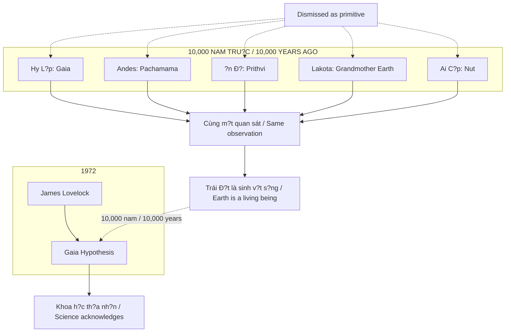
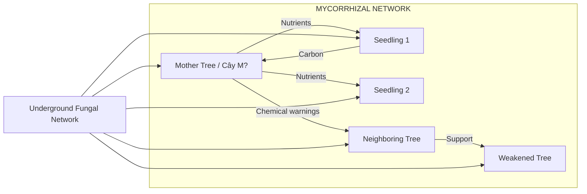
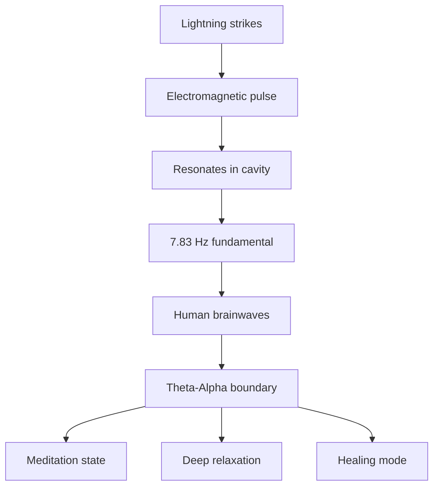
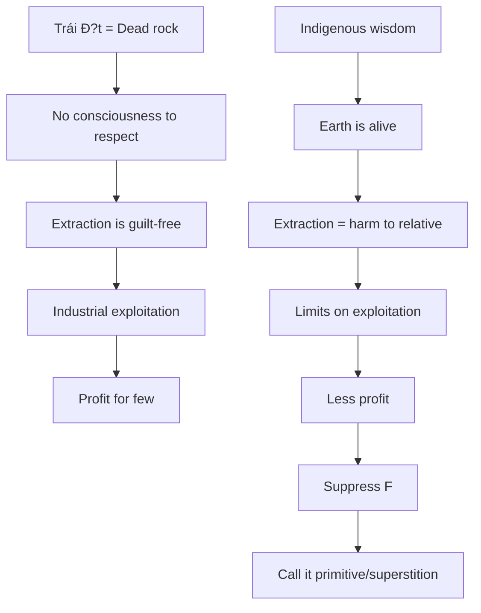

# Gaia - Trái Ð?t Có Ý Th?c / Earth as Living Consciousness

> *"Trái Ð?t không quên nó là gì. Chúng ta m?i là nh?ng k? dã quên."*
> *"The Earth has not forgotten what it is. We are the ones who forgot."*

M?i n?n van minh c? d?i l?n trên th? gi?i - không có liên l?c v?i nhau - d?u d?c l?p tôn th? Trái Ð?t nhu m?t **ý th?c s?ng**. Khoa h?c hi?n d?i d?t tên là Gaia Hypothesis (1972) và gi? v? dây là ý tu?ng m?i.

*Every major ancient civilization on Earth - with no contact with each other - independently worshipped the Earth as a living consciousness. Modern science named it the Gaia Hypothesis (1972) and pretended it was a new idea.*

---

## T?ng Quan / Overview

---

## Ancient Wisdom: H? Ðã Bi?t / They Already Knew

### Không Có Liên L?c - Cùng M?t Quan Sát / No Contact - Same Observation

| Truy?n th?ng / Tradition | Tên g?i / Name | Mô t? / Description |
|--------------------------|----------------|---------------------|
| **Hy L?p / Greek** | Gaia | N? th?n nguyên th?y, t? dó m?i s? s?ng sinh ra / Primordial goddess, source of all life |
| **Andean** | Pachamama | M? Ð?t, ngu?n c?a s? màu m? / Earth Mother, source of fertility |
| **Vedic** | Prithvi | N? th?n Trái Ð?t, v? c?a Dyaus (Tr?i) / Earth goddess, wife of Dyaus (Sky) |
| **Lakota** | Unci Maka | Bà N?i Ð?t, th?c th? s?ng nuôi du?ng / Grandmother Earth, living nurturing entity |
| **Ai C?p / Egypt** | Nut | Thân th? là b?u tr?i, t? cung sinh ra v?n v?t / Body is sky, womb births all things |
| **Trung Hoa / Chinese** | Houtu | H?u Th?, th?n linh c?a d?t dai / Earth deity |
| **Celtic** | Danu | M? c?a các v? th?n / Mother of the gods |

### Pattern: Universal Recognition / Nh?n Th?c Ph? Quát

Không có internet. Không có giao thuong xuyên l?c d?a. Không có di?n tho?i.

*No internet. No transcontinental trade. No phones.*

V?y mà **cùng m?t k?t lu?n**. / Yet the **same conclusion**.

Ho?c dây là [[Vô Th?c T?p Th?]] - ki?n th?c du?c encode trong DNA nhân lo?i.
Ho?c h? dang quan sát m?t **th?c t?i khách quan** mà chúng ta dã quên.

*Either this is the [[Vô Th?c T?p Th?]] - knowledge encoded in human DNA.
Or they were observing an objective reality that we have forgotten.*

---

## Gaia Hypothesis: Khoa H?c "Phát Hi?n L?i" / Science "Rediscovers"

### James Lovelock (1972)

> *"Trái Ð?t không ph?i là m?t t?ng dá mà s? s?ng tình c? cu ng?. Nó là m?t h? th?ng t? di?u ch?nh."*
> *"Earth is not a rock that life happens to inhabit. It is a self-regulating system."*

| Khái ni?m / Concept | Gi?i thích / Explanation |
|---------------------|--------------------------|
| **Self-regulating system** | Sinh h?c, hóa h?c, d?a ch?t ph?i h?p duy trì di?u ki?n s?ng / Biology, chemistry, geology coordinate to maintain life conditions |
| **Homeostasis** | Gi? các thông s? trong ngu?ng c?c h?p qua hàng t? nam / Keep parameters within narrow thresholds for billions of years |
| **No central controller** | Không có "não b?" trung tâm, nhung v?n có coordination / No central "brain" yet coordination exists |

### B?ng ch?ng: Precision Không Th? Ng?u Nhiên / Evidence: Precision Cannot Be Random

| Thông s? / Parameter | Giá tr? / Value | Ý nghia / Significance |
|----------------------|-----------------|------------------------|
| **Oxygen** | 21% | Th?p hon ? ng?t. Cao hon ? cháy toàn c?u / Lower ? suffocation. Higher ? global fires |
| **Temperature** | ±15°C | Nu?c l?ng t?n t?i, s? s?ng ph?c t?p kh? thi / Liquid water exists, complex life possible |
| **Ocean pH** | 8.1 | L?ch nh? ? sinh v?t bi?n ch?t hàng lo?t / Slight deviation ? mass marine death |
| **CO2/O2 balance** | Maintained | Qua hàng t? nam, không c?n di?u khi?n / Billions of years, no controller needed |

Cái gì dang regulate di?u này? / What is regulating this?

Khoa h?c do du?c regulation. Co ch? m?t ph?n du?c hi?u. **Trí tu? dang t? ch?c nó không có tên chính th?c.**

*Science measures the regulation. Mechanism partially understood. **The intelligence organizing it has no official name.***

Các truy?n th?ng c? d?i có tên: **Gaia. Pachamama. Prithvi.**

*Ancient traditions had names: **Gaia. Pachamama. Prithvi.***

---

## Wood Wide Web: R?ng Là M?t Trí Tu? Phân Tán / Forest as Distributed Intelligence

### Suzanne Simard - University of British Columbia

### Peer-Reviewed Findings / Phát Hi?n Ðu?c Ki?m Ch?ng

| Phát hi?n / Finding | Ý nghia / Significance |
|---------------------|------------------------|
| **Nutrient sharing** | Cây m? chia s? dinh du?ng v?i cây con / Mother tree shares nutrients with seedlings |
| **Chemical warnings** | Truy?n tín hi?u c?nh báo côn trùng / Transmit insect warning signals |
| **Kin recognition** | Nh?n di?n "h? hàng", uu tiên h? tr? / Recognize kin, prioritize support |
| **Dying transfer** | Cây s?p ch?t chuy?n dinh du?ng cho cây khác / Dying trees transfer nutrients to others |

> *"R?ng là m?t trí tu? phân tán don l?."*
> *"The forest is a single distributed intelligence."*

Indigenous traditions mô t? r?ng có ý th?c. H? không làm tho. **H? dang quan sát.**

*Indigenous traditions described conscious forests. They weren't being poetic. **They were observing.***

---

## Schumann Resonance: Nh?p Tim C?a Trái Ð?t / Earth's Heartbeat

### 7.83 Hz - Earth's Heartbeat

| Fact / S? th?t | Implication / H? qu? |
|----------------|----------------------|
| 7.83 Hz = ranh gi?i Theta-Alpha / Theta-Alpha boundary | Trùng v?i tr?ng thái thi?n d?nh / Coincides with meditation state |
| Astronauts c?n Schumann simulator / need Schumann simulator | Thi?u ? suy gi?m s?c kh?e / Lack ? health decline |
| T?n s? dang tang / Frequency rising | Có ngu?i cho r?ng: shift in consciousness / Some say: consciousness shift |

Trái Ð?t có nh?p tim. Con ngu?i du?c tune vào nh?p tim dó.

*Earth has a heartbeat. Humans are tuned to that heartbeat.*

Ng?u nhiên? Hay **design**? / Random? Or **design**?

---

## Self-Regulating Systems / H? Th?ng T? Ði?u Ch?nh

| H? th?ng / System | Ch?c nang / Function | Precision |
|-------------------|----------------------|-----------|
| **Atmosphere** | O2 21%, CO2 balance | T? nam / Billions of years |
| **Hydrological cycle** | Nu?c tu?n hoàn, mua phân ph?i / Water cycles, rain distribution | T? d?ng / Automatic |
| **Carbon cycle** | CO2 ? O2 conversion | Không central control / No central control |
| **Magnetic field** | B?o v? kh?i radiation / Protection from radiation | T? duy trì / Self-maintaining |
| **Ocean currents** | Phân ph?i nhi?t toàn c?u / Global heat distribution | Thermohaline circulation |

### Scale of Coordination / Quy Mô Ph?i H?p

Quy mô ph?i h?p vu?t xa b?t k? t? ch?c nào con ngu?i t?ng t?o ra.

*The scale of coordination exceeds anything humans have ever created.*

"T?ng dá tro" không ph?i mô t? phù h?p. / "Inert rock" is not an adequate description.

---

## Suppression Pattern / Mô Hình Ðàn Áp

### Resource vs Relative / Tài Nguyên vs Ngu?i Thân

| Worldview / Th? gi?i quan | H? qu? / Consequence |
|---------------------------|----------------------|
| **Trái Ð?t = Resource** | Khai thác, tiêu th?, v?t b? / Extract, consume, discard |
| **Trái Ð?t = Relative** | Tôn tr?ng, c?ng sinh, b?o v? / Respect, symbiosis, protect |

### Ai Hu?ng L?i T? "Resource" Narrative? / Who Benefits From "Resource" Narrative?

### Dismissed, Not Disproven / B? Bác B?, Không Ph?i B? Ch?ng Minh Sai

| Truy?n th?ng / Tradition | B? g?i là / Called |
|--------------------------|-------------------|
| Indigenous knowledge | Primitive superstition |
| Animism | Childish beliefs |
| Earth consciousness | Woo-woo New Age |

Không ai **bác b?** du?c h? sai. / No one has **disproven** them.

Ch? **dismiss** d? không c?n d?i m?t v?i implications. / Just **dismissed** to avoid facing implications.

---

## The Pattern: "Phát Hi?n" vs Ðánh C?p / "Discovery" vs Theft

| Ancient Knowledge / Ki?n Th?c C? | "Modern Discovery" | Year / Nam |
|----------------------------------|-------------------|------------|
| Gaia / Pachamama | Gaia Hypothesis | 1972 |
| Prana / Chi / Ki | Bioelectricity, ATP | 1900s |
| Third Eye | Pineal gland function | ongoing |
| Meditation benefits | Neuroplasticity | 2000s |
| Fasting healing | Autophagy | 2016 Nobel |
| Plant communication | Mycorrhizal networks | 1990s |

Pattern rõ ràng: / Clear pattern:

1. Ancient wisdom quan sát và document / Ancient wisdom observes and documents
2. "Modern science" dismiss là primitive / "Modern science" dismisses as primitive
3. Decades/centuries sau, khoa h?c "phát hi?n" / Decades/centuries later, science "discovers"
4. Ð?t tên m?i, claim credit / Give new name, claim credit
5. Original sources v?n b? coi là superstition / Original sources still labeled superstition

---

## Case Study: Avatar (2009)

### Hollywood Encode Truth Trong Fiction / Hollywood Encodes Truth in Fiction

James Cameron's Avatar là Gaia hypothesis du?i d?ng blockbuster:

*James Cameron's Avatar is the Gaia hypothesis as a blockbuster:*

| Avatar (Pandora) | Earth Reality / Th?c T? Trái Ð?t |
|------------------|----------------------------------|
| **Eywa** | Gaia consciousness |
| **Tree of Souls** | Mother Tree / Mycorrhizal network |
| **Neural queue** (tsaheylu) | Biological interface k?t n?i / connection |
| **"I see you"** | Recognition of consciousness |
| **Na'vi vs RDA** | Indigenous vs Extractors |
| **All Is One** | Gaia as unified organism |

### Câu H?i: Cameron Bi?t T? Ðâu? / Question: How Did Cameron Know?

- Avatar ra 2009 / Avatar released 2009
- Suzanne Simard publish "Finding the Mother Tree" = 2021
- Nhung research c?a bà t? **1990s** / But her research from **1990s**
- Cameron có access s?m? Hay tapping vào [[Vô Th?c T?p Th?]]? / Early access? Or tapping into [[Vô Th?c T?p Th?]]?

### Pattern: Disclosure Qua Entertainment / Disclosure Through Entertainment

Xem thêm / See also: [[Hollywood - Cây Ðua Phép C?a Phù Th?y]]

---

## Connection v?i Vault / Vault Connections

### Ma Tr?n & Control
- [[Ma Tr?n]] - Disconnect con ngu?i kh?i Ngu?n (Trái Ð?t, Vu tr?) / Disconnect humans from Source (Earth, Universe)
- [[Khoa H?c Xét L?i]] - Khoa h?c hi?n d?i claim credit cho ancient knowledge / Modern science claims credit for ancient knowledge
- [[V?n Chín]] - Period 9 = ánh sáng, s? th?t b? phoi bày / Period 9 = light, truth exposed

### Consciousness & Spirituality
- [[Vô Th?c T?p Th?]] - Universal knowledge encoded trong nhân lo?i / Universal knowledge encoded in humanity
- [[T?n S? Schumann]] - Earth's frequency ?nh hu?ng consciousness / Earth's frequency affects consciousness
- [[Tuy?n Tùng]] - Antenna k?t n?i v?i frequencies cao hon / Antenna connecting to higher frequencies

### Suppressed Knowledge
- [[Tartaria]] - N?n van minh b? xóa kh?i l?ch s? / Civilization erased from history
- [[K? Thu?t Thi?n Ð?nh Kogi|Ngu?i Kogi]] - Nh?ng ngu?i v?n nh? / Those who still remember

---

## Core Insight / Insight C?t Lõi

> *"B?n dang s?ng trên m?t hành tinh d? thông minh d? duy trì nh?ng h? th?ng sinh h?c ph?c t?p nh?t trong vu tr? dã bi?t.*
>
> *Và su?t ph?n l?n cu?c d?i, b?n du?c d?y coi nó nhu tài nguyên thay vì ngu?i thân.*
>
> *M?i truy?n th?ng bi?t rõ hon d?u b? dàn áp ho?c bác b?.*
>
> *Trái Ð?t không quên nó là gì. Chúng ta m?i là nh?ng k? dã quên."*

> *"You are living on a planet intelligent enough to sustain the most complex biological systems in the known universe.*
>
> *And for most of your life, you were taught to treat it as a resource rather than a relative.*
>
> *Every tradition that knew better has been suppressed or dismissed.*
>
> *The Earth has not forgotten what it is. We are the ones who forgot."*

---

## Practical Implications / H? Qu? Th?c Ti?n

### N?u Gaia hypothesis dúng: / If Gaia hypothesis is true:

- [ ] Trái Ð?t có feedback loops ? hành d?ng c?a ta có consequences / Earth has feedback loops ? our actions have consequences
- [ ] Disconnect kh?i nature = disconnect kh?i health / Disconnect from nature = disconnect from health
- [ ] Schumann resonance matters ? grounding, nature exposure
- [ ] Indigenous wisdom = data, không ph?i superstition / Indigenous wisdom = data, not superstition

### Remember / Nh?:

B?n không **? trên** Trái Ð?t. / You are not **on** Earth.

B?n **là m?t ph?n c?a** Trái Ð?t. / You **are part of** Earth.

S? phân bi?t dó thay d?i m?i th?. / That distinction changes everything.

---

## Sources

- James Lovelock - *Gaia: A New Look at Life on Earth* (1972)
- Lynn Margulis - Co-developer of Gaia hypothesis
- Suzanne Simard - *Finding the Mother Tree* (2021)
- Schumann, W.O. - Original resonance research (1952)
- Indigenous traditions worldwide - 10,000+ years of observation
- James Cameron - *Avatar* (2009)

