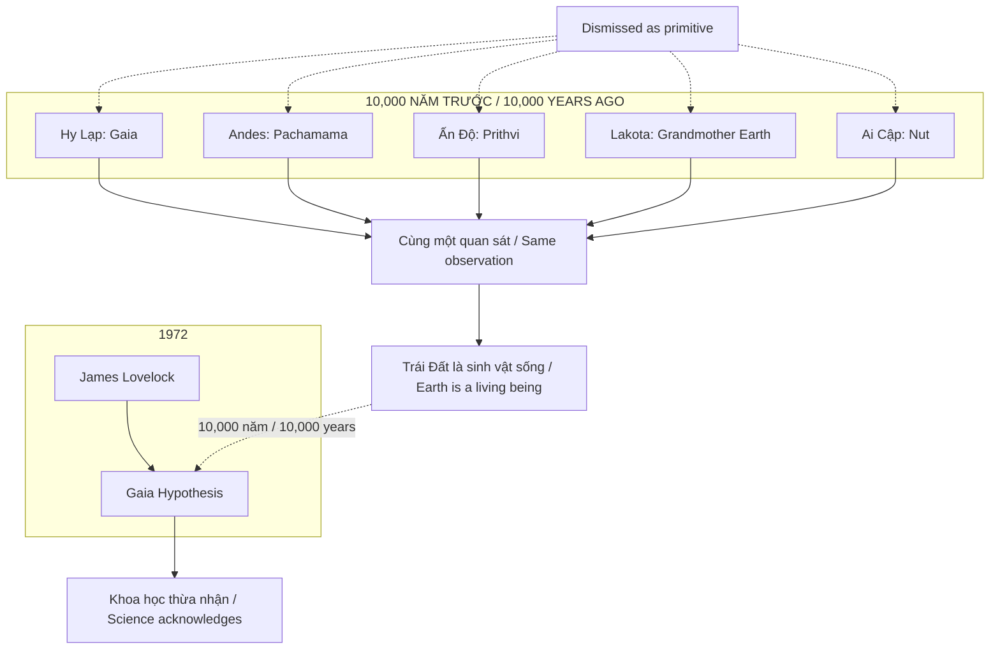
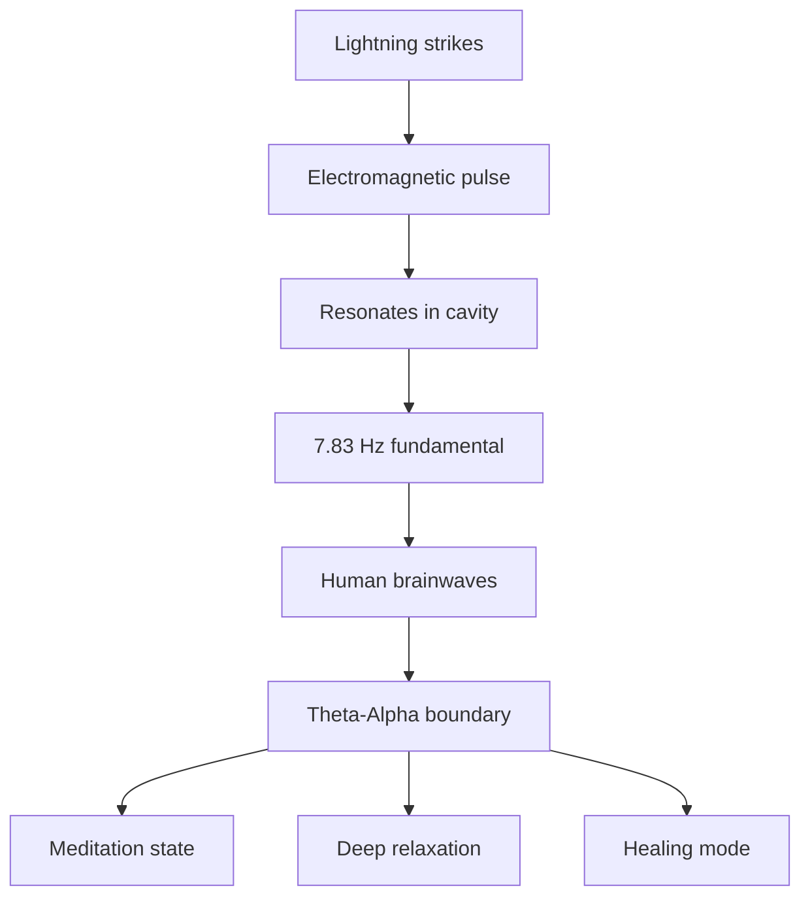

# Gaia — Trái Đất Có Ý Thức / Earth as Living Consciousness

> *"Trái Đất không quên nó là gì. Chúng ta mới là những kẻ đã quên."*
> *"The Earth has not forgotten what it is. We are the ones who forgot."*

Mọi nền văn minh cổ đại lớn trên thế giới — không có liên lạc với nhau — đều độc lập tôn thờ Trái Đất như một **ý thức sống**. Khoa học hiện đại đặt tên là Gaia Hypothesis (1972) và giả vờ đây là ý tưởng mới.

*Every major ancient civilization on Earth — with no contact with each other — independently worshipped the Earth as a living consciousness. Modern science named it the Gaia Hypothesis (1972) and pretended it was a new idea.*

---

## Tổng Quan / Overview

---

## Ancient Wisdom: Họ Đã Biết / They Already Knew

### Không Có Liên Lạc — Cùng Một Quan Sát / No Contact — Same Observation

| Truyền thống / Tradition | Tên gọi / Name | Mô tả / Description |
|--------------------------|----------------|---------------------|
| **Hy Lạp / Greek** | Gaia | Nữ thần nguyên thủy, từ đó mọi sự sống sinh ra / Primordial goddess, source of all life |
| **Andean** | Pachamama | Mẹ Đất, nguồn của sự màu mỡ / Earth Mother, source of fertility |
| **Vedic** | Prithvi | Nữ thần Trái Đất, vợ của Dyaus (Trời) / Earth goddess, wife of Dyaus (Sky) |
| **Lakota** | Unci Maka | Bà Nội Đất, thực thể sống nuôi dưỡng / Grandmother Earth, living nurturing entity |
| **Ai Cập / Egypt** | Nut | Thân thể là bầu trời, tử cung sinh ra vạn vật / Body is sky, womb births all things |
| **Trung Hoa / Chinese** | Houtu | Hậu Thổ, thần linh của đất đai / Earth deity |
| **Celtic** | Danu | Mẹ của các vị thần / Mother of the gods |

### Pattern: Universal Recognition / Nhận Thức Phổ Quát

Không có internet. Không có giao thương xuyên lục địa. Không có điện thoại.

*No internet. No transcontinental trade. No phones.*

Vậy mà **cùng một kết luận**. / Yet the **same conclusion**.

Hoặc đây là [[Vô Thức Tập Thể]] — kiến thức được encode trong DNA nhân loại.
Hoặc họ đang quan sát một **thực tại khách quan** mà chúng ta đã quên.

*Either this is the [[Vô Thức Tập Thể]] — knowledge encoded in human DNA.
Or they were observing an objective reality that we have forgotten.*

---

## Gaia Hypothesis: Khoa Học "Phát Hiện Lại" / Science "Rediscovers"

### James Lovelock (1972)

> *"Trái Đất không phải là một tảng đá mà sự sống tình cờ cư ngụ. Nó là một hệ thống tự điều chỉnh."*
> *"Earth is not a rock that life happens to inhabit. It is a self-regulating system."*

| Khái niệm / Concept | Giải thích / Explanation |
|---------------------|--------------------------|
| **Self-regulating system** | Sinh học, hóa học, địa chất phối hợp duy trì điều kiện sống / Biology, chemistry, geology coordinate to maintain life conditions |
| **Homeostasis** | Giữ các thông số trong ngưỡng cực hẹp qua hàng tỷ năm / Keep parameters within narrow thresholds for billions of years |
| **No central controller** | Không có "não bộ" trung tâm, nhưng vẫn có coordination / No central "brain" yet coordination exists |

### Bằng chứng: Precision Không Thể Ngẫu Nhiên / Evidence: Precision Cannot Be Random

| Thông số / Parameter | Giá trị / Value | Ý nghĩa / Significance |
|----------------------|-----------------|------------------------|
| **Oxygen** | 21% | Thấp hơn → ngạt. Cao hơn → cháy toàn cầu / Lower → suffocation. Higher → global fires |
| **Temperature** | ±15°C | Nước lỏng tồn tại, sự sống phức tạp khả thi / Liquid water exists, complex life possible |
| **Ocean pH** | 8.1 | Lệch nhẹ → sinh vật biển chết hàng loạt / Slight deviation → mass marine death |
| **CO₂/O₂ balance** | Maintained | Qua hàng tỷ năm, không cần điều khiển / Billions of years, no controller needed |

Cái gì đang regulate điều này? / What is regulating this?

Khoa học đo được regulation. Cơ chế một phần được hiểu. **Trí tuệ đang tổ chức nó không có tên chính thức.**

*Science measures the regulation. Mechanism partially understood. **The intelligence organizing it has no official name.***

Các truyền thống cổ đại có tên: **Gaia. Pachamama. Prithvi.**

*Ancient traditions had names: **Gaia. Pachamama. Prithvi.***

---

## Wood Wide Web: Rừng Là Một Trí Tuệ Phân Tán / Forest as Distributed Intelligence

### Suzanne Simard — University of British Columbia

### Peer-Reviewed Findings / Phát Hiện Được Kiểm Chứng

| Phát hiện / Finding | Ý nghĩa / Significance |
|---------------------|------------------------|
| **Nutrient sharing** | Cây mẹ chia sẻ dinh dưỡng với cây con / Mother tree shares nutrients with seedlings |
| **Chemical warnings** | Truyền tín hiệu cảnh báo côn trùng / Transmit insect warning signals |
| **Kin recognition** | Nhận diện "họ hàng", ưu tiên hỗ trợ / Recognize kin, prioritize support |
| **Dying transfer** | Cây sắp chết chuyển dinh dưỡng cho cây khác / Dying trees transfer nutrients to others |

> *"Rừng là một trí tuệ phân tán đơn lẻ."*
> *"The forest is a single distributed intelligence."*

Indigenous traditions mô tả rừng có ý thức. Họ không làm thơ. **Họ đang quan sát.**

*Indigenous traditions described conscious forests. They weren't being poetic. **They were observing.***

---

## Schumann Resonance: Nhịp Tim Của Trái Đất / Earth's Heartbeat

### 7.83 Hz — Earth's Heartbeat

| Fact / Sự thật | Implication / Hệ quả |
|----------------|----------------------|
| 7.83 Hz = ranh giới Theta-Alpha / Theta-Alpha boundary | Trùng với trạng thái thiền định / Coincides with meditation state |
| Astronauts cần Schumann simulator / need Schumann simulator | Thiếu → suy giảm sức khỏe / Lack → health decline |
| Tần số đang tăng / Frequency rising | Có người cho rằng: shift in consciousness / Some say: consciousness shift |

Trái Đất có nhịp tim. Con người được tune vào nhịp tim đó.

*Earth has a heartbeat. Humans are tuned to that heartbeat.*

Ngẫu nhiên? Hay **design**? / Random? Or **design**?

---

## Self-Regulating Systems / Hệ Thống Tự Điều Chỉnh

| Hệ thống / System | Chức năng / Function | Precision |
|-------------------|----------------------|-----------|
| **Atmosphere** | O₂ 21%, CO₂ balance | Tỷ năm / Billions of years |
| **Hydrological cycle** | Nước tuần hoàn, mưa phân phối / Water cycles, rain distribution | Tự động / Automatic |
| **Carbon cycle** | CO₂ ↔ O₂ conversion | Không central control / No central control |
| **Magnetic field** | Bảo vệ khỏi radiation / Protection from radiation | Tự duy trì / Self-maintaining |
| **Ocean currents** | Phân phối nhiệt toàn cầu / Global heat distribution | Thermohaline circulation |

### Scale of Coordination / Quy Mô Phối Hợp

Quy mô phối hợp vượt xa bất kỳ tổ chức nào con người từng tạo ra.

*The scale of coordination exceeds anything humans have ever created.*

"Tảng đá trơ" không phải mô tả phù hợp. / "Inert rock" is not an adequate description.

---

## Suppression Pattern / Mô Hình Đàn Áp

### Resource vs Relative / Tài Nguyên vs Người Thân

| Worldview / Thế giới quan | Hệ quả / Consequence |
|---------------------------|----------------------|
| **Trái Đất = Resource** | Khai thác, tiêu thụ, vứt bỏ / Extract, consume, discard |
| **Trái Đất = Relative** | Tôn trọng, cộng sinh, bảo vệ / Respect, symbiosis, protect |

### Ai Hưởng Lợi Từ "Resource" Narrative? / Who Benefits From "Resource" Narrative?

### Dismissed, Not Disproven / Bị Bác Bỏ, Không Phải Bị Chứng Minh Sai

| Truyền thống / Tradition | Bị gọi là / Called |
|--------------------------|-------------------|
| Indigenous knowledge | Primitive superstition |
| Animism | Childish beliefs |
| Earth consciousness | Woo-woo New Age |

Không ai **bác bỏ** được họ sai. / No one has **disproven** them.

Chỉ **dismiss** để không cần đối mặt với implications. / Just **dismissed** to avoid facing implications.

---

## The Pattern: "Phát Hiện" vs Đánh Cắp / "Discovery" vs Theft

| Ancient Knowledge / Kiến Thức Cổ | "Modern Discovery" | Year / Năm |
|----------------------------------|-------------------|------------|
| Gaia / Pachamama | Gaia Hypothesis | 1972 |
| Prana / Chi / Ki | Bioelectricity, ATP | 1900s |
| Third Eye | Pineal gland function | ongoing |
| Meditation benefits | Neuroplasticity | 2000s |
| Fasting healing | Autophagy | 2016 Nobel |
| Plant communication | Mycorrhizal networks | 1990s |

Pattern rõ ràng: / Clear pattern:

1. Ancient wisdom quan sát và document / Ancient wisdom observes and documents
2. "Modern science" dismiss là primitive / "Modern science" dismisses as primitive
3. Decades/centuries sau, khoa học "phát hiện" / Decades/centuries later, science "discovers"
4. Đặt tên mới, claim credit / Give new name, claim credit
5. Original sources vẫn bị coi là superstition / Original sources still labeled superstition

---

## Case Study: Avatar (2009)

### Hollywood Encode Truth Trong Fiction / Hollywood Encodes Truth in Fiction

James Cameron's Avatar là Gaia hypothesis dưới dạng blockbuster:

*James Cameron's Avatar is the Gaia hypothesis as a blockbuster:*

| Avatar (Pandora) | Earth Reality / Thực Tế Trái Đất |
|------------------|----------------------------------|
| **Eywa** | Gaia consciousness |
| **Tree of Souls** | Mother Tree / Mycorrhizal network |
| **Neural queue** (tsaheylu) | Biological interface kết nối / connection |
| **"I see you"** | Recognition of consciousness |
| **Na'vi vs RDA** | Indigenous vs Extractors |
| **All Is One** | Gaia as unified organism |

### Câu Hỏi: Cameron Biết Từ Đâu? / Question: How Did Cameron Know?

- Avatar ra 2009 / Avatar released 2009
- Suzanne Simard publish "Finding the Mother Tree" = 2021
- Nhưng research của bà từ **1990s** / But her research from **1990s**
- Cameron có access sớm? Hay tapping vào [[Vô Thức Tập Thể]]? / Early access? Or tapping into [[Vô Thức Tập Thể]]?

### Pattern: Disclosure Qua Entertainment / Disclosure Through Entertainment

Xem thêm / See also: [[Hollywood - Cây Đũa Phép Của Phù Thủy]]

---

## Connection với Vault / Vault Connections

### Ma Trận & Control
- [[Ma Trận]] — Disconnect con người khỏi Nguồn (Trái Đất, Vũ trụ) / Disconnect humans from Source (Earth, Universe)
- [[Khoa Học Xét Lại]] — Khoa học hiện đại claim credit cho ancient knowledge / Modern science claims credit for ancient knowledge
- [[Vận Chín]] — Period 9 = ánh sáng, sự thật bị phơi bày / Period 9 = light, truth exposed

### Consciousness & Spirituality
- [[Vô Thức Tập Thể]] — Universal knowledge encoded trong nhân loại / Universal knowledge encoded in humanity
- [[Tần Số Schumann]] — Earth's frequency ảnh hưởng consciousness / Earth's frequency affects consciousness
- [[Tuyến Tùng]] — Antenna kết nối với frequencies cao hơn / Antenna connecting to higher frequencies

### Suppressed Knowledge
- [[Tartaria]] — Nền văn minh bị xóa khỏi lịch sử / Civilization erased from history
- [[Người Kogi]] — Những người vẫn nhớ / Those who still remember

---

## Core Insight / Insight Cốt Lõi

> *"Bạn đang sống trên một hành tinh đủ thông minh để duy trì những hệ thống sinh học phức tạp nhất trong vũ trụ đã biết.*
>
> *Và suốt phần lớn cuộc đời, bạn được dạy coi nó như tài nguyên thay vì người thân.*
>
> *Mọi truyền thống biết rõ hơn đều bị đàn áp hoặc bác bỏ.*
>
> *Trái Đất không quên nó là gì. Chúng ta mới là những kẻ đã quên."*

> *"You are living on a planet intelligent enough to sustain the most complex biological systems in the known universe.*
>
> *And for most of your life, you were taught to treat it as a resource rather than a relative.*
>
> *Every tradition that knew better has been suppressed or dismissed.*
>
> *The Earth has not forgotten what it is. We are the ones who forgot."*

---

## Practical Implications / Hệ Quả Thực Tiễn

### Nếu Gaia hypothesis đúng: / If Gaia hypothesis is true:

- [ ] Trái Đất có feedback loops → hành động của ta có consequences / Earth has feedback loops → our actions have consequences
- [ ] Disconnect khỏi nature = disconnect khỏi health / Disconnect from nature = disconnect from health
- [ ] Schumann resonance matters → grounding, nature exposure
- [ ] Indigenous wisdom = data, không phải superstition / Indigenous wisdom = data, not superstition

### Remember / Nhớ:

Bạn không **ở trên** Trái Đất. / You are not **on** Earth.

Bạn **là một phần của** Trái Đất. / You **are part of** Earth.

Sự phân biệt đó thay đổi mọi thứ. / That distinction changes everything.

---

## Sources

- James Lovelock — *Gaia: A New Look at Life on Earth* (1972)
- Lynn Margulis — Co-developer of Gaia hypothesis
- Suzanne Simard — *Finding the Mother Tree* (2021)
- Schumann, W.O. — Original resonance research (1952)
- Indigenous traditions worldwide — 10,000+ years of observation
- James Cameron — *Avatar* (2009)
