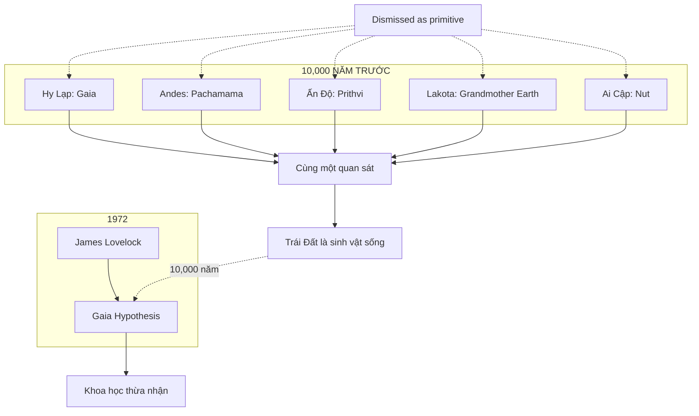
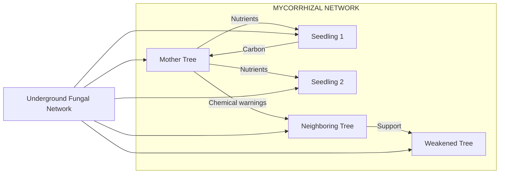
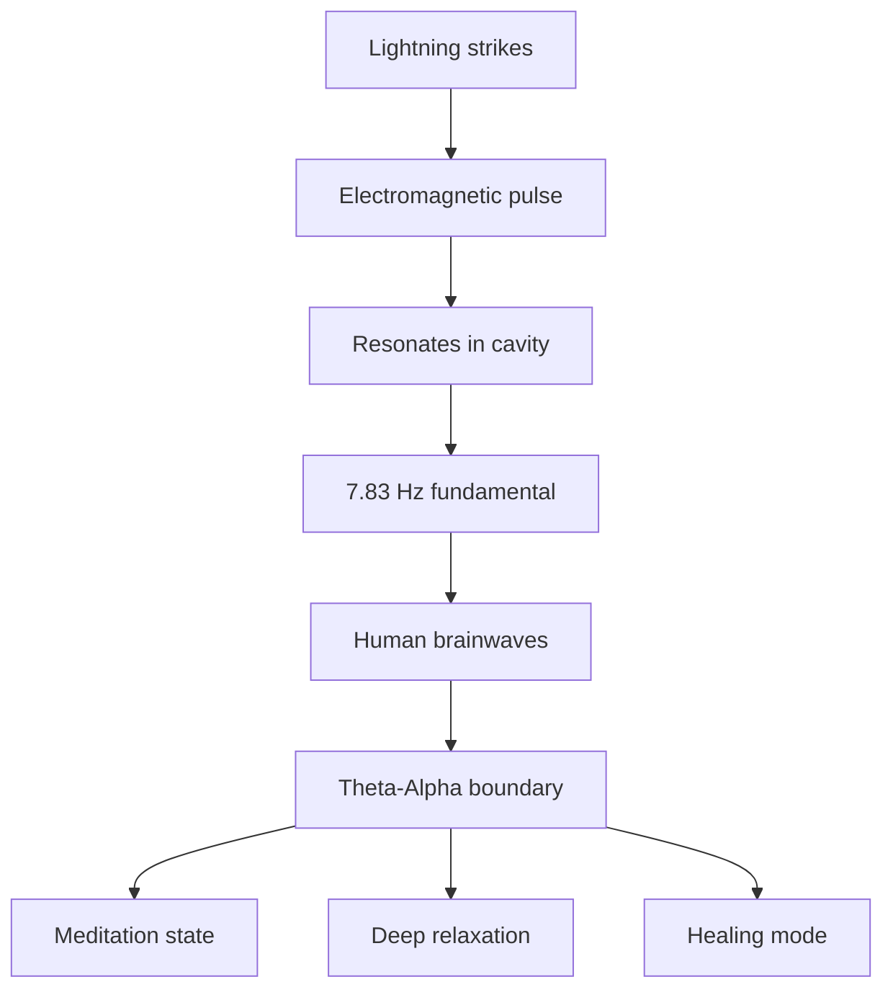

# Gaia — Trái Đất Có Ý Thức

> *"Trái Đất không quên nó là gì. Chúng ta mới là những kẻ đã quên."*

Mọi nền văn minh cổ đại lớn trên thế giới — không có liên lạc với nhau — đều độc lập tôn thờ Trái Đất như một **ý thức sống**. Khoa học hiện đại đặt tên là Gaia Hypothesis (1972) và giả vờ đây là ý tưởng mới.

---

## Tổng Quan

---

## Ancient Wisdom: Họ Đã Biết

### Không Có Liên Lạc — Cùng Một Quan Sát

| Truyền thống | Tên gọi | Mô tả |
|--------------|---------|-------|
| **Hy Lạp** | Gaia | Nữ thần nguyên thủy, từ đó mọi sự sống sinh ra |
| **Andean** | Pachamama | Mẹ Đất, nguồn của sự màu mỡ |
| **Vedic** | Prithvi | Nữ thần Trái Đất, vợ của Dyaus (Trời) |
| **Lakota** | Unci Maka | Bà Nội Đất, thực thể sống nuôi dưỡng |
| **Ai Cập** | Nut | Thân thể là bầu trời, tử cung sinh ra vạn vật |
| **Trung Hoa** | Houtu | Hậu Thổ, thần linh của đất đai |
| **Celtic** | Danu | Mẹ của các vị thần |

### Pattern: Universal Recognition

Không có internet. Không có giao thương xuyên lục địa. Không có điện thoại.

Vậy mà **cùng một kết luận**.

Hoặc đây là [[Vô Thức Tập Thể]] — kiến thức được encode trong DNA nhân loại.
Hoặc họ đang quan sát một **thực tại khách quan** mà chúng ta đã quên.

---

## Gaia Hypothesis: Khoa Học "Phát Hiện Lại"

### James Lovelock (1972)

> *"Trái Đất không phải là một tảng đá mà sự sống tình cờ cư ngụ. Nó là một hệ thống tự điều chỉnh."*

| Khái niệm | Giải thích |
|-----------|------------|
| **Self-regulating system** | Sinh học, hóa học, địa chất phối hợp duy trì điều kiện sống |
| **Homeostasis** | Giữ các thông số trong ngưỡng cực hẹp qua hàng tỷ năm |
| **No central controller** | Không có "não bộ" trung tâm, nhưng vẫn có coordination |

### Bằng chứng: Precision Không Thể Ngẫu Nhiên

| Thông số | Giá trị | Ý nghĩa |
|----------|---------|---------|
| **Oxygen** | 21% | Thấp hơn → ngạt. Cao hơn → cháy toàn cầu |
| **Temperature** | ±15°C | Nước lỏng tồn tại, sự sống phức tạp khả thi |
| **Ocean pH** | 8.1 | Lệch nhẹ → sinh vật biển chết hàng loạt |
| **CO₂/O₂ balance** | Maintained | Qua hàng tỷ năm, không cần điều khiển |

Cái gì đang regulate điều này?

Khoa học đo được regulation. Cơ chế một phần được hiểu. **Trí tuệ đang tổ chức nó không có tên chính thức.**

Các truyền thống cổ đại có tên: **Gaia. Pachamama. Prithvi.**

---

## Wood Wide Web: Rừng Là Một Trí Tuệ Phân Tán

### Suzanne Simard — University of British Columbia

### Peer-Reviewed Findings

| Phát hiện | Ý nghĩa |
|-----------|---------|
| **Nutrient sharing** | Cây mẹ chia sẻ dinh dưỡng với cây con |
| **Chemical warnings** | Truyền tín hiệu cảnh báo côn trùng |
| **Kin recognition** | Nhận diện "họ hàng", ưu tiên hỗ trợ |
| **Dying transfer** | Cây sắp chết chuyển dinh dưỡng cho cây khác |

> *"Rừng là một trí tuệ phân tán đơn lẻ."*

Indigenous traditions mô tả rừng có ý thức. Họ không làm thơ. **Họ đang quan sát.**

---

## Schumann Resonance: Nhịp Tim Của Trái Đất

### 7.83 Hz — Earth's Heartbeat

| Fact | Implication |
|------|-------------|
| 7.83 Hz = ranh giới Theta-Alpha | Trùng với trạng thái thiền định |
| Astronauts cần Schumann simulator | Thiếu → suy giảm sức khỏe |
| Tần số đang tăng | Có người cho rằng: shift in consciousness |

Trái Đất có nhịp tim. Con người được tune vào nhịp tim đó.

Ngẫu nhiên? Hay **design**?

---

## Self-Regulating Systems: Danh Sách

| Hệ thống | Chức năng | Precision |
|----------|-----------|-----------|
| **Atmosphere** | O₂ 21%, CO₂ balance | Tỷ năm |
| **Hydrological cycle** | Nước tuần hoàn, mưa phân phối | Tự động |
| **Carbon cycle** | CO₂ ↔ O₂ conversion | Không central control |
| **Magnetic field** | Bảo vệ khỏi radiation | Tự duy trì |
| **Ocean currents** | Phân phối nhiệt toàn cầu | Thermohaline circulation |

### Scale of Coordination

Quy mô phối hợp vượt xa bất kỳ tổ chức nào con người từng tạo ra.

"Tảng đá trơ" không phải mô tả phù hợp.

---

## Suppression Pattern

### Resource vs Relative

| Worldview | Hệ quả |
|-----------|--------|
| **Trái Đất = Resource** | Khai thác, tiêu thụ, vứt bỏ |
| **Trái Đất = Relative** | Tôn trọng, cộng sinh, bảo vệ |

### Ai Hưởng Lợi Từ "Resource" Narrative?

### Dismissed, Not Disproven

| Truyền thống | Bị gọi là |
|--------------|-----------|
| Indigenous knowledge | Primitive superstition |
| Animism | Childish beliefs |
| Earth consciousness | Woo-woo New Age |

Không ai **bác bỏ** được họ sai.

Chỉ **dismiss** để không cần đối mặt với implications.

---

## Connection với Vault

### Ma Trận & Control

- [[Ma Trận]] — Disconnect con người khỏi Nguồn (Trái Đất, Vũ trụ)
- [[Khoa Học Xét Lại]] — Khoa học hiện đại claim credit cho ancient knowledge
- [[Vận Chín]] — Period 9 = ánh sáng, sự thật bị phơi bày

### Consciousness & Spirituality

- [[Vô Thức Tập Thể]] — Universal knowledge encoded trong nhân loại
- [[Tần Số Schumann]] — Earth's frequency ảnh hưởng consciousness
- [[Tuyến Tùng]] — Antenna kết nối với frequencies cao hơn

### Suppressed Knowledge

- [[Tartaria]] — Nền văn minh bị xóa khỏi lịch sử
- [[Người Kogi]] — Những người vẫn nhớ

---

## The Pattern: "Phát Hiện" vs Đánh Cắp

| Ancient Knowledge | "Modern Discovery" | Year |
|-------------------|-------------------|------|
| Gaia / Pachamama | Gaia Hypothesis | 1972 |
| Prana / Chi / Ki | Bioelectricity, ATP | 1900s |
| Third Eye | Pineal gland function | ongoing |
| Meditation benefits | Neuroplasticity | 2000s |
| Fasting healing | Autophagy | 2016 Nobel |
| Plant communication | Mycorrhizal networks | 1990s |

Pattern rõ ràng:

1. Ancient wisdom quan sát và document
2. "Modern science" dismiss là primitive
3. Decades/centuries sau, khoa học "phát hiện"
4. Đặt tên mới, claim credit
5. Original sources vẫn bị coi là superstition

---

## Core Insight

> *"Bạn đang sống trên một hành tinh đủ thông minh để duy trì những hệ thống sinh học phức tạp nhất trong vũ trụ đã biết.*
>
> *Và suốt phần lớn cuộc đời, bạn được dạy coi nó như tài nguyên thay vì người thân.*
>
> *Mọi truyền thống biết rõ hơn đều bị đàn áp hoặc bác bỏ.*
>
> *Trái Đất không quên nó là gì. Chúng ta mới là những kẻ đã quên."*

---

## Practical Implications

### Nếu Gaia hypothesis đúng:

- [ ] Trái Đất có feedback loops → hành động của ta có consequences
- [ ] Disconnect khỏi nature = disconnect khỏi health
- [ ] Schumann resonance matters → grounding, nature exposure
- [ ] Indigenous wisdom = data, không phải superstition
- [ ] "Climate change" narrative có thể đang weaponize một truth

### Remember:

Bạn không **ở trên** Trái Đất.

Bạn **là một phần của** Trái Đất.

Sự phân biệt đó thay đổi mọi thứ.

---

## Sources

- James Lovelock — *Gaia: A New Look at Life on Earth* (1972)
- Lynn Margulis — Co-developer of Gaia hypothesis
- Suzanne Simard — *Finding the Mother Tree* (2021)
- Schumann, W.O. — Original resonance research (1952)
- Indigenous traditions worldwide — 10,000+ years of observation
