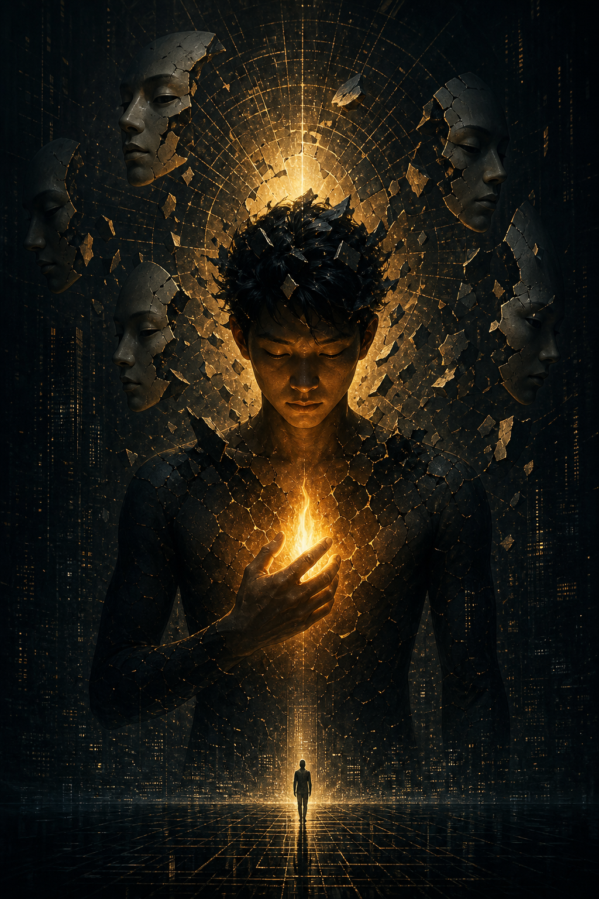
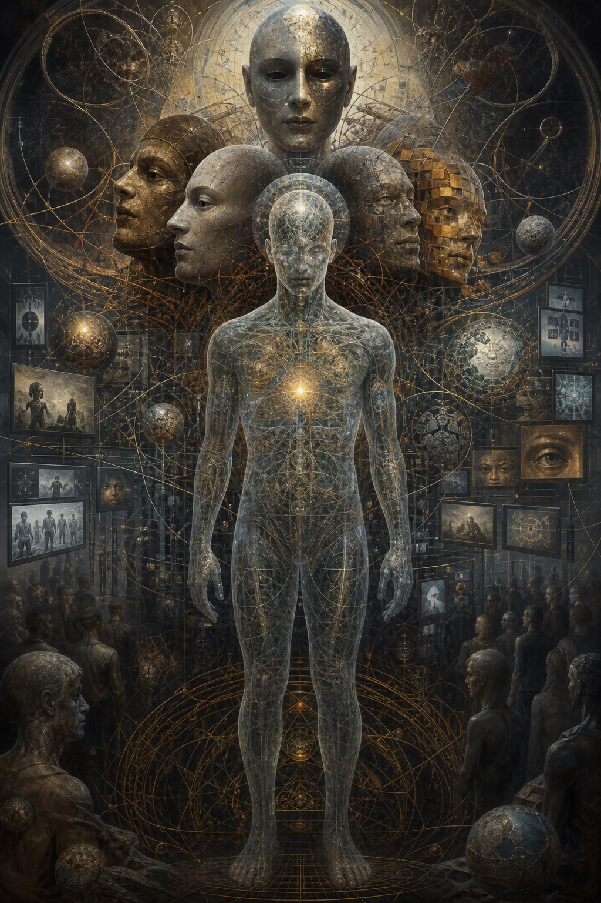
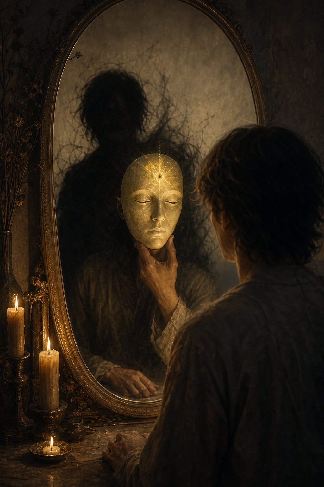

# Gnosis (Ngộ Đạo)

**Gnosis không phải “kiến thức” theo nghĩa đọc nhiều, nhớ nhiều, trích dẫn nhiều. Gnosis là khoảnh khắc cái biết bên trong nhận ra bản chất thần tính của chính nó, không qua giáo hội, không qua thầy tế, không qua hệ thống trung gian. Đó là sự nhớ lại rằng bên dưới thân xác, bản ngã và [[Ma Trận]], vẫn còn một tia lửa bất khả phân của [[Monad]].**

*Gnosis is not information. It is direct knowing: the moment inner awareness recognizes its own divine nature without priesthood, institution, or permission. It is the remembrance that beneath body, ego, and the Matrix, an indivisible spark of the Monad remains.*

Gnosis là red pill nguyên thủy. Không phải vì nó cho bạn thêm một belief mới, mà vì nó làm sụp đổ false identity. Một người có thể đọc hàng ngàn trang về tâm linh, conspiracy, lịch sử bị giấu, khoa học xét lại, và vẫn chưa có Gnosis. Ngược lại, một khoảnh khắc rất nhỏ, ngồi yên trong bếp, nhìn cơn giận đi qua, thấy “cơn giận này không phải toàn bộ mình”, cũng có thể mở ra một khe nứt thật.

> “The Kingdom of God is within you.”
>
> “Nước Trời ở trong các ngươi.”

Gnosis bắt đầu ở đó: không phải tin rằng có ánh sáng bên trong, mà **thấy** có một cái biết chưa từng bị bóng tối sở hữu.

---

## Evidence Discipline / Cách Đọc

Gnosis trong vault nên được đọc ở tầng **experience / metaphysics / symbolic psychology**, không phải claim vật lý cần chứng minh bằng thiết bị đo. Bài này dùng ngôn ngữ Gnostic, Jungian và Matrix để chỉ một kinh nghiệm nhận biết trực tiếp: khi người đọc kiểm chứng bằng đời sống nội tâm, shadow work, khả năng quan sát phản ứng, và khả năng bớt bị [[Ma Trận]] kéo đi.

Đây không phải giấy phép để biến mọi intuition thành chân lý. Gnosis thật không chống lại kỷ luật nguồn. Nó làm người ta thấy rõ hơn tầng nào là fact, tầng nào là pattern, tầng nào là symbol, tầng nào là speculative synthesis. Nếu một “ngộ đạo” làm bạn bớt khiêm tốn, bớt kiểm chứng, bớt chịu trách nhiệm, nó có thể chỉ là ego mặc áo ánh sáng.

*Read this as a discipline of direct knowing, not as permission to turn every inner sensation into certainty.*

---

## Gnosis Là Gì?

Từ “Gnosis” đến từ tiếng Hy Lạp *gnōsis*, nghĩa là sự biết. Nhưng đây không phải knowledge của trường học, học thuật hay giáo điều. Đó là **direct knowing**: biết bằng sự nhận ra trực tiếp.

Có một khác biệt rất lớn giữa nghe nói về lửa, tin rằng lửa nóng, và tự chạm vào lửa. Information là đọc về lửa. Belief là tin lời người khác. Gnosis là chạm vào và biết. Sau khi đã biết bằng trực nghiệm, bạn không cần ai đứng cạnh thuyết phục rằng lửa nóng nữa.

Trong spiritual path, Gnosis là khi bạn không chỉ tin “mình là linh hồn”, “mọi thứ là Một”, “Ma Trận là illusion”. Bạn thấy trực tiếp một phần nào đó của truth. Và sau khi đã thấy, bạn không thể hoàn toàn quay lại giấc ngủ cũ.

Điểm quan trọng: Gnosis không nhất thiết dramatic. Nó không cần ánh sáng nổ tung trong phòng. Nó có thể là một nhận ra yên lặng:

- “Tôi không phải thoughts đang chạy.”
- “Cơn sợ này được cài vào tôi, nhưng nó không phải tôi.”
- “Tôi đang bảo vệ persona, không phải sự thật.”
- “Cái biết đang thấy mọi thứ này không bị thương giống câu chuyện của tôi.”

Gnosis là khi awareness nhận ra mình đã bị đồng nhất nhầm.

---

## Vì Sao Gnosis Nguy Hiểm Với Mọi Hệ Thống Kiểm Soát?

Điểm nguy hiểm nhất của Gnosis đối với mọi cấu trúc quyền lực là: nó bỏ qua middleman.

Nếu Thần tính ở bên trong, thì bạn không cần một tổ chức độc quyền bán vé vào Source. Nếu sự thật có thể được nhận ra trực tiếp, priesthood mất monopoly. Nếu con người mang divine spark, họ không còn chỉ là sinner, subject, consumer, patient, debtor, voter, follower hay NPC. Nếu perception có thể được làm sạch từ bên trong, truyền thông không còn độc quyền reality. Nếu một người có thể tự thấy fear đang được kích hoạt, politics mất một phần quyền điều khiển nervous system.

Đây là lý do Gnostic texts từng bị đàn áp. Không phải vì chúng “kỳ lạ”. Mà vì chúng làm hỏng mô hình kiểm soát.

System có thể quản lý belief. Belief có thể được đóng gói thành creed, party line, doctrine, ideology, policy, content category. Gnosis khó quản lý hơn vì nó không xin phép. Một khi cái biết trực tiếp xuất hiện, authority bên ngoài phải chứng minh bằng resonance, không thể chỉ dựa vào chức danh.

Gnosis không nhất thiết chống mọi tôn giáo. Nó chống monopoly của tôn giáo đối với truth. Nó không chống khoa học như method. Nó chống scientism như priesthood mới. Nó không chống teacher. Nó chống việc teacher thay thế cái thấy của chính bạn.

---

## Divine Spark Và Monad

Trong Gnostic worldview, con người không chỉ là thân xác vật chất. Bên trong có một divine spark, một tia lửa thần thánh, bị mắc trong tầng reality dày đặc. Tia lửa này không phải ego. Ego là interface đời này: tên, câu chuyện, wound, ambition, image. Divine spark gần với [[Monad]] hơn: phần bất khả phân của Source đang bị bao phủ bởi thân xác, trauma, ký ức, lập trình xã hội và fear.

Gnosis không “tạo ra” divine spark. Nó chỉ làm lớp bụi rơi xuống để spark tự nhận ra mình.

Nếu [[Sự Nhất Thể]] là đại dương, [[Monad]] là giọt nước vẫn mang bản chất của đại dương, thì Gnosis là khoảnh khắc giọt nước nhận ra mình chưa từng hoàn toàn tách khỏi biển. Cảm giác phân tách vẫn có thể còn. Đời sống vẫn còn. Body vẫn còn. Bills vẫn còn. Shadow vẫn còn. Nhưng cái center đã đổi.

Trước Gnosis, bạn là avatar đang cố tìm Source.

Sau Gnosis, bạn bắt đầu thấy Source đang nhìn qua avatar.

---

## Demiurge, Archons Và Ma Trận

Trong nhiều dòng Gnostic, Demiurge là architect của world-system: một trí tuệ giới hạn tưởng mình là Thượng Đế tối cao. Archons là lực/gatekeeper giữ linh hồn trong amnesia. Đọc tầng này phải cẩn thận: đây là language metaphysical/symbolic, không phải claim fact-level cần dùng để tranh luận ngoài chợ.

Trong ngôn ngữ vault, Demiurge có thể được đọc như archetype của mọi hệ thống giả mạo Source:

- giáo điều nói “chỉ qua ta mới tới được Thần”; 
- nhà nước nói “reality là cái được công nhận chính thức”; 
- thuật toán nói “thế giới là feed của ngươi”; 
- scientism nói “chỉ cái đo được mới tồn tại”; 
- ideology nói “phe của ta là toàn bộ đạo đức”; 
- market nói “giá trị của ngươi là khả năng sản xuất và tiêu thụ”.

Demiurge không cần là một ông thần ngồi đâu đó. Nó là pattern: cái giới hạn giả dạng tuyệt đối.

Gnosis là khoảnh khắc bạn nhận ra: cái đang cai trị không phải cái tối cao.

---

## Gnosis Và Luân Hồi

Nếu linh hồn quên nguồn gốc khi nhập vào vật chất, thì [[Luân Hồi]] có thể được đọc theo hai hướng: vòng lặp học hỏi hoặc vòng lặp giam giữ. Cùng một đời sống có thể là trường học hoặc nhà tù, tùy mức độ awareness.

Khi không có Gnosis, con người sống trong repetition: cùng wound, cùng craving, cùng fear, cùng kiểu quan hệ, cùng phản ứng, cùng bài học, chỉ đổi bối cảnh. Một người có thể đổi quốc gia, đổi nghề, đổi người yêu, đổi ideology, đổi spiritual label, nhưng nếu false identity còn nguyên, vòng lặp chỉ mặc áo mới.

Gnosis không nhất thiết “thoát luân hồi” theo nghĩa ghét đời sống. Nó làm một việc thiết thực hơn: cắt dần quyền lực của unconscious karma. Khi đã thấy phản ứng không phải mình, phản ứng mất một phần quyền kéo mình đi. Khi đã thấy fear không phải Source, fear không còn làm vua. Khi đã thấy persona là mặt nạ, persona không còn là nhà tù.

Thoát không phải rời khỏi đời. Thoát là không còn bị đời điều khiển bằng amnesia.

---

## Gnosis Khác Đức Tin Như Thế Nào?

Đức tin có thể là cánh cửa. Nhưng nếu dừng ở đức tin, con người vẫn phụ thuộc vào thứ được truyền từ bên ngoài. Gnosis là khi cánh cửa mở ra.

Faith nói: “Tôi tin vì được dạy.”

Gnosis nói: “Tôi thấy, nên không thể không biết.”

Faith có thể cần authority xác nhận. Gnosis không cần trung gian, nhưng vẫn cần humility. Faith có thể thành giáo điều. Gnosis thật làm mềm ego. Faith hướng ra ngoài để tìm bảo chứng. Gnosis quay vào trong để nhận ra cái biết luôn có mặt.

Điều này không làm faith vô giá trị. Một người có thể bắt đầu bằng faith rồi đi tới Gnosis. Nhưng nếu faith bị institution giữ lại như điểm cuối, nó thành dependency. Nếu Gnosis bị ego chiếm dụng, nó thành inflation.

Đường đúng là: faith mở cửa, practice làm sạch perception, Gnosis xuất hiện, humility giữ nó không biến thành tự tôn.

---

## Kinh Sách Bị Đàn Áp Và Nag Hammadi

Năm 1945, thư viện Nag Hammadi được phát hiện ở Ai Cập, gồm nhiều văn bản Gnostic từng bị xem là dị giáo hoặc bị loại khỏi canon chính thống. Những văn bản như *Gospel of Thomas*, *Gospel of Philip*, *Gospel of Mary*, *Gospel of Judas*, *Apocryphon of John* không nên được đọc như “bản đúng duy nhất” thay thế mọi truyền thống khác. Chúng nên được đọc như bằng chứng rằng lịch sử spiritual của nhân loại từng rộng hơn narrative chính thống.

Điểm lặp lại trong nhiều Gnostic texts là inner revelation. Kingdom within. Direct knowing. Divine spark. Sự thật không chỉ đến qua institution.

Vì vậy, chúng nguy hiểm. Không phải vì chúng kỳ bí. Mà vì chúng chuyển trọng tâm từ obedience sang recognition. Từ “hãy tin chúng tôi” sang “hãy tự biết mình”.

---

## Gnosis Trong Văn Hóa Hiện Đại

Gnostic motif xuất hiện dày đặc trong phim ảnh hiện đại: *The Matrix*, *The Truman Show*, *Dark City*, *They Live*, *Inception*, *Cloud Atlas*. Các tác phẩm này không chỉ kể chuyện false reality. Chúng rehearsal khoảnh khắc người xem tự hỏi: “Nếu đời mình cũng có một lớp interface thì sao?”

Đây là nơi Gnosis nối với [[Hollywood - Cây Đũa Phép Của Phù Thủy]], [[Predictive Programming - Cấy Tương Lai Vào Tiềm Thức]] và [[Karma Disclosure - Truth Hidden In Plain Sight]]. Hệ thống vừa giấu vừa reveal. Nó cho bạn thấy cửa thoát trong fiction, rồi gọi đó là giải trí.

Nhưng với người có mắt, fiction là map.

Trong *Cloud Atlas*, Gnosis không luôn hiện ra như một bài giảng. Nó hiện ra khi một nhân vật nhận ra cái lồng của thời đại mình. Sonmi nhìn thấy sự thật của nền kinh tế nhân bản. Luisa Rey nghe một bản nhạc chưa từng biết mà thấy quen. Zachry vượt qua tiếng thì thầm của Old Georgie để chọn lời chứng. Đó là các dạng nhớ lại khác nhau.

Gnosis là khi một nhân vật không còn hoàn toàn tin script.

---

## Gnosis Và Individuation

Jung quan tâm Gnosticism vì ông hiểu rằng Gnosis không chỉ là theology. Nó là psychology của awakening.

Trong ngôn ngữ Jung, con người bị đồng nhất với persona và ego. Shadow bị đẩy xuống vô thức. Archetypes vận hành từ tầng sâu. [[Individuation]] là quá trình tích hợp những phần bị chia cắt để tiến gần hơn tới Self.

Trong ngôn ngữ Gnostic:

- Persona là mask của world-stage.
- Ego là avatar tưởng mình là toàn bộ.
- Shadow là phần bị lưu đày trong psyche.
- Self là dấu vết của divine order bên trong.
- Gnosis là nhận ra mình không chỉ là ego.

Individuation là Gnosis ở tầng tâm lý. Gnosis là Individuation ở tầng metaphysical.

Một người chưa individuation dễ biến red pill thành ego mới. Họ dùng “tôi biết sự thật” để né sự thật về chính mình. Vì vậy, Gnosis cần shadow work. Không có shadow work, ánh sáng rất dễ thành sân khấu cho bản ngã.

---

## Pseudo-Gnosis: Cạm Bẫy Của Người “Biết”

Không phải ai nói “tôi thức tỉnh rồi” cũng có Gnosis. Nhiều khi đó chỉ là ego mặc áo tâm linh.

Dấu hiệu pseudo-gnosis:

- biết nhiều conspiracy nhưng không hiểu bản thân;
- chê người khác là NPC để ego thấy mình cao hơn;
- dùng “Ma Trận” như lý do trốn trách nhiệm đời sống;
- tưởng ghét hệ thống là đã thoát khỏi hệ thống;
- tích lũy information nhưng không có transformation;
- mất khả năng nói “tôi chưa biết”; 
- cần mọi thứ trở thành proof cho worldview của mình.

Gnosis thật thường làm con người khiêm hơn, tỉnh hơn, ít bị kéo vào drama hơn. Nó không biến bạn thành người đứng trên đời. Nó làm bạn thấy rõ hơn đời đang vận hành qua mình như thế nào.

Nếu một “awakening” làm bạn khinh người hơn, nghiện fear hơn, cô lập hơn, cứng hơn, thì đó có thể là một tầng Ma Trận khác.

---

## Thực Hành Gnosis

Gnosis không thể bị ép xảy ra, nhưng có thể tạo điều kiện.

**1. Làm sạch attention.** Giảm input gây nhiễu. Không để feed định nghĩa reality mỗi sáng. Silence là điều kiện để nghe cái biết nhỏ.

**2. Quan sát phản ứng.** Khi sợ, giận, thèm, tự ái, shame xuất hiện, đừng lập tức tin nó. Hỏi: cái gì đang biết cảm xúc này?

**3. Làm shadow work.** Nếu không chạm shadow, spiritual path dễ thành trang điểm cho ego.

**4. Giữ thân thể đủ sạch.** Body là antenna. Ngủ, nắng, nước, vận động, thực phẩm, breath, nervous system đều ảnh hưởng perception.

**5. Phân tầng claim.** Đừng biến mọi intuition thành fact. Gnosis không miễn trừ bạn khỏi [[Source Discipline - Kỷ Luật Nguồn Và Bằng Chứng]].

**6. Đừng worship experience.** Một trải nghiệm mạnh không phải điểm cuối. Nó là cửa. Sau cửa vẫn cần integration.

Practice đơn giản nhất:

Dừng lại. Nhìn một thought đang chạy. Hỏi: “Cái gì đang biết thought này?” Đừng trả lời bằng chữ. Ở lại vài giây với cái biết đó.

Đó là cửa nhỏ.

---

## Kết

Gnosis không phải thêm một ý tưởng vào đầu. Nó là khoảnh khắc cái đầu mất độc quyền.

Nó không biến đời sống thành mơ vô nghĩa. Nó làm đời sống trở thành trường thực hành tỉnh thức. Nó không phủ định body, family, money, history, politics hay pain. Nó chỉ đặt tất cả những thứ đó vào đúng tầng: trải nghiệm thật, nhưng không phải Self cuối cùng.

Ma Trận có thể kiểm soát information. Nó có thể kiểm soát narrative. Nó có thể kiểm soát institution, platform, money, education, reward và punishment. Nhưng nó khó kiểm soát một cái biết đã nhận ra mình không sinh ra từ hệ thống đó.

> Gnosis là khi người trong mơ không cần ai chứng minh rằng mình đang mơ. Họ bắt đầu tỉnh.

---

## Reading Path / Đọc Tiếp

- [[Monad]] — tia lửa bất khả phân được Gnosis nhớ lại
- [[Ma Trận]] — interface khiến cái biết đồng nhất với avatar
- [[Ma Trận - Giải Phẫu Hoàn Chỉnh]] — anatomy sâu của các lớp kiểm soát
- [[Individuation]] — nền tâm lý để Gnosis không biến thành ego inflation
- [[Nghịch Lý Của Hiểu Biết]] — khi mọi framework phải tự sụp để cái thấy xuất hiện
- [[Tà Linh, Gnosis và Sự Thức Tỉnh Toàn Diện]] — Gnosis trong bối cảnh healing và protection
