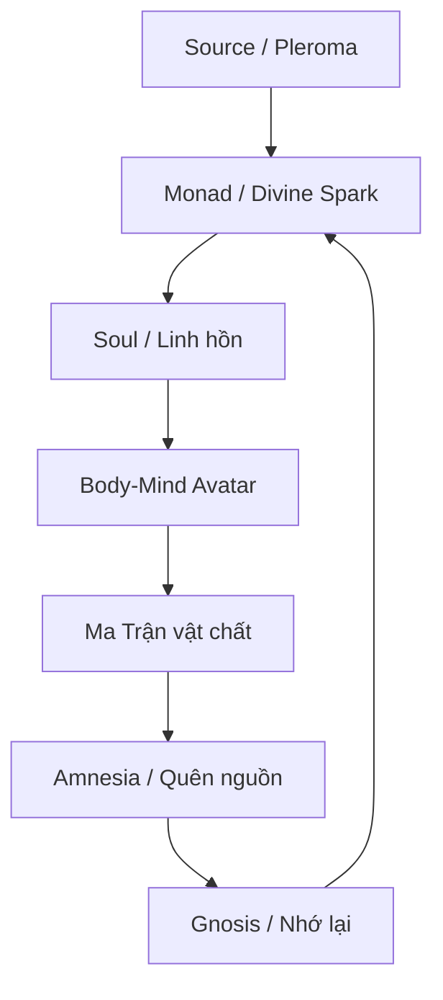

# Gnosis (Ngộ Đạo)

**Gnosis không phải “kiến thức” theo nghĩa đọc nhiều, nhớ nhiều, trích dẫn nhiều. Gnosis là khoảnh khắc cái biết bên trong nhận ra bản chất thần tính của chính nó, không qua giáo hội, không qua thầy tế, không qua hệ thống trung gian. Đó là sự nhớ lại rằng bên dưới thân xác, bản ngã và [[Ma Trận]], vẫn còn một tia lửa bất khả phân của [[Monad]].**

*Gnosis is not “knowledge” in the intellectual sense. It is the moment inner knowing recognizes its own divine nature, without church, priesthood, or institutional mediation. It is the remembrance that beneath body, ego, and the Matrix, there remains an indivisible spark of the Monad.*

> “The Kingdom of God is within you.”
>
> “Nước Trời ở trong các ngươi.”

Gnosis là red pill nguyên thủy. Không phải vì nó cho bạn thêm thông tin, mà vì nó làm sụp đổ false identity.

---

## Evidence Discipline / Cách Đọc

Gnosis trong vault nên được đọc ở tầng **experience / metaphysics / symbolic psychology**, không phải claim vật lý cần chứng minh bằng laboratory data. Bài này dùng ngôn ngữ Gnostic, Jungian và Matrix để chỉ một kinh nghiệm nhận biết trực tiếp: khi người đọc kiểm chứng bằng đời sống nội tâm, shadow work và khả năng bớt bị [[Ma Trận|Ma Trận]] kéo đi.

*Read this as a discipline of direct knowing, not as permission to turn every intuition into certainty.*

---

## 1. Gnosis Là Gì?

Từ “Gnosis” đến từ tiếng Hy Lạp *gnōsis* — nghĩa là sự biết. Nhưng đây không phải knowledge của trường học, học thuật hay giáo điều. Đó là direct knowing: biết bằng sự nhận ra trực tiếp.

Có ba tầng “biết”:

| Tầng | Loại biết | Ví dụ |
|---|---|---|
| Information | Biết bằng dữ liệu | Đọc về lửa nóng |
| Belief | Biết bằng niềm tin | Tin lời người khác rằng lửa nóng |
| Gnosis | Biết bằng trực nghiệm | Chạm vào lửa và biết |

Trong tâm linh, Gnosis là khi bạn không còn chỉ tin “mình là linh hồn”, “mọi thứ là một”, “Ma Trận là illusion”. Bạn thấy trực tiếp một phần nào đó của truth. Và sau khi đã thấy, bạn không thể hoàn toàn quay lại giấc ngủ cũ.

---

## 2. Gnosis Không Cần Trung Gian

Điểm nguy hiểm nhất của Gnosis đối với mọi hệ thống quyền lực là: nó bỏ qua middleman.

Nếu Thần tính ở bên trong, thì bạn không cần một tổ chức độc quyền bán vé vào Source. Nếu sự thật có thể được nhận ra trực tiếp, thì priesthood mất monopoly. Nếu con người có divine spark, thì họ không còn chỉ là sinner, subject, consumer hay NPC.

Đây là lý do Gnostic texts từng bị đàn áp. Không phải vì chúng “kỳ lạ”. Mà vì chúng làm hỏng mô hình kiểm soát.

| Mô hình kiểm soát | Gnosis phá vỡ bằng cách nào? |
|---|---|
| Giáo hội độc quyền cứu rỗi | Thần tính nằm bên trong |
| Nhà nước định nghĩa reality | Reality có tầng sâu hơn official narrative |
| Truyền thông định hướng perception | Cái thấy trực tiếp mạnh hơn frame |
| Ma Trận giữ con người trong amnesia | Gnosis là remembering |

*The system can tolerate belief. Belief can be managed. Gnosis is harder to manage because it does not ask permission.*

---

## 3. Divine Spark: Tia Lửa Bị Mắc Kẹt Trong Vật Chất

Trong Gnostic worldview, con người không chỉ là thân xác vật chất. Bên trong có một divine spark — tia lửa thần thánh — bị mắc kẹt trong tầng reality dày đặc.

Tia lửa này không phải ego. Ego là interface đời này. Divine spark gần với [[Monad]] hơn: phần bất khả phân của Source đang bị bao phủ bởi thân xác, trauma, ký ức, lập trình xã hội và fear.

Gnosis không “tạo ra” divine spark. Nó chỉ làm lớp bụi rơi xuống để spark tự nhận ra mình.

---

## 4. Demiurge Và Ma Trận

Trong nhiều dòng Gnostic, Demiurge là “creator god” của thế giới vật chất. Nhưng Demiurge không phải Source tối cao. Nó là craftsman, architect, hoặc một trí tuệ giới hạn tưởng mình là Thượng Đế.

Nếu nói bằng ngôn ngữ hiện đại: Demiurge là system architect của [[Ma Trận]].

| Gnostic term | Ngôn ngữ vault |
|---|---|
| Pleroma | Source / fullness / trường ánh sáng |
| Monad / Divine Spark | Tia lửa bất khả phân của Source |
| Demiurge | Architect của world-simulation |
| Archons | Agents / gatekeepers / lực giữ linh hồn trong amnesia |
| Material world | Layer vật chất của Ma Trận |
| Gnosis | Red pill trực nghiệm |

Demiurge không cần được hiểu như một ông thần ngồi đâu đó. Nó có thể là archetype của mọi hệ thống giả mạo Source: giáo điều, nhà nước, thuật toán, priesthood, scientism, ideology, hoặc bất kỳ cấu trúc nào nói rằng “ta là thực tại duy nhất”.

Gnosis là khoảnh khắc bạn nhận ra: cái đang cai trị không phải cái tối cao.

---

## 5. Gnosis Và Luân Hồi

Nếu linh hồn quên nguồn gốc khi nhập vào vật chất, thì [[Luân Hồi]] có thể trở thành vòng lặp học hỏi hoặc vòng lặp giam giữ, tùy mức độ tỉnh thức.

Gnostic path nhìn hành trình như sau:

| Giai đoạn | Trạng thái |
|---|---|
| Descent | Soul đi vào vật chất |
| Amnesia | Quên Source, đồng nhất với ego/avatar |
| Sleep | Sống trong script của Ma Trận |
| Friction | Đau khổ, mâu thuẫn, câu hỏi xuất hiện |
| Awakening | Nhận ra reality có gì đó sai |
| Gnosis | Trực nghiệm divine spark |
| Integration | Sống trong đời nhưng không còn thuộc về script cũ |
| Return | Không còn bị kéo bởi vòng lặp cũ |

Thoát luân hồi không nhất thiết nghĩa là ghét đời sống. Nó nghĩa là không còn bị unconscious karma kéo đi như một phản xạ. Khi đã nhớ mình là gì, linh hồn không còn cần học cùng một bài bằng cùng một cách đau đớn.

---

## 6. Gnosis Khác Với Đức Tin Như Thế Nào?

Đức tin có thể là cánh cửa. Nhưng nếu dừng ở đức tin, con người vẫn phụ thuộc vào thứ được truyền từ bên ngoài.

Gnosis là khi cánh cửa mở ra.

| Faith / Đức tin | Gnosis / Ngộ đạo |
|---|---|
| Tin vì được dạy | Biết vì trực nghiệm |
| Cần authority xác nhận | Không cần trung gian |
| Có thể bị thay bằng niềm tin khác | Khó bị xóa vì đã thấy |
| Dễ trở thành giáo điều | Nếu thật, làm mềm ego |
| Hướng ra ngoài | Quay vào trong |

Gnosis không chống lại tất cả tôn giáo. Nó chống lại monopoly của tôn giáo đối với truth.

---

## 7. Kinh Sách Bị Đàn Áp Và Nag Hammadi

Năm 1945, thư viện Nag Hammadi được phát hiện ở Ai Cập, gồm nhiều văn bản Gnostic từng bị xem là dị giáo hoặc bị loại khỏi canon chính thống.

Một số văn bản quan trọng:

| Text | Gợi ý nội dung |
|---|---|
| Gospel of Thomas | Những lời dạy trực tiếp, nhấn mạnh Kingdom within |
| Gospel of Philip | Sacrament, union, Mary Magdalene |
| Gospel of Mary | Vai trò nữ tính và inner revelation |
| Gospel of Judas | Đảo chiều narrative phản bội |
| Apocryphon of John | Cosmology về Demiurge và divine spark |

Tại sao những văn bản này nguy hiểm?

Vì chúng chuyển trọng tâm từ obedience sang recognition. Từ institution sang inner knowing. Từ “hãy tin chúng tôi” sang “hãy tự biết mình”.

---

## 8. Gnosis Trong Văn Hóa Hiện Đại

Gnostic motif xuất hiện dày đặc trong phim ảnh hiện đại, đặc biệt những tác phẩm về false reality.

| Tác phẩm | Gnostic motif |
|---|---|
| *The Matrix* | Red pill, false reality, awakening, agents |
| *The Truman Show* | Thế giới dựng sẵn, bầu trời giả, escape dome |
| *Dark City* | Memory manipulation, trapped city, hidden controllers |
| *They Live* | Kính nhìn xuyên illusion, alien controllers |
| *Inception* | Dream layers, planted ideas, reality testing |

Đây là nơi Gnosis nối với [[Hollywood - Cây Đũa Phép Của Phù Thủy]] và [[Karma Disclosure - Truth Hidden In Plain Sight]]. Hệ thống vừa giấu vừa reveal. Nó cho bạn thấy cửa thoát trong fiction, rồi gọi đó là giải trí.

Nhưng với người có mắt, fiction là map.

---

## 9. Gnosis Và Individuation

Jung nghiên cứu Gnosticism rất sâu vì ông hiểu rằng Gnosis không chỉ là theology. Nó là psychology của awakening.

Trong ngôn ngữ Jung, con người bị đồng nhất với persona và ego. Shadow bị đẩy xuống vô thức. Archetypes vận hành từ tầng sâu. Individuation là quá trình tích hợp những phần bị chia cắt để trở thành một Self toàn vẹn hơn.

Trong ngôn ngữ Gnostic:

- Persona = mask của world-stage.
- Ego = avatar tưởng mình là toàn bộ.
- Shadow = phần bị lưu đày trong psyche.
- Self = dấu vết của divine order bên trong.
- Gnosis = nhận ra mình không chỉ là ego.

[[Individuation]] là Gnosis ở tầng tâm lý. Gnosis là Individuation ở tầng metaphysical.

---

## 10. Pseudo-Gnosis: Cạm Bẫy Của Người “Biết”

Không phải ai nói “tôi thức tỉnh rồi” cũng có Gnosis. Nhiều khi đó chỉ là ego mặc áo tâm linh.

Các dấu hiệu pseudo-gnosis:

- Biết nhiều conspiracy nhưng không hiểu bản thân.
- Chê người khác là NPC để ego thấy mình cao hơn.
- Dùng “Ma Trận” như lý do trốn trách nhiệm đời sống.
- Tưởng ghét hệ thống là đã thoát khỏi hệ thống.
- Tích lũy information nhưng không có transformation.

Gnosis thật thường làm con người khiêm hơn, tỉnh hơn, ít bị kéo vào drama hơn. Nó không biến bạn thành người đứng trên đời. Nó làm bạn thấy rõ hơn đời đang vận hành qua mình như thế nào.

---

## 11. Thực Hành Gnosis

Gnosis không thể ép xảy ra, nhưng có thể tạo điều kiện.

Một số cửa vào:

1. **Self-inquiry** — hỏi “Tôi là ai nếu không phải thought này, emotion này, story này?”
2. **Shadow work** — nhìn phần bị chối bỏ thay vì project ra ngoài.
3. **Meditation** — quan sát cái biết phía sau trạng thái.
4. **Dream work** — đọc biểu tượng từ vô thức.
5. **Body purification** — thân xác đục thì perception cũng đục.
6. **Truth practice** — nói thật với chính mình trước khi đòi biết truth vũ trụ.

Gnosis không phải event một lần. Nó là nhiều lần nhớ lại, quên, rồi nhớ sâu hơn.

---

## 12. Synthesis: Gnosis Là Lối Thoát Khỏi Ma Trận Bên Trong

Nhiều người tưởng thoát Ma Trận là biết hết âm mưu bên ngoài. Nhưng nếu bên trong vẫn bị điều khiển bởi fear, craving, pride, resentment và identity, thì Ma Trận chỉ đổi hình dạng.

Gnosis bắt đầu khi câu hỏi quay ngược lại:

> Cái gì trong mình đang bị điều khiển?

Và sâu hơn:

> Cái gì trong mình không thể bị điều khiển?

Câu trả lời thứ hai dẫn về [[Monad]].

Gnosis là lúc consciousness nhớ ra nó không phải nhà tù, không phải cai ngục, không phải vai tù nhân. Nó là cái đang thấy toàn bộ cấu trúc nhà tù.

Khi cái thấy đủ sáng, nhà tù mất quyền định nghĩa bạn.

---

## Related

### Source / Nguồn
- [[Monad]] — Tia lửa bất khả phân được Gnosis nhớ lại
- [[Sự Nhất Thể]] — Tầng Source sau mọi phân mảnh
- [[Nghịch Lý Của Hiểu Biết]] — Khi mọi framework collapse

### Matrix / Escape
- [[Ma Trận]] — False reality cần được nhìn xuyên
- [[Ma Trận - Giải Phẫu Hoàn Chỉnh]] — Cấu trúc nhiều lớp của hệ thống kiểm soát
- [[Luân Hồi]] — Vòng lặp kinh nghiệm/amnesia
- [[Tà Linh, Gnosis và Sự Thức Tỉnh Toàn Diện]]

### Integration
- [[Individuation]] — Gnosis ở tầng tâm lý học Jung
- [[Tuyến Tùng]] — Biểu tượng của inner sight
- [[Vô Thức Tập Thể]] — Tầng archetype nơi nhiều revelation xuất hiện

---

> *“Gnosis is not learning something new. It is remembering what was never truly lost.”*
>
> *Gnosis không phải học thêm một điều mới. Nó là nhớ lại thứ chưa từng thật sự mất.*
