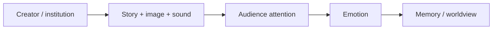
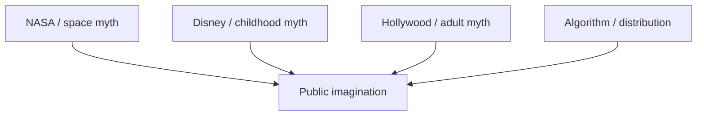

# Hollywood — Cây Đũa Phép Của Phù Thủy / The Sorcerer's Wand

**Hollywood là nơi giải trí trở thành nghi lễ đại chúng: hình ảnh, nhạc, thần tượng, biểu tượng và câu chuyện được lặp lại đủ lâu để đi thẳng vào [[Vô Thức Tập Thể]].** Cách đọc "holy wood" như cây đũa phép không nên hiểu là etymology chắc chắn; nó là **symbolic key** để thấy chức năng của màn hình: hướng attention, gợi cảm xúc, và lập trình cách con người tưởng tượng thực tại.

*Hollywood is mass ritual through entertainment: image, music, celebrity, symbol, and story repeated until they enter the collective unconscious.*

---

## Evidence Discipline / Cách Đọc

| Tầng claim | Cách đọc đúng |
|---|---|
| Fact | Hollywood là trung tâm công nghiệp điện ảnh; media có tác động thật lên hành vi, ngôn ngữ, aspiration và worldview |
| Pattern | Nội dung lặp lại có thể bình thường hóa công nghệ, chiến tranh, surveillance, transhumanism, panic hoặc desire |
| Symbol | "Holy wood", wand, spell, screen, star, ritual là ngôn ngữ biểu tượng để đọc power của hình ảnh |
| Speculative synthesis | Claim về occult network, karmic disclosure hoặc elite ritual phải đọc như vault hypothesis, không phải hồ sơ pháp lý |

---

## Vault Position / Vị Trí Trong Vault

Bài này là hub cho cụm [[Predictive Programming - Cấy Tương Lai Vào Tiềm Thức]], [[Inception - Predictive Programming Về Kiểm Soát Tâm Trí]], [[Bộ Tam Thánh Mind Control - NASA Disney Hollywood]] và [[Karma Disclosure - Truth Hidden In Plain Sight]]. Nếu [[Ma Trận]] là hệ điều hành của perception, Hollywood là một trong các UI chính: đẹp, cảm xúc, addictive, và được tiêu thụ tự nguyện.

---

## Wand Không Tạo Phép, Wand Hướng Ý Chí

Trong biểu tượng học, đũa phép không tự sinh quyền năng. Nó **hướng ý chí** của người cầm vào một điểm. Màn hình cũng vậy: nó gom hàng triệu con mắt vào cùng một frame, cùng một nhạc nền, cùng một archetype.

Đây là "magic" theo nghĩa vận hành của consciousness: không cần vi phạm vật lý, chỉ cần chạm vào hình ảnh bên trong đầu người xem.

---

## Entertainment Là Vùng Critical Thinking Thấp

Khi con người xem phim, họ tự nguyện hạ phòng thủ: "chỉ là giải trí mà". Chính trạng thái này làm fiction mạnh. Một ý tưởng mà khi nói trong politics sẽ bị phản kháng, khi đặt vào story có thể được cảm, được yêu, được nhớ.

| Chính trị nói thẳng | Fiction làm mềm |
|---|---|
| surveillance | superhero cần hệ thống theo dõi để cứu thế giới |
| AI governance | robot thông minh hơn người nhưng "có đạo đức" |
| pandemic control | lockdown như hy sinh cần thiết |
| war expansion | enemy ngoài hành tinh hoặc terrorist tuyệt đối |
| transhumanism | upgrade cơ thể như cool destiny |

Đây là lõi của [[Predictive Programming - Cấy Tương Lai Vào Tiềm Thức]]: không phải phim nào cũng là agenda, nhưng agenda nào muốn đi sâu vào tâm trí đều cần story.

---

## Hidden In Plain Sight

Hollywood thích nói thật bằng fiction: aliens, simulation, body harvesting, secret societies, mind control, occult symbols, AI gods, synthetic humans. Người xem được quyền cười, khóc, cosplay, rồi quay lại đời thường như chưa có gì xảy ra.

Theo ngôn ngữ vault, đây là [[Karma Disclosure - Truth Hidden In Plain Sight]]: phương pháp được reveal, nhưng dưới dạng entertainment nên phần lớn không xử lý như knowledge.

> Câu hỏi không phải "phim này dự đoán đúng chưa?" mà là "phim này đang dạy hệ thần kinh phản ứng thế nào với một khả năng?"

---

## Symbol Stack / Bộ Ký Hiệu Lặp Lại

| Symbol | Cách đọc trong vault |
|---|---|
| Eye | surveillance, initiation, nhìn và bị nhìn |
| Pyramid | hierarchy, ancient power, top-down order |
| Saturn / cube | limitation, time, enclosure, [[Saturn Cube]] |
| Star | celebrity as astral substitute, worship of image |
| Mirror / screen | reality layer, avatar, double-self |
| Alien | otherness, awe, fear, controlled revelation |

Symbol không tự chứng minh âm mưu. Symbol là nơi pattern để lại fingerprint. Một dấu thì có thể tình cờ; một hệ dấu lặp qua decades thì đáng đọc.

---

## NASA - Disney - Hollywood

[[Bộ Tam Thánh Mind Control - NASA Disney Hollywood]] là bài đọc riêng cho tam giác science spectacle, child imagination và adult entertainment. Hollywood không đứng một mình; nó hoạt động cùng education, news, platform algorithm, celebrity economy và tech marketing.

Khi cùng một archetype xuất hiện trong phim, toys, news, documentaries và school material, nó không còn là một "movie trope". Nó trở thành shared reality template.

---

## Avatar, Matrix, Inception

Ba case study quan trọng trong vault:

| Phim | Disclosure pattern |
|---|---|
| *Avatar* | Gaia, planetary intelligence, indigenous knowledge vs extraction |
| *The Matrix* | simulation, battery-human, red pill, agent system |
| *Inception* | cấy ý tưởng vào subconscious để người nhận tưởng là ý của mình |

Các phim này không cần được đọc là "tài liệu". Chúng là myth hiện đại: kể sự thật bằng hình ảnh đủ mạnh để cả nền văn hóa dùng lại ngôn ngữ của chúng.

---

## Decoder Mindset / Cách Xem Không Bị Nuốt

Không cần paranoia. Paranoia vẫn là bị điều khiển. Cách xem tỉnh hơn:

1. Thưởng thức craft, nhưng hỏi frame đang bán gì.
2. Nhìn concept nào được làm cool, concept nào bị làm ghê.
3. Nhìn ai được quyền giải thích reality trong phim.
4. Nhìn fear/desire nào bị kích hoạt.
5. Sau khi xem, quay về thân: mình sáng hơn hay đục hơn?

Người tỉnh không phải người ghét phim. Người tỉnh là người không để phim xem ngược lại mình.

---

## Core Insight / Chốt Lại

**Hollywood là một cây đũa phép vì nó hướng ý chí tập thể qua hình ảnh. Khi hàng tỷ người cùng mơ bằng hình ảnh do một công nghiệp tạo ra, câu hỏi "ai đang viết giấc mơ?" trở thành câu hỏi chính trị, tâm linh và nhận thức luận.**

*When billions dream through images manufactured by an industry, "who writes the dream?" becomes an epistemological and spiritual question.*
