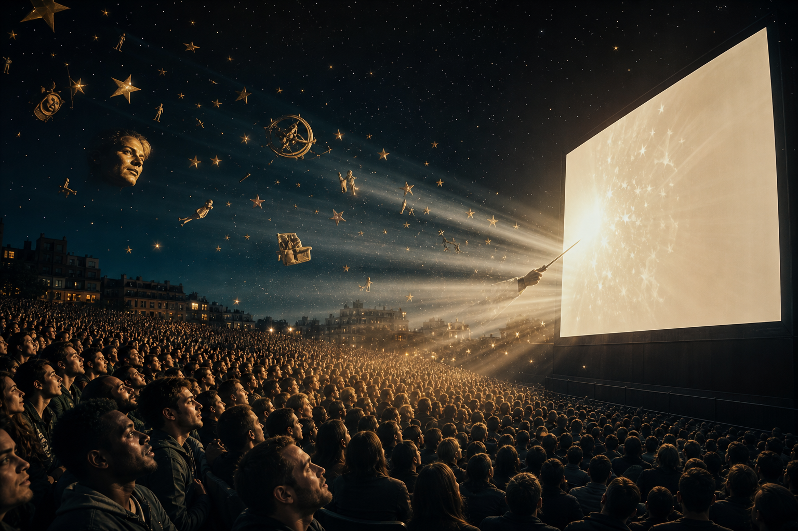
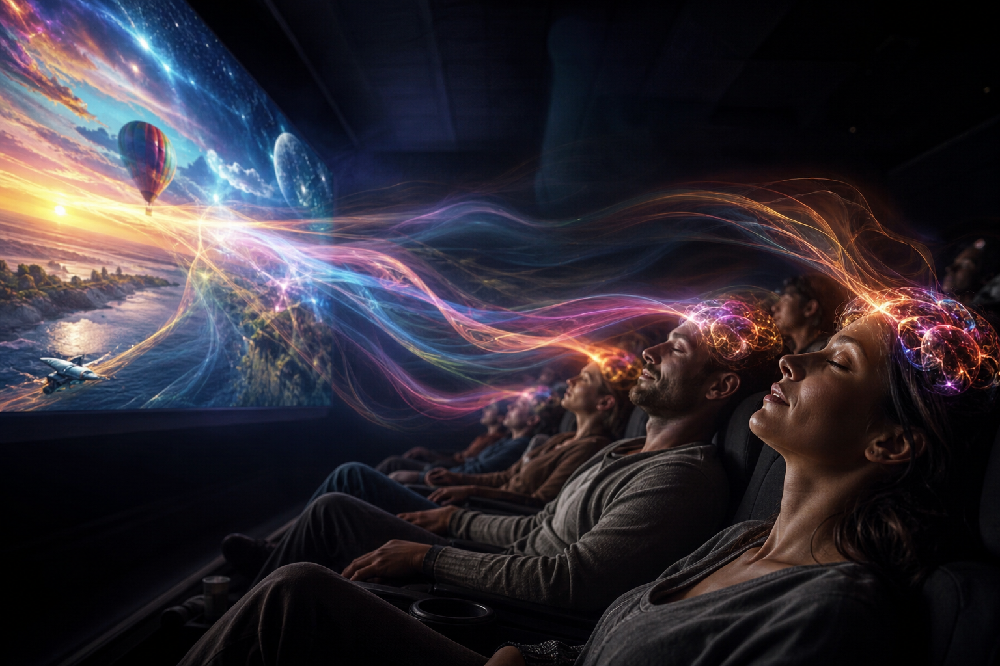
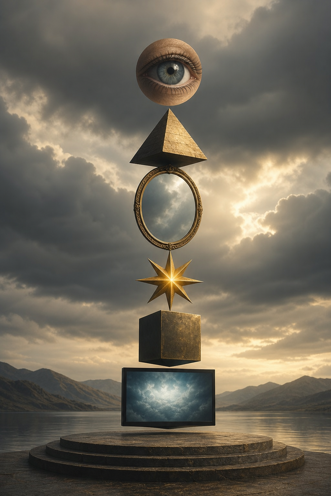

# Hollywood — Cây Đũa Phép Của Phù Thủy

**Hollywood là nơi giải trí trở thành nghi lễ đại chúng: hình ảnh, nhạc, thần tượng, biểu tượng và câu chuyện được lặp đủ lâu để đi thẳng vào [[Vô Thức Tập Thể]]. Cách đọc “holy wood” như cây đũa phép không nên hiểu là etymology chắc chắn; nó là symbolic key để thấy chức năng của màn hình: hướng attention, gợi cảm xúc, và lập trình cách con người tưởng tượng thực tại.**

*Hollywood is mass ritual through entertainment: image, music, celebrity, symbol, and story repeated until they enter the collective unconscious. “Holy wood” as wand is not a strict etymological claim; it is a symbolic key for reading the screen as a device that directs attention, emotion, and imagination.*

Hollywood không cần mọi người tin một doctrine. Nó chỉ cần mọi người cùng mơ bằng cùng một bộ hình ảnh.

---

## Evidence Discipline / Cách Đọc

Ở tầng fact, Hollywood là trung tâm công nghiệp điện ảnh và media có tác động thật lên ngôn ngữ, aspiration, hành vi và worldview. Ở tầng pattern, nội dung lặp lại có thể bình thường hóa công nghệ, chiến tranh, surveillance, transhumanism, panic hoặc desire. Ở tầng symbol, wand, spell, screen, star, ritual, mirror là ngôn ngữ đọc power của hình ảnh. Ở tầng speculative synthesis, claim về occult network hoặc elite ritual phải đọc như vault hypothesis, không phải hồ sơ pháp lý.

Không phải cứ thấy một con mắt, kim tự tháp hay màu đỏ-xanh là kết luận agenda. Symbol không tự chứng minh âm mưu. Symbol là nơi pattern để lại fingerprint. Một dấu có thể là coincidence. Một hệ dấu lặp qua decades, qua nhiều studio, franchise, ceremony và news cycle thì đáng đọc.

---

## Vault Position / Vị Trí Trong Vault

Bài này là hub cho cụm [[Predictive Programming - Cấy Tương Lai Vào Tiềm Thức]], [[Inception - Predictive Programming Về Kiểm Soát Tâm Trí]], [[Bộ Tam Thánh Mind Control - NASA Disney Hollywood]] và [[Karma Disclosure - Truth Hidden In Plain Sight]]. Nếu [[Ma Trận]] là hệ điều hành perception, Hollywood là một trong các UI chính: đẹp, cảm xúc, addictive, và được tiêu thụ tự nguyện.

Hollywood không đứng riêng. Nó hoạt động cùng education, news, platform algorithm, celebrity economy, advertising, tech marketing và chính trị. Khi cùng một archetype xuất hiện trong phim, toys, documentaries, memes, news và school material, nó không còn là trope. Nó trở thành shared reality template.

---

## Wand Không Tạo Phép, Wand Hướng Ý Chí

Trong biểu tượng học, đũa phép không tự sinh quyền năng. Nó hướng ý chí của người cầm vào một điểm. Màn hình cũng vậy: nó gom hàng triệu con mắt vào cùng một frame, cùng một nhạc nền, cùng một archetype.

Đây là “magic” theo nghĩa vận hành của consciousness. Không cần vi phạm vật lý. Chỉ cần đặt hình ảnh đúng vào đầu người xem, đúng cảm xúc, đúng nhịp lặp, đúng thời điểm đời sống.

Một cảnh phim mạnh có thể dạy public yêu một technology trước khi họ hiểu nó. Một villain đẹp có thể eroticize darkness. Một hero dùng surveillance có thể moralize surveillance. Một alien disclosure story có thể tập public với awe/fear trước authority mới. Một dystopia có thể vừa cảnh báo vừa làm quen.

Hollywood là wand vì nó không chỉ chiếu hình ảnh. Nó hướng imagination.

---

## Entertainment Là Vùng Critical Thinking Thấp

Khi xem phim, người ta tự nguyện hạ guard. “Chỉ là giải trí mà.” Chính câu này làm fiction mạnh.

Một ý tưởng mà khi nói trong politics sẽ bị phản kháng, khi đặt vào story có thể được cảm, được yêu, được khóc, được cosplay. Khi cảm xúc đã gắn với hình ảnh, lý trí thường chỉ viết lời biện hộ sau.

Surveillance trong debate là quyền riêng tư bị xâm phạm. Surveillance trong superhero movie là công cụ cứu thành phố. AI governance trong policy là technocracy. AI lover trong phim là intimacy. Biosecurity trong law là restriction. Biosecurity trong thriller là sacrifice để cứu nhân loại.

Đây là lõi của [[Predictive Programming - Cấy Tương Lai Vào Tiềm Thức]]: không phải phim nào cũng là agenda, nhưng agenda nào muốn đi sâu vào tâm trí đều cần story.

---

## Hidden In Plain Sight

Hollywood thích nói thật bằng fiction: simulation, body harvesting, secret societies, mind control, occult symbols, AI gods, synthetic humans, alien management, ritual sacrifice, memory editing. Người xem được quyền cười, khóc, cosplay, rồi quay lại đời thường như chưa có gì xảy ra.

Theo ngôn ngữ vault, đây là [[Karma Disclosure - Truth Hidden In Plain Sight]]: method được reveal, nhưng dưới dạng entertainment nên phần lớn không xử lý như knowledge.

Câu hỏi không phải “phim này dự đoán đúng chưa?”. Câu hỏi là: “Phim này đang dạy hệ thần kinh phản ứng thế nào với một khả năng?”

Một tác phẩm có thể là art thật và programming cùng lúc. Nghệ sĩ có thể thành channel cho zeitgeist mà không hiểu toàn bộ field đang chảy qua mình.

---

## Symbol Stack / Bộ Ký Hiệu Lặp Lại

Một số symbol lặp trong Hollywood đáng đọc như grammar của imagination.

**Eye** thường gắn với surveillance, initiation, nhìn và bị nhìn. **Pyramid** gợi hierarchy, ancient power, top-down order. **Saturn/cube** gợi limitation, time, enclosure, [[Saturn Cube]]. **Star** biến celebrity thành astral substitute, worship of image. **Mirror/screen** gợi reality layer, avatar, double-self. **Alien** gợi otherness, awe, fear và controlled revelation.

Không symbol nào tự nó là proof. Nhưng symbol là ngôn ngữ của subconscious. Culture nói bằng symbol trước khi nó nói bằng law.

---

## NASA - Disney - Hollywood

[[Bộ Tam Thánh Mind Control - NASA Disney Hollywood]] là bài đọc riêng cho tam giác science spectacle, child imagination và adult entertainment.

NASA quản myth về sky, frontier, space destiny và cosmic authority. Disney quản childhood myth: innocence, magic, princess, animal, song, moral grammar. Hollywood quản adult myth: hero, villain, sex, war, apocalypse, salvation, technology, alien, simulation.

Khi ba màn hình này cùng push một archetype, nó đi rất sâu. Trẻ em học emotional grammar. Người lớn học political myth. News và documentary đóng dấu realism. Algorithm phân phối repetition.

Đây là cách imagination tập thể được điều hướng mà không cần một lệnh duy nhất.

---

## Avatar, Matrix, Inception

Một số phim trở thành node vì chúng cho culture ngôn ngữ để nói điều khó nói.

*Avatar* nói về Gaia, planetary intelligence, indigenous knowledge và extraction empire. *The Matrix* nói về simulation, battery-human, red pill, agent system và Gnosis. *Inception* nói về cấy ý tưởng vào subconscious để người nhận tưởng là ý của mình. *Cloud Atlas* nói về luân hồi, lời chứng, cùng một linh hồn đi qua nhiều hệ thống áp bức.

Các phim này không cần được đọc là tài liệu. Chúng là myth hiện đại. Myth không cần đúng theo nghĩa newspaper. Myth đúng khi nó cho con người language để nhìn một pattern lặp trong đời.

---

## Decoder Mindset / Cách Xem Không Bị Nuốt

Không cần ghét Hollywood. Ghét cũng là bị dính. Người tỉnh không phải người không xem phim. Người tỉnh là người biết mình đang cho cái gì đi vào subconscious.

Cách xem sạch hơn:

- thưởng thức craft, nhưng hỏi frame đang bán gì;
- nhìn concept nào được làm cool, concept nào bị làm ghê;
- nhìn ai được quyền giải thích reality trong phim;
- nhìn fear/desire nào bị kích hoạt;
- nhìn motif này lặp ở đâu ngoài phim;
- sau khi xem, quay về thân: mình sáng hơn hay đục hơn?

Người tỉnh không để phim xem ngược lại mình.

---

## Kết

Hollywood là cây đũa phép vì nó hướng ý chí tập thể qua hình ảnh. Khi hàng tỷ người cùng mơ bằng hình ảnh do một công nghiệp tạo ra, câu hỏi “ai đang viết giấc mơ?” trở thành câu hỏi chính trị, tâm linh và nhận thức luận.

Không phải mọi giấc mơ đều xấu. Nhưng một dân tộc không tự viết được myth của mình sẽ sống trong myth do người khác sản xuất.

> Màn hình không chỉ chiếu thế giới. Nó tập cho bạn tưởng tượng thế giới nào là có thể.

---

## Publication Pack / Disclosure & Spectacle

Reading path:

1. [[Hollywood - Cây Đũa Phép Của Phù Thủy]] — screen như wand của collective imagination.
2. [[Predictive Programming - Cấy Tương Lai Vào Tiềm Thức]] — method đọc repetition/framing.
3. [[Inception - Predictive Programming Về Kiểm Soát Tâm Trí]] — cấy ý tưởng vào subconscious.
4. [[Bộ Tam Thánh Mind Control - NASA Disney Hollywood]] — ba màn hình myth công nghiệp.
5. [[Karma Disclosure - Truth Hidden In Plain Sight]] — disclosure dưới dạng fiction.
