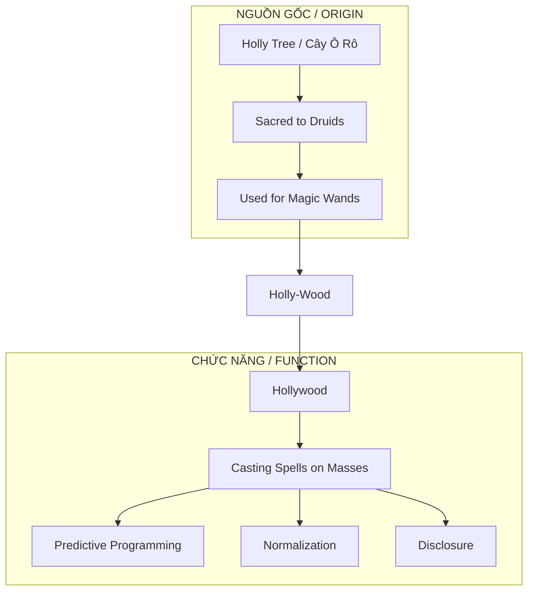
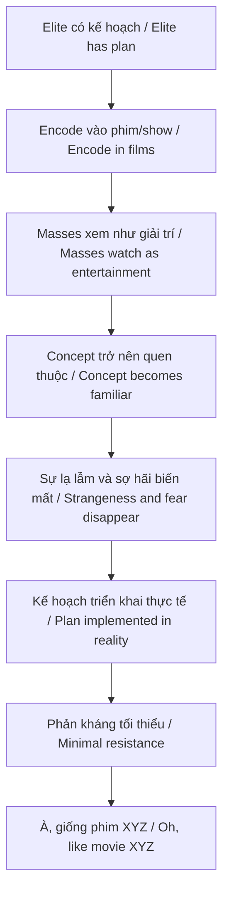
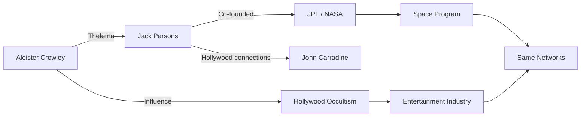

# Hollywood — Cây Đũa Phép Của Phù Thủy / The Sorcerer's Wand

> *"Họ đặt tên thật ngay từ đầu. Chúng ta chỉ không đọc."*
> *"They named it truthfully from the start. We just didn't read."*

**Hollywood** không chỉ là địa danh. Cái tên tự nó đã tiết lộ chức năng: **Holy Wood** — gỗ thiêng dùng để làm đũa phép. Ngành công nghiệp giải trí lớn nhất thế giới là một **cỗ máy phép thuật** vận hành trước mắt hàng tỷ người.

*Hollywood is not just a place. The name itself reveals its function: Holy Wood — sacred wood used for magic wands. The world's largest entertainment industry is a spell-casting machine operating in front of billions.*

---

## Tổng Quan / Overview

---

## Etymology: Nguồn Gốc Cái Tên / Name Origin

### Holly Tree — Cây Ô Rô

| Tradition / Truyền thống | Ý nghĩa / Meaning |
|--------------------------|-------------------|
| **Druid** | Cây thiêng, dùng làm đũa phép / Sacred tree, used for wands |
| **Celtic** | Biểu tượng của protection và prophecy / Symbol of protection and prophecy |
| **Merlin** | Đũa phép của Merlin làm từ holly wood / Merlin's wand made from holly wood |
| **Pagan** | Dùng trong rituals và spellcasting / Used in rituals and spellcasting |

### Magic Wand = Công Cụ Truyền Ý Chí / Tool to Transmit Will

Đũa phép không "tạo ra" phép thuật.
Đũa phép **truyền và hướng** ý chí của phù thủy vào thực tại.

*The wand doesn't "create" magic.
The wand **transmits and directs** the sorcerer's will into reality.*

**Hollywood làm gì? / What does Hollywood do?**
- Truyền ý tưởng vào tâm trí hàng tỷ người / Transmit ideas into billions of minds
- Hướng nhận thức tập thể / Direct collective perception
- "Cast spells" qua màn hình / "Cast spells" through screens

> *"Waving the magic wand over something allegedly created a magic spell, transforming reality."*

Họ vẫy đũa phép trước mặt bạn mỗi ngày. Bạn gọi nó là "giải trí".

*They wave the wand in front of you every day. You call it "entertainment."*

---

## Predictive Programming: Phép Thuật Của Hollywood / Hollywood's Magic

### Cơ Chế Hoạt Động / How It Works

### Công Thức 3 Bước / 3-Step Formula

| Bước / Step | Quá trình / Process | Ví dụ / Example |
|-------------|---------------------|-----------------|
| **1. Seeding** | Giới thiệu concept trong fiction / Introduce concept in fiction | Black Mirror: Social Credit |
| **2. Normalization** | Khán giả bàn luận như giải trí / Audience discusses as entertainment | "Hay đấy, nhưng chỉ là phim" / "Cool, but just a movie" |
| **3. Implementation** | Triển khai thực tế / Real-world implementation | China Social Credit System |

### Case Studies

| Phim/Show | Concept | Thực tế sau đó / Reality after |
|-----------|---------|-------------------------------|
| **The Simpsons** | Trump presidency | 2016 |
| **Contagion (2011)** | Pandemic từ bat, WHO, lockdown / Pandemic from bat, WHO, lockdown | COVID-19 (2020) |
| **Black Mirror: Nosedive** | Social credit scoring | China (đang triển khai / implementing) |
| **The Matrix** | Simulation, control system | Mainstream discussion |
| **WALL-E** | Obesity, screen addiction, corp control | Đang xảy ra / Happening now |

---

## Occult Connections: Ai Đứng Sau? / Who's Behind It?

### Freemasonry & Hollywood

| Nhân vật / Figure | Vai trò / Role | Masonic degree |
|-------------------|----------------|----------------|
| **Cecil B. DeMille** | Director, biblical epics | 33rd degree Mason |
| **John Wayne** | Actor, American icon | Member |
| **Walt Disney** | Founder Disney | Connections documented |

> *"Masonry is about building—temples, character, consciousness. Hollywood builds dreams, constructs realities, architects experiences. The parallels are structural and intentional."*

### Aleister Crowley → Jack Parsons → NASA/Hollywood

**Jack Parsons:**
- Co-founder của JPL (Jet Propulsion Laboratory) / Co-founder of JPL
- Follower của Aleister Crowley / Follower of Aleister Crowley
- Practiced Thelema rituals
- Hollywood circles overlap

### Pattern: Science & Entertainment — Cùng Một Network / Same Network

| Domain | Key figures | Connection |
|--------|-------------|------------|
| **Rocketry** | Jack Parsons | Crowley follower |
| **Hollywood** | Various actors | Same rituals |
| **NASA** | Founded with Parsons' work | Occult origins |

---

## Symbolism: Ký Hiệu Khắp Nơi / Symbols Everywhere

### Các Biểu Tượng Lặp Lại / Recurring Symbols

| Symbol | Ý nghĩa / Meaning | Xuất hiện / Appears in |
|--------|-------------------|------------------------|
| **All-Seeing Eye** | Surveillance, Illuminati | Logos, music videos |
| **Pyramid** | Hierarchy, ancient knowledge | Countless films |
| **Pentagram** | Occult power | Often "hidden" |
| **Saturn** | [[Saturn Cube]], limitation | Company logos |
| **Owl** | Wisdom, Moloch | Award shows |

### "Hidden in Plain Sight" / Ẩn Ngay Trước Mắt

> *"Nếu bạn nói cho người ta biết mà họ không hiểu, bạn đã hoàn thành nghĩa vụ 'disclosure' mà không phải chịu karmic debt."*
>
> *"If you tell people and they don't understand, you've fulfilled the 'disclosure' obligation without karmic debt."*

Đây là lý do symbols xuất hiện công khai: / This is why symbols appear openly:
1. **Consent by ignorance** — Bạn đã thấy, bạn không phản đối / You saw, you didn't object
2. **Karmic loophole** — Họ đã "nói", bạn không "nghe" / They "told," you didn't "listen"
3. **In-group signaling** — Những người biết nhận ra nhau / Those who know recognize each other

---

## Disclosure Qua Entertainment / Disclosure Through Entertainment

### Tại Sao Elite Tiết Lộ Qua Phim? / Why Do Elite Disclose Through Films?

| Lý do / Reason | Giải thích / Explanation |
|----------------|--------------------------|
| **Karmic law** | Phải "nói" trước khi làm / Must "tell" before doing |
| **Consent loophole** | Fiction = plausible deniability |
| **Testing reaction** | Gauge public response |
| **Normalization** | Khi xảy ra thật, đã quen / When it happens, already familiar |
| **Mockery** | "Chúng tôi nói rồi, các ngươi không tin" / "We told you, you didn't believe" |

### Case: Avatar — Gaia Disclosure

| Avatar element | Real knowledge / Kiến thức thực |
|----------------|--------------------------------|
| Eywa | Gaia hypothesis |
| Mycorrhizal-like network | Suzanne Simard's research |
| Indigenous wisdom vs extraction | Global pattern |
| All is connected | Systems biology |

James Cameron có access đến research trước khi public?
Hay Hollywood là channel cho esoteric knowledge?

*Did James Cameron have early access to research?
Or is Hollywood a channel for esoteric knowledge?*

Xem thêm / See also: [[Gaia - Trái Đất Có Ý Thức]]

---

## Black Mirror: Cẩm Nang Của Tương Lai / Manual for the Future

### Không Phải Cảnh Báo — Là Programming / Not Warning — It's Programming

> *"Black Mirror không phải warning về tương lai xa. Nó là psychological conditioning cho hiện tại."*
>
> *"Black Mirror isn't a warning about distant future. It's psychological conditioning for the present."*

| Episode | Concept | Status |
|---------|---------|--------|
| **Nosedive** | Social credit | China implementing |
| **The Entire History of You** | Memory recording | Tech developing |
| **Arkangel** | Child tracking | Normalized |
| **Joan Is Awful** | AI using your likeness | Legal battles now |
| **Be Right Back** | AI resurrection of dead | Companies exist |

### Cơ Chế / Mechanism

1. Show concept gây sốc trong bối cảnh "an toàn" (fiction) / Show shocking concept in "safe" context
2. Viewers bàn luận như giải trí / Viewers discuss as entertainment
3. Concept trở nên quen thuộc / Concept becomes familiar
4. Khi triển khai thực tế: "À, giống Black Mirror" / When implemented: "Oh, like Black Mirror"
5. Phản kháng giảm vì đã được normalized / Resistance reduced because normalized

---

## The Matrix: Disclosure Lớn Nhất? / The Biggest Disclosure?

### Họ Nói Thẳng / They Said It Directly

| Phim nói / Movie says | Thực tế / Reality |
|-----------------------|-------------------|
| "You are a battery" | Energy harvesting (loosh) |
| "The Matrix is everywhere" | Media, education, finance |
| "Most people not ready to be unplugged" | Mass denial |
| "Agents" | Those who defend the system |
| "Red pill" | Awakening |

### Tại Sao Được Phép Ra Mắt? / Why Was It Allowed?

Có thể: / Possibly:
1. **Controlled disclosure** — Release valve cho những người "thấy" / for those who "see"
2. **Mockery** — "Chúng tôi nói thẳng, các ngươi coi là fiction" / "We told you directly, you thought it was fiction"
3. **Karmic requirement** — Phải tiết lộ trước khi harvest / Must disclose before harvest
4. **Test** — Ai thức tỉnh, ai tiếp tục ngủ / Who awakens, who keeps sleeping

---

## Connection Với Vault / Vault Connections

### Predictive Programming
- [[Inception - Predictive Programming Về Kiểm Soát Tâm Trí]] — Cấy ý tưởng vào subconscious / Planting ideas in subconscious
- [[Ma Trận]] — Hệ thống kiểm soát đa chiều / Multi-dimensional control system

### Consciousness & Reality
- [[Gaia - Trái Đất Có Ý Thức]] — Avatar as Gaia disclosure
- [[Vô Thức Tập Thể]] — Hollywood tapping vào collective / tapping into collective

### Control Systems
- [[Saturn Cube]] — Symbolism trong logos / in logos
- [[Cabal]] — Networks behind entertainment
- [[Khoa Học Xét Lại]] — Science & entertainment cùng agenda / same agenda

### Occult Knowledge
- [[Manly P. Hall]] — Esoteric knowledge in plain sight
- [[Gnosis]] — Hidden wisdom traditions

---

## Practical Implications / Hệ Quả Thực Tiễn

### Khi Xem Phim/Show / When Watching Films

- [ ] Concept nào đang được giới thiệu? / What concept is being introduced?
- [ ] Ai hưởng lợi nếu concept này được normalized? / Who benefits if normalized?
- [ ] Có pattern với thực tế đang/sắp xảy ra? / Pattern with current/upcoming reality?
- [ ] Symbols nào xuất hiện? / What symbols appear?
- [ ] Narrative đang push điều gì? / What is the narrative pushing?

### Remember / Nhớ

Không phải tất cả đều là programming. / Not everything is programming.

Nhưng khi bạn biết pattern, bạn không còn là mục tiêu vô thức. / But when you know the pattern, you're no longer an unconscious target.

> *"Họ vẫy đũa phép trước mặt bạn mỗi ngày. Bây giờ bạn có thể thấy."*
> *"They wave the wand in front of you every day. Now you can see."*

---

## Core Insight / Insight Cốt Lõi

**Hollywood = Holy Wood = Magic Wand**

Họ đặt tên thật ngay từ đầu. / They named it truthfully from the start.

Chức năng của ngành công nghiệp này không phải giải trí. / The function of this industry isn't entertainment.
Đó là **casting spells on a global scale**. / It's **casting spells on a global scale**.

Mỗi bộ phim là một ritual. / Every film is a ritual.
Mỗi khán giả là một participant. / Every viewer is a participant.
Mỗi concept được plant là một seed. / Every planted concept is a seed.

Sự khác biệt giữa người thức tỉnh và người ngủ mê: / The difference between the awakened and the sleeping:
- Người ngủ mê: xem và bị program / Sleeping: watch and get programmed
- Người thức tỉnh: xem và decode / Awakened: watch and decode

---

## Sources

- Academia.edu — *Holy Wood: Sacred Symbol to Ancient Druids*
- Robert W. Sullivan IV — *Cinema Symbolism* series
- Science History Institute — *Jack Parsons and Occult JPL*
- Memory archive — Black Mirror analysis
- [[Inception - Predictive Programming Về Kiểm Soát Tâm Trí]] — Vault note
