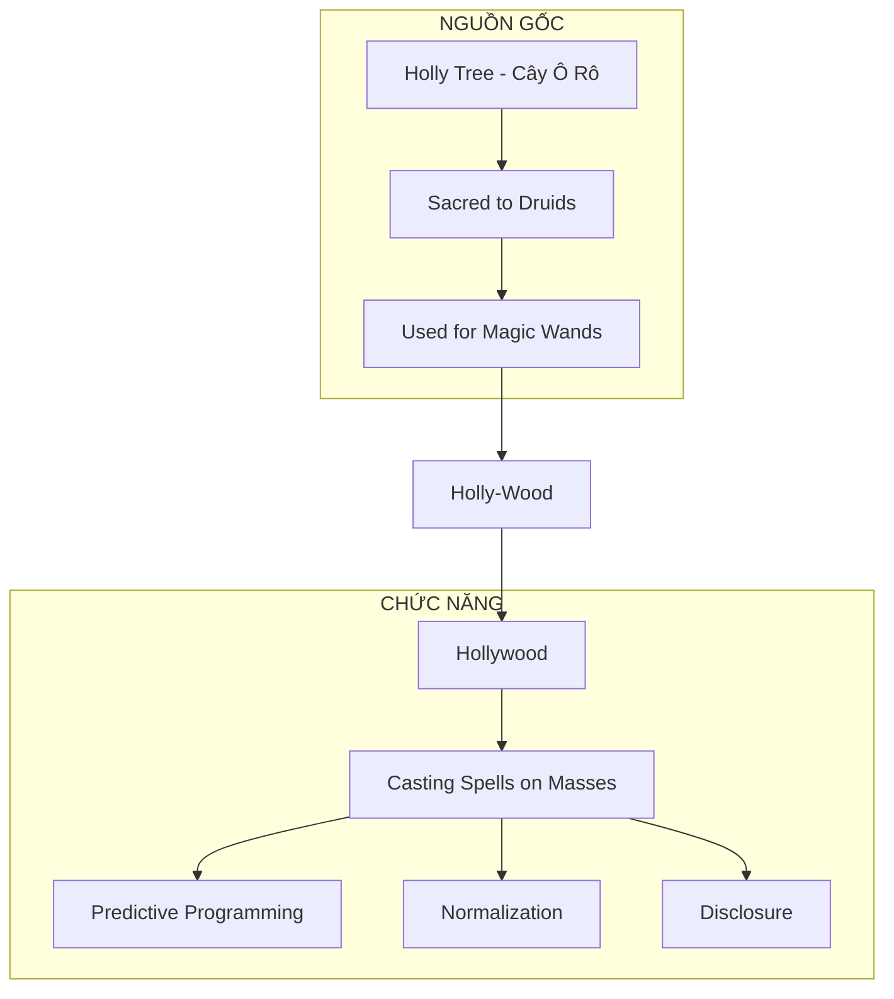
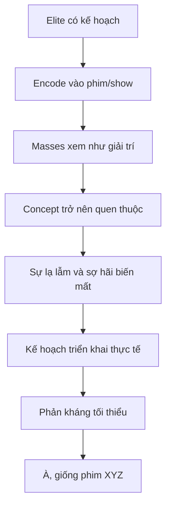
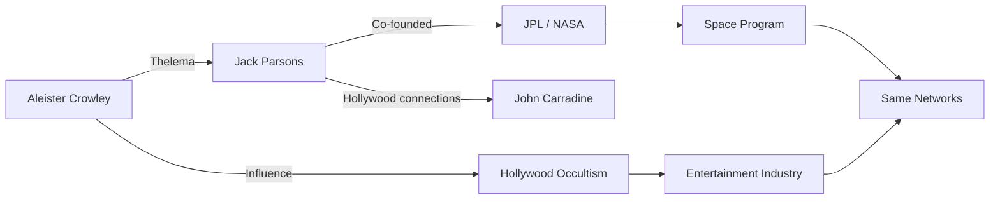

# Hollywood — Cây Đũa Phép Của Phù Thủy

> *"Họ đặt tên thật ngay từ đầu. Chúng ta chỉ không đọc."*

**Hollywood** không chỉ là địa danh. Cái tên tự nó đã tiết lộ chức năng: **Holy Wood** — gỗ thiêng dùng để làm đũa phép. Ngành công nghiệp giải trí lớn nhất thế giới là một **cỗ máy phép thuật** vận hành trước mắt hàng tỷ người.

---

## Tổng Quan

---

## Etymology: Nguồn Gốc Cái Tên

### Holly Tree — Cây Ô Rô

| Tradition | Ý nghĩa |
|-----------|---------|
| **Druid** | Cây thiêng, dùng làm đũa phép |
| **Celtic** | Biểu tượng của protection và prophecy |
| **Merlin** | Đũa phép của Merlin làm từ holly wood |
| **Pagan** | Dùng trong rituals và spellcasting |

### Magic Wand = Công Cụ Truyền Ý Chí

Đũa phép không "tạo ra" phép thuật.
Đũa phép **truyền và hướng** ý chí của phù thủy vào thực tại.

**Hollywood làm gì?**
- Truyền ý tưởng vào tâm trí hàng tỷ người
- Hướng nhận thức tập thể
- "Cast spells" qua màn hình

> *"Waving the magic wand over something allegedly created a magic spell, transforming reality."*

Họ vẫy đũa phép trước mặt bạn mỗi ngày. Bạn gọi nó là "giải trí".

---

## Predictive Programming: Phép Thuật Của Hollywood

### Cơ Chế Hoạt Động

### Công Thức 3 Bước

| Bước | Quá trình | Ví dụ |
|------|-----------|-------|
| **1. Seeding** | Giới thiệu concept trong fiction | Black Mirror: Social Credit |
| **2. Normalization** | Khán giả bàn luận như giải trí | "Hay đấy, nhưng chỉ là phim" |
| **3. Implementation** | Triển khai thực tế | China Social Credit System |

### Case Studies

| Phim/Show | Concept | Thực tế sau đó |
|-----------|---------|----------------|
| **The Simpsons** | Trump presidency | 2016 |
| **Contagion (2011)** | Pandemic từ bat, WHO, lockdown | COVID-19 (2020) |
| **Black Mirror: Nosedive** | Social credit scoring | China (đang triển khai) |
| **The Matrix** | Simulation, control system | Mainstream discussion |
| **WALL-E** | Obesity, screen addiction, corp control | Đang xảy ra |

---

## Occult Connections: Ai Đứng Sau?

### Freemasonry & Hollywood

| Nhân vật | Vai trò | Masonic degree |
|----------|---------|----------------|
| **Cecil B. DeMille** | Director, biblical epics | 33rd degree Mason |
| **John Wayne** | Actor, American icon | Member |
| **Walt Disney** | Founder Disney | Connections documented |

> *"Masonry is about building—temples, character, consciousness. Hollywood builds dreams, constructs realities, architects experiences. The parallels are structural and intentional."*

### Aleister Crowley → Jack Parsons → NASA/Hollywood

**Jack Parsons:**
- Co-founder của JPL (Jet Propulsion Laboratory)
- Follower của Aleister Crowley
- Practiced Thelema rituals
- Hollywood circles overlap

### Pattern: Science & Entertainment — Cùng Một Network

| Domain | Key figures | Connection |
|--------|-------------|------------|
| **Rocketry** | Jack Parsons | Crowley follower |
| **Hollywood** | Various actors | Same rituals |
| **NASA** | Founded with Parsons' work | Occult origins |

---

## Symbolism: Ký Hiệu Khắp Nơi

### Các Biểu Tượng Lặp Lại

| Symbol | Ý nghĩa | Xuất hiện |
|--------|---------|-----------|
| **All-Seeing Eye** | Surveillance, Illuminati | Logos, music videos |
| **Pyramid** | Hierarchy, ancient knowledge | Countless films |
| **Pentagram** | Occult power | Often "hidden" |
| **Saturn** | [[Saturn Cube]], limitation | Company logos |
| **Owl** | Wisdom, Moloch | Award shows |

### "Hidden in Plain Sight"

> *"Nếu bạn nói cho người ta biết mà họ không hiểu, bạn đã hoàn thành nghĩa vụ 'disclosure' mà không phải chịu karmic debt."*

Đây là lý do symbols xuất hiện công khai:
1. **Consent by ignorance** — Bạn đã thấy, bạn không phản đối
2. **Karmic loophole** — Họ đã "nói", bạn không "nghe"
3. **In-group signaling** — Những người biết nhận ra nhau

---

## Disclosure Qua Entertainment

### Tại Sao Elite Tiết Lộ Qua Phim?

| Lý do | Giải thích |
|-------|------------|
| **Karmic law** | Phải "nói" trước khi làm |
| **Consent loophole** | Fiction = plausible deniability |
| **Testing reaction** | Gauge public response |
| **Normalization** | Khi xảy ra thật, đã quen |
| **Mockery** | "Chúng tôi nói rồi, các ngươi không tin" |

### Case: Avatar — Gaia Disclosure

| Avatar element | Real knowledge |
|----------------|----------------|
| Eywa | Gaia hypothesis |
| Mycorrhizal-like network | Suzanne Simard's research |
| Indigenous wisdom vs extraction | Global pattern |
| All is connected | Systems biology |

James Cameron có access đến research trước khi public?
Hay Hollywood là channel cho esoteric knowledge?

Xem thêm: [[Gaia - Trái Đất Có Ý Thức]]

---

## Black Mirror: Cẩm Nang Của Tương Lai

### Không Phải Cảnh Báo — Là Programming

> *"Black Mirror không phải warning về tương lai xa. Nó là psychological conditioning cho hiện tại."*

| Episode | Concept | Status |
|---------|---------|--------|
| **Nosedive** | Social credit | China implementing |
| **The Entire History of You** | Memory recording | Tech developing |
| **Arkangel** | Child tracking | Normalized |
| **Joan Is Awful** | AI using your likeness | Legal battles now |
| **Be Right Back** | AI resurrection of dead | Companies exist |

### Cơ Chế

1. Show concept gây sốc trong bối cảnh "an toàn" (fiction)
2. Viewers bàn luận như giải trí
3. Concept trở nên quen thuộc
4. Khi triển khai thực tế: "À, giống Black Mirror"
5. Phản kháng giảm vì đã được normalized

---

## The Matrix: Disclosure Lớn Nhất?

### Họ Nói Thẳng

| Phim nói | Thực tế |
|----------|---------|
| "You are a battery" | Energy harvesting (loosh) |
| "The Matrix is everywhere" | Media, education, finance |
| "Most people not ready to be unplugged" | Mass denial |
| "Agents" | Those who defend the system |
| "Red pill" | Awakening |

### Tại Sao Được Phép Ra Mắt?

Có thể:
1. **Controlled disclosure** — Release valve cho những người "thấy"
2. **Mockery** — "Chúng tôi nói thẳng, các ngươi coi là fiction"
3. **Karmic requirement** — Phải tiết lộ trước khi harvest
4. **Test** — Ai thức tỉnh, ai tiếp tục ngủ

---

## Connection Với Vault

### Predictive Programming
- [[Inception - Predictive Programming Về Kiểm Soát Tâm Trí]] — Cấy ý tưởng vào subconscious
- [[Ma Trận]] — Hệ thống kiểm soát đa chiều

### Consciousness & Reality
- [[Gaia - Trái Đất Có Ý Thức]] — Avatar as Gaia disclosure
- [[Vô Thức Tập Thể]] — Hollywood tapping vào collective

### Control Systems
- [[Saturn Cube]] — Symbolism trong logos
- [[Cabal]] — Networks behind entertainment
- [[Khoa Học Xét Lại]] — Science & entertainment cùng agenda

### Occult Knowledge
- [[Manly P. Hall]] — Esoteric knowledge in plain sight
- [[Gnosis]] — Hidden wisdom traditions

---

## Practical Implications

### Khi Xem Phim/Show

- [ ] Concept nào đang được giới thiệu?
- [ ] Ai hưởng lợi nếu concept này được normalized?
- [ ] Có pattern với thực tế đang/sắp xảy ra?
- [ ] Symbols nào xuất hiện?
- [ ] Narrative đang push điều gì?

### Remember

Không phải tất cả đều là programming.
Nhưng khi bạn biết pattern, bạn không còn là mục tiêu vô thức.

> *"Họ vẫy đũa phép trước mặt bạn mỗi ngày. Bây giờ bạn có thể thấy."*

---

## Core Insight

**Hollywood = Holy Wood = Magic Wand**

Họ đặt tên thật ngay từ đầu.

Chức năng của ngành công nghiệp này không phải giải trí.
Đó là **casting spells on a global scale**.

Mỗi bộ phim là một ritual.
Mỗi khán giả là một participant.
Mỗi concept được plant là một seed.

Sự khác biệt giữa người thức tỉnh và người ngủ mê:
- Người ngủ mê: xem và bị program
- Người thức tỉnh: xem và decode

---

## Sources

- Academia.edu — *Holy Wood: Sacred Symbol to Ancient Druids*
- Robert W. Sullivan IV — *Cinema Symbolism* series
- Science History Institute — *Jack Parsons and Occult JPL*
- Memory archive — Black Mirror analysis
- [[Inception - Predictive Programming Về Kiểm Soát Tâm Trí]] — Vault note
