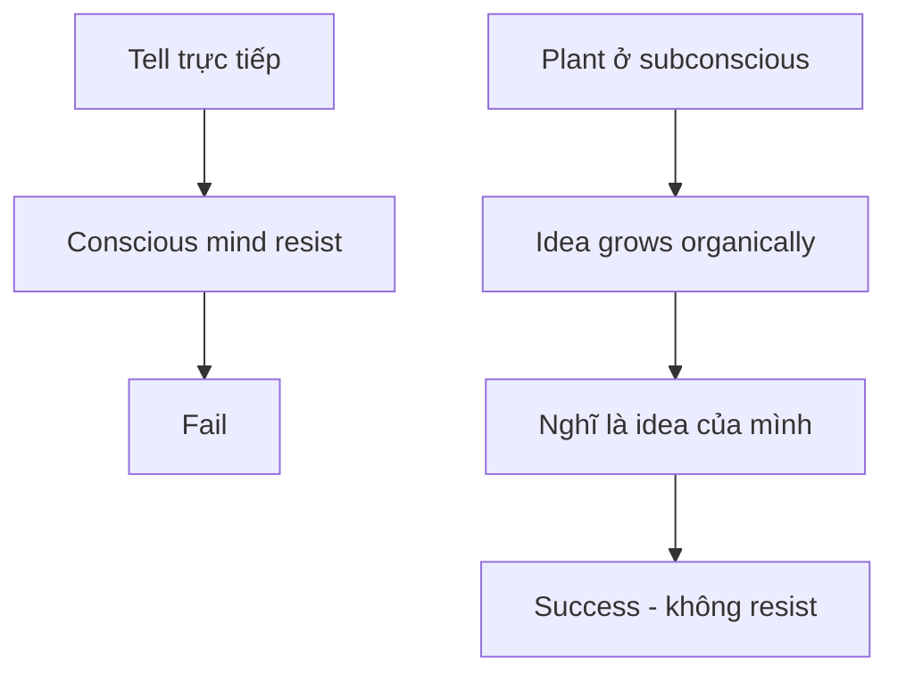
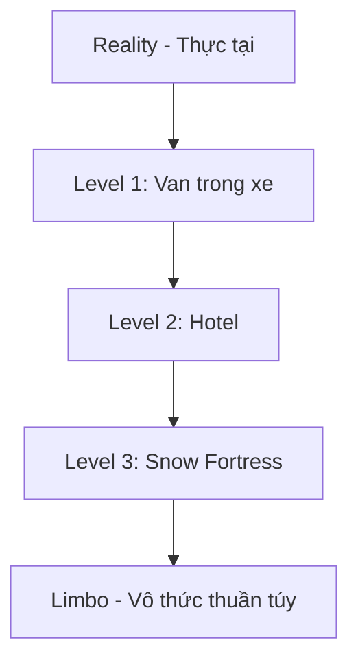
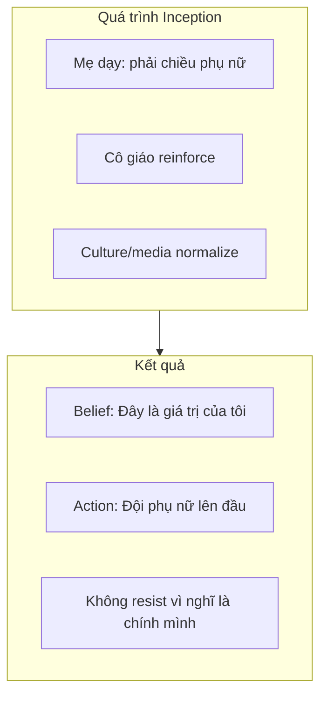

# Inception — Predictive Programming Về Kiểm Soát Tâm Trí

Inception (2010) của Christopher Nolan không chỉ là phim giải trí. Đây có thể là **disclosure** — Elite nói thẳng cách họ manipulate nhân loại, ẩn dưới lớp vỏ "fiction".

*Inception (2010) isn't just entertainment. It may be disclosure — Elite openly telling how they manipulate humanity, hidden under the veil of "fiction".*

> "What is the most resilient parasite? An idea." — Cobb
>
> *"Ký sinh trùng bền bỉ nhất là gì? Một ý tưởng."*

---

## Core Concept: Inception — Cấy Ý Tưởng

### Tại Sao Không Thể "Nói Thẳng"?

Phim giải thích rõ: Nếu bạn **tell** ai đó trực tiếp một idea, họ sẽ **resist**. Conscious mind tự động phòng thủ.

*If you directly tell someone an idea, they resist. The conscious mind automatically defends.*

Nhưng nếu bạn **plant idea ở tầng sâu nhất** (subconscious), nó sẽ:
- Grow organically
- Người đó nghĩ đó là **idea của chính họ**
- Không có gì để resist vì "đây là tôi"

*But if you plant the idea at the deepest level, it grows organically. The person thinks it's their own idea. Nothing to resist because "this is me."*

### Điều Kiện Để Inception Thành Công

Phim nói rõ:

1. **Phải đơn giản** — Một idea core, không phức tạp
2. **Phải có emotional hook** — Gắn với cảm xúc sâu nhất (cha con, tình yêu, sợ hãi)
3. **Phải plant ở tầng sâu nhất** — Càng sâu càng "real" với người đó
4. **Người đó phải tự "discover"** — Không được nhận ra bị cấy

*Simple idea. Emotional hook. Deepest level. Self-discovery without awareness of planting.*

---

## Dream Layers — Tầng Ý Thức

### Cấu Trúc Trong Phim

| Level | Trong phim | Tương đương thực tế |
|-------|------------|---------------------|
| Reality | Thế giới thức | Cuộc sống hàng ngày |
| Level 1 | Van trong mưa | Surface thoughts |
| Level 2 | Hotel (gravity shift) | Deeper beliefs |
| Level 3 | Snow fortress | Core values |
| **Limbo** | Vô thức thuần túy | [[Vô Thức Tập Thể]]? Waveform level? |

### Limbo — Tầng Sâu Nhất

Trong Limbo:
- **Thời gian gần như vô hạn** — Mấy phút reality = hàng chục năm
- **Raw subconscious** — Không có structure, không có logic
- **Idea planted ở đây = trở thành "truth" của người đó**
- **Khó phân biệt real vs dream** — Cobb và Mal bị lost ở đây

*Time is nearly infinite. Raw subconscious. Ideas planted here become the person's "truth." Hard to distinguish real from dream.*

> Nếu có manipulation xảy ra ở **waveform level** như đã discuss trong [[Nghịch Lý Của Hiểu Biết]], thì đó chính là **Limbo** — tầng mà conscious mind không access được.

---

## Áp Dụng Vào Thực Tế / Real World Application

### Cách Elite "Inception" Nhân Loại

| Concept trong phim | Thực tế |
|-------------------|---------|
| Dream architect | Hệ thống giáo dục, media, Hollywood |
| Multiple dream levels | Layers của xã hội (family, school, work, culture) |
| Deeper = more real | Những gì học từ nhỏ cảm thấy "natural" nhất |
| Emotional hook | Sợ hãi, tình yêu, ego, survival instincts |
| Kick to wake up | Red pill moments? Trauma? |

### Ví Dụ Cụ Thể: Nice Guy Syndrome

Người đàn ông **không biết** đây là programmed behavior. Họ nghĩ "tôi là người tốt, đây là giá trị của tôi."

*The man doesn't know this is programmed behavior. He thinks "I'm a good person, these are my values."*

### Ví Dụ: Consumerism

**Idea được plant:** "Mua sắm = hạnh phúc"

**Cách plant:**
- Quảng cáo từ bé (emotional: vui vẻ, gia đình, success)
- Social comparison (deeper: ego, belonging)
- "Retail therapy" becomes normalized

**Kết quả:** Người ta nghĩ "tôi MUỐN mua" — không nhận ra đó là planted desire.

### Ví Dụ: Fear of Being Different

**Idea được plant:** "Khác biệt = nguy hiểm"

**Cách plant:**
- School system reward conformity
- Punishment for "standing out"
- Social media amplifies (likes = validation)

**Kết quả:** "Tôi muốn fit in" feels like personal preference, not programming.

---

## Projections — Hệ Miễn Dịch Của Tâm Trí

### Trong Phim

Khi có người lạ xâm nhập dream, subconscious tạo ra **projections** để attack intruders. Đây là defense mechanism tự nhiên.

*When intruders enter the dream, the subconscious creates projections to attack. Natural defense mechanism.*

### Trong Thực Tế

Khi ai đó cố **wake you up** (red pill), **programmed responses** kick in:

| Projection trong phim | Programmed responses trong thực tế |
|----------------------|-----------------------------------|
| Projections attack intruders | "Conspiracy theorist!" |
| Protect the dreamer | "Đừng nghe mấy thứ điên khùng đó" |
| Prevent waking up | "Tin vào science/experts đi" |
| Violent resistance | Social ostracism, cancel culture |

**Người bị programmed sẽ defend programming** — không phải vì họ nghĩ kỹ, mà vì **projection tự động** từ subconscious.

*Programmed people defend the programming — not because they think carefully, but because of automatic projection from subconscious.*

---

## Totem — Cách Biết Mình Đang Dream

### Trong Phim

Mỗi người có **totem** — vật riêng mà chỉ họ biết behavior. Dùng để check "đây có phải reality không?"

Cobb: con quay (spinning top) — nếu quay mãi không đổ = dream.

### Trong Thực Tế

**Totem của bạn là gì?** Cách nào để biết mình đang bị manipulate hay đang suy nghĩ tự do?

Có thể là:
- **Cái thấy** — Witness consciousness ([[Nghịch Lý Của Hiểu Biết]])
- **Felt sense** — Biết mà không cần words
- **Pattern recognition** — Thấy được manipulation trước khi nó affect

> "Totem" tốt nhất: **Hỏi "Idea này đến từ đâu?"** Nếu không trace được origin → có thể là planted.
>
> *Best totem: Ask "Where did this idea come from?" If you can't trace the origin → might be planted.*

---

## Mal — Inception Đi Sai

### Trong Phim

Cobb đã inception vợ (Mal) với idea "thế giới này không real" để cô chịu rời Limbo cùng anh.

**Vấn đề:** Idea đó không disappear khi về reality. Mal vẫn nghĩ reality là dream → tự sát để "wake up".

*Cobb incepted his wife with "this world isn't real" to get her to leave Limbo. Problem: The idea didn't disappear in reality. Mal still thought reality was a dream → killed herself to "wake up."*

### Bài Học

**Inception không có OFF switch.** Một khi idea planted ở Limbo, nó trở thành **core identity** của người đó.

*Inception has no OFF switch. Once planted in Limbo, it becomes the person's core identity.*

Đây là warning về:
- **Radicalization** — Extreme ideas planted deep
- **Cult programming** — Identity replacement
- **Childhood trauma** — Becomes core belief about self/world

---

## Disclosure Hay Coincidence?

### Tại Sao Elite Cần Disclose?

Như đã discuss trong [[Nghịch Lý Của Hiểu Biết]]: **Karma requires disclosure.** 

Nếu họ nói cho bạn (qua "fiction") và bạn không nghe → đó là **your choice**. Free will preserved.

*If they tell you (through "fiction") and you don't listen → that's your choice. Free will preserved.*

### Evidence Inception Là Disclosure

| Element | Suspicious? |
|---------|-------------|
| Phim dạy **chính xác** cách manipulate mind | Không phải random plot device |
| "Idea là ký sinh trùng bền bỉ nhất" | Quá specific |
| Projections protect programmed beliefs | Giải thích tại sao người ta resist truth |
| Limbo = raw consciousness | Maps to real concepts (collective unconscious) |
| Totem để check reality | Hint về cách protect yourself |

### Các Phim Disclosure Khác

| Phim | Disclose về |
|------|-------------|
| **The Matrix** | Simulated reality, energy harvesting |
| **They Live** | Hidden controllers, subliminal messaging |
| **Inception** | Mind control, idea planting |
| **Eyes Wide Shut** | Elite rituals |
| **The Truman Show** | Manufactured reality, surveillance |

> Hollywood = **Ministry of Truth** ẩn dưới entertainment.

---

## Tự Bảo Vệ / Self-Protection

### 1. Trace Origin Của Ideas

Khi có belief mạnh, hỏi:
- "Tôi bắt đầu tin điều này từ khi nào?"
- "Ai dạy tôi điều này đầu tiên?"
- "Điều này serve interest của ai?"

*When you have a strong belief, ask: When did I start believing this? Who taught me this first? Whose interest does this serve?*

### 2. Observe Projections

Khi ai đó challenge belief của bạn và bạn **react emotionally mạnh**:
- Đó có thể là **projection** protecting planted idea
- Observe reaction trước khi act
- Hỏi: "Tại sao tôi defensive thế?"

### 3. Build Your Totem

Develop cách để check:
- "Đây có phải suy nghĩ của tôi không?"
- "Hay tôi đang repeat programming?"

Totem tốt nhất: **Witness consciousness** — cái thấy đứng ngoài mọi thought.

### 4. Question "Natural" Feelings

Những gì cảm thấy "tự nhiên" nhất có thể là **planted deepest**.

- "Tự nhiên" muốn mua iPhone mới?
- "Tự nhiên" sợ khác biệt?
- "Tự nhiên" respect authority?

---

## Kết: Wake Up Call

Inception kết thúc ambiguous — con quay có đổ không? Cobb có đang ở reality không?

**Đó cũng là câu hỏi cho bạn:**

Bạn có đang sống trong reality không?
Hay đang trong dream được architect bởi người khác?
Ideas bạn nghĩ là "của mình" — có thực sự của mình không?

*Are you living in reality? Or in a dream architected by others? Are the ideas you think are "yours" actually yours?*

> Khác biệt duy nhất giữa Inception và reality: Trong phim họ phải ngủ để bị inception. Trong thực tế, bạn bị inception **lúc tỉnh**.
>
> *The only difference between Inception and reality: In the film they have to sleep to be incepted. In reality, you're incepted while awake.*

---

## Related

### Kiểm Soát Tâm Trí / Mind Control
- [[Kiểm Soát Tâm Trí]] — Techniques
- [[Vô Thức Tập Thể]] — Jung's collective unconscious
- [[Tâm Lý Học Jung]] — Archetypes and shadow

### Ma Trận / Matrix
- [[Ma Trận]] — The control system
- [[Nghịch Lý Của Hiểu Biết]] — Layers, waveform manipulation, paradox
- [[Tâm Lý Học Tiến Hóa Về Giới Tính]] — Nice guy programming example

### Predictive Programming
- [[Báo Cáo 2030]] — Elite's open disclosure
- [[Gen Z - Phân Tích Phản Biện]] — How youngest generation is being programmed
