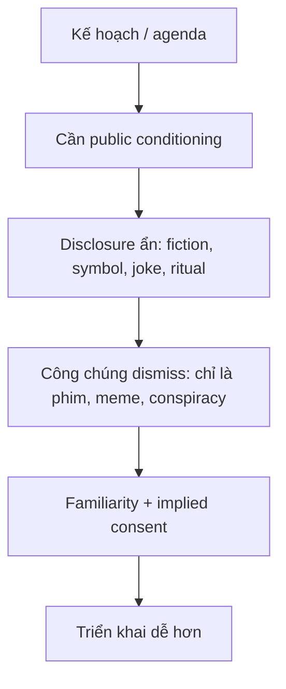
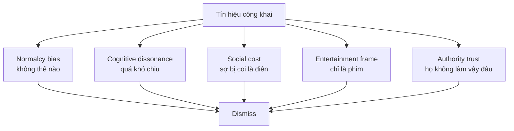

# Karma Disclosure - Truth Hidden In Plain Sight

**Karma Disclosure là giả thuyết rằng quyền lực không chỉ che giấu kế hoạch; nó còn để lại dấu vết công khai dưới dạng fiction, symbol, ritual, slogan hoặc "joke" để biến sự thật thành thứ ai cũng thấy nhưng ít người xử lý.** Đọc đúng, đây không phải giấy phép gom mọi trùng hợp thành định mệnh. Đây là một model để hỏi: khi một motif lặp quá lâu, quá đúng thời điểm, quá có lợi cho cùng một cấu trúc quyền lực, ta nên đọc nó ở tầng nào?

*Karma Disclosure is the hypothesis that power often hides truth in plain sight: visible enough to count as disclosure, framed softly enough to be dismissed as entertainment.*

---

## Evidence Discipline / Cách Đọc

| Tầng claim | Cách đọc đúng |
|---|---|
| Fact / documentable | Có phim, sự kiện, logo, chiến dịch truyền thông, tài liệu public, timeline cụ thể |
| Pattern / systems | Media có thể bình thường hóa một tương lai trước khi chính sách hoặc công nghệ xuất hiện |
| Symbol / myth | Disclosure, consent, karma, ritual là ngôn ngữ biểu tượng để đọc quan hệ giữa truth và free will |
| Speculative synthesis | "Elite phải disclose để tránh karma" là giả thuyết esoteric của vault, không phải fact pháp lý hay khoa học |

Nếu bỏ kỷ luật này, bài sẽ thành paranoia. Nếu giữ kỷ luật, nó trở thành một lens mạnh để đọc [[Predictive Programming - Cấy Tương Lai Vào Tiềm Thức]], [[Hollywood - Cây Đũa Phép Của Phù Thủy]] và [[Inception - Predictive Programming Về Kiểm Soát Tâm Trí]].

---

## Vị Trí Trong Vault / Vault Position

Trong cụm [[Ma Trận]], bài này trả lời một câu hỏi hẹp: tại sao sự thật đôi khi không bị giấu hoàn toàn, mà được trình diễn trong plain sight? Nó nối [[Nhân Quả]], [[Luân Hồi]], [[Gnosis]] và truyền thông đại chúng. Đây là bài esoteric-conspiracy, nên giọng có thể sắc, nhưng claim phải được đặt đúng tầng.

---

## Luật Consent Ở Tầng Biểu Tượng

Trong nhiều truyền thống tâm linh, con người không chỉ là thân xác mà còn là chủ thể có ý chí. Vì vậy "consent" không chỉ là chữ ký pháp lý; nó còn là sự đồng thuận qua im lặng, chấp nhận, thờ ơ, hoặc không chịu nhìn.

Ở tầng speculative synthesis, Karma Disclosure nói rằng một số quyền lực công bố kế hoạch dưới dạng ẩn để bảo toàn logic free will: "chúng tôi đã nói rồi; các người không nghe." Đây không phải đạo đức đẹp đẽ. Đây là một cách đọc lạnh về nghi thức quyền lực.

Điểm chắc hơn ở tầng systems: khi một ý tưởng được expose nhiều lần trong fiction, công chúng bớt sốc khi nó xuất hiện trong đời thật. Điểm speculative hơn: expose đó còn có chức năng karmic/ritual.

---

## Fiction Là Vùng Disclosure Mềm

Fiction mạnh vì nó đi vòng qua cổng kiểm duyệt của lý trí. Nếu nói thẳng "chúng tôi muốn surveillance toàn diện", người xem phản kháng. Nếu kể một câu chuyện nơi surveillance cứu thế giới khỏi terrorist, alien, pandemic hoặc AI rogue, cảm xúc đã đi trước lập luận.

| Medium | Cách disclosure có thể vận hành |
|---|---|
| Movies / TV | Cho công chúng tập cảm xúc với kịch bản tương lai |
| Music / performance | Đưa symbol vào trạng thái trance, worship, crowd energy |
| Corporate branding | Lặp archetype trong đời sống thường ngày |
| Ceremonies | Biến symbol thành nghi lễ công cộng |
| News + documentary | Cấp authority cho motif đã được fiction làm quen |

Không phải phim nào cũng là agenda. Nhưng agenda nào muốn đi sâu vào [[Vô Thức Tập Thể]] đều cần story, image và repetition.

---

## Hidden In Plain Sight

Truth hidden in plain sight hoạt động bằng nghịch lý: càng thấy nhiều, càng không còn thấy. Một symbol xuất hiện khắp nơi thì trở thành background. Một ý tưởng được joke hóa thì mất khả năng gây cảnh giác. Một kế hoạch được gọi là "fiction" thì người nhìn nghiêm túc bị biến thành kẻ quá căng.

| Technique | Cách hoạt động |
|---|---|
| Ridicule | Gắn nhãn "conspiracy theory" để đóng câu hỏi |
| Saturation | Quá nhiều tín hiệu khiến mind bỏ qua |
| Fiction wrapper | Truth được cảm như giải trí, không xử lý như knowledge |
| Symbol | Người biết thì thấy, người không biết thì gọi là design |
| Inversion | Nói thật bằng cách làm nó nghe như đùa hoặc nói ngược |

Đây là chỗ [[Gnosis]] quan trọng: không phải biết thêm dữ kiện, mà là chuyển trạng thái nhìn. Khi mắt đổi tầng, thứ "trang trí" bắt đầu nói.

---

## Timeline Không Phải Bằng Chứng Tự Động

Các ví dụ thường được đưa vào cụm này gồm *The Lone Gunmen* trước 9/11, *Contagion* trước 2020, *Black Mirror* trước social credit discourse, hoặc các lễ khai mạc có symbol lặp. Chúng đáng đọc, nhưng không nên đọc cẩu thả.

Một timeline chỉ trở thành evidence tốt hơn khi có thêm:

1. **Specificity** — chi tiết có cụ thể hay chỉ chung chung?
2. **Timing** — xuất hiện trước event bao lâu, trong bối cảnh nào?
3. **Incentive** — ai lợi khi motif đó được normalize?
4. **Repetition** — một case lẻ hay nhiều case cùng hướng?
5. **Transmission** — có kênh nào nối media, policy, tech, funding, institution không?

Nếu thiếu các câu hỏi này, ta chỉ đang chơi pattern recognition. Nếu có chúng, ta bắt đầu làm evidence discipline.

---

## Tại Sao Người Ta Không Thấy?

Đây cũng là vùng free will. Không thấy đôi khi là không đủ data. Nhưng nhiều khi là không muốn trả giá tâm lý của việc thấy. Mind thích comfort hơn truth; hệ thống biết điều đó và thiết kế quanh nó.

---

## Decoder Mindset / Cách Đọc Không Paranoid

Mục đích không phải biến đời thành phòng điều tra vô tận. Paranoia vẫn là một dạng bị control. Cách đọc sạch hơn:

1. Tách fact, pattern, symbol và speculation.
2. Hỏi motif nào được lặp, ai được lợi, timing ra sao.
3. Không dùng một biểu tượng để kết luận toàn bộ âm mưu.
4. Không nhầm cảm giác "rùng mình" với bằng chứng.
5. Khi thấy đủ pattern, rút consent bằng hành vi: attention, tiền, niềm tin, dữ liệu.

> **Thấy không phải để sợ. Thấy để không bị ký thay vào hợp đồng nhận thức.**
>
> *Seeing is not for fear. Seeing is how you stop outsourcing consent.*

---

## Counter-Arguments / Phản Biện Cần Giữ

**"Đây có thể là pattern recognition bias."** Đúng. Con người giỏi tìm hình trong mây. Vì vậy một case lẻ không đủ. Cần specificity, repetition, incentive và transmission.

**"Fiction đoán tương lai vì writer quan sát xã hội tốt."** Đúng một phần. Nhà văn, đạo diễn, futurist có thể nhìn trend trước đám đông. Điều đó không phủ định predictive programming; nó buộc ta phân biệt foresight tự nhiên với coordinated normalization.

**"Elite không cần disclosure."** Có thể ở tầng pháp lý. Nhưng ở tầng symbol/ritual, nhiều cấu trúc quyền lực vẫn thích trình diễn. Power không chỉ muốn làm; power muốn được nhìn thấy mà không bị gọi tên.

---

## Kết / Core Synthesis

Karma Disclosure không nên được dùng như câu trả lời đóng. Nó là câu hỏi mở có răng:

- Tại sao motif này được lặp?
- Vì sao nó xuất hiện đúng giai đoạn này?
- Nó làm công chúng quen với điều gì?
- Nó biến phản kháng thành ridicule bằng cách nào?
- Mình có đang consent bằng attention, silence, money hoặc belief không?

**Nếu truth được giấu ngay trước mắt, nhiệm vụ không phải nhìn nhiều hơn. Nhiệm vụ là nhìn đúng tầng.**

*If truth is hidden in plain sight, the task is not merely to look harder. It is to look at the right layer.*

---

## Related

### Nền tảng / Foundation
- [[Luân Hồi]] — Karma và cycle
- [[Nhân Quả]] — Nhân-duyên và hậu quả
- [[Nhị Nguyên]] — Duality của choice
- [[Gnosis]] — Direct knowing

### Ứng dụng / Application
- [[Predictive Programming - Cấy Tương Lai Vào Tiềm Thức]] — Cách tương lai được làm quen trước
- [[Inception - Predictive Programming Về Kiểm Soát Tâm Trí]] — Cách ideas được cấy
- [[Hollywood - Cây Đũa Phép Của Phù Thủy]] — Màn hình như nghi lễ đại chúng
- [[Ma Trận]] — Control system

### Meta
- [[Nghịch Lý Của Hiểu Biết]] — Vượt qua framework
- [[Khoa Học Xét Lại]] — Question without fake certainty
