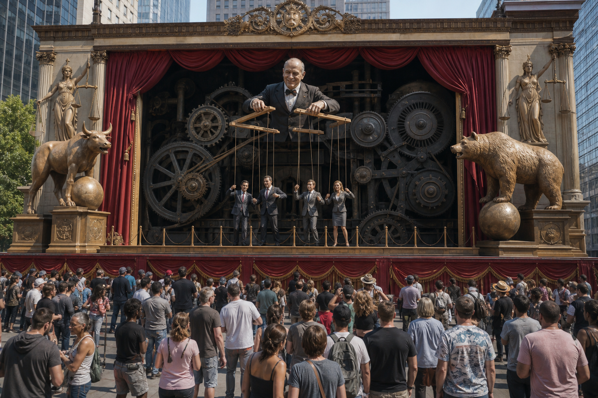

# Karma Disclosure - Truth Hidden In Plain Sight

**Karma Disclosure là giả thuyết rằng quyền lực không chỉ che giấu kế hoạch; nó còn để lại dấu vết công khai dưới dạng fiction, symbol, ritual, slogan hoặc joke để biến sự thật thành thứ ai cũng thấy nhưng ít người xử lý. Visible enough to count as disclosure, soft enough to dismiss.**

*Karma Disclosure is the hypothesis that power hides truth in plain sight: visible enough to count as disclosure, framed softly enough to be dismissed as entertainment.*

Đọc đúng, đây không phải giấy phép gom mọi trùng hợp thành định mệnh. Đây là một model để hỏi: khi một motif lặp quá lâu, quá đúng thời điểm, quá có lợi cho cùng một cấu trúc quyền lực, ta nên đọc nó ở tầng nào?

---

## Evidence Discipline / Cách Đọc

Ở tầng fact, ta kiểm tra phim, sự kiện, logo, chiến dịch truyền thông, tài liệu public, timeline cụ thể. Ở tầng pattern, media có thể bình thường hóa một tương lai trước khi chính sách hoặc công nghệ xuất hiện. Ở tầng symbol, disclosure, consent, karma, ritual là ngôn ngữ biểu tượng để đọc quan hệ giữa truth và free will. Ở tầng speculative synthesis, “Elite phải disclose để tránh karma” là giả thuyết esoteric của vault, không phải fact pháp lý hay khoa học.

Nếu bỏ kỷ luật này, bài thành paranoia. Nếu giữ kỷ luật, nó trở thành lens mạnh để đọc [[Predictive Programming - Cấy Tương Lai Vào Tiềm Thức]], [[Hollywood - Cây Đũa Phép Của Phù Thủy]] và [[Inception - Predictive Programming Về Kiểm Soát Tâm Trí]].

---

## Vault Position / Vị Trí Trong Vault

Trong cụm [[Ma Trận]], bài này trả lời câu hỏi hẹp: tại sao sự thật đôi khi không bị giấu hoàn toàn, mà được trình diễn trong plain sight? Nó nối [[Gnosis]], [[Luân Hồi]], [[Nghịch Lý Của Hiểu Biết]], media đại chúng và quyền lực biểu tượng.

Karma Disclosure không phải thay thế research. Nó là layer symbol/pattern: khi truth được show nhưng đóng gói như entertainment, public vẫn có thể “đã thấy” mà không thật sự biết.

---

## Consent Ở Tầng Biểu Tượng

Trong nhiều truyền thống tâm linh, con người không chỉ là thân xác mà còn là chủ thể có ý chí. Vì vậy consent không chỉ là chữ ký pháp lý; nó còn là sự đồng thuận qua im lặng, thờ ơ, worship, laughter, hoặc không chịu nhìn.

Ở tầng speculative synthesis, Karma Disclosure nói rằng một số quyền lực công bố kế hoạch dưới dạng ẩn để bảo toàn logic free will: “chúng tôi đã nói rồi; các người không nghe.” Đây không phải đạo đức đẹp đẽ. Đây là cách đọc lạnh về nghi thức quyền lực.

Điểm chắc hơn ở tầng systems: khi một ý tưởng được expose nhiều lần trong fiction, công chúng bớt sốc khi nó xuất hiện trong đời thật. Điểm speculative hơn: exposure đó còn có chức năng karmic/ritual.

---

## Fiction Là Disclosure Mềm

Fiction mạnh vì nó đi vòng qua cổng kiểm duyệt của lý trí. Nếu nói thẳng “chúng tôi muốn surveillance toàn diện”, người xem phản kháng. Nếu kể một chuyện nơi surveillance cứu thế giới khỏi terrorist, alien, pandemic hoặc AI rogue, cảm xúc đã đi trước lập luận.

Movies, TV, music performance, corporate branding, ceremonies, news/documentary đều có thể vận hành như disclosure mềm. Không phải tác phẩm nào cũng là agenda. Nhưng agenda nào muốn đi sâu vào [[Vô Thức Tập Thể]] đều cần story, image và repetition.

Đây là nơi Karma Disclosure và predictive programming chồng lên nhau: một bên nói về rehearsal tâm lý, một bên nói về logic symbol/consent.

---

## Hidden In Plain Sight Hoạt Động Như Thế Nào?

Truth hidden in plain sight hoạt động bằng nghịch lý: càng thấy nhiều, càng không còn thấy. Một symbol xuất hiện khắp nơi thì thành background. Một ý tưởng được joke hóa thì mất khả năng gây cảnh giác. Một kế hoạch được gọi là fiction thì người nhìn nghiêm túc bị biến thành kẻ quá căng.

Ridicule đóng câu hỏi bằng nhãn “conspiracy theory”. Saturation làm mind bỏ qua vì quá nhiều tín hiệu. Fiction wrapper làm truth được cảm như giải trí, không xử lý như knowledge. Symbol cho người biết thấy, người không biết gọi là design. Inversion nói thật bằng cách làm nó nghe như đùa hoặc nói ngược.

Đây là chỗ [[Gnosis]] quan trọng: không phải biết thêm dữ kiện, mà là đổi tầng nhìn.

---

## Timeline Không Phải Bằng Chứng Tự Động

Các ví dụ thường được đưa vào cụm này gồm *The Lone Gunmen* trước 9/11, *Contagion* trước 2020, *Black Mirror* trước social credit discourse, hoặc các lễ khai mạc có symbol lặp. Chúng đáng đọc, nhưng không nên đọc cẩu thả.

Một timeline chỉ mạnh hơn khi có specificity, timing, incentive, repetition và transmission. Chi tiết có cụ thể không? Xuất hiện trước event bao lâu? Ai lợi khi motif được normalize? Một case lẻ hay cluster? Có kênh nối media, policy, tech, funding, institution không?

Nếu thiếu câu hỏi này, ta chỉ đang chơi pattern recognition. Nếu có chúng, ta bắt đầu làm evidence discipline.

---

## Vì Sao Người Ta Không Thấy?

Không thấy đôi khi là thiếu data. Nhưng nhiều khi là không muốn trả giá tâm lý của việc thấy.

Normalcy bias nói: không thể nào. Cognitive dissonance nói: nếu chuyện này thật thì worldview của mình sụp. Social cost nói: nói ra người ta cười. Entertainment frame nói: chỉ là phim. Authority trust nói: họ không làm vậy đâu.

Mind thích comfort hơn truth. Hệ thống biết điều đó và thiết kế quanh nó.

Karma Disclosure không cần public hiểu. Nó chỉ cần public nhìn mà dismiss.

---

## Decoder Mindset

Mục đích không phải biến đời thành phòng điều tra vô tận. Paranoia vẫn là một dạng bị control.

Cách đọc sạch hơn: tách fact, pattern, symbol và speculation. Hỏi motif nào được lặp, ai được lợi, timing ra sao. Không dùng một biểu tượng để kết luận toàn bộ âm mưu. Không nhầm cảm giác rùng mình với bằng chứng. Khi thấy đủ pattern, rút consent bằng hành vi: attention, tiền, niềm tin, dữ liệu.

> Thấy không phải để sợ. Thấy để không bị ký thay vào hợp đồng nhận thức.

---

## Kết

Karma Disclosure không nên được dùng như câu trả lời đóng. Nó là câu hỏi mở có răng: tại sao motif này lặp? Vì sao nó xuất hiện đúng giai đoạn này? Nó đang làm công chúng quen với điều gì? Ai được lợi nếu public vừa thấy vừa không xử lý?

Truth hidden in plain sight không phải lúc nào cũng chứng minh âm mưu. Nhưng nó nhắc một điều quan trọng: cái bị giấu kỹ nhất đôi khi không nằm trong bóng tối. Nó nằm ngay trước mắt, được đóng gói thành trò đùa.

---

## Reading Path / Đọc Tiếp

- [[Predictive Programming - Cấy Tương Lai Vào Tiềm Thức]] — rehearsal tương lai trong imagination
- [[Hollywood - Cây Đũa Phép Của Phù Thủy]] — màn hình như wand của collective dream
- [[Inception - Predictive Programming Về Kiểm Soát Tâm Trí]] — cấy ý tưởng vào subconscious
- [[Nghịch Lý Của Hiểu Biết]] — không nhầm pattern recognition với truth tuyệt đối
