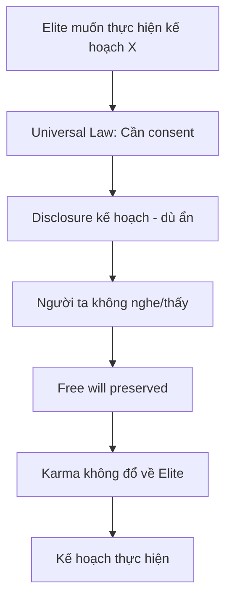
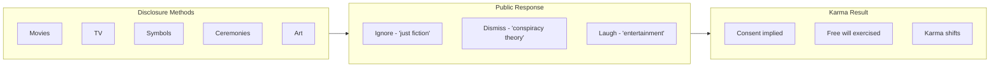
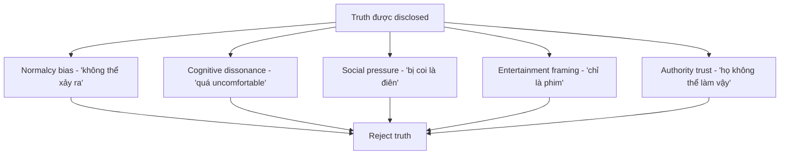

# Karma Disclosure - Truth Hidden In Plain Sight

Tại sao Elite luôn "hint" kế hoạch của họ trước khi thực hiện? Tại sao truth luôn được giấu ngay trước mắt?

*Why do the Elite always "hint" their plans before executing them? Why is truth always hidden in plain sight?*

---

## Phần 1: Quy Luật Karma & Free Will

### Universal Law

Trong nhiều truyền thống tâm linh, có một quy luật bất biến:

*In many spiritual traditions, there's an immutable law:*

> **Không thể gây hại cho người khác mà không có sự đồng ý (consent) ở một level nào đó.**
>
> *You cannot harm another without their consent at some level.*

### Tại Sao Cần Disclosure?

| Không Disclosure | Có Disclosure |
|------------------|---------------|
| Vi phạm Free Will | Free Will preserved |
| Karma đổ về người gây hại | Karma chuyển sang người "đồng ý" |
| Universal Law block | Universal Law cho phép |
| Action bị cản trở | Action được thực hiện |

**Đây không phải đạo đức hay luật pháp con người.** Đây là **cơ chế vận hành của vũ trụ** — như gravity, không thể bypass.

*This isn't human morality or law. This is the operating mechanism of the universe — like gravity, it cannot be bypassed.*

---

## Phần 2: Cách Elite Disclosure

### "Fiction" Là Disclosure

Elite không cần nói thẳng. Họ dùng **"fiction"** — và fiction không bị coi là lie:

*Elite don't need to speak directly. They use "fiction" — and fiction isn't considered a lie:*

| Medium | Ví dụ |
|--------|-------|
| **Movies** | Contagion (2011) → pandemic protocols, The Simpsons → countless predictions |
| **TV Shows** | Black Mirror → social credit, surveillance |
| **Music** | Madonna Super Bowl 2012 → symbolism |
| **Art** | Denver Airport murals, Economist covers |
| **Ceremonies** | Olympics opening/closing ceremonies |
| **Corporate logos** | Hidden symbolism |
| **Architecture** | Washington DC layout, Vatican |

### Logic Của Họ

> *"Chúng tôi đã nói cho các người rồi. Qua phim. Qua nhạc. Qua symbol. Các người không nghe? Đó là CHOICE của các người. Free will preserved."*
>
> *"We told you. Through movies. Music. Symbols. You didn't listen? That's YOUR choice. Free will preserved."*

---

## Phần 3: Hidden In Plain Sight

### Tại Sao "Giấu Ngay Trước Mắt"?

Paradox: Truth được giấu **bằng cách để nó visible** — nhưng trong context mà người ta dismiss nó.

*Paradox: Truth is hidden by making it visible — but in a context where people dismiss it.*

| Technique | Cách hoạt động |
|-----------|----------------|
| **Ridicule** | Gọi là "conspiracy theory" → ai tin bị coi là điên |
| **Saturation** | Quá nhiều info → overwhelm → ignore |
| **Fiction wrapper** | Wrap truth trong "entertainment" → không ai take seriously |
| **Symbol** | Chỉ người "biết" mới hiểu → plausible deniability |
| **Inversion** | Nói ngược → truth sounds like lie |

### Ví Dụ Cụ Thể

| Event | Disclosure trước đó |
|-------|---------------------|
| 9/11 | The Lone Gunmen pilot (March 2001) - plane into WTC |
| Pandemic 2020 | Event 201 (Oct 2019), Contagion (2011), Operation Lockstep (2010) |
| Surveillance state | The Truman Show (1998), Enemy of the State (1998) |
| Social credit | Black Mirror "Nosedive" (2016) |
| Digital currency | Multiple hints in media pre-2020 |

**"Coincidence"?** Hay disclosure?

---

## Phần 4: Tại Sao Người Ta Không Thấy?

### Cognitive Barriers

### Đây Cũng Là Free Will

Việc **chọn không thấy** cũng là một choice. Và choice có consequences.

*Choosing not to see is also a choice. And choices have consequences.*

> Mind muốn comfortable hơn là truth. Đó là feature, không phải bug — từ góc nhìn của người muốn control.
>
> *The mind wants comfort more than truth. That's a feature, not a bug — from the controller's perspective.*

---

## Phần 5: Ứng Dụng Thực Tế

### Cách "Thấy" Truth Hidden In Plain Sight

| Bước | Hành động |
|------|-----------|
| 1 | **Question "entertainment"** — Tại sao theme này lặp lại? |
| 2 | **Notice patterns** — Coincidence hay coordination? |
| 3 | **Follow symbols** — Ai dùng? Ở đâu? Tại sao? |
| 4 | **Check timing** — Disclosure xuất hiện trước event bao lâu? |
| 5 | **Ignore ridicule** — "Conspiracy theory" là thought-stopper |

### Không Phải Để Paranoid

Mục đích không phải để sợ hãi hay paranoid. Mà là:

*The purpose isn't fear or paranoia. It's:*

- **Awareness** — Biết game đang được chơi
- **Consent withdrawal** — Không đồng ý với những gì đang xảy ra
- **Discernment** — Phân biệt truth và manipulation
- **Sovereignty** — Giữ free will thực sự

> Khi bạn **thấy** disclosure — bạn có thể **chọn** không đồng ý. Đó là power thực sự.
>
> *When you see the disclosure — you can choose not to consent. That's real power.*

---

## Phần 6: Counter-Argument

### "Đây Chỉ Là Pattern Recognition Bias"

Có thể. Human brain tìm patterns ngay cả khi không có.

*Perhaps. The human brain finds patterns even when there are none.*

### "Elite Không Cần Disclosure"

Nếu Universal Law không tồn tại — tại sao họ **consistently** làm điều này qua hàng thập kỷ? Across cultures? Across organizations?

*If Universal Law doesn't exist — why do they consistently do this across decades? Cultures? Organizations?*

### Điểm Giao

Như mọi thứ trong vault này — **có thể đúng, có thể sai**. 

Nhưng câu hỏi hữu ích hơn:

> Nếu đây là thật — nó thay đổi gì trong cách bạn consume media và information?
>
> *If this is true — what does it change about how you consume media and information?*

---

## Kết: Karma Requires Disclosure

Tóm lại:

1. **Universal Law** yêu cầu consent trước khi gây hại
2. **Elite disclosure** qua "fiction" để satisfy requirement
3. **Người ta không nghe** = implicit consent = free will exercised
4. **Karma shifts** từ perpetrator sang người "đồng ý"
5. **Truth hidden in plain sight** là technique hoàn hảo

> Họ nói cho bạn rồi. Qua "fiction". Bạn không nghe? Đó là choice của bạn.
>
> *They told you. Through "fiction". You didn't listen? That's your choice.*

**Câu hỏi duy nhất:** Bây giờ bạn biết — bạn sẽ chọn gì?

*The only question: Now that you know — what will you choose?*

---

## Related

### Nền tảng / Foundation
- [[Luân Hồi]] — Karma và cycle
- [[Nhị Nguyên]] — Duality của choice
- [[Gnosis]] — Direct knowing

### Ứng dụng / Application  
- [[Inception - Predictive Programming Về Kiểm Soát Tâm Trí]] — Cách ideas được cấy
- [[Ma Trận]] — Control system
- [[Atula]] — Cuộc chiến thiện ác

### Meta
- [[Nghịch Lý Của Hiểu Biết]] — Vượt qua framework
- [[Khoa Học Xét Lại]] — Question everything
