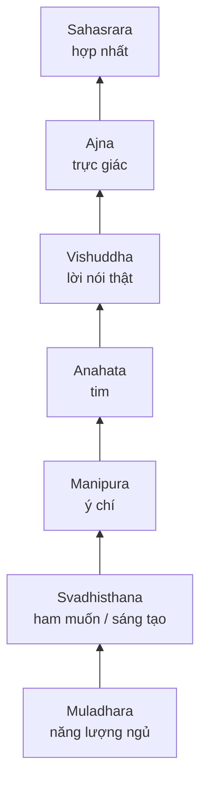
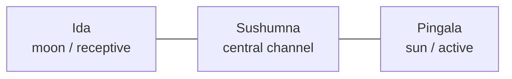

# Kundalini — Năng Lượng Rắn Thiêng

**Kundalini là ngôn ngữ cổ để nói về sinh lực nguyên thủy khi nó không chỉ phục vụ sinh tồn và tình dục, mà được chuyển hóa thành ý thức, trực giác và hiện diện.** Trong vault, Kundalini là cầu nối giữa [[Chakra]], [[Năng Lượng Tình Dục]], [[Tinh Khí Thần]], [[Tuyến Tùng]] và hành trình thoát khỏi một đời sống bị lập trình bởi khoái cảm rẻ.

*Kundalini is the ancient language of primal life-force rising from survival and sexuality into awareness, intuition, and embodied presence.*

---

## How To Read This / Cách Đọc

Đọc Kundalini theo bốn tầng:

| Tầng | Cách hiểu |
|---|---|
| Tradition | Khái niệm đến từ Hindu, Tantra, Yoga và nhiều dòng thực hành khác nhau |
| Psychology | Năng lượng bị kẹt có thể hiện ra như trauma, ham muốn, fear, hoặc compulsion |
| Symbol | Rắn cuộn là hình ảnh của power đang ngủ, không phải lời mời săn trải nghiệm |
| Speculative synthesis | Vault đọc Kundalini như trục chuyển hóa sexual energy thành clarity; đây là mô hình, không phải chẩn đoán y khoa |

> Cảnh báo ngắn: không ép Kundalini. Nếu có mất ngủ nặng, hoảng loạn, ảo giác, đau bất thường hoặc khủng hoảng tâm lý, hãy tìm hỗ trợ chuyên môn.

---

## Vault Position / Vị Trí Trong Vault

Kundalini là bài cầu nối giữa esoterica và health sovereignty. Nó không thay thế bài [[Chakra]], mà trả lời câu hỏi sâu hơn: **điều gì xảy ra khi năng lượng đi lên thay vì bị xả ra ngoài?**

Nó cũng nối với [[S.E.X]], [[S.E.X Và Tâm Lý Học Jung]], [[Individuation]] và [[Gnosis]]: cùng một lực có thể thành addiction, sáng tạo, tình yêu, vision, hoặc madness nếu container yếu.

---

## Biểu Tượng Rắn Cuộn / The Coiled Serpent

Con rắn không chỉ là "nguy hiểm". Trong nhiều truyền thống, rắn là renewal: lột da, chết một lớp cũ, sinh một lớp mới. Kundalini vì vậy không phải năng lượng để khoe. Nó là lực buộc cái giả trong con người bong ra.

Trong biểu tượng học, rắn đi lên cột sống gặp các motif như caduceus, uraeus Ai Cập, rồng phương Đông, và trục 33 đốt sống trong bài [[33 Tầng Bậc - Khám Phá Ngôi Đền Linh Thiêng Trong Tâm Trí]].

---

## Sexual Energy Là Nhiên Liệu Thô

Kundalini và sexual energy không nên bị tách rời. Tình dục là một dạng sinh lực dễ thấy nhất; Kundalini là sinh lực đó khi được giữ, tinh luyện và hướng lên.

| Cách dùng năng lượng | Kết quả thường gặp |
|---|---|
| Xả vô thức qua porn, fantasy, compulsion | mệt, phân tán, mất drive |
| Đè nén bằng shame | căng thẳng, shadow tình dục, đạo đức giả |
| Quan sát và tiết chế | tích lực, clarity, sáng tạo |
| Chuyển hóa có tim và kỷ luật | năng lượng trở thành presence, work, prayer, love |

Đây là lý do [[Sự Thật Đen Tối Về Phim Khiêu Dâm]] không chỉ là bài về morality. Nó là bài về energy economics: thứ đáng lẽ thành sáng tạo bị biến thành dopamine loop.

---

## Ba Kênh: Ida, Pingala, Sushumna

Trong yoga, Kundalini đi lên qua **Sushumna**, kênh trung tâm. Hai kênh bên là **Ida** và **Pingala**, thường được đọc như âm/dương, mặt trăng/mặt trời, receptive/active.

Synthesis của vault: nếu đời sống nghiêng quá mạnh về kích thích, thành tựu, sex, outrage, caffeine, fear, con người bị kéo vào Pingala méo. Nếu chìm vào mơ mộng, bất lực, fantasy, dissociation, Ida méo. Sushumna chỉ mở khi thân, cảm xúc, ý chí và tim đủ cân bằng.

---

## Awakening Không Phải Performance

Dấu hiệu đáng tin không phải "tôi thấy ánh sáng" hay "tôi có năng lực đặc biệt". Dấu hiệu đáng tin là đời sống bớt dối trá hơn.

Một tiến trình Kundalini lành mạnh thường có:

| Dấu hiệu | Nghĩa thực tế |
|---|---|
| Cơ thể nhạy hơn | biết cái gì làm mình đục |
| Ham muốn rõ hơn | không còn bị desire lái mù |
| Cảm xúc trồi lên | trauma cần được tiêu hóa |
| Tim mềm hơn | bớt cay nghiệt, bớt tự vệ |
| Lời nói sạch hơn | ít nói để thao túng |
| Trực giác sắc hơn | thấy pattern nhưng vẫn kiểm chứng |

Nếu trải nghiệm chỉ làm ego lớn hơn, nó chưa phải awakening. Nó chỉ là một costume mới.

---

## Kundalini Syndrome / Khi Năng Lượng Vượt Container

Khi thực hành quá mạnh, thiếu grounding, dùng chất kích thích, thiếu ngủ, hoặc có nền trauma chưa xử lý, trải nghiệm năng lượng có thể trở thành khủng hoảng.

| Tín hiệu cần nghiêm túc | Cách xử lý tối thiểu |
|---|---|
| mất ngủ kéo dài | dừng practice mạnh, ưu tiên ngủ và ăn |
| hoảng loạn, tim đập nhanh | grounding, thở nhẹ, giảm kích thích |
| ảo giác, mất thực tại | tìm hỗ trợ chuyên môn ngay |
| đau cơ thể bất thường | kiểm tra y tế, không quy hết cho năng lượng |
| grandiosity | quay về việc nhỏ, trách nhiệm thật, người thật |

Medical caution: bài này không thay thế chăm sóc y tế hoặc trị liệu tâm lý. Esoteric language chỉ hữu ích khi nó làm người đọc sống tỉnh hơn, không phải khi nó che phủ triệu chứng.

---

## Matrix Và Năng Lượng Ngủ

[[Ma Trận - Giải Phẫu Hoàn Chỉnh]] không cần con người vô tri hoàn toàn. Nó chỉ cần con người bị giữ ở ba tầng thấp: sợ, thèm, chứng minh bản thân.

| Cơ chế Matrix | Kundalini bị giữ thế nào |
|---|---|
| Fear media | root luôn báo động |
| Porn / hookup dopamine | sacral bị drain |
| Status game | solar plexus bị nghiện thắng-thua |
| Cynicism | heart đóng lại |
| Censorship / self-censorship | throat không nói thật |
| Info overload | Ajna thấy nhiều nhưng không phân biệt |

Vì vậy, "đánh thức Kundalini" trong đời thường có thể bắt đầu rất không huyền bí: bớt porn, bớt doomscroll, ngủ đủ, nói thật, ăn sạch, làm việc sâu, giữ lời hứa.

---

## Practice: Từ Dưới Lên, Không Nhảy Cóc

1. Ground thân thể: ngủ, ăn, vận động, ánh nắng, nhịp sinh học.
2. Làm sạch dopamine: giảm porn, short video, outrage, stimulant abuse.
3. Xử lý shadow: dùng [[Individuation]] để nhìn phần bị đè nén.
4. Giữ năng lượng tình dục có ý thức: không đè nén, không xả mù.
5. Mở tim: forgiveness, grief work, service, tình yêu tỉnh thức.
6. Thiền nhẹ: quan sát, không săn hiện tượng.
7. Tích hợp: biến insight thành hành vi.

---

## Core Insight / Chốt Lại

**Kundalini không phải shortcut để thành "người tâm linh". Nó là bài test xem thân, dục, ý chí, tim và trực giác của bạn có đủ sạch để chứa thêm năng lượng hay không.**

*Kundalini is not a shortcut to spiritual identity. It tests whether your body, desire, will, heart, and intuition can hold more life-force without distortion.*
