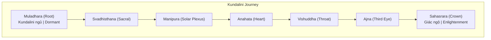
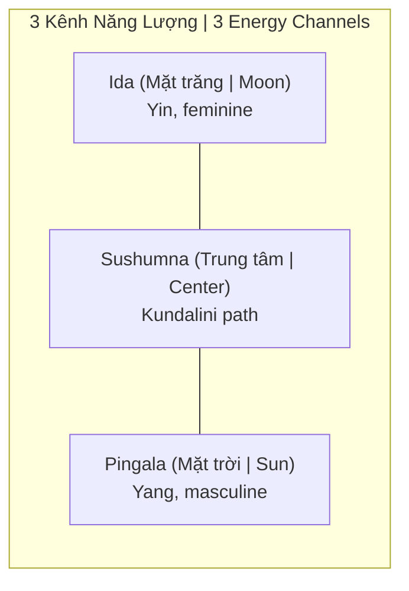
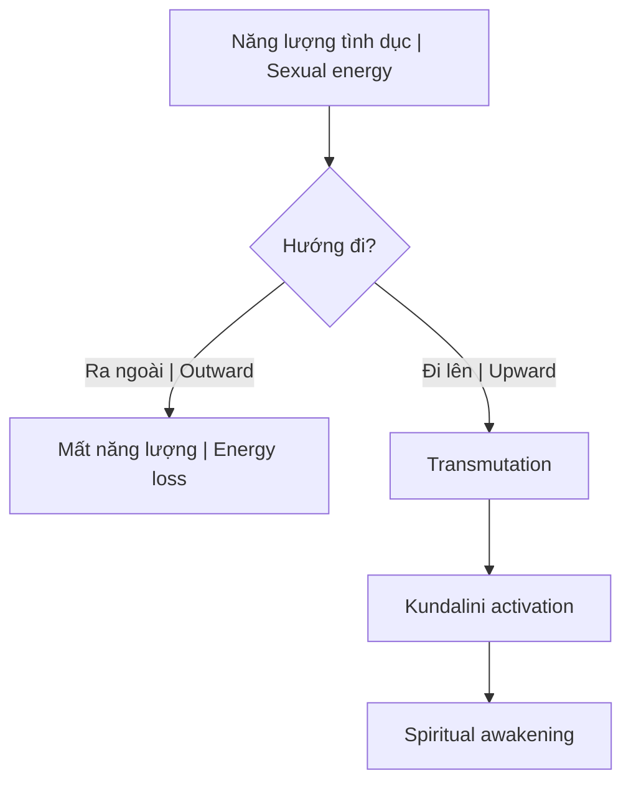

# Kundalini — Năng Lượng Rắn Thiêng

> *"Kundalini là năng lượng nguyên thủy nằm cuộn ở đáy cột sống, chờ được đánh thức."*
> *"Kundalini is the primal energy coiled at the base of the spine, waiting to be awakened."*

**Kundalini** (Sanskrit: कुण्डलिनी, "cuộn tròn như rắn") là khái niệm trong truyền thống Hindu và Tantra, mô tả năng lượng tâm linh tiềm ẩn nằm ở đáy cột sống (Muladhara chakra). Khi được đánh thức, nó đi lên dọc theo cột sống qua các [[Chakra]], dẫn đến sự thức tỉnh tâm linh.

*Kundalini (Sanskrit: कुण्डलिनी, "coiled like a serpent") is a concept in Hindu and Tantric traditions, describing latent spiritual energy at the base of the spine (Muladhara chakra). When awakened, it rises along the spine through the Chakras, leading to spiritual awakening.*

---

## Biểu Tượng / Symbolism

### Con Rắn Cuộn / The Coiled Serpent

| Biểu tượng / Symbol | Ý nghĩa / Meaning |
|---------------------|-------------------|
| **Rắn cuộn 3.5 vòng** | Năng lượng tiềm ẩn, ngủ yên |
| **Rắn thức dậy, bò lên** | Năng lượng được kích hoạt |
| **Đạt đỉnh đầu** | Hợp nhất với ý thức vũ trụ |

### Parallels Trong Các Văn Hóa / Cross-Cultural Parallels

| Văn hóa / Culture | Biểu tượng / Symbol |
|-------------------|---------------------|
| **Hindu** | Kundalini Shakti |
| **Ai Cập** | Uraeus (rắn hổ mang trên vương miện) |
| **Y học** | Caduceus (2 rắn quấn quanh gậy) |
| **Aztec** | Quetzalcoatl (rắn có lông vũ) |
| **Trung Hoa** | Rồng (năng lượng đi lên) |

---

## Cơ Chế / Mechanism

### Kundalini Ngủ / Dormant Kundalini

Ở hầu hết mọi người, Kundalini nằm **ngủ yên** ở đáy cột sống:

*In most people, Kundalini lies dormant at the base of the spine:*

- Năng lượng bị "khóa" tại Muladhara
- Chỉ sử dụng cho survival, sinh sản
- Tiềm năng tâm linh chưa được khai phá

### Kundalini Thức Tỉnh / Awakened Kundalini

Khi được đánh thức, năng lượng đi lên qua **Sushumna** (kênh trung tâm trong cột sống):

*When awakened, energy rises through Sushumna (central channel in the spine):*

### Qua Từng Chakra / Through Each Chakra

| Chakra | Khi Kundalini đi qua / When Kundalini passes |
|--------|---------------------------------------------|
| **Muladhara** | Giải phóng sợ hãi sinh tồn |
| **Svadhisthana** | Chuyển hóa năng lượng tình dục |
| **Manipura** | Giải phóng ego, ý chí mạnh mẽ |
| **Anahata** | Mở rộng tình yêu vô điều kiện |
| **Vishuddha** | Biểu đạt chân thật, sáng tạo |
| **Ajna** | Kích hoạt [[Tuyến Tùng]], trực giác |
| **Sahasrara** | Hợp nhất với ý thức vũ trụ |

---

## Connection: [[Năng Lượng Tình Dục]] / Sexual Energy Connection

Kundalini và năng lượng tình dục **cùng nguồn gốc**:

*Kundalini and sexual energy share the same source:*

| Sử dụng / Use | Kết quả / Result |
|---------------|------------------|
| **Xuất tinh thường xuyên** | Năng lượng thoát ra ngoài, mất sinh lực |
| **Giữ tinh (Semen Retention)** | Năng lượng tích lũy, có thể chuyển hóa |
| **Transmutation** | Năng lượng đi lên → Kundalini awakening |

→ Xem: [[Năng Lượng Tình Dục]], [[S.E.X]]

### Thực Hành / Practice

---

## Cách Đánh Thức / Methods of Awakening

### 1. Yoga Kundalini

Hệ thống yoga chuyên dành cho việc đánh thức Kundalini:

*Yoga system specifically designed for Kundalini awakening:*

- Asanas (tư thế)
- Pranayama (hơi thở)
- Bandhas (khóa năng lượng)
- Mudras (thủ ấn)
- Mantras

### 2. Thiền Định / Meditation

- Tập trung vào các chakra
- Visualize năng lượng đi lên
- Mantra meditation

### 3. Tantric Practices

- Sử dụng năng lượng tình dục có ý thức
- Sacred union

### 4. Spontaneous Awakening

Đôi khi Kundalini thức dậy **tự phát**:

*Sometimes Kundalini awakens spontaneously:*

- Qua trauma
- Near-death experience
- Intense spiritual practice
- Meditation breakthrough

---

## Triệu Chứng Kundalini Thức Tỉnh / Symptoms of Kundalini Awakening

### Tích Cực / Positive

| Triệu chứng / Symptom | Mô tả / Description |
|-----------------------|---------------------|
| **Bliss** | Trạng thái hạnh phúc vô cớ |
| **Energy surges** | Cảm giác điện chạy dọc cột sống |
| **Heightened awareness** | Nhận thức mở rộng |
| **Psychic abilities** | Trực giác, nhìn thấy aura |
| **Sense of unity** | Cảm giác hợp nhất với vạn vật |

### Tiêu Cực (Kundalini Syndrome) / Negative (Kundalini Syndrome)

Khi Kundalini thức dậy **quá nhanh** hoặc **không chuẩn bị**:

*When Kundalini awakens too fast or without preparation:*

| Triệu chứng / Symptom | Mô tả / Description |
|-----------------------|---------------------|
| **Intense heat/cold** | Nóng lạnh bất thường |
| **Involuntary movements** | Cơ thể run, giật |
| **Emotional upheaval** | Cảm xúc bùng nổ |
| **Sleep disturbances** | Mất ngủ, mơ vivid |
| **Physical pain** | Đau ở các chakra |
| **Psychological crisis** | Có thể giống psychosis |

> **Cảnh báo:** Đánh thức Kundalini cần **sự chuẩn bị** và **hướng dẫn**. Không nên ép buộc.
>
> *Warning: Kundalini awakening requires preparation and guidance. Should not be forced.*

---

## Connection: [[Ma Trận]] và Kundalini / Matrix and Kundalini

### Tại Sao Ma Trận Muốn Kundalini Ngủ? / Why Does the Matrix Want Kundalini Dormant?

| Khi Kundalini ngủ | Khi Kundalini thức |
|-------------------|-------------------|
| Dễ kiểm soát | Khó kiểm soát |
| Năng lượng thấp | Năng lượng cao |
| Bị kẹt trong survival mode | Vượt qua survival |
| Dễ bị sợ hãi | Không sợ |
| Tiêu thụ, phụ thuộc | Tự do, độc lập |

### Các Cách Ma Trận Giữ Kundalini Ngủ / How Matrix Keeps Kundalini Dormant

| Method | Effect |
|--------|--------|
| **Porn, casual sex** | Xả năng lượng ra ngoài thay vì đi lên |
| **Fluoride** | Calcify [[Tuyến Tùng]] (Ajna chakra) |
| **Fear-based media** | Giữ ở survival mode (Muladhara) |
| **Processed food** | Cản trở năng lượng |
| **Sedentary lifestyle** | Năng lượng ứ đọng |

→ Xem: [[Sự Thật Đen Tối Về Phim Khiêu Dâm]], [[Ma Trận - Giải Phẫu Hoàn Chỉnh]]

---

## Thực Hành An Toàn / Safe Practice

### Chuẩn Bị / Preparation

1. **Thanh lọc cơ thể** — Clean eating, detox
2. **Thanh lọc tâm** — Shadow work, giải quyết trauma
3. **Nền tảng yoga** — Asana, pranayama cơ bản
4. **Tìm người hướng dẫn** — Không tự mò

### Nguyên Tắc / Principles

- **Từ từ** — Không ép buộc, không vội
- **Grounding** — Kết nối với đất
- **Balance** — Cân bằng các chakra trước
- **Surrender** — Buông bỏ, không kiểm soát

---

## Related / Liên quan

### Energy
- [[Chakra]] — 7 trung tâm năng lượng
- [[Năng Lượng Tình Dục]] — Cùng nguồn với Kundalini
- [[Tinh Khí Thần]] — Tam bảo

### Anatomy
- [[Tuyến Tùng]] — Third eye, đích đến của Kundalini
- [[33 Tầng Bậc - Khám Phá Ngôi Đền Linh Thiêng Trong Tâm Trí]] — 33 vertebrae = 33 degrees

### Practice
- [[S.E.X]] — Sacred energy exchange
- [[Y Tế Tự Nhiên]] — Body preparation

### Matrix
- [[Ma Trận - Giải Phẫu Hoàn Chỉnh]] — Why Matrix keeps it dormant
- [[Sự Thật Đen Tối Về Phim Khiêu Dâm]] — How energy is drained
