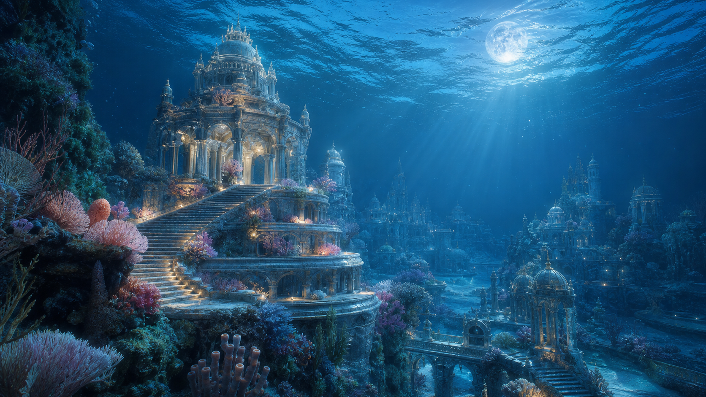
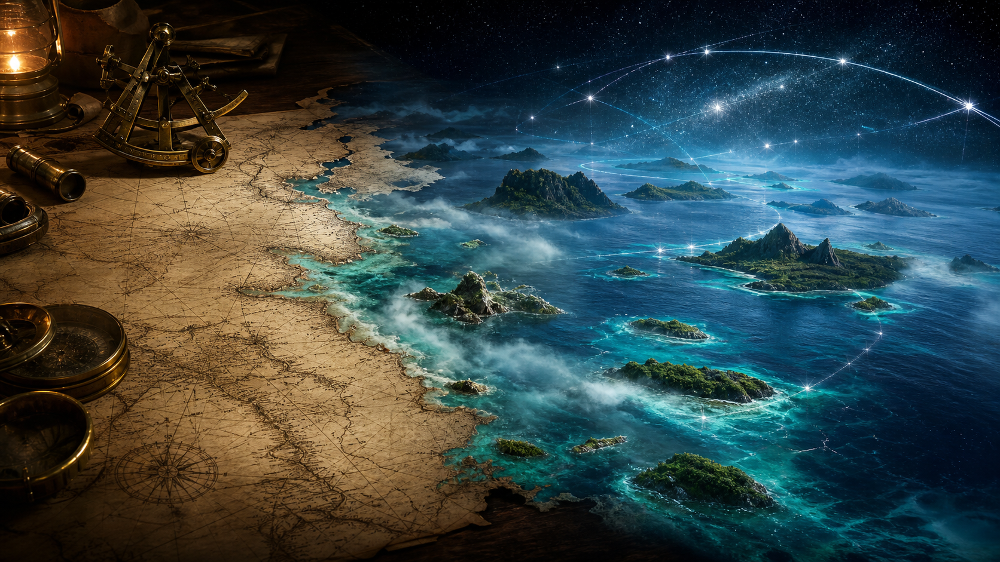
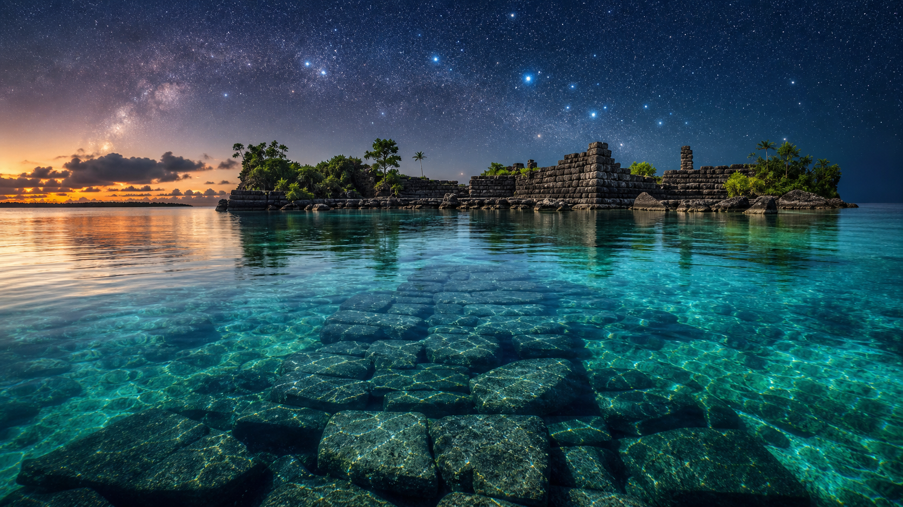
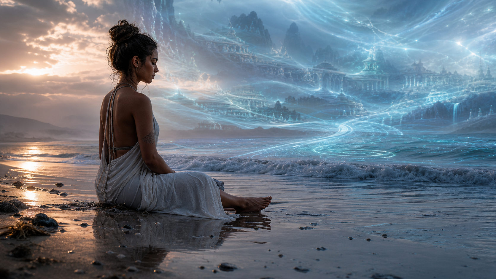

# Lemuria (Mu)

**Lemuria là ký ức về một nhánh văn minh oceanic, feminine, trực giác và cộng sinh với Gaia. Nó không cần được chứng minh như một quốc gia khảo cổ đã đóng án để đặt câu hỏi đúng: nhân loại đã đánh mất kiểu trí tuệ nào khi chọn chinh phục thay vì lắng nghe?**

*Lemuria is an oceanic, feminine, Gaia-aligned memory. Its value is not hard certainty; its value is the question it forces modern civilization to face.*

---

## Evidence Discipline / Cách Đọc

| Tầng claim | Cách đọc |
|---|---|
| **Fact / history of ideas** | “Lemuria” xuất hiện trong giả thuyết land bridge thế kỷ 19 rồi đi vào Theosophy và Mu literature |
| **Archaeological hints** | Nan Madol, Pacific navigation, submerged shelves, island legends là mảnh gợi hỏi |
| **Symbol / myth** | feminine, oceanic, telepathic, heart-based civilization |
| **Speculative synthesis** | Lemurian souls, starseeds, ký ức tiền sử, Gaia grid |

Không cần biến Lemuria thành fact cứng để nó có giá trị. Nhưng cũng không được nói như đã đào được thủ đô Mu dưới đáy biển.

---

## Vault Position / Vị Trí Trong Vault

Lemuria thuộc [[MOC - Ancient Civilizations & Hidden History]] và đối thoại trực tiếp với [[Atlantis]]. Nếu Atlantis là cảnh báo về công nghệ mất heart, Lemuria là ký ức về heart thiếu form. Nếu Atlantis là crystal, tower, engineering, Lemuria là ocean, womb, song, listening.

Vault không chọn phe. Một nhân loại chỉ Atlantis sẽ thành machine. Một nhân loại chỉ Lemuria sẽ thiếu boundary. Sự trưởng thành là union: heart có structure, technology có soul.

---

## Từ Land Bridge Đến Myth-History

Ban đầu, Lemuria là giả thuyết địa chất để giải thích phân bố loài lemur trước khi plate tectonics làm model đó lỗi thời. Sau đó Theosophy và các tác giả về Mu biến nó thành lục địa cổ, root race, nền văn minh chìm.

Điều này không “debunk” toàn bộ motif. Nó chỉ nhắc ta đặt đúng tầng. Một ý tưởng có thể sai ở tầng geology cũ nhưng vẫn đúng ở tầng mythic memory: Pacific world có những kỹ năng navigation, cosmology và ocean intelligence mà modern textbook thường làm phẳng.

---

## Lemuria Vs Atlantis

| Trục | Lemuria | Atlantis |
|---|---|---|
| năng lượng | feminine, oceanic, receptive | masculine, crystalline, technological |
| tri thức | telepathy, dream, Gaia resonance | engineering, power, crystal systems |
| shadow | thiếu boundary, dễ tan vào mơ | control, hubris, weaponized knowledge |
| bài học | heart cần form | technology cần soul |

Đặt cạnh [[Chu Kỳ Vũ Trụ - Yugas & Kalpas]], hai motif này giống hai memory của nhân loại trước reset: một memory về cộng sinh, một memory về quyền năng.

---

## Pacific Clues / Những Mảnh Gợi Hỏi

Nan Madol, Rapa Nui, Polynesian wayfinding, Ring of Fire, Sundaland, truyền thuyết homeland chìm và các kỹ năng đọc sao/biển đều là mảnh đáng hỏi. Chúng không prove một lục địa Lemuria thống nhất, nhưng chúng phá hình ảnh “người cổ đại chỉ mò mẫm sơ khai”.

Pacific không chỉ là khoảng trống xanh trên bản đồ. Nó là archive nước, gió, đảo, sao và memory truyền miệng. Lemuria là tên biểu tượng cho archive đó.

---

## Gaia Consciousness

Lemuria thường được mô tả như civilization gần [[Gaia - Trái Đất Có Ý Thức]]: nghe đất, nghe biển, chữa lành bằng resonance, sống theo chu kỳ thay vì extraction. Đây là tầng myth, nhưng nó đánh trúng một thiếu hụt hiện đại rất thật.

Con người công nghiệp có sensor, dashboard, policy, carbon market vì đã mất khả năng cảm môi trường trực tiếp. Lemuria hỏi ngược: một loài thật sự thông minh có cần tách khỏi Gaia để chứng minh mình văn minh không?

---

## Lemurian Soul: Đừng Trôi Khỏi Đất

Nhiều người nói về Lemurian souls, starseeds, ký ức “home” không thuộc đời này. Tầng này nên đọc như phenomenology của linh hồn, không như giấy khai sinh cosmic. Cảm giác nhớ biển, nhớ một cách sống có heart hơn, có thể là dữ liệu nội tâm. Nhưng nội tâm cần grounding.

Nếu một identity esoteric làm bạn embodied hơn, tử tế hơn, yêu Gaia hơn, nó có giá trị. Nếu nó làm bạn trốn đời, khinh người “chưa thức tỉnh”, bỏ trách nhiệm thân thể, nó đã thành spiritual ego.

---

## Core Insight / Chốt Lại

**Lemuria là memory của communion. Nó không cần thắng tranh luận khảo cổ để hữu ích. Nó chỉ cần giữ một câu hỏi sống: nếu nhân loại từng biết sống với Gaia thay vì đứng trên Gaia, ta đã mất gì khi gọi sự tách rời là tiến bộ?**

*Lemuria is the memory of communion: a reminder that intelligence without listening becomes conquest, and spirituality without grounding becomes fog.*
