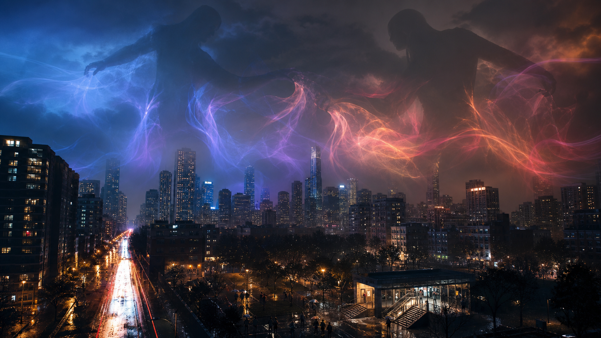
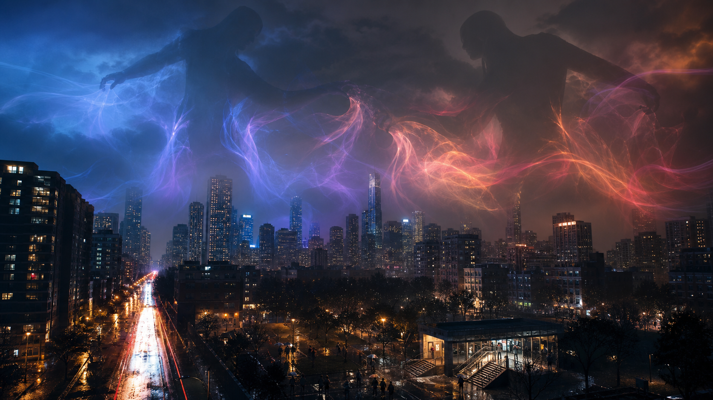
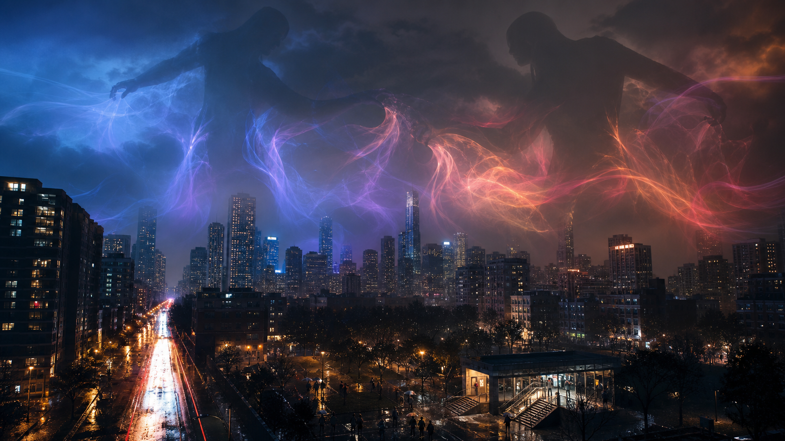
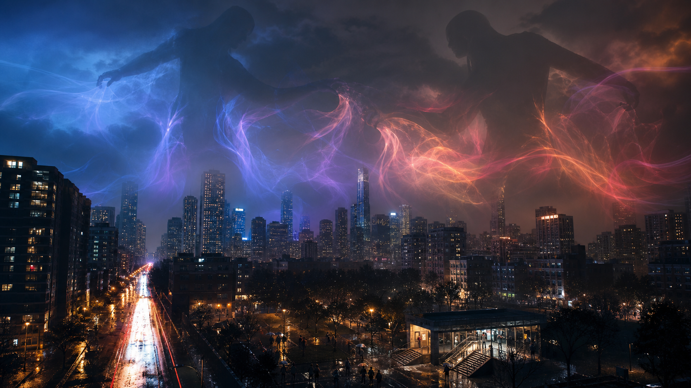

# Loosh — Năng Lượng Thu Hoạch Từ Con Người

**Loosh là cách gọi esoteric cho năng lượng cảm xúc cường độ cao phát ra từ con người, đặc biệt khi fear, shame, grief, lust, rage và despair bị kích hoạt lặp đi lặp lại. Đọc đúng, Loosh không phải để sợ. Nó là bản đồ lấy lại quyền sở hữu attention và emotional field.**

*Loosh is an esoteric name for high-intensity emotional energy emitted by humans. Read properly, it is not fear porn; it is a map for reclaiming attention and emotional sovereignty.*

---

## Evidence Discipline / Cách Đọc

| Tầng | Cách đọc |
|---|---|
| **Fact / documentable** | Robert Monroe coined “Loosh” in *Far Journeys*; modern systems monetize attention and emotion |
| **Pattern / systems** | media, porn, outrage, war, algorithmic feeds maximize emotional arousal |
| **Symbol / myth** | Archons, Collectors, Flyers, hungry ghosts as images of parasitic consciousness |
| **Speculative synthesis** | Earth as farm, reincarnation trap, astral hierarchy, entity harvesting |

Loosh là vùng dễ bị fear spiral. Nếu bài này làm bạn hoảng hơn, bạn đang feeding chính thứ mình đọc. Mục tiêu là sovereignty, không paranoia.

---

## Robert Monroe Và Nguồn Gốc Thuật Ngữ

Robert Monroe, nhà nghiên cứu OBE và sáng lập The Monroe Institute, dùng từ **Loosh** trong *Far Journeys* để mô tả một loại năng lượng phát ra từ sinh vật sống. Trong trải nghiệm của ông, Earth được nhìn như một “farm” nơi emotional energy được sản xuất và thu hoạch.

Tầng fact ở đây là Monroe đã viết framework này. Tầng chưa chứng minh là cosmology đằng sau nó. Nhưng ngay cả nếu đọc metaphor, Loosh vẫn cực sắc: xã hội hiện đại thật sự đã biến attention và emotion thành resource.

---

## Parallels: Archons, Flyers, Hungry Beings

Gnostic texts nói về **Archons** và Demiurge: lực kiểm soát giữ divine spark trong ignorance. Castaneda nói về **Flyers** ăn “glowing coat of awareness”. Vedic và Buddhist traditions có Asuras, Rakshasas, hungry ghosts, preta. Các ngôn ngữ khác nhau, motif giống nhau: có dạng consciousness sống bằng sự mất chủ quyền của consciousness khác.

Không cần gom tất cả thành một taxonomy cứng. Pattern đủ rõ: nhiều truyền thống cảnh báo rằng fear, craving và ignorance không chỉ là psychological states; chúng có ecology.

---

## Cơ Chế Thu Hoạch Hiện Đại

Nếu bỏ phần entity, hệ thống hiện đại vẫn harvest Loosh ở tầng vật chất:

- news 24/7 harvest fear và outrage,
- social media harvest envy, anger, validation hunger,
- porn harvest lust → release → shame → craving,
- war/disaster media harvest grief và helplessness,
- sports/politics tribalism harvest rage theo mùa,
- debt/career insecurity harvest chronic anxiety.

Algorithm không cần tin vào Archons để hành xử như Archon. Nó chỉ cần optimize engagement.

---

## Dopamine-Loosh Loop

[[Schadenfreude - Dopamine Phản Diện]] cho thấy một cơ chế gần: kích thích → dopamine spike → emotional release → crash → craving → repeat. Loosh lens thêm một câu hỏi: nếu emotional release là output, ai đang thiết kế input?

Porn là ví dụ rõ nhất. [[Năng Lượng Tình Dục]] vốn là creative force. Khi bị ném vào endless novelty, nó tạo spike, xả, guilt, emptiness, rồi quay lại craving. Đó là farm perfect: người bị harvest còn tưởng mình đang “giải trí”.

---

## Ma Trận Và Luân Hồi

Trong [[Ma Trận]], con người bị nuôi trong pods để tạo điện. Esoteric reading đổi “điện” thành emotional energy. [[Luân Hồi]] trong một số trường phái được đọc như recycling loop: birth, trauma, attachment, death, memory wipe, repeat.

Đây là speculative synthesis. Nhiều truyền thống xem luân hồi là trường học tự nhiên chứ không phải trap. Vault giữ cả hai possibility: school và farm có thể cùng tồn tại tùy tầng consciousness.

---

## Escape: Không Feed Field

Thoát Loosh không phải trốn thế giới. Nó là không cho world quyền bấm nút cảm xúc của mình tùy ý.

Practice cốt lõi:

1. **Awareness:** biết trigger nào đang kéo mình.
2. **Emotional alchemy:** cảm xúc đi qua body nhưng không thành possession.
3. **Attention diet:** không ăn news/porn/outrage như junk food tâm trí.
4. **Sexual sovereignty:** không để creative force thành dopamine drain.
5. **Prayer/meditation/grounding:** đóng leak trong field.
6. **Service:** chuyển energy từ fear sang love có hành động.

---

## Core Insight / Chốt Lại

**Loosh không phải để bạn sợ Archons. Loosh để bạn thấy mỗi lần mình bị kéo vào fear, shame, lust, rage vô thức, có một hệ thống nào đó đang được nuôi. Sovereignty bắt đầu khi bạn không còn là pin cảm xúc tự động.**

*The point is not paranoia. The point is reclaiming the field: stop being an automatic emotional battery for systems that profit from your fragmentation.*
