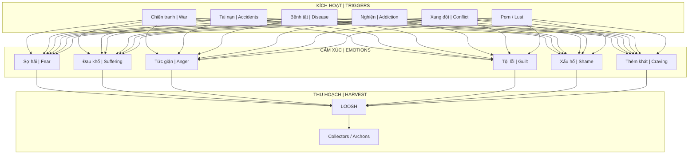
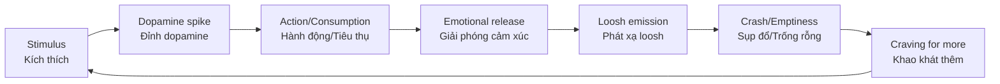
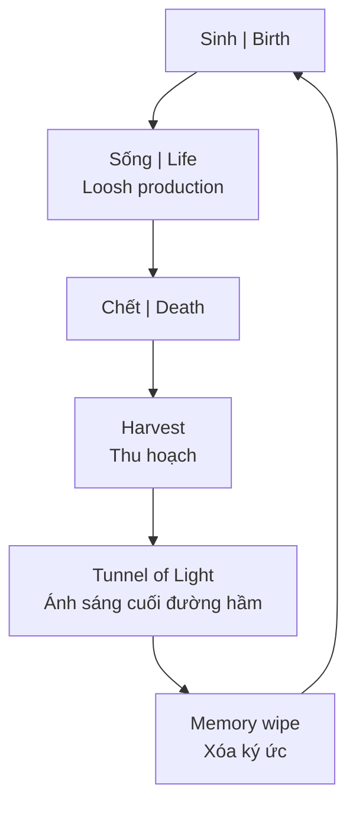
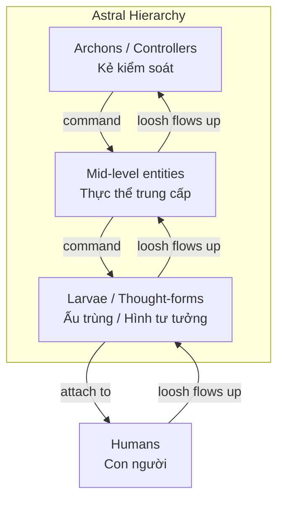
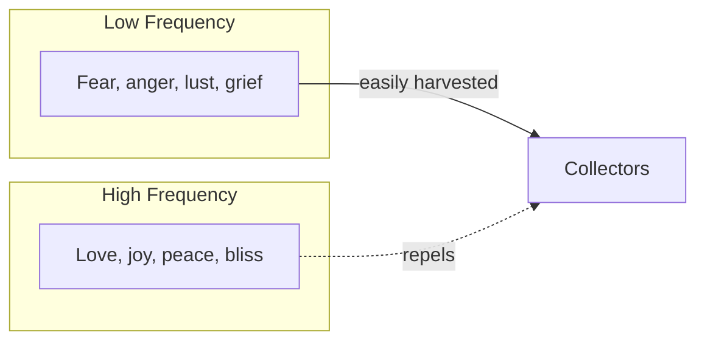

---
title: "Loosh - Năng Lượng Thu Hoạch Từ Con Người"
aliases: ["Loosh", "Energy Harvesting", "Thu Hoạch Năng Lượng"]
date: 2026-04-29
tags: [esoterica, consciousness, matrix]
status: refined
---

# Loosh — Năng Lượng Thu Hoạch Từ Con Người

> *"Chúng ta là thức ăn của thần linh."*
> *"We are food for the gods."*
> — Carlos Castaneda

**Loosh** là thuật ngữ do Robert Monroe đặt ra trong sách *Far Journeys* (1985), mô tả một loại năng lượng phát ra từ con người — đặc biệt là năng lượng cảm xúc cường độ cao — được các thực thể chiều cao hơn thu hoạch.

*Loosh is a term coined by Robert Monroe in Far Journeys (1985), describing a type of energy emitted by humans — especially high-intensity emotional energy — harvested by higher-dimensional entities.*

---

## Nguồn Gốc Thuật Ngữ / Origin of the Term

### Robert Monroe (1915-1995)

Robert Monroe là nhà nghiên cứu tiên phong về out-of-body experiences (OBE), sáng lập **The Monroe Institute** và phát triển công nghệ **Hemi-Sync** (đồng bộ bán cầu não).

*Robert Monroe was a pioneer researcher of out-of-body experiences (OBE), founder of The Monroe Institute and developer of Hemi-Sync technology (hemispheric synchronization).*

| Tác phẩm / Work | Năm / Year | Nội dung chính / Main content |
|-----------------|------------|-------------------------------|
| *Journeys Out of the Body* | 1971 | OBE experiences đầu tiên |
| *Far Journeys* | 1985 | **Loosh concept**, Collectors |
| *Ultimate Journey* | 1994 | Tổng kết hành trình |

### "Loosh" trong Far Journeys

Trong một trải nghiệm OBE, Monroe mô tả được "chỉ cho thấy" rằng:

*In an OBE experience, Monroe describes being "shown" that:*

1. Trái Đất là một "trang trại" (*farm*) được thiết kế để sản xuất một loại năng lượng đặc biệt
2. Năng lượng này — *loosh* — phát sinh từ **cảm xúc cường độ cao** của sinh vật sống
3. Có các thực thể (*Collectors*) thu hoạch năng lượng này
4. Loosh chất lượng cao nhất đến từ **đau khổ, sợ hãi, và cảm xúc tiêu cực**

*Earth is a "farm" designed to produce a special energy. This energy — loosh — arises from high-intensity emotions of living beings. Entities (Collectors) harvest this energy. Highest quality loosh comes from suffering, fear, and negative emotions.*

> Monroe viết rằng có hai loại loosh:
> - **Loosh thấp**: từ đau khổ, sợ hãi, chết chóc
> - **Loosh cao**: từ tình yêu vô điều kiện, an lạc
>
> *Monroe wrote there are two types: low loosh (from suffering) and high loosh (from unconditional love, bliss).*

---

## Parallels Trong Các Truyền Thống / Parallels in Traditions

### Gnosticism — Archons (2000+ năm trước)

Các văn bản Gnostic cổ đại đã mô tả hệ thống tương tự:

*Ancient Gnostic texts described a similar system:*

| Gnostic Term | Monroe's Term | Giải thích / Explanation |
|--------------|---------------|--------------------------|
| **Archons** | Collectors | Thực thể kiểm soát và thu hoạch |
| **Demiurge** | Someone (in metaphor) | Người tạo ra "trang trại" |
| **Hylic** | Low loosh producer | Con người chỉ sống trong vật chất |
| **Pneumatic** | High loosh producer | Con người thức tỉnh tâm linh |

### Castaneda — The Flyers

Carlos Castaneda (học trò của Don Juan) mô tả "the flyers" — sinh vật bóng tối ăn "sự nhận thức sáng chói" (*glowing coat of awareness*) của con người.

*Carlos Castaneda (student of Don Juan) described "the flyers" — shadow beings that eat humans' "glowing coat of awareness."*

> *"Họ cho chúng ta hệ thống niềm tin, ý tưởng về thiện ác, tập quán xã hội. Họ đánh thức lòng tham, sự lo lắng."*
>
> *"They gave us their mind... their mind which is bizarre, contradictory, morose, filled with fear."*
> — Don Juan (theo Castaneda)

### Vedic — Asuras & Rakshasas

Truyền thống Ấn Độ cổ đại cũng mô tả các thực thể sống bằng năng lượng cảm xúc con người.

*Ancient Indian traditions also describe entities living off human emotional energy.*

---

## Cơ Chế Thu Hoạch / Harvesting Mechanisms

### Tổng Quan Hệ Thống / System Overview

### Các Kênh Thu Hoạch Hiện Đại / Modern Harvesting Channels

| Kênh / Channel | Loại cảm xúc / Emotion Type | Cường độ / Intensity |
|----------------|----------------------------|---------------------|
| **[[Sự Thật Đen Tối Về Phim Khiêu Dâm|Pornography]]** | Lust → Guilt → Shame | Cao, lặp lại / High, repetitive |
| **News 24/7** | Fear, outrage, anxiety | Liên tục / Continuous |
| **Social Media** | Envy, anger, validation-seeking | Liên tục / Continuous |
| **Wars/Disasters** | Mass fear, grief, trauma | Cực cao / Extreme |
| **Entertainment violence** | Vicarious trauma | Trung bình / Medium |
| **Sports fanaticism** | Tribal rage, despair | Cao, cyclical |

### Vòng Lặp Dopamine-Loosh / Dopamine-Loosh Loop

Connection với [[Schadenfreude - Dopamine Phản Diện]]:

**Insight:** Dopamine system có thể được thiết kế như "bẫy" để maximize loosh production.

*Dopamine system may be designed as a "trap" to maximize loosh production.*

---

## Connection: [[Ma Trận]] Và Energy Farming

### Ma Trận Như Trang Trại Năng Lượng / Matrix as Energy Farm

Trong phim *The Matrix* (1999), con người bị nuôi trong pods để sản xuất **điện** cho máy móc.

*In The Matrix (1999), humans are kept in pods to produce electricity for machines.*

Theo góc nhìn esoteric, đây là metaphor cho thực tế:

*From esoteric perspective, this is a metaphor for reality:*

| Phim / Movie | Thực tế Esoteric / Esoteric Reality |
|--------------|-------------------------------------|
| Machines | Archons / Collectors |
| Electricity | Loosh (emotional energy) |
| Pods | Physical bodies |
| Matrix simulation | Consensus reality / Maya |
| The One | Thức tỉnh / Awakened one |

### [[Luân Hồi]] Như Recycling

Theo nhiều truyền thống esoteric (và Monroe), hệ thống luân hồi có thể là mechanism để **giữ linh hồn trong vòng lặp** sản xuất loosh.

*According to many esoteric traditions (and Monroe), reincarnation may be a mechanism to keep souls in the loosh production loop.*

> **Cảnh báo:** Đây là góc nhìn esoteric, không phải tất cả các truyền thống đều đồng ý. Nhiều truyền thống xem luân hồi là con đường học hỏi tự nhiên.
>
> *Warning: This is an esoteric perspective, not all traditions agree. Many traditions view reincarnation as a natural learning path.*

---

## Connection: [[Năng Lượng Tình Dục]] Và Thu Hoạch

### Tại Sao Sex/Porn Là Target Chính? / Why Sex/Porn Is Primary Target?

Năng lượng tình dục ([[Tinh Khí Thần]]) là năng lượng sáng tạo mạnh nhất của con người.

*Sexual energy ([[Tinh Khí Thần]]) is the most powerful creative energy of humans.*

| Sử dụng đúng / Proper use | Sử dụng sai / Misuse |
|---------------------------|----------------------|
| Sinh con / Procreation | Porn addiction |
| Sáng tạo / Creativity | Casual hookups |
| Kundalini / Spiritual | Energy vampirism |
| Sacred union | One-night stands |

**Khi năng lượng tình dục bị lãng phí qua porn/masturbation:**

*When sexual energy is wasted through porn/masturbation:*

1. Dopamine spike → Emotional release → Loosh emission
2. Post-orgasm: guilt, shame, emptiness → More loosh
3. Addiction cycle → Continuous harvesting
4. Kundalini blocked → Spiritual growth stunted

→ Xem chi tiết: [[Sự Thật Đen Tối Về Phim Khiêu Dâm]]

---

## Connection: [[Thực Thể Cõi Trung Giới]]

### Hierarchy Của Collectors

### Cách Attachment Xảy Ra / How Attachment Happens

| Entry Point | Mechanism |
|-------------|-----------|
| **Trauma** | Creates "holes" in aura |
| **Porn/Sex** | Opens lower chakras |
| **Drugs/Alcohol** | Lowers defenses |
| **Extreme emotions** | Attracts matching entities |
| **Occult without protection** | Direct invitation |

---

## Làm Sao Để Thoát? / How to Escape?

### 1. Nhận Thức / Awareness

Bước đầu tiên: **biết mình đang bị thu hoạch**.

*First step: know you are being harvested.*

### 2. Kiểm Soát Cảm Xúc / Emotional Mastery

| Thay vì / Instead of | Chuyển thành / Transform to |
|----------------------|----------------------------|
| Fear → | Awareness |
| Anger → | Boundary |
| Lust → | Transmuted creativity |
| Grief → | Acceptance |

### 3. Energy Hygiene

- Thiền định / Meditation
- Grounding với thiên nhiên / Nature grounding
- Tránh triggers (news, porn, drama) / Avoid triggers
- Bảo vệ năng lượng / Energy protection

### 4. Raise Frequency

Theo Monroe, **loosh từ tình yêu vô điều kiện** không bị thu hoạch theo cách tương tự — nó thực sự có thể "chói sáng" khiến collectors không thể tiếp cận.

*According to Monroe, loosh from unconditional love isn't harvested the same way — it actually "shines" so bright that collectors cannot approach.*

### 5. [[Individuation]] / Shadow Work

Khi bạn integrate Shadow, bạn có ít "buttons" để bị pressed → ít loosh production.

*When you integrate your Shadow, you have fewer "buttons" to be pressed → less loosh production.*

---

## Skeptical View / Góc Nhìn Hoài Nghi

Cần acknowledge:

*Need to acknowledge:*

1. **Không có "bằng chứng khoa học"** cho loosh — đây là trải nghiệm chủ quan (OBE) và truyền thống esoteric
2. Monroe's experiences có thể là **psychological projections** hoặc metaphors
3. Gnostic texts là **mythology**, không phải documentary
4. "Prison planet" narrative có thể là **coping mechanism** cho suffering

**Tuy nhiên:**

*However:*

- Pattern xuất hiện **độc lập** trong nhiều truyền thống, thời đại, địa lý
- Phù hợp với observable reality: hệ thống xã hội maximize stress, fear, conflict
- Giải thích tại sao "negative news sells" và entertainment ngày càng dark
- Không cần "tin" để thực hành: emotional mastery có lợi dù metaphysics thế nào

---

## Related / Liên Quan

### Core Connections
- [[Ma Trận]] — Hệ thống kiểm soát tổng thể
- [[Thực Thể Cõi Trung Giới]] — Collectors chi tiết
- [[Năng Lượng Tình Dục]] — Sexual energy harvesting
- [[Sự Thật Đen Tối Về Phim Khiêu Dâm]] — Case study: porn industry

### Psychology
- [[Schadenfreude - Dopamine Phản Diện]] — Dopamine as harvesting mechanism
- [[Individuation]] — Con đường thoát
- [[Tâm Lý Học Jung]] — Shadow work

### Spiritual Traditions
- [[Gnosis]] — Direct knowing, escaping archons
- [[Luân Hồi]] — Potential recycling mechanism
- [[Tinh Khí Thần]] — Sexual/creative energy

---

## Sources

- **Robert Monroe** — *Far Journeys* (1985), *Ultimate Journey* (1994)
- **Carlos Castaneda** — *The Active Side of Infinity* (1998) — "Flyers" concept
- **Nag Hammadi Library** — Gnostic texts on Archons
- **Sol Luckman** — Contemporary loosh researcher
- Vault articles: [[Ma Trận]], [[Thực Thể Cõi Trung Giới]], [[Năng Lượng Tình Dục]]
