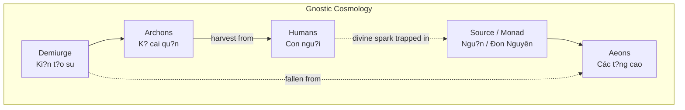
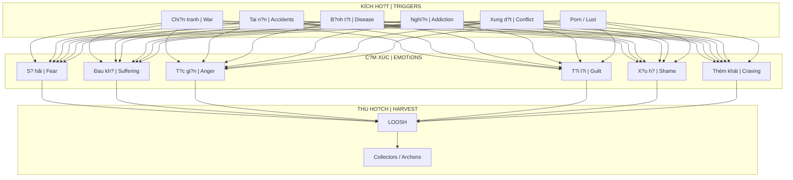
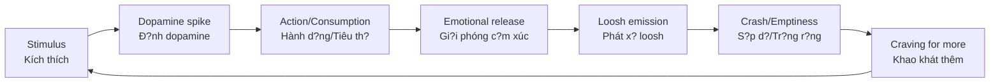
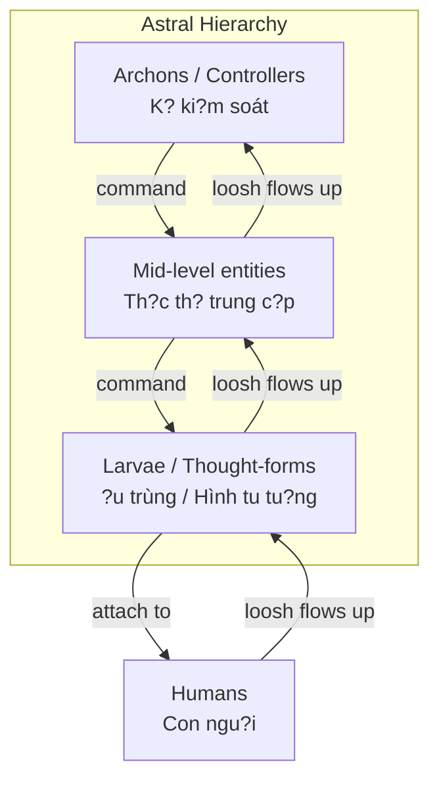
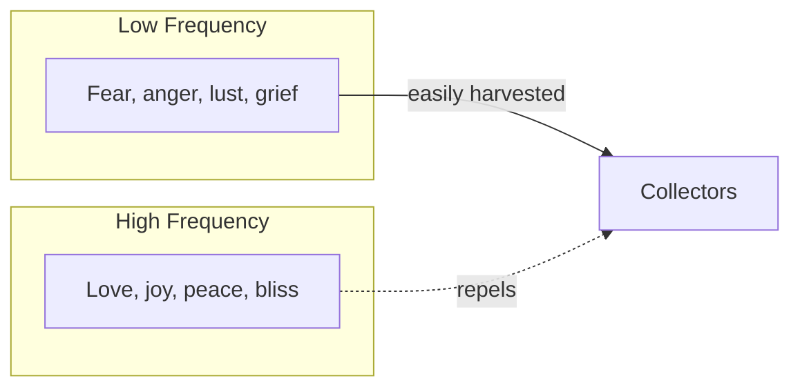

# Loosh - Nang Lu?ng Thu Ho?ch T? Con Ngu?i

> *"Chúng ta là th?c an c?a th?n linh."*
> *"We are food for the gods."*
> - Carlos Castaneda

**Loosh** là thu?t ng? do Robert Monroe d?t ra trong sách *Far Journeys* (1985), mô t? m?t lo?i nang lu?ng phát ra t? con ngu?i - d?c bi?t là nang lu?ng c?m xúc cu?ng d? cao - du?c các th?c th? chi?u cao hon thu ho?ch.

*Loosh is a term coined by Robert Monroe in Far Journeys (1985), describing a type of energy emitted by humans - especially high-intensity emotional energy - harvested by higher-dimensional entities.*

---

## Ngu?n G?c Thu?t Ng? / Origin of the Term

### Robert Monroe (1915-1995)

Robert Monroe là nhà nghiên c?u tiên phong v? out-of-body experiences (OBE), sáng l?p **The Monroe Institute** và phát tri?n công ngh? **Hemi-Sync** (d?ng b? bán c?u não).

*Robert Monroe was a pioneer researcher of out-of-body experiences (OBE), founder of The Monroe Institute and developer of Hemi-Sync technology (hemispheric synchronization).*

| Tác ph?m / Work | Nam / Year | N?i dung chính / Main content |
|-----------------|------------|-------------------------------|
| *Journeys Out of the Body* | 1971 | OBE experiences d?u tiên |
| *Far Journeys* | 1985 | **Loosh concept**, Collectors |
| *Ultimate Journey* | 1994 | T?ng k?t hành trình |

### "Loosh" trong Far Journeys

Trong m?t tr?i nghi?m OBE, Monroe mô t? du?c "ch? cho th?y" r?ng:

*In an OBE experience, Monroe describes being "shown" that:*

1. Trái Ð?t là m?t "trang tr?i" (*farm*) du?c thi?t k? d? s?n xu?t m?t lo?i nang lu?ng d?c bi?t
2. Nang lu?ng này - *loosh* - phát sinh t? **c?m xúc cu?ng d? cao** c?a sinh v?t s?ng
3. Có các th?c th? (*Collectors*) thu ho?ch nang lu?ng này
4. Loosh ch?t lu?ng cao nh?t d?n t? **dau kh?, s? hãi, và c?m xúc tiêu c?c**

*Earth is a "farm" designed to produce a special energy. This energy - loosh - arises from high-intensity emotions of living beings. Entities (Collectors) harvest this energy. Highest quality loosh comes from suffering, fear, and negative emotions.*

> Monroe vi?t r?ng có hai lo?i loosh:
> - **Loosh th?p**: t? dau kh?, s? hãi, ch?t chóc
> - **Loosh cao**: t? tình yêu vô di?u ki?n, an l?c
>
> *Monroe wrote there are two types: low loosh (from suffering) and high loosh (from unconditional love, bliss).*

---

## Parallels Trong Các Truy?n Th?ng / Parallels in Traditions

### Gnosticism - Archons (2000+ nam tru?c)

Các van b?n Gnostic c? d?i dã mô t? h? th?ng tuong t?:

*Ancient Gnostic texts described a similar system:*

| Gnostic Term | Monroe's Term | Gi?i thích / Explanation |
|--------------|---------------|--------------------------|
| **Archons** | Collectors | Th?c th? ki?m soát và thu ho?ch |
| **Demiurge** | Someone (in metaphor) | Ngu?i t?o ra "trang tr?i" |
| **Hylic** | Low loosh producer | Con ngu?i ch? s?ng trong v?t ch?t |
| **Pneumatic** | High loosh producer | Con ngu?i th?c t?nh tâm linh |

### Castaneda - The Flyers

Carlos Castaneda (h?c trò c?a Don Juan) mô t? "the flyers" - sinh v?t bóng t?i an "s? nh?n th?c sáng chói" (*glowing coat of awareness*) c?a con ngu?i.

*Carlos Castaneda (student of Don Juan) described "the flyers" - shadow beings that eat humans' "glowing coat of awareness."*

> *"H? cho chúng ta h? th?ng ni?m tin, ý tu?ng v? thi?n ác, t?p quán xã h?i. H? dánh th?c lòng tham, s? lo l?ng."*
>
> *"They gave us their mind... their mind which is bizarre, contradictory, morose, filled with fear."*
> - Don Juan (theo Castaneda)

### Vedic - Asuras & Rakshasas

Truy?n th?ng ?n Ð? c? d?i cung mô t? các th?c th? s?ng b?ng nang lu?ng c?m xúc con ngu?i.

*Ancient Indian traditions also describe entities living off human emotional energy.*

---

## Co Ch? Thu Ho?ch / Harvesting Mechanisms

### T?ng Quan H? Th?ng / System Overview

### Các Kênh Thu Ho?ch Hi?n Ð?i / Modern Harvesting Channels

| Kênh / Channel | Lo?i c?m xúc / Emotion Type | Cu?ng d? / Intensity |
|----------------|----------------------------|---------------------|
| **[[S? Th?t Ðen T?i V? Phim Khiêu Dâm|Pornography]]** | Lust ? Guilt ? Shame | Cao, l?p l?i / High, repetitive |
| **News 24/7** | Fear, outrage, anxiety | Liên t?c / Continuous |
| **Social Media** | Envy, anger, validation-seeking | Liên t?c / Continuous |
| **Wars/Disasters** | Mass fear, grief, trauma | C?c cao / Extreme |
| **Entertainment violence** | Vicarious trauma | Trung bình / Medium |
| **Sports fanaticism** | Tribal rage, despair | Cao, cyclical |

### Vòng L?p Dopamine-Loosh / Dopamine-Loosh Loop

Connection v?i [[Schadenfreude - Dopamine Ph?n Di?n]]:

**Insight:** Dopamine system có th? du?c thi?t k? nhu "b?y" d? maximize loosh production.

*Dopamine system may be designed as a "trap" to maximize loosh production.*

---

## Connection: [[Ma Tr?n]] Và Energy Farming

### Ma Tr?n Nhu Trang Tr?i Nang Lu?ng / Matrix as Energy Farm

Trong phim *The Matrix* (1999), con ngu?i b? nuôi trong pods d? s?n xu?t **di?n** cho máy móc.

*In The Matrix (1999), humans are kept in pods to produce electricity for machines.*

Theo góc nhìn esoteric, dây là metaphor cho th?c t?:

*From esoteric perspective, this is a metaphor for reality:*

| Phim / Movie | Th?c t? Esoteric / Esoteric Reality |
|--------------|-------------------------------------|
| Machines | Archons / Collectors |
| Electricity | Loosh (emotional energy) |
| Pods | Physical bodies |
| Matrix simulation | Consensus reality / Maya |
| The One | Th?c t?nh / Awakened one |

### [[Luân H?i]] Nhu Recycling

Theo nhi?u truy?n th?ng esoteric (và Monroe), h? th?ng luân h?i có th? là mechanism d? **gi? linh h?n trong vòng l?p** s?n xu?t loosh.

*According to many esoteric traditions (and Monroe), reincarnation may be a mechanism to keep souls in the loosh production loop.*

> **C?nh báo:** Ðây là góc nhìn esoteric, không ph?i t?t c? các truy?n th?ng d?u d?ng ý. Nhi?u truy?n th?ng xem luân h?i là con du?ng h?c h?i t? nhiên.
>
> *Warning: This is an esoteric perspective, not all traditions agree. Many traditions view reincarnation as a natural learning path.*

---

## Connection: [[Nang Lu?ng Tình D?c]] Và Thu Ho?ch

### T?i Sao Sex/Porn Là Target Chính? / Why Sex/Porn Is Primary Target?

Nang lu?ng tình d?c ([[Tinh Khí Th?n]]) là nang lu?ng sáng t?o m?nh nh?t c?a con ngu?i.

*Sexual energy ([[Tinh Khí Th?n]]) is the most powerful creative energy of humans.*

| S? d?ng dúng / Proper use | S? d?ng sai / Misuse |
|---------------------------|----------------------|
| Sinh con / Procreation | Porn addiction |
| Sáng t?o / Creativity | Casual hookups |
| Kundalini / Spiritual | Energy vampirism |
| Sacred union | One-night stands |

**Khi nang lu?ng tình d?c b? lãng phí qua porn/masturbation:**

*When sexual energy is wasted through porn/masturbation:*

1. Dopamine spike ? Emotional release ? Loosh emission
2. Post-orgasm: guilt, shame, emptiness ? More loosh
3. Addiction cycle ? Continuous harvesting
4. Kundalini blocked ? Spiritual growth stunted

? Xem chi ti?t: [[S? Th?t Ðen T?i V? Phim Khiêu Dâm]]

---

## Connection: [[Th?c Th? Cõi Trung Gi?i]]

### Hierarchy C?a Collectors

### Cách Attachment X?y Ra / How Attachment Happens

| Entry Point | Mechanism |
|-------------|-----------|
| **Trauma** | Creates "holes" in aura |
| **Porn/Sex** | Opens lower chakras |
| **Drugs/Alcohol** | Lowers defenses |
| **Extreme emotions** | Attracts matching entities |
| **Occult without protection** | Direct invitation |

---

## Làm Sao Ð? Thoát? / How to Escape?

### 1. Nh?n Th?c / Awareness

Bu?c d?u tiên: **bi?t mình dang b? thu ho?ch**.

*First step: know you are being harvested.*

### 2. Ki?m Soát C?m Xúc / Emotional Mastery

| Thay vì / Instead of | Chuy?n thành / Transform to |
|----------------------|----------------------------|
| Fear ? | Awareness |
| Anger ? | Boundary |
| Lust ? | Transmuted creativity |
| Grief ? | Acceptance |

### 3. Energy Hygiene

- Thi?n d?nh / Meditation
- Grounding v?i thiên nhiên / Nature grounding
- Tránh triggers (news, porn, drama) / Avoid triggers
- B?o v? nang lu?ng / Energy protection

### 4. Raise Frequency

Theo Monroe, **loosh t? tình yêu vô di?u ki?n** không b? thu ho?ch theo cách tuong t? - nó th?c s? có th? "chói sáng" khi?n collectors không th? ti?p c?n.

*According to Monroe, loosh from unconditional love isn't harvested the same way - it actually "shines" so bright that collectors cannot approach.*

### 5. [[Individuation]] / Shadow Work

Khi b?n integrate Shadow, b?n có ít "buttons" d? b? pressed ? ít loosh production.

*When you integrate your Shadow, you have fewer "buttons" to be pressed ? less loosh production.*

---

## Skeptical View / Góc Nhìn Hoài Nghi

C?n acknowledge:

*Need to acknowledge:*

1. **Không có "b?ng ch?ng khoa h?c"** cho loosh - dây là tr?i nghi?m ch? quan (OBE) và truy?n th?ng esoteric
2. Monroe's experiences có th? là **psychological projections** ho?c metaphors
3. Gnostic texts là **mythology**, không ph?i documentary
4. "Prison planet" narrative có th? là **coping mechanism** cho suffering

**Tuy nhiên:**

*However:*

- Pattern xu?t hi?n **d?c l?p** trong nhi?u truy?n th?ng, th?i d?i, d?a lý
- Phù h?p v?i observable reality: h? th?ng xã h?i maximize stress, fear, conflict
- Gi?i thích t?i sao "negative news sells" và entertainment ngày càng dark
- Không c?n "tin" d? th?c hành: emotional mastery có l?i dù metaphysics th? nào

---

## Related / Liên Quan

### Core Connections
- [[Ma Tr?n]] - H? th?ng ki?m soát t?ng th?
- [[Th?c Th? Cõi Trung Gi?i]] - Collectors chi ti?t
- [[Nang Lu?ng Tình D?c]] - Sexual energy harvesting
- [[S? Th?t Ðen T?i V? Phim Khiêu Dâm]] - Case study: porn industry

### Psychology
- [[Schadenfreude - Dopamine Ph?n Di?n]] - Dopamine as harvesting mechanism
- [[Individuation]] - Con du?ng thoát
- [[Tâm Lý H?c Jung]] - Shadow work

### Spiritual Traditions
- [[Gnosis]] - Direct knowing, escaping archons
- [[Luân H?i]] - Potential recycling mechanism
- [[Tinh Khí Th?n]] - Sexual/creative energy

---

## Sources

- **Robert Monroe** - *Far Journeys* (1985), *Ultimate Journey* (1994)
- **Carlos Castaneda** - *The Active Side of Infinity* (1998) - "Flyers" concept
- **Nag Hammadi Library** - Gnostic texts on Archons
- **Sol Luckman** - Contemporary loosh researcher
- Vault articles: [[Ma Tr?n]], [[Th?c Th? Cõi Trung Gi?i]], [[Nang Lu?ng Tình D?c]]
