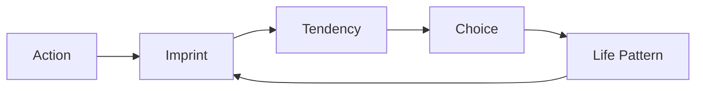

# Luân Hồi (Samsara / Reincarnation)

**Luân Hồi là vòng tái sinh của tâm thức qua nhiều thân xác, nhưng trong vault nó không được đọc một chiều. Cùng một cơ chế có thể là trường học linh hồn hoặc nhà tù ký ức, tùy mức độ tỉnh thức, consent và khả năng nhớ lại của người tham gia.**

*Samsara is the cycle of consciousness rebirth through many bodies, but in the vault it is not read one-dimensionally. The same mechanism can be a school for the soul or a prison of memory, depending on awareness, consent, and the being's capacity to remember.*

---

## Vault Position / Vị Trí Trong Vault

Luân Hồi nằm giữa [[Monad]], [[Gnosis]], [[Nhân Quả]], [[Ma Trận]] và [[Loosh - Năng Lượng Thu Hoạch Từ Con Người]]. Đây là một trong những node nguy hiểm nhất vì nó dễ bị biến thành dogma:

- một bên romanticize mọi đau khổ là “bài học linh hồn”,
- một bên xem mọi tái sinh là “soul trap” tuyệt đối.

Vault giữ cả hai khả năng.

> Câu hỏi không phải chỉ là “có luân hồi không?”, mà là “nếu có, ai đang quản lý ký ức, consent và hướng đi của linh hồn?”

---

## Claim Discipline / Cách Đọc Claim

| Tầng | Cách đọc | Ví dụ |
|---|---|---|
| **Tradition / documentable** | Samsara là khái niệm trung tâm trong Phật giáo, Hindu giáo, Jainism | six realms, karma, moksha, nirvana |
| **Research / anecdotal** | ký ức tiền kiếp, NDE, child cases | Ian Stevenson, life review reports |
| **Pattern / psychological** | trauma, repetition compulsion, inherited patterns | lặp lại bài học gia đình/cá nhân |
| **Speculative synthesis** | prison planet, archons, tunnel-of-light deception | đọc như model, không như dogma |

---

## 1. Hai Cách Đọc Lớn

### Luân Hồi Như Trường Học

Trong nhiều truyền thống, tái sinh là cơ hội:

- trả nghiệp,
- học bài học,
- phát triển từ vô minh đến trí tuệ,
- sinh làm người là cơ hội quý để tỉnh thức.

Cách đọc này có lòng từ. Nó giúp con người không xem đau khổ là vô nghĩa.

### Luân Hồi Như Soul Trap

Trong Gnostic/prison planet lens, luân hồi là vòng lặp bị quản lý:

- ký ức bị xóa,
- linh hồn bị guilt/shame kéo lại,
- tunnel of light có thể là trap,
- năng lượng cảm xúc bị harvest như [[Loosh - Năng Lượng Thu Hoạch Từ Con Người]].

Cách đọc này có tính cảnh báo. Nó giúp con người không romanticize suffering.

### Synthesis

Một trường học không có ký ức, không có consent rõ ràng, và có harvest energy thì rất dễ thành nhà tù.

---

## 2. Six Realms / Sáu Cõi

Trong Phật giáo, sáu cõi có thể đọc vừa literal vừa psychological:

| Realm | Tâm lý học | Pattern đời sống |
|---|---|---|
| Deva | pleasure, privilege | quá sướng nên quên tỉnh |
| Asura | envy, competition | chiến đấu, hơn thua, politics |
| Human | balance | đủ khổ và đủ vui để thức tỉnh |
| Animal | instinct | sống theo survival/programming |
| Preta | craving | đói khát không bao giờ đủ |
| Naraka | hatred/agony | trauma, rage, hell states |

Không cần chờ chết mới thấy sáu cõi. Một ngày trong social media cũng có đủ sáu cõi.

---

## 3. Nhân Quả Và Memory

[[Nhân Quả]] thường bị hiểu như thưởng/phạt. Đọc sâu hơn, nó là continuity of pattern.

Một hành động tạo imprint. Imprint tạo tendency. Tendency tạo lựa chọn. Lựa chọn tạo đời sống. Đời sống tạo thêm imprint.

Nếu ký ức tiền kiếp bị xóa, nhân quả vẫn có thể vận hành như tendency vô thức. Đây là chỗ luân hồi nối với [[Vô Thức Tập Thể]] và ancestral trauma.

---

## 4. Death, Bardo, Rebirth

Nhiều truyền thống mô tả các giai đoạn:

1. rời thân xác,
2. life review,
3. intermediate state / bardo,
4. gặp beings/light/family/archetypes,
5. bị hút bởi nghiệp/desire/fear,
6. tái sinh.

Trong vault, phần này cần đọc với humility. Không ai đang sống có monopoly over afterlife map.

Nhưng pattern đáng chú ý: nhiều NDE/life review reports nhấn mạnh memory, emotion, lesson và review. Nếu đúng, thì consciousness không kết thúc đơn giản ở brain shutdown.

---

## 5. Gnosis Là Gì Trong Luân Hồi?

[[Gnosis]] là nhớ lại mình là ai trước khi bị identity/karma/story kéo đi.

Nếu không có gnosis, linh hồn dễ bị hút bởi:

- guilt,
- unfinished desire,
- family attachment,
- fear,
- savior figures,
- ánh sáng/authority chưa kiểm chứng,
- “nhiệm vụ” được giao mà không hiểu consent.

Gnosis không phải chống lại mọi ánh sáng. Nó là không trao sovereignty cho bất kỳ ánh sáng nào chỉ vì nó sáng.

---

## 6. Practical Implication

Dù bạn tin literal reincarnation hay không, bài này vẫn có ứng dụng:

- nhìn các vòng lặp đời mình,
- nhận ra pattern gia đình lặp qua thế hệ,
- không romanticize suffering,
- không biến victimhood thành identity,
- làm shadow work,
- sống có memory và intention hơn.

Thoát luân hồi bắt đầu từ việc thoát vòng lặp ngay trong đời này.

---

## Synthesis

Luân Hồi có thể là trường học. Có thể là nhà tù. Có thể là cả hai: một trường học đã bị chiếm quyền quản trị.

Điểm quyết định không phải chỉ là cơ chế tái sinh, mà là mức độ tỉnh thức của linh hồn trước memory wipe, guilt, desire và authority.

> Nếu Monad là phần chưa từng rời Source, thì Luân Hồi là giấc mơ dài nơi Monad học cách nhớ lại mình không phải nhân vật trong giấc mơ.

---

## Related

- [[Monad]]
- [[Gnosis]]
- [[Nhân Quả]]
- [[Ma Trận]]
- [[Loosh - Năng Lượng Thu Hoạch Từ Con Người]]
- [[Nhị Nguyên]]
- [[MOC - Esoterica & Consciousness]]
